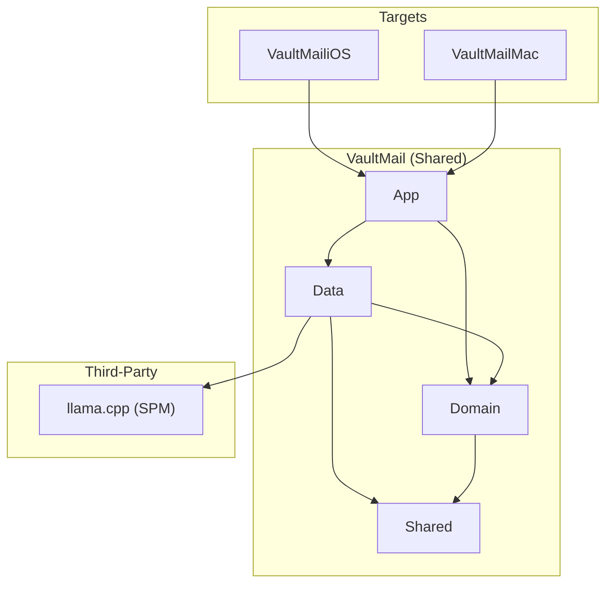
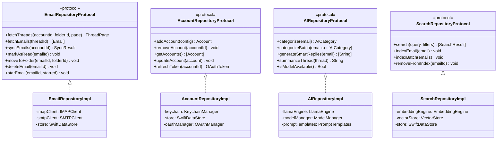
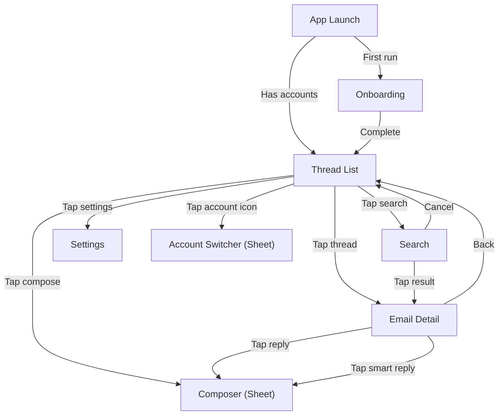
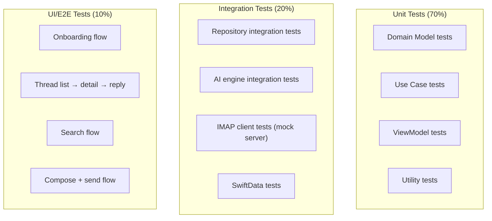

# iOS/macOS Implementation Plan

> The key words **MUST**, **MUST NOT**, **REQUIRED**, **SHALL**, **SHALL NOT**, **SHOULD**, **SHOULD NOT**, **RECOMMENDED**, **MAY**, and **OPTIONAL** in this document are to be interpreted as described in [RFC 2119](https://www.ietf.org/rfc/rfc2119.txt).

---

## 1. Scope

This plan covers the full V1 implementation of the privacy-first email client for iOS 17+ and macOS 14+ (Sonoma), as defined in `docs/spec.md` sections 1-10.

Platform-specific deviations from the spec:
- **macOS**: Three-pane layout (sidebar + thread list + detail) instead of the navigation stack used on iOS.
- **macOS**: Compose opens in a separate window; on iOS it opens as a sheet.
- **Notifications**: Deferred to plan phase per spec OQ-03. This plan specifies background app refresh only for V1.

---

## 2. Platform Context

### 2.1 OS and Framework Versions

| Dependency | Version | Purpose |
|-----------|---------|---------|
| iOS | 17.0+ | Minimum deployment target |
| macOS | 14.0+ (Sonoma) | Minimum deployment target |
| Swift | 5.9+ | Language |
| SwiftUI | 5.0+ | UI framework |
| SwiftData | 1.0+ | Persistence |
| Xcode | 15.0+ | Build toolchain |

### 2.2 Device Targets

| Device | Minimum |
|--------|---------|
| iPhone | iPhone SE 3rd gen (A15, 4GB RAM) |
| Mac | Any Apple Silicon Mac (M1+, 8GB RAM) |

### 2.3 Platform Guidelines

- iOS: Apple Human Interface Guidelines (iOS 17)
- macOS: Apple Human Interface Guidelines (macOS 14)
- Accessibility: WCAG 2.1 AA, VoiceOver, Dynamic Type

---

## 3. Architecture Mapping

### 3.1 Project Structure

```
VaultMail/
├── VaultMail.xcodeproj
├── VaultMail/                      # Shared code
│   ├── App/
│   │   ├── VaultMailApp.swift      # App entry point
│   │   └── AppState.swift            # Global app state
│   ├── Domain/
│   │   ├── Models/
│   │   │   ├── Account.swift
│   │   │   ├── Folder.swift
│   │   │   ├── Email.swift
│   │   │   ├── Thread.swift
│   │   │   ├── Attachment.swift
│   │   │   ├── AICategory.swift
│   │   │   └── SearchResult.swift
│   │   ├── UseCases/
│   │   │   ├── SyncEmailsUseCase.swift
│   │   │   ├── FetchThreadsUseCase.swift
│   │   │   ├── SendEmailUseCase.swift
│   │   │   ├── CategorizeEmailUseCase.swift
│   │   │   ├── SmartReplyUseCase.swift
│   │   │   ├── SummarizeThreadUseCase.swift
│   │   │   ├── SearchEmailsUseCase.swift
│   │   │   └── ManageAccountsUseCase.swift
│   │   └── Protocols/
│   │       ├── EmailRepository.swift
│   │       ├── AccountRepository.swift
│   │       ├── AIRepository.swift
│   │       └── SearchRepository.swift
│   ├── Data/
│   │   ├── Persistence/
│   │   │   ├── SwiftDataStore.swift
│   │   │   ├── AccountEntity.swift
│   │   │   ├── FolderEntity.swift
│   │   │   ├── EmailEntity.swift
│   │   │   ├── ThreadEntity.swift
│   │   │   └── AttachmentEntity.swift
│   │   ├── Network/
│   │   │   ├── IMAPClient.swift
│   │   │   ├── SMTPClient.swift
│   │   │   ├── IMAPSession.swift
│   │   │   ├── OAuthManager.swift
│   │   │   └── ConnectionPool.swift
│   │   ├── AI/
│   │   │   ├── LlamaEngine.swift
│   │   │   ├── EmbeddingEngine.swift
│   │   │   ├── ModelManager.swift
│   │   │   ├── PromptTemplates.swift
│   │   │   └── AIProcessingQueue.swift
│   │   ├── Search/
│   │   │   ├── SearchIndexManager.swift
│   │   │   └── VectorStore.swift
│   │   ├── Keychain/
│   │   │   └── KeychainManager.swift
│   │   └── Repositories/
│   │       ├── EmailRepositoryImpl.swift
│   │       ├── AccountRepositoryImpl.swift
│   │       ├── AIRepositoryImpl.swift
│   │       └── SearchRepositoryImpl.swift
│   └── Shared/
│       ├── Extensions/
│       ├── Utilities/
│       └── Constants.swift
├── VaultMailiOS/                    # iOS-specific
│   ├── Views/
│   │   ├── ThreadList/
│   │   │   ├── ThreadListView.swift
│   │   │   ├── ThreadRowView.swift
│   │   │   └── ThreadListViewModel.swift
│   │   ├── EmailDetail/
│   │   │   ├── EmailDetailView.swift
│   │   │   ├── MessageBubbleView.swift
│   │   │   ├── AttachmentView.swift
│   │   │   └── EmailDetailViewModel.swift
│   │   ├── Composer/
│   │   │   ├── ComposerView.swift
│   │   │   ├── RecipientFieldView.swift
│   │   │   └── ComposerViewModel.swift
│   │   ├── Search/
│   │   │   ├── SearchView.swift
│   │   │   └── SearchViewModel.swift
│   │   ├── Settings/
│   │   │   ├── SettingsView.swift
│   │   │   └── SettingsViewModel.swift
│   │   ├── Onboarding/
│   │   │   ├── OnboardingView.swift
│   │   │   └── OnboardingViewModel.swift
│   │   └── Components/
│   │       ├── AvatarView.swift
│   │       ├── CategoryBadgeView.swift
│   │       ├── SmartReplyChipView.swift
│   │       └── LoadingStateView.swift
│   └── Navigation/
│       └── iOSNavigationRouter.swift
├── VaultMailMac/                    # macOS-specific
│   ├── Views/
│   │   ├── MainWindowView.swift       # Three-pane layout
│   │   ├── SidebarView.swift          # Accounts + folders
│   │   ├── ThreadList/
│   │   │   └── MacThreadListView.swift
│   │   ├── EmailDetail/
│   │   │   └── MacEmailDetailView.swift
│   │   ├── Composer/
│   │   │   └── MacComposerWindow.swift
│   │   └── Settings/
│   │       └── MacSettingsView.swift
│   ├── Commands/
│   │   └── AppCommands.swift          # Menu bar commands
│   └── Navigation/
│       └── MacNavigationRouter.swift
└── Tests/
    ├── DomainTests/
    ├── DataTests/
    ├── ViewModelTests/
    └── IntegrationTests/
```

### 3.2 Module Dependency Graph



### 3.3 Key Class Diagram



---

## 4. Implementation Phases

### Phase 1: Foundation

**Goal**: Project scaffolding, data layer, IMAP connectivity, account management.

| Task ID | Description | Dependencies |
|---------|-------------|-------------|
| IOS-F-01 | Xcode project setup with iOS + macOS targets | — |
| IOS-F-02 | SwiftData model definitions (all entities) | IOS-F-01 |
| IOS-F-03 | Keychain manager implementation | IOS-F-01 |
| IOS-F-04 | OAuth 2.0 manager (Gmail XOAUTH2) | IOS-F-03 |
| IOS-F-05 | IMAP client (connect, authenticate, list folders) | IOS-F-04 |
| IOS-F-06 | IMAP sync engine (headers, bodies, IDLE) | IOS-F-05 |
| IOS-F-07 | SMTP client (send, queue) | IOS-F-04 |
| IOS-F-08 | Email repository implementation | IOS-F-02, IOS-F-06, IOS-F-07 |
| IOS-F-09 | Account repository implementation | IOS-F-02, IOS-F-03, IOS-F-04 |
| IOS-F-10 | Domain use cases (Sync, Fetch, Send, ManageAccounts) | IOS-F-08, IOS-F-09 |

### Phase 2: Core UI

**Goal**: Thread list, email detail, composer — functional email client without AI.

| Task ID | Description | Dependencies |
|---------|-------------|-------------|
| IOS-U-01 | iOS navigation structure + router | Phase 1 |
| IOS-U-02 | Thread list view + view model | IOS-U-01, IOS-F-10 |
| IOS-U-03 | Thread row component (avatar, snippet, badges) | IOS-U-02 |
| IOS-U-04 | Pull-to-refresh + swipe actions | IOS-U-02 |
| IOS-U-05 | Email detail view + view model | IOS-U-01, IOS-F-10 |
| IOS-U-06 | Message bubble component (HTML render + plain text) | IOS-U-05 |
| IOS-U-07 | Attachment view + download | IOS-U-05 |
| IOS-U-08 | Composer view + view model | IOS-U-01, IOS-F-10 |
| IOS-U-09 | Recipient field with auto-complete | IOS-U-08 |
| IOS-U-10 | Draft auto-save | IOS-U-08 |
| IOS-U-11 | Undo-send mechanism | IOS-U-08 |
| IOS-U-12 | Account switcher + multi-account thread list | IOS-U-02 |
| IOS-U-13 | Onboarding flow (account add + tour) | IOS-U-01, IOS-F-09 |
| IOS-U-14 | Settings screen | IOS-U-01 |

### Phase 3: AI Integration

**Goal**: llama.cpp integration, categorization, smart reply, summarization, semantic search.

| Task ID | Description | Dependencies |
|---------|-------------|-------------|
| IOS-A-01 | llama.cpp SPM package integration | Phase 1 |
| IOS-A-02 | LlamaEngine wrapper (load model, run inference) | IOS-A-01 |
| IOS-A-03 | Model manager (download, cache, delete) | IOS-A-02 |
| IOS-A-04 | Prompt templates for categorization | IOS-A-02 |
| IOS-A-05 | Categorization use case + background queue | IOS-A-04 |
| IOS-A-06 | Category badges in thread list | IOS-A-05, IOS-U-02 |
| IOS-A-07 | Category tab filtering | IOS-A-06 |
| IOS-A-08 | Prompt templates for smart reply | IOS-A-02 |
| IOS-A-09 | Smart reply use case | IOS-A-08 |
| IOS-A-10 | Smart reply chips in email detail | IOS-A-09, IOS-U-05 |
| IOS-A-11 | Prompt templates for summarization | IOS-A-02 |
| IOS-A-12 | Summarization use case | IOS-A-11 |
| IOS-A-13 | Summary display in email detail | IOS-A-12, IOS-U-05 |
| IOS-A-14 | Embedding engine setup | IOS-A-01 |
| IOS-A-15 | Vector store implementation | IOS-A-14 |
| IOS-A-16 | Search index manager (build + incremental update) | IOS-A-15 |
| IOS-A-17 | Search use case (semantic + exact) | IOS-A-16 |
| IOS-A-18 | Search UI (search bar, results, filters) | IOS-A-17, IOS-U-01 |
| IOS-A-19 | AI model download in onboarding | IOS-A-03, IOS-U-13 |

### Phase 4: macOS

**Goal**: macOS-specific UI and behaviors using shared domain/data layers.

| Task ID | Description | Dependencies |
|---------|-------------|-------------|
| IOS-M-01 | macOS target configuration | Phase 1 |
| IOS-M-02 | Three-pane main window layout | IOS-M-01 |
| IOS-M-03 | Sidebar (accounts + folders) | IOS-M-02 |
| IOS-M-04 | macOS thread list adaptation | IOS-M-02, Phase 2 |
| IOS-M-05 | macOS email detail adaptation | IOS-M-02, Phase 2 |
| IOS-M-06 | macOS composer window | IOS-M-01, Phase 2 |
| IOS-M-07 | Menu bar commands + keyboard shortcuts | IOS-M-01 |
| IOS-M-08 | macOS toolbar integration | IOS-M-02 |
| IOS-M-09 | Drag-and-drop for attachments | IOS-M-06 |
| IOS-M-10 | macOS settings (Settings scene) | IOS-M-01 |

### Phase 5: Polish and Validation

**Goal**: Performance optimization, accessibility, edge cases, final QA.

| Task ID | Description | Dependencies |
|---------|-------------|-------------|
| IOS-P-01 | Accessibility audit (VoiceOver, Dynamic Type) | Phase 2, 3, 4 |
| IOS-P-02 | Performance profiling (Instruments) | Phase 2, 3, 4 |
| IOS-P-03 | Memory optimization for AI inference | Phase 3 |
| IOS-P-04 | Offline mode testing + edge cases | Phase 2 |
| IOS-P-05 | Error handling audit | Phase 2, 3 |
| IOS-P-06 | App lock (biometric) implementation | Phase 2 |
| IOS-P-07 | Background app refresh for sync | Phase 1 |
| IOS-P-08 | Acceptance criteria validation (full test suite) | All phases |
| IOS-P-09 | App Store metadata and screenshots | IOS-P-08 |

---

## 5. UI/UX Implementation Details

### 5.1 iOS Navigation Flow



### 5.2 macOS Window Layout

```
┌─────────────────────────────────────────────────────────────────┐
│ Toolbar: [Search] [Compose] [Reply] [Archive] [Delete] [Star]  │
├──────────┬──────────────────┬───────────────────────────────────┤
│ Sidebar  │ Thread List      │ Email Detail                     │
│          │                  │                                   │
│ Accounts │ ┌──────────────┐ │ From: sender@example.com         │
│ ▼ Gmail  │ │ Thread Row 1 │ │ To: me@gmail.com                │
│   Inbox  │ │ (selected)   │ │ Date: Feb 7, 2025               │
│   Sent   │ ├──────────────┤ │                                   │
│   Drafts │ │ Thread Row 2 │ │ [AI Summary]                     │
│   Trash  │ │              │ │                                   │
│   Spam   │ ├──────────────┤ │ Message body content...           │
│   Labels │ │ Thread Row 3 │ │                                   │
│   ▶ Work │ │              │ │                                   │
│   ▶ Pers │ ├──────────────┤ │ [Smart Reply] [Smart Reply]       │
│          │ │ Thread Row 4 │ │ [Reply] [Reply All] [Forward]    │
├──────────┴──────────────────┴───────────────────────────────────┤
│ Status: Synced 2 min ago │ 3 unread │ AI: Ready                │
└─────────────────────────────────────────────────────────────────┘
```

### 5.3 iOS Thread Row Layout

```
┌──────────────────────────────────────────────────────────┐
│ [Avatar] Sender Name              2:30 PM  [★] [📎]     │
│          Subject line goes here...          [Primary]    │
│          Snippet of the latest message in this thread... │
│          ● (unread indicator)                            │
└──────────────────────────────────────────────────────────┘
```

### 5.4 Shared Component Strategy

| Component | Shared? | Notes |
|-----------|---------|-------|
| ViewModels | Yes | All ViewModels shared between iOS and macOS |
| Domain Models | Yes | Identical across platforms |
| Use Cases | Yes | Identical across platforms |
| Data Layer | Yes | Identical across platforms |
| SwiftUI Views | Partial | Simple components shared; complex layouts platform-specific |
| Navigation | No | iOS uses NavigationStack; macOS uses NavigationSplitView |

---

## 6. Testing Strategy

### 6.1 Test Pyramid



### 6.2 Test Targets

| Target | What It Tests | Tools |
|--------|--------------|-------|
| `DomainTests` | Models, use cases, protocols | XCTest |
| `DataTests` | Repositories, SwiftData, Keychain, IMAP/SMTP (mocked) | XCTest, mock servers |
| `ViewModelTests` | ViewModel logic with mocked use cases | XCTest |
| `IntegrationTests` | End-to-end repository flows with real SwiftData | XCTest |
| `UITests` | Critical user flows | XCUITest |

### 6.3 Device Testing Matrix

| Device | OS | Purpose |
|--------|-----|---------|
| iPhone SE 3rd gen | iOS 17 | Minimum spec, small screen |
| iPhone 15 Pro | iOS 17 | Performance baseline |
| MacBook Air M1 | macOS 14 | Minimum Mac spec |
| MacBook Pro M3 | macOS 14 | Performance baseline |

---

## 7. Third-Party Dependencies

| Dependency | Purpose | License | Integration |
|-----------|---------|---------|-------------|
| llama.cpp | LLM inference engine | MIT | SPM |

All other functionality uses Apple-provided frameworks (SwiftUI, SwiftData, Security, Network, WebKit for HTML rendering). This minimizes supply chain risk and aligns with the privacy constitution.

**IMAP/SMTP client**: Evaluate building a thin Swift wrapper around Network.framework vs. using an existing Swift IMAP library. Decision to be made during Phase 1, Task IOS-F-05.

---

## 8. Risks and Mitigations

| Risk | Likelihood | Impact | Mitigation |
|------|-----------|--------|------------|
| llama.cpp Swift integration complexity | Medium | High | Spike in Phase 3 task IOS-A-01; C interop via Swift bridging header |
| IMAP protocol edge cases (Gmail quirks) | Medium | Medium | Extensive integration tests with real Gmail account; handle known Gmail IMAP quirks |
| AI model RAM usage on iPhone SE (4GB) | High | High | Use smallest viable model (1-3B Q4); monitor memory; implement model unloading after inference |
| SwiftData performance with large datasets | Medium | Medium | Profile early with 50K+ email dataset; fallback to raw SQLite for search index if needed |
| OAuth token refresh reliability | Low | High | Implement proactive refresh (before expiry); clear error messaging for re-auth |
| Background sync iOS limitations | High | Medium | Rely on background app refresh; clearly document expected behavior to users |

---

## 9. Progress Tracking

Progress is tracked in `ios-macos/tasks.md` with per-task status updates.
