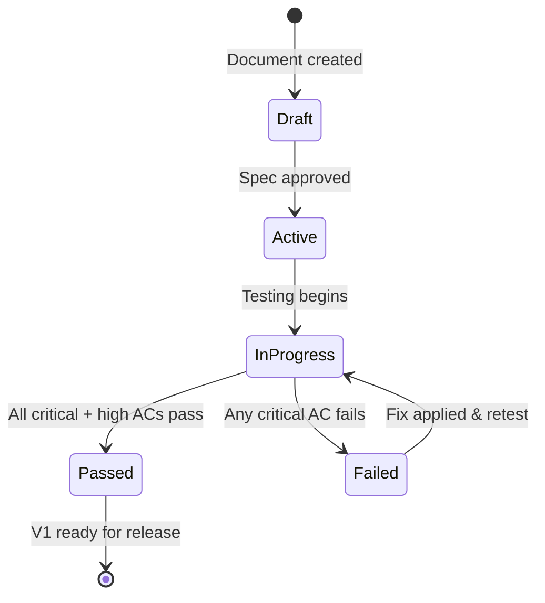

# iOS/macOS Validation: Acceptance Criteria & Test Plan

> The key words **MUST**, **MUST NOT**, **REQUIRED**, **SHALL**, **SHALL NOT**, **SHOULD**, **SHOULD NOT**, **RECOMMENDED**, **MAY**, and **OPTIONAL** in this document are to be interpreted as described in [RFC 2119](https://www.ietf.org/rfc/rfc2119.txt).

---

## 1. Validation Scope

- **Spec version**: 1.0.0
- **Platforms**: iOS 17+, macOS 14+
- **Spec sections covered**: All (Sections 1-10)

---

## 2. Requirement Traceability Matrix

| Req ID | Requirement Summary | Keyword | Test Case IDs | Platform | Status |
|--------|-------------------|---------|---------------|----------|--------|
| G-01 | Full email CRUD via IMAP/SMTP | MUST | AC-F-05, AC-F-07, AC-F-08 | Both | — |
| G-02 | Multiple Gmail accounts | MUST | AC-F-09, AC-U-12 | Both | — |
| G-03 | Threaded conversation view | MUST | AC-F-06, AC-U-02, AC-U-05 | Both | — |
| G-04 | AI categorization, smart reply, summarization | MUST | AC-A-04, AC-A-05, AC-A-06 | Both | — |
| G-05 | AI semantic search | MUST | AC-A-07 | Both | — |
| G-06 | iOS and native macOS | MUST | AC-M-01 through AC-M-05 | Both | — |
| G-07 | No third-party data transmission | MUST | AC-SEC-01 | Both | — |
| G-08 | Offline access for synced emails | MUST | AC-P-04 | Both | — |

---

## 3. Acceptance Criteria

### Phase 1: Foundation

---

**AC-F-01**: Project Setup

- **Given**: A clean development environment with Xcode 15+
- **When**: The project is opened and built
- **Then**: The project **MUST** compile without errors on both iOS Simulator and macOS
  AND both targets **MUST** launch to an empty screen
  AND the project **MUST** contain shared, iOS, and macOS targets
- **Priority**: Critical

---

**AC-F-02**: SwiftData Models

- **Given**: SwiftData model classes are defined
- **When**: A `ModelContainer` is initialized with all model types
- **Then**: The container **MUST** initialize without errors
  AND all relationships (Account→Folder, Folder→Email, Email→Thread, Email→Attachment) **MUST** be navigable
  AND CRUD operations on each entity **MUST** persist across app restarts
  AND cascade deletes **MUST** function (deleting Account deletes all child data)
- **Priority**: Critical

---

**AC-F-03**: Keychain Manager

- **Given**: A `KeychainManager` instance
- **When**: An OAuth token is stored for a given account ID
- **Then**: The token **MUST** be retrievable using the same account ID
  AND the token **MUST NOT** be retrievable after deletion
  AND the token **MUST** be stored with `kSecAttrAccessibleWhenUnlockedThisDeviceOnly`
  AND storing a token for the same account ID **MUST** update the existing entry
- **Priority**: Critical

---

**AC-F-04**: OAuth 2.0 Flow

- **Given**: A user with a valid Gmail account
- **When**: The user initiates account addition
- **Then**: A system browser **MUST** open to Google's OAuth consent page
  AND after user consent, the app **MUST** receive an authorization code
  AND the app **MUST** exchange the code for access + refresh tokens
  AND tokens **MUST** be stored in the Keychain
  AND IMAP authentication with XOAUTH2 **MUST** succeed using the access token
- **Priority**: Critical

**AC-F-04b**: Token Refresh

- **Given**: An account with an expired access token
- **When**: The app attempts an IMAP operation
- **Then**: The app **MUST** automatically refresh the token using the refresh token
  AND the new token **MUST** be stored in the Keychain
  AND the IMAP operation **MUST** succeed with the new token
  AND if refresh fails, the user **MUST** be prompted to re-authenticate
- **Priority**: Critical

---

**AC-F-05**: IMAP Client

- **Given**: Valid OAuth credentials for a Gmail account
- **When**: The IMAP client connects to `imap.gmail.com:993`
- **Then**: The connection **MUST** use TLS
  AND XOAUTH2 authentication **MUST** succeed
  AND the client **MUST** list all Gmail folders (INBOX, Sent, Drafts, Trash, Spam, All Mail, Starred, plus labels)
  AND the client **MUST** fetch email UIDs within a date range
  AND the client **MUST** fetch complete email headers (From, To, CC, Subject, Date, Message-ID, References, In-Reply-To)
  AND the client **MUST** fetch email bodies (plain text and HTML parts)
  AND the client **MUST** support IMAP IDLE and receive notifications within 30 seconds of new email arrival
- **Priority**: Critical

---

**AC-F-06**: Sync Engine

- **Given**: A configured Gmail account
- **When**: Initial sync is triggered with a 30-day window
- **Then**: All emails within the window **MUST** be downloaded (headers + bodies)
  AND emails **MUST** be grouped into threads using References/In-Reply-To headers
  AND folder metadata (unread count, total count) **MUST** be accurate
  AND sync state (last UID, UIDVALIDITY) **MUST** be persisted

**AC-F-06b**: Incremental Sync

- **Given**: A previously synced account with sync state
- **When**: Incremental sync is triggered
- **Then**: Only emails newer than the last synced UID **MUST** be fetched
  AND deleted/moved emails on the server **MUST** be reflected locally
  AND flag changes (read, starred) **MUST** be synced bidirectionally
  AND the sync **MUST** complete within 5 seconds for 10 new emails on Wi-Fi
- **Priority**: Critical

---

**AC-F-07**: SMTP Client

- **Given**: Valid OAuth credentials and a composed email
- **When**: The email is sent
- **Then**: The SMTP connection **MUST** use TLS
  AND the email **MUST** be delivered to the recipient's inbox
  AND a copy **MUST** be appended to the Sent folder via IMAP
  AND if offline, the email **MUST** be queued and sent when connectivity resumes
- **Priority**: Critical

---

**AC-F-08**: Email Repository

- **Given**: An `EmailRepositoryImpl` with connected IMAP/SMTP and initialized SwiftData
- **When**: CRUD operations are performed
- **Then**: `fetchThreads` **MUST** return paginated threads sorted by latest date
  AND `markAsRead` **MUST** set the \Seen flag via IMAP and update local state
  AND `moveToFolder` **MUST** perform IMAP COPY + DELETE and update local state
  AND `deleteEmail` **MUST** move to Trash (or permanently delete if already in Trash)
  AND `starEmail` **MUST** set/remove the \Flagged flag via IMAP and update local state
- **Priority**: Critical

---

**AC-F-09**: Account Repository

- **Given**: An `AccountRepositoryImpl`
- **When**: Account operations are performed
- **Then**: `addAccount` **MUST** store account config in SwiftData and tokens in Keychain
  AND `removeAccount` **MUST** delete all associated data (emails, folders, threads, attachments, search index, sync state, Keychain tokens)
  AND `getAccounts` **MUST** return all configured accounts
  AND `updateAccount` **MUST** persist configuration changes
- **Priority**: Critical

---

**AC-F-10**: Domain Use Cases

- **Given**: Use cases with mocked repositories
- **When**: Each use case is invoked
- **Then**: `SyncEmailsUseCase` **MUST** orchestrate sync and report progress/errors
  AND `FetchThreadsUseCase` **MUST** return filtered, sorted, paginated threads
  AND `SendEmailUseCase` **MUST** send or queue the email and handle errors
  AND `ManageAccountsUseCase` **MUST** delegate to account repository correctly
- **Priority**: Critical

---

### Phase 2: Core UI

---

**AC-U-01**: iOS Navigation

- **Given**: The app is launched on iOS with at least one account
- **When**: The user navigates between screens
- **Then**: Thread list **MUST** be the root view
  AND tapping a thread **MUST** push the email detail view
  AND tapping compose **MUST** present the composer as a sheet
  AND tapping search **MUST** present the search view
  AND tapping settings **MUST** push or present the settings view
  AND back navigation **MUST** work consistently
- **Priority**: Critical

---

**AC-U-02**: Thread List

- **Given**: An account with synced emails
- **When**: The thread list is displayed
- **Then**: Threads **MUST** be sorted by most recent message date (newest first)
  AND each row **MUST** display: sender name, subject, snippet, timestamp, unread indicator, star indicator, attachment indicator
  AND category tabs **MUST** filter threads by AI category
  AND the list **MUST** scroll at 60fps with no visible jank
  AND empty state **MUST** display an appropriate message
- **Priority**: Critical

---

**AC-U-03**: Thread Row

- **Given**: A thread with known properties (unread, starred, has attachment, categorized)
- **When**: The thread row is rendered
- **Then**: Unread threads **MUST** display bold sender name and a dot indicator
  AND starred threads **MUST** display a star icon
  AND threads with attachments **MUST** display a paperclip icon
  AND the category badge **MUST** show the correct category
  AND the timestamp **MUST** display relative time (e.g., "2:30 PM", "Yesterday", "Feb 5")
  AND VoiceOver **MUST** announce all visible information
- **Priority**: High

---

**AC-U-04**: Thread List Interactions

- **Given**: The thread list is displayed
- **When**: The user performs gestures
- **Then**: Pull-to-refresh **MUST** trigger an incremental sync and update the list
  AND swipe right on a thread **MUST** archive it (move to All Mail)
  AND swipe left on a thread **MUST** delete it (move to Trash)
  AND long-press **MUST** enter multi-select mode
  AND in multi-select mode, batch archive/delete **MUST** work on all selected threads
- **Priority**: High

---

**AC-U-05**: Email Detail View

- **Given**: The user taps a thread with 3 messages (2 read, 1 unread)
- **When**: The email detail view opens
- **Then**: All 3 messages **MUST** be displayed in chronological order
  AND the 2 read messages **SHOULD** be collapsed
  AND the 1 unread message **MUST** be expanded
  AND the thread **MUST** be marked as read
  AND reply, reply-all, and forward buttons **MUST** be visible
  AND tapping a collapsed message **MUST** expand it
- **Priority**: Critical

---

**AC-U-06**: Message Rendering

- **Given**: An email with HTML body content
- **When**: The message is displayed
- **Then**: HTML content **MUST** render correctly (formatting, images, links)
  AND links **MUST** open in the system browser
  AND quoted text (replies) **SHOULD** be collapsible
  AND plain-text emails **MUST** render with preserved line breaks
- **Priority**: High

---

**AC-U-07**: Attachment Handling

- **Given**: An email with attachments (1 image 500KB, 1 PDF 10MB)
- **When**: The email detail is displayed
- **Then**: Both attachments **MUST** show filename, type, and size
  AND the 500KB image **MAY** be auto-previewed inline
  AND the 10MB PDF **MUST NOT** auto-download (requires user tap)
  AND tapping download **MUST** show a progress indicator
  AND after download, tapping the attachment **MUST** show a preview (QuickLook)
  AND the share button **MUST** open the system share sheet
- **Priority**: High

---

**AC-U-08**: Email Composer

- **Given**: The user opens the composer (new email or reply)
- **When**: The composer is displayed
- **Then**: To, CC, BCC fields **MUST** be available
  AND the subject field **MUST** be pre-filled for reply (Re:) and forward (Fwd:)
  AND the body **MUST** be editable with basic formatting
  AND for replies, the original message **MUST** be quoted below
  AND the send button **MUST** be disabled until at least one recipient and a body are provided
  AND tapping send **MUST** queue the message for delivery
- **Priority**: Critical

---

**AC-U-09**: Recipient Auto-Complete

- **Given**: The user has previously received emails from `alice@example.com`
- **When**: The user types "ali" in the To field
- **Then**: `alice@example.com` **MUST** appear as a suggestion
  AND tapping the suggestion **MUST** add it as a token in the field
  AND invalid email addresses **MUST** be visually indicated
- **Priority**: Medium

---

**AC-U-10**: Draft Auto-Save

- **Given**: The user is composing an email with content
- **When**: 30 seconds pass without sending
- **Then**: The draft **MUST** be saved locally
  AND the draft **SHOULD** be synced to the Drafts IMAP folder
  AND if the app is killed and reopened, the draft **MUST** be recoverable
  AND when the email is sent, the draft **MUST** be deleted
- **Priority**: Medium

---

**AC-U-11**: Undo Send

- **Given**: The user taps send with a 5-second undo delay configured
- **When**: The send is initiated
- **Then**: A toast/snackbar **MUST** appear with an "Undo" button and a countdown
  AND the email **MUST NOT** be transmitted via SMTP during the delay
  AND tapping "Undo" **MUST** cancel the send and return to the composer
  AND after the delay expires, the email **MUST** be sent via SMTP
- **Priority**: Medium

---

**AC-U-12**: Multi-Account

- **Given**: Two Gmail accounts are configured
- **When**: The user navigates the app
- **Then**: The account switcher **MUST** list both accounts
  AND selecting an account **MUST** show that account's thread list
  AND a unified inbox option **MUST** show threads from both accounts merged by date
  AND threads in unified view **MUST** indicate which account they belong to
  AND composing a new email **MUST** default to the selected account (or the configured default)
- **Priority**: High

---

**AC-U-13**: Onboarding

- **Given**: The app is launched for the first time (no accounts configured)
- **When**: The app starts
- **Then**: The onboarding flow **MUST** be displayed (not the thread list)
  AND the welcome screen **MUST** communicate the privacy value proposition
  AND the user **MUST** be able to add at least one Gmail account
  AND the AI model download step **MUST** be shown with a skip option
  AND after completion, the app **MUST** navigate to the thread list
  AND the onboarding **MUST NOT** exceed 5 screens
- **Priority**: High

---

**AC-U-14**: Settings

- **Given**: The user opens settings
- **When**: Settings are modified
- **Then**: Sync window changes **MUST** trigger a re-sync on next foreground
  AND theme changes **MUST** apply immediately
  AND undo send delay changes **MUST** apply to the next send
  AND AI model deletion **MUST** free storage and disable AI features gracefully
  AND "Clear cache" **MUST** remove cached data without deleting accounts
- **Priority**: Medium

---

### Phase 3: AI

---

**AC-A-01**: llama.cpp Integration

- **Given**: The llama.cpp SPM package is added
- **When**: The project is built for iOS and macOS
- **Then**: The build **MUST** succeed on both platforms without errors
  AND a small GGUF model **MUST** load successfully
  AND a simple text generation prompt **MUST** return a coherent response
- **Priority**: Critical

---

**AC-A-02**: AI Engine Abstraction

- **Given**: An `AIEngineProtocol` and its llama.cpp implementation
- **When**: The protocol methods are called
- **Then**: `isModelAvailable()` **MUST** return `false` if no model is downloaded
  AND `loadModel(path:)` **MUST** load a GGUF model into memory
  AND `generate(prompt:)` **MUST** return generated text
  AND `unloadModel()` **MUST** free model memory
  AND the protocol **MUST** be implementable by an alternative engine without changing callers
- **Priority**: Critical

---

**AC-A-03**: Model Manager

- **Given**: A `ModelManager` instance with no models downloaded
- **When**: Model management operations are performed
- **Then**: `availableModels()` **MUST** list models with name, size, and download status
  AND `downloadModel(id:)` **MUST** download the GGUF file with progress reporting (0-100%)
  AND download **MUST** be cancellable
  AND `deleteModel(id:)` **MUST** remove the file and free storage
  AND `storageUsage()` **MUST** report total model storage accurately
- **Priority**: High

---

**AC-A-04**: Email Categorization

- **Given**: A synced email with subject "50% off shoes today only!"
- **When**: The categorization use case processes the email
- **Then**: The email **MUST** be categorized as `promotions`
  AND the category **MUST** be stored on the email entity
  AND the thread list **MUST** show the correct category badge
  AND the Promotions tab **MUST** include this thread
  AND manual re-categorization to `primary` **MUST** update the stored category

**AC-A-04b**: Batch Categorization

- **Given**: 50 uncategorized emails after sync
- **When**: Background categorization runs
- **Then**: All 50 emails **MUST** be categorized within 60 seconds
  AND the UI **MUST NOT** freeze during processing
  AND results **MUST** appear progressively in the thread list
- **Priority**: High

---

**AC-A-05**: Smart Reply

- **Given**: An email asking "Can you meet at 3pm tomorrow?"
- **When**: The smart reply use case is invoked
- **Then**: Up to 3 reply suggestions **MUST** be returned
  AND at least one suggestion **SHOULD** be affirmative (e.g., "Sure, 3pm works for me.")
  AND at least one suggestion **SHOULD** be declining or alternative (e.g., "I'm not available at 3pm, how about 4pm?")
  AND generation **MUST** complete within 3 seconds
  AND the UI **MUST NOT** block during generation
  AND tapping a suggestion **MUST** insert it into the composer body
- **Priority**: High

---

**AC-A-06**: Thread Summarization

- **Given**: A thread with 5 messages discussing a project deadline
- **When**: The summarize action is triggered
- **Then**: A summary of 2-4 sentences **MUST** be generated
  AND the summary **MUST** capture the key decision or action items
  AND the summary **MUST** be displayed at the top of the email detail
  AND the summary **MUST** be cached (not regenerated on revisit)
  AND threads with 3+ messages **SHOULD** auto-summarize on open
- **Priority**: High

---

**AC-A-07**: Semantic Search

- **Given**: 1000 synced and indexed emails, including one about "quarterly budget review"
- **When**: The user searches for "financial planning meeting"
- **Then**: The email about "quarterly budget review" **MUST** appear in search results (semantic match)
  AND results **MUST** be ranked by relevance
  AND first results **MUST** appear within 2 seconds
  AND exact-match filters (sender, date) **MUST** narrow results correctly
  AND search results **MUST** be tappable to navigate to the email detail
- **Priority**: High

---

**AC-A-08**: AI Onboarding

- **Given**: The user is on the AI model download step in onboarding
- **When**: The user taps "Download"
- **Then**: The model download **MUST** start with a visible progress bar
  AND the user **MUST** be able to skip without downloading
  AND if skipped, all AI features **MUST** show a "Download model to enable" state
  AND after download completes, AI features **MUST** begin working
- **Priority**: Medium

---

### Phase 4: macOS

---

**AC-M-01**: macOS Build

- **Given**: The macOS target is configured
- **When**: The project is built and run on macOS
- **Then**: The app **MUST** launch as a native macOS application
  AND it **MUST** display in a resizable window (minimum 800x600)
  AND it **MUST** use a three-pane layout (sidebar, thread list, detail)
- **Priority**: Critical

---

**AC-M-02**: macOS Navigation

- **Given**: The macOS app is running with a configured account
- **When**: The user interacts with the sidebar
- **Then**: Accounts **MUST** be listed with expandable folder trees
  AND clicking a folder **MUST** update the thread list pane
  AND clicking a thread **MUST** display the email detail in the right pane
  AND all three panes **MUST** be visible simultaneously
  AND pane widths **SHOULD** be resizable via drag handles
- **Priority**: Critical

---

**AC-M-03**: macOS Composer

- **Given**: The user triggers compose on macOS
- **When**: Cmd+N is pressed or the compose button is clicked
- **Then**: A new composer window **MUST** open (separate from the main window)
  AND the composer **MUST** have the same functionality as the iOS composer
  AND multiple composer windows **MAY** be open simultaneously
  AND closing a composer window with unsaved content **MUST** prompt to save as draft
- **Priority**: High

---

**AC-M-04**: Keyboard Shortcuts

- **Given**: The macOS app is focused
- **When**: Keyboard shortcuts are pressed
- **Then**: Cmd+N **MUST** open a new composer
  AND Cmd+R **MUST** reply to the selected email
  AND Cmd+Shift+R **MUST** reply-all
  AND Cmd+Delete **MUST** delete the selected thread
  AND Cmd+F **MUST** focus the search field
  AND Delete/Backspace **MUST** archive the selected thread
  AND these shortcuts **MUST** appear in the menu bar
- **Priority**: High

---

**AC-M-05**: macOS Toolbar and Drag-Drop

- **Given**: The macOS app is displaying an email
- **When**: The user interacts with the toolbar and attachments
- **Then**: The toolbar **MUST** show Reply, Reply All, Forward, Archive, Delete, Star buttons
  AND dragging a file onto the composer **MUST** attach it
  AND dragging an attachment from the detail view to Finder **MUST** save the file
- **Priority**: Medium

---

### Phase 5: Polish

---

**AC-P-01**: Accessibility

- **Given**: The app is running with VoiceOver enabled
- **When**: The user navigates all screens
- **Then**: Every interactive element **MUST** have an accessible label
  AND navigation **MUST** be possible using VoiceOver gestures alone
  AND Dynamic Type at the largest accessibility size **MUST NOT** cause text truncation that hides information
  AND no information **MUST** be conveyed by color alone
- **Priority**: High

---

**AC-P-02**: Performance

- **Given**: The app is profiled on minimum spec devices (iPhone SE 3rd gen, MacBook Air M1)
- **When**: Performance is measured
- **Then**: Cold start **MUST** be under 3 seconds (target: 1.5s)
  AND thread list scroll **MUST** maintain 60fps (hard floor: 30fps)
  AND opening a cached email **MUST** be under 500ms (target: 300ms)
  AND AI categorization per email **MUST** be under 2 seconds (target: 500ms)
  AND search first results **MUST** appear within 3 seconds (target: 1s)
  AND idle memory **MUST** be under 200MB (target: 100MB)
- **Priority**: Critical

---

**AC-P-03**: Memory Under AI Load

- **Given**: The AI model is loaded and performing inference
- **When**: Memory usage is measured
- **Then**: Peak memory during inference **MUST NOT** exceed 500MB above baseline
  AND after inference completes, the model **SHOULD** be unloaded within 30 seconds of idle
  AND if system memory pressure is detected, the model **MUST** be unloaded immediately
- **Priority**: High

---

**AC-P-04**: Offline Mode

- **Given**: The device is in airplane mode with previously synced emails
- **When**: The user interacts with the app
- **Then**: The thread list **MUST** display all synced threads
  AND tapping a thread **MUST** display the cached email content
  AND search **MUST** work against locally indexed data
  AND composing and sending **MUST** queue the email with a "will send when online" indicator
  AND when connectivity resumes, queued emails **MUST** send automatically
  AND sync **MUST** resume automatically on connectivity restoration
- **Priority**: High

---

### Security

---

**AC-SEC-01**: No Third-Party Data Transmission

- **Given**: A network traffic monitor (e.g., Charles Proxy) is configured
- **When**: The app is used through a full session (sync, read, compose, send, search, AI operations)
- **Then**: The only network connections **MUST** be to `imap.gmail.com`, `smtp.gmail.com`, and `oauth2.googleapis.com`
  AND zero connections to any analytics, crash reporting, or third-party AI service **MUST** be observed
  AND all connections **MUST** use TLS
- **Priority**: Critical

---

**AC-SEC-02**: Credential Security

- **Given**: The app has configured accounts
- **When**: The device file system is inspected
- **Then**: OAuth tokens **MUST NOT** appear in any file outside the Keychain
  AND the SwiftData database **MUST NOT** contain plaintext tokens
  AND tokens **MUST** be stored with `kSecAttrAccessibleWhenUnlockedThisDeviceOnly`
- **Priority**: Critical

---

**AC-SEC-03**: Data Deletion on Account Removal

- **Given**: An account with 500 synced emails and AI-generated data
- **When**: The account is removed
- **Then**: All emails, folders, threads, attachments, search index entries, and AI cache for the account **MUST** be deleted from SwiftData
  AND Keychain tokens for the account **MUST** be deleted
  AND no orphaned data **MUST** remain
  AND the operation **MUST** complete within 10 seconds
- **Priority**: Critical

---

## 4. Edge Cases and Error Scenarios

| # | Scenario | Expected Behavior |
|---|---------|-------------------|
| E-01 | Network drops during initial sync | Sync pauses; resumes from last checkpoint on reconnect; partial data is usable |
| E-02 | OAuth token refresh fails (revoked) | User sees "Re-authenticate" prompt; no crash; other accounts unaffected |
| E-03 | IMAP UIDVALIDITY changes | Full re-sync of affected folder; user notified of delay |
| E-04 | AI model file corrupted | Model fails to load; error displayed; user can re-download |
| E-05 | Device runs low on storage | Warning shown; AI features degrade (model unloaded); sync reduces window |
| E-06 | Very large thread (100+ messages) | Paginate messages; no OOM; scroll performance acceptable |
| E-07 | Email with large attachment (50MB+) | Attachment metadata shown; body loads; download requires explicit user action |
| E-08 | Concurrent sync on multiple accounts | Syncs run independently; no deadlocks; UI responsive |
| E-09 | App killed during AI inference | Model state cleaned up on next launch; no corrupt cache |
| E-10 | Email with malformed HTML | Rendered safely; no crash; fallback to plain text if necessary |
| E-11 | Search with no results | Empty state with helpful message; no crash |
| E-12 | Compose with no network | Draft saved locally; send queued; user informed |

---

## 5. Performance Validation

| Metric | Target | Hard Limit | Measurement Method | Failure Threshold |
|--------|--------|------------|--------------------|-------------------|
| Cold start | < 1.5s | 3s | Instruments Time Profiler on min-spec device | Fails if > 3s on 3 consecutive runs |
| Thread list scroll FPS | 60 fps | 30 fps | Instruments Core Animation on min-spec with 500+ threads | Fails if drops below 30fps for >1s |
| Email open (cached) | < 300ms | 500ms | Measured from tap to content visible | Fails if > 500ms on 3 consecutive runs |
| AI categorization (single) | < 500ms | 2s | Wall clock time from input to result | Fails if > 2s on min-spec device |
| AI batch categorization (100) | < 30s | 60s | Wall clock time for full batch | Fails if > 60s on min-spec device |
| Search first results | < 1s | 3s | Time from query submit to first result visible | Fails if > 3s on 10K email corpus |
| Memory idle | < 100MB | 200MB | Instruments Allocations, app in foreground, no activity | Fails if > 200MB |
| Memory during AI | < 500MB above baseline | — | Instruments Allocations during inference | Fails if > 500MB above baseline |
| Initial sync (1K emails) | < 60s | 120s | Wall clock time on Wi-Fi | Fails if > 120s |
| Send email | < 3s | 5s | Time from send tap to SMTP completion (after undo delay) | Fails if > 5s |

---

## 6. Validation Workflow

---

## 7. Device Test Matrix

| Device | OS | Role |
|--------|-----|------|
| iPhone SE 3rd gen (A15, 4GB) | iOS 17 | Min-spec performance validation |
| iPhone 15 Pro (A17 Pro, 8GB) | iOS 17 | Reference device, AI performance |
| iPhone 16 | iOS 18 | Forward compatibility |
| MacBook Air M1 (8GB) | macOS 14 | Min-spec Mac validation |
| MacBook Pro M3 (18GB) | macOS 14 | Reference Mac, AI performance |
| Simulator (various) | iOS 17 | UI layout, accessibility, functional testing |

---

## 8. Sign-Off

| Reviewer | Role | Date | Status |
|----------|------|------|--------|
| — | Spec Author | — | — |
| — | QA Lead | — | — |
| — | Engineering Lead | — | — |
