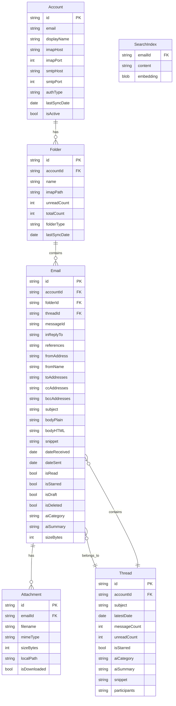
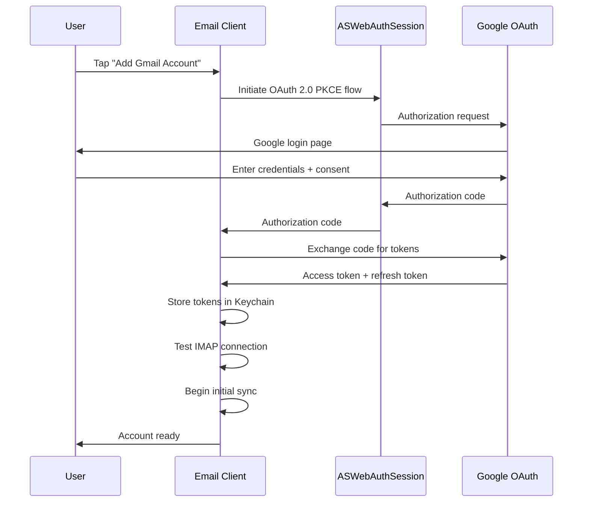
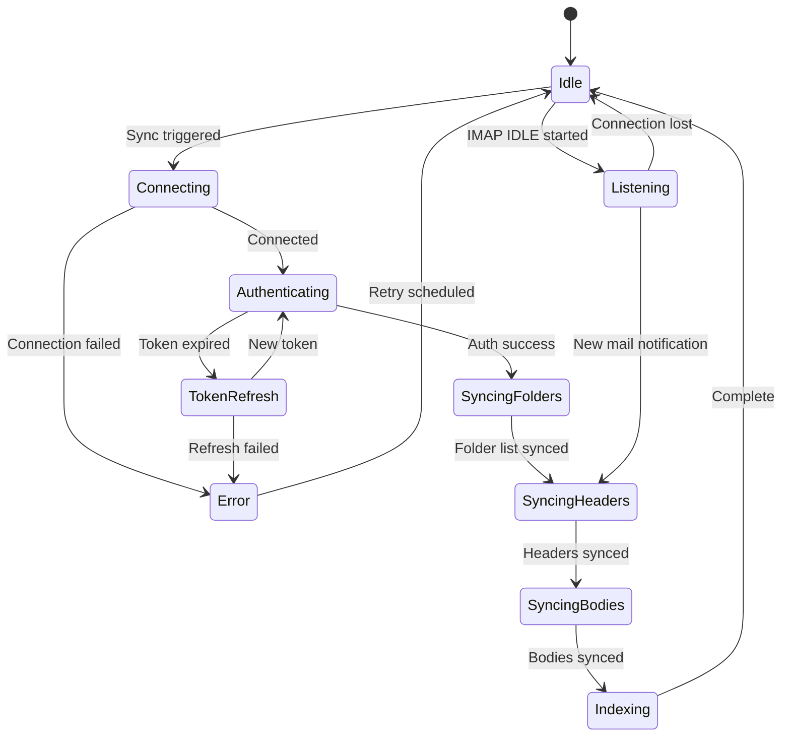
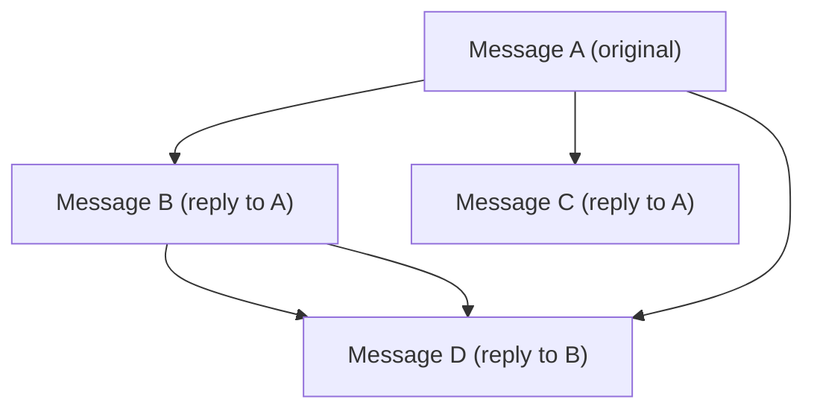
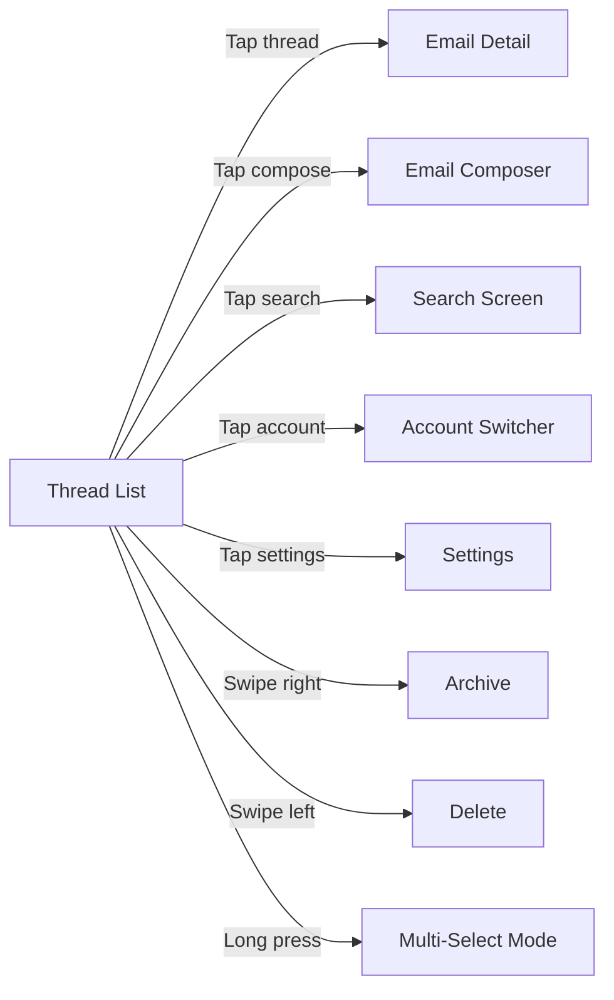
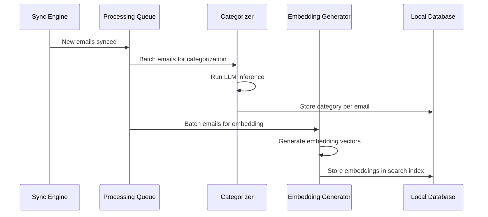
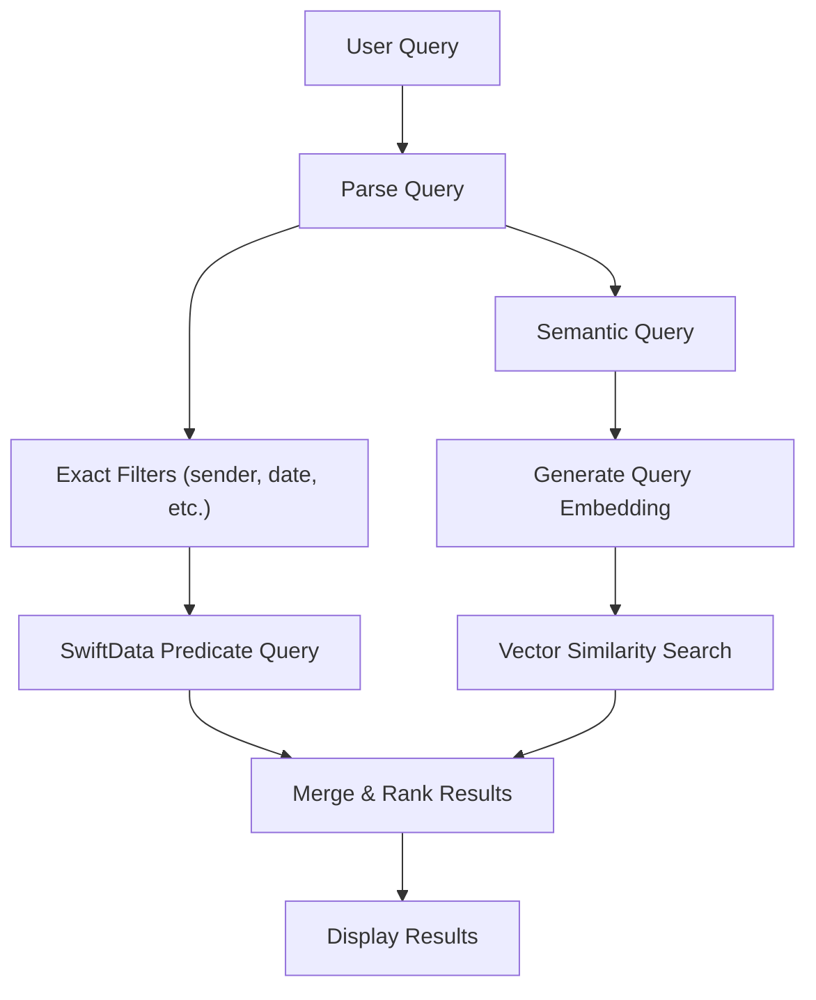

# Product Specification: Privacy-First Email Client (V1)

> The key words **MUST**, **MUST NOT**, **REQUIRED**, **SHALL**, **SHALL NOT**, **SHOULD**, **SHOULD NOT**, **RECOMMENDED**, **MAY**, and **OPTIONAL** in this document are to be interpreted as described in [RFC 2119](https://www.ietf.org/rfc/rfc2119.txt).

---

## 1. Summary

This specification defines a privacy-first email client that stores all user data locally, communicates only with the user's email service provider via IMAP/SMTP, and runs all AI features on-device. V1 targets Gmail as the email provider with iOS and native macOS as platforms.

---

## 2. Goals and Non-Goals

### Goals

- **G-01**: The client **MUST** provide full email functionality (read, compose, reply, forward, delete, archive) via IMAP/SMTP.
- **G-02**: The client **MUST** support multiple Gmail accounts simultaneously.
- **G-03**: The client **MUST** display emails in a threaded conversation view.
- **G-04**: The client **MUST** provide AI-powered email categorization, smart reply suggestions, and thread summarization using a local LLM.
- **G-05**: The client **MUST** provide AI-powered semantic search across synced emails.
- **G-06**: The client **MUST** run on both iOS and macOS as a native application.
- **G-07**: The client **MUST NOT** transmit any user data to servers other than the user's email provider.
- **G-08**: The client **MUST** support offline access for previously synced emails.

### Non-Goals (V1)

- **NG-01**: Support for email providers other than Gmail (deferred to V2).
- **NG-02**: Calendar or contacts integration.
- **NG-03**: Email encryption (S/MIME, PGP) beyond transport-level TLS.
- **NG-04**: Rich text / HTML email composition (V1 supports plain text and basic formatting).
- **NG-05**: Shared mailboxes or delegation.
- **NG-06**: Email rules / filters automation.
- **NG-07**: Widgets or app extensions.

---

## 3. Architecture Overview

```mermaid
graph TD
    subgraph Presentation
        TL["Thread List Screen"]
        ED["Email Detail Screen"]
        EC["Email Composer Screen"]
        ST["Settings Screen"]
        OB["Onboarding Screen"]
        AC["Account Management Screen"]
    end

    subgraph Domain
        UC_Sync["SyncEmailsUseCase"]
        UC_Fetch["FetchThreadsUseCase"]
        UC_Send["SendEmailUseCase"]
        UC_Cat["CategorizeEmailUseCase"]
        UC_Reply["SmartReplyUseCase"]
        UC_Sum["SummarizeThreadUseCase"]
        UC_Search["SearchEmailsUseCase"]
        UC_Acct["ManageAccountsUseCase"]
        DM["Domain Models"]
        RP["Repository Protocols"]
    end

    subgraph Data
        ER["EmailRepository"]
        AR["AccountRepository"]
        AIR["AIRepository"]
        SR["SearchRepository"]
        IMAP["IMAP Client"]
        SMTP["SMTP Client"]
        SD["SwiftData Store"]
        LLM["llama.cpp Engine"]
        EMB["Embedding Engine"]
        KC["Keychain Manager"]
    end

    TL --> UC_Fetch
    TL --> UC_Cat
    ED --> UC_Sum
    ED --> UC_Reply
    EC --> UC_Send
    ST --> UC_Acct
    OB --> UC_Acct
    AC --> UC_Acct
    TL --> UC_Search

    UC_Sync --> RP
    UC_Fetch --> RP
    UC_Send --> RP
    UC_Cat --> RP
    UC_Reply --> RP
    UC_Sum --> RP
    UC_Search --> RP
    UC_Acct --> RP

    ER --> RP
    AR --> RP
    AIR --> RP
    SR --> RP

    ER --> IMAP
    ER --> SMTP
    ER --> SD
    AR --> KC
    AR --> SD
    AIR --> LLM
    SR --> EMB
    SR --> SD
```

---

## 4. Data Model

### 4.1 Entity Relationship Diagram

### 4.2 AI Category Enum

| Value | Description |
|-------|------------|
| `primary` | Direct, personal communication |
| `social` | Social network notifications and messages |
| `promotions` | Marketing, deals, offers |
| `updates` | Bills, receipts, statements, confirmations |
| `forums` | Mailing lists, group discussions |
| `uncategorized` | Not yet processed by AI |

### 4.3 Folder Type Enum

| Value | IMAP Mapping |
|-------|-------------|
| `inbox` | INBOX |
| `sent` | [Gmail]/Sent Mail |
| `drafts` | [Gmail]/Drafts |
| `trash` | [Gmail]/Trash |
| `spam` | [Gmail]/Spam |
| `archive` | [Gmail]/All Mail |
| `starred` | [Gmail]/Starred |
| `custom` | User-created labels |

---

## 5. Feature Specifications

### 5.1 Account Management

#### 5.1.1 Account Addition

- The client **MUST** support adding Gmail accounts via OAuth 2.0 (using `ASWebAuthenticationSession`).
- The client **MUST** store OAuth tokens in the platform Keychain.
- The client **MUST** support adding multiple accounts.
- The client **MUST** validate IMAP/SMTP connectivity before completing account setup.
- The client **MUST** display connection errors with actionable messages.

#### 5.1.2 Account Configuration

- The client **MUST** allow users to configure the sync window per account (7, 14, 30, 60, 90 days; default: 30 days).
- The client **MUST** allow users to set a display name per account.
- The client **MUST** allow users to remove an account, deleting all associated local data.
- The client **SHOULD** allow users to set a default sending account.

#### 5.1.3 Gmail OAuth Flow

### 5.2 Email Synchronization

#### 5.2.1 Sync Behavior

- The client **MUST** perform a full sync of all folders within the configured sync window on first setup.
- The client **MUST** use IMAP IDLE (RFC 2177) to receive real-time updates when the app is in the foreground.
- The client **MUST** perform incremental sync on app foreground (fetch only changes since last sync).
- The client **SHOULD** use iOS background app refresh to periodically sync new emails.
- The client **MUST** sync email headers and bodies for all emails within the sync window.
- The client **MUST** track sync state per folder (last seen UID, UIDVALIDITY).
- The client **MUST** handle UIDVALIDITY changes by re-syncing the affected folder.

#### 5.2.2 Sync State Machine

#### 5.2.3 Conflict Resolution

- Server state is authoritative for email metadata (read status, labels, folder membership).
- Local drafts and queued sends are authoritative locally until confirmed by the server.
- If a local action (mark read, delete) fails to sync, the client **MUST** retry up to 3 times with exponential backoff, then surface the error to the user.

#### 5.2.4 Threading Algorithm

The client **MUST** group emails into conversation threads locally using the following algorithm. This is the canonical threading logic — it does not rely on any provider-specific thread IDs.

**Step 1: Header Extraction**

For each synced email, extract:
- `Message-ID` — unique identifier for this email
- `In-Reply-To` — the `Message-ID` of the direct parent message
- `References` — ordered list of `Message-ID`s representing the full ancestry chain

**Step 2: Reference Graph Construction**

Build a directed graph where each `Message-ID` is a node. Edges are derived from:
- `In-Reply-To` → link this message to its parent
- `References` → link this message to all ancestors in the chain

**Step 3: Thread Grouping by Reference Chain**

All messages that share **any** `Message-ID` in their reference chains are grouped into the same thread. This is computed as connected components in the reference graph.

**Step 4: Subject-Based Fallback**

For messages with **no** `References` and **no** `In-Reply-To` headers (common in forwarded emails, some mailing lists, or broken clients):

1. Normalize the subject: strip prefixes `Re:`, `Fwd:`, `RE:`, `FW:`, `re:`, `fwd:` (case-insensitive, applied recursively), then trim leading/trailing whitespace.
2. Match against existing threads by exact normalized subject within the **same account**.
3. Subject-only grouping **MUST** be restricted to messages within a **30-day window** of each other to prevent false merges across unrelated conversations with the same subject.

**Step 5: Thread Metadata Computation**

For each thread, compute:
- `latestDate` — the most recent `dateSent` or `dateReceived` across all messages
- `messageCount` — total number of messages
- `unreadCount` — count of messages where `isRead == false`
- `participants` — deduplicated list of all From addresses
- `snippet` — first ~100 characters of the latest message body
- `subject` — subject of the root (earliest) message

**Gmail Mismatch Handling**

Gmail's internal threading algorithm may produce different groupings than this RFC-based algorithm. The client's local threading is authoritative. Differences between Gmail's web UI thread view and this client's thread view are expected and acceptable. The client **MUST NOT** attempt to replicate Gmail's proprietary threading logic.

**Limitations (V1)**

- Thread splitting is **not** supported. Users cannot manually separate a thread into two.
- Thread merging is **not** supported. Users cannot manually combine two threads.
- These are deferred to V2.

### 5.3 Thread List Screen

#### 5.3.1 Display Requirements

- The client **MUST** display emails grouped by thread.
- Each thread row **MUST** show: sender name(s)/avatar(s), subject line, snippet (first ~100 chars of latest message body), timestamp, unread indicator, star indicator, attachment indicator, AI category badge.
- The client **MUST** support pull-to-refresh to trigger manual sync.
- The client **MUST** display threads sorted by most recent message date (newest first).
- The client **MUST** support category tabs/filters: All, Primary, Social, Promotions, Updates.
- The client **MUST** display an account switcher for multi-account navigation.
- The client **SHOULD** display a unified inbox across all accounts.
- The client **MUST** support swipe gestures: swipe right to archive, swipe left to delete.
- The client **MUST** support batch selection with multi-select mode.

#### 5.3.2 Thread List Navigation

### 5.4 Email Detail Screen

#### 5.4.1 Display Requirements

- The client **MUST** display the full thread with all messages in chronological order.
- Each message **MUST** show: sender name + avatar, recipients (To, CC), timestamp, full body (HTML rendered or plain text), attachment list with download option.
- The client **MUST** mark a thread as read when opened.
- The client **MUST** display an AI-generated thread summary at the top of the thread (generated on demand or cached).
- The client **MUST** display smart reply suggestions at the bottom of the thread.
- The client **MUST** support reply, reply-all, and forward actions.
- The client **MUST** support star/unstar, archive, and delete actions.
- The client **MUST** allow expanding/collapsing individual messages within the thread.
- The client **SHOULD** collapse read messages by default, expanding the latest unread message.

#### 5.4.2 Attachment Handling

- The client **MUST** display attachment metadata (name, type, size) inline with the message.
- The client **MUST** support downloading attachments to local storage on explicit user action (tap).
- The client **MUST** support previewing common attachment types (images, PDFs) via system QuickLook (sandboxed).
- The client **MUST** support sharing attachments via the system share sheet.

**Attachment Security**

- The client **MUST NOT** auto-download any attachment regardless of size. All attachments require explicit user tap to download.
- The client **MUST NOT** auto-open or auto-execute any attachment after download.
- Attachment previews **MUST** use the system QuickLook framework, which provides sandboxed rendering.
- The client **MUST** display a security warning before downloading executable or potentially dangerous file types:

  | File Extensions | Warning |
  |----------------|---------|
  | `.exe`, `.bat`, `.cmd`, `.com`, `.msi` | "This file is a Windows executable." |
  | `.app`, `.command`, `.sh`, `.pkg`, `.dmg` | "This file can run code on your Mac." |
  | `.js`, `.vbs`, `.wsf`, `.scr` | "This file is a script that can run code." |
  | `.zip`, `.rar`, `.7z`, `.tar.gz` | "This archive may contain executable files." |

- The client **MUST NOT** execute attachments directly. Opening an attachment **MUST** delegate to the system handler (e.g., Finder, default app).
- Downloaded attachment files **MUST** be stored within the app's sandbox directory, not in shared locations.

#### 5.4.3 HTML Rendering Safety

Email HTML is untrusted content. The client **MUST** sanitize and restrict HTML rendering to prevent privacy leaks, tracking, and code execution.

**Remote Content Blocking**

- The client **MUST** block all remote content (images, CSS, fonts, iframes) by default.
- Blocked remote images **MUST** display a placeholder with an indication that images were blocked.
- The client **MUST** provide a per-message "Load Remote Images" action.
- The client **SHOULD** provide a per-sender "Always Load Remote Images" preference (stored locally).
- When remote images are blocked, no network requests for those resources **SHALL** be made.

**Tracking Pixel Detection**

- The client **MUST** detect and strip likely tracking pixels before rendering, even when remote images are allowed:
  - Images with dimensions 1x1 or 0x0 (in `width`/`height` attributes or inline CSS)
  - Images with URLs matching known tracking domains (maintain a local blocklist)
  - Images embedded in visually hidden elements (`display:none`, `visibility:hidden`, `opacity:0`)
- Stripped tracking pixels **MUST NOT** generate any network request.
- The client **SHOULD** display a count of blocked trackers per message (e.g., "3 trackers blocked").

**HTML Sanitization**

The following elements and attributes **MUST** be stripped or neutralized before rendering:

| Removed | Reason |
|---------|--------|
| `<script>`, `<noscript>` | Code execution |
| `<iframe>`, `<frame>`, `<frameset>` | External content embedding |
| `<object>`, `<embed>`, `<applet>` | Plugin/code execution |
| `<form>`, `<input>`, `<button>`, `<select>`, `<textarea>` | Phishing form submission |
| `<meta http-equiv="refresh">` | Automatic redirect |
| `<link rel="stylesheet">` (external) | Remote resource loading |
| `@import` in CSS | Remote CSS loading |
| Event handler attributes (`onclick`, `onerror`, `onload`, `onmouseover`, etc.) | Code execution |
| `javascript:` URI scheme in `href`, `src`, `action` | Code execution |
| `data:` URI scheme (except for inline images in `` tags) | Content injection |

**Rendering Constraints**

- HTML **MUST** be rendered in a `WKWebView` with JavaScript **disabled** (`javaScriptEnabled = false`).
- All hyperlinks **MUST** open in the system default browser, never navigated within the WKWebView.
- The WKWebView **MUST** have no access to the app's cookies, local storage, or network session.
- If sanitization fails or produces empty output, the client **MUST** fall back to rendering the plain text body.

### 5.5 Email Composer

#### 5.5.1 Composition

- The client **MUST** support composing new emails, replies, reply-all, and forwards.
- The client **MUST** provide To, CC, and BCC fields with contact auto-complete from previously seen addresses.
- The client **MUST** provide a subject field (pre-filled for replies/forwards with Re:/Fwd: prefix).
- The client **MUST** provide a body editor with basic formatting (bold, italic, links).
- The client **MUST** support attaching files via the system file picker.
- The client **MUST** support attaching images from the photo library or camera.
- The client **MUST** auto-save drafts locally at regular intervals (every 30 seconds).
- The client **MUST** sync drafts to the server's drafts folder.
- The client **SHOULD** support inline image insertion.

#### 5.5.2 Send Behavior

- The client **MUST** send email via SMTP.
- The client **MUST** queue emails for sending if offline, and send when connectivity is restored. See Proposal Section 3.5 (Offline Send Queue) for the full queue lifecycle, retry policy, and error handling.
- The client **MUST** move sent messages to the Sent folder via IMAP APPEND.
- The client **MUST** display clear error messages if sending fails.

**Undo-Send Mechanism**

Undo-send is a purely client-side delay. The email **MUST NOT** be transmitted to the SMTP server during the undo window.

- The undo window is configurable: 0 (disabled), 5, 10, 15, or 30 seconds. Default: 5 seconds.
- When the user taps Send:
  1. The message transitions to `pendingSend` state in the local outbox.
  2. A countdown toast/snackbar appears with an "Undo" button.
  3. No SMTP transmission occurs during this window.

**Undo-Send Edge Cases**

| Scenario | Behavior |
|----------|----------|
| User taps Undo | Send cancelled. Message returns to composer for editing. |
| Timer expires (app foregrounded) | SMTP send proceeds immediately. Message moves to Sent on success. |
| App enters background during undo window | Timer **pauses**. Resumes when app returns to foreground. |
| App terminated by OS during undo window | Message **MUST** be persisted as a draft (saved locally + synced to Drafts folder). It is **NOT** sent automatically on next launch. User must explicitly re-send. |
| App killed by user during undo window | Same as OS termination: saved as draft, not auto-sent. |
| Device loses network during undo window | Timer continues normally. On expiry, message enters the offline send queue (see Proposal 3.5). |
| Undo window set to 0 (disabled) | SMTP send proceeds immediately on tap with no undo option. |

**Persistence guarantee**: The message **MUST** be written to local storage (SwiftData) as `pendingSend` **before** the undo countdown begins. This ensures no data loss if the app is terminated at any point.

#### 5.5.3 Smart Reply Integration

- When composing a reply, the client **SHOULD** pre-populate up to 3 smart reply suggestions.
- The user **MUST** be able to select a suggestion to insert it into the body, then edit freely.
- Smart reply generation **MUST** happen asynchronously and **MUST NOT** block the composer UI.

#### 5.5.4 Contacts Autocomplete Privacy

The recipient autocomplete feature **MUST** operate entirely from locally synced data, with no external contact lookups.

- Autocomplete data **MUST** be sourced exclusively from email headers (`From`, `To`, `CC`) of locally synced emails.
- The client **MUST NOT** access the system Contacts framework (`CNContact`, `ABAddressBook`). No contact permissions are requested.
- The client **MUST NOT** perform external contact directory lookups (LDAP, CardDAV, Google People API, etc.).
- The contact cache **MUST** be stored locally in SwiftData, scoped per account.
- Each contact entry stores: email address, display name (from email header), last seen date, frequency of appearance.
- Autocomplete results **SHOULD** be ranked by frequency of correspondence (most frequent first).
- When an account is removed, all associated contact cache entries **MUST** be deleted (cascade).
- Contact data **MUST NOT** be shared, exported, or transmitted to any external service.
- The unified inbox view **SHOULD** merge autocomplete suggestions across all accounts, deduplicating by email address.

### 5.6 AI Features

#### 5.6.1 Engine Requirements

- The AI engine **MUST** use llama.cpp with GGUF quantized models.
- Models **MUST** be downloaded on first launch or on demand (not bundled in the app binary).
- The client **MUST** display download progress and allow the user to cancel.
- The client **MUST** function without AI features if the model is not downloaded (graceful degradation).
- The client **MUST** allow the user to delete downloaded models to reclaim storage.
- The AI engine **MUST** expose a protocol-based interface so the underlying runtime can be swapped.

#### 5.6.2 Email Categorization

- The client **MUST** categorize each email into one of: Primary, Social, Promotions, Updates, Forums.
- Categorization **MUST** run locally using the LLM.
- Categorization **SHOULD** run in the background after sync completes.
- Categorization results **MUST** be cached locally (stored on the Email/Thread entity).
- The client **SHOULD** allow users to manually re-categorize an email (override AI decision).
- Re-categorization **SHOULD** be used as implicit feedback to improve future categorization (stored locally as preference signals).

#### 5.6.3 Smart Reply

- The client **MUST** generate up to 3 short reply suggestions for a given email.
- Suggestions **MUST** be contextually relevant to the email content.
- Suggestions **SHOULD** vary in tone (e.g., affirmative, declining, follow-up question).
- Generation **MUST** complete within 3 seconds on supported hardware.
- Generation **MUST** run asynchronously; UI **MUST NOT** block while generating.

#### 5.6.4 Thread Summarization

- The client **MUST** generate a concise summary (2-4 sentences) for any email thread.
- Summarization **MUST** be triggered on demand (user taps "Summarize") or automatically for threads with 3+ messages.
- Summaries **MUST** be cached locally.
- The summary **MUST** capture: key decisions, action items, and the latest status.

#### 5.6.5 Semantic Search

- The client **MUST** support natural language search queries across all synced emails.
- Search **MUST** use locally generated embeddings for semantic matching.
- Embeddings **MUST** be generated and stored locally during the indexing phase of sync.
- Search results **MUST** be ranked by relevance.
- Search **MUST** also support exact-match queries for sender, subject, and date range.
- The search index **MUST** update incrementally as new emails are synced.

#### 5.6.6 AI Processing Pipeline

### 5.7 Search

#### 5.7.1 Search Interface

- The client **MUST** provide a search bar accessible from the thread list.
- The client **MUST** support free-text search input.
- The client **SHOULD** display recent searches.
- The client **SHOULD** provide search filters: sender, date range, has attachment, category, account.
- The client **MUST** display search results as a thread list with highlighted matching terms.
- The client **MUST** support tapping a search result to navigate to the email detail.

#### 5.7.2 Search Architecture

### 5.8 Settings

- The client **MUST** provide a settings screen with the following options:

| Setting | Type | Default | Description |
|---------|------|---------|-------------|
| Sync window | Picker (7/14/30/60/90 days) | 30 days | Per-account configurable |
| Default account | Picker | First added | Account used for new compositions |
| Undo send delay | Picker (0/5/10/15/30 seconds) | 5 seconds | Delay before email is actually sent |
| AI model management | Section | — | Download, delete, view model size |
| Category tabs visible | Toggle per category | All on | Show/hide categories in thread list |
| Notification preferences | Section | — | Per-account enable/disable |
| Theme | System/Light/Dark | System | Appearance preference |
| App lock | Toggle | Off | Require biometric/passcode to open |
| Data management | Section | — | Clear cache, export data, storage usage |
| About | Section | — | Version, licenses, privacy policy |

### 5.9 Onboarding

- The client **MUST** display a first-launch onboarding flow.
- Onboarding **MUST** include: welcome screen with privacy value proposition, account addition (at least one account required), AI model download (with option to skip), brief feature tour (swipe gestures, AI features).
- Onboarding **MUST** complete in 5 or fewer screens/steps.

---

## 6. Platform-Specific Considerations

### 6.1 iOS

- **MUST** follow Apple Human Interface Guidelines.
- **MUST** support iPhone screen sizes (SE to Pro Max).
- **MUST** support both portrait and landscape orientations.
- **MUST** support split-view and slide-over on iPad (if installed via Mac target is not applicable — but future iPad support should be considered in layout).

### 6.2 macOS

- **MUST** provide a native macOS window with standard menu bar items.
- **MUST** support keyboard shortcuts for common actions (Cmd+N for new email, Cmd+R for reply, Cmd+Delete for delete, Cmd+F for search).
- **MUST** support multiple windows (e.g., compose in a separate window).
- **SHOULD** support a three-pane layout: sidebar (accounts/folders) | thread list | email detail.
- **MUST** support native macOS drag-and-drop for attachments.
- **MUST** support the macOS toolbar and sidebar patterns.

---

## 7. Security Considerations

### 7.1 Authentication

- OAuth 2.0 tokens **MUST** be stored in the Keychain with `kSecAttrAccessibleWhenUnlockedThisDeviceOnly` protection level.
- Token refresh **MUST** happen transparently before token expiry.
- Refresh failure **MUST** prompt re-authentication; the client **MUST NOT** store user passwords.

### 7.2 Data at Rest

- All email data **MUST** be stored using SwiftData, which inherits iOS Data Protection (encrypted at rest when device is locked).
- The client **SHOULD** support an optional app lock (biometric or passcode) as an additional layer.
- AI models stored locally do not require encryption (they contain no user data).

### 7.3 Data in Transit

- All IMAP connections **MUST** use TLS (port 993).
- All SMTP connections **MUST** use TLS (port 465 or STARTTLS on 587).
- The client **MUST** validate server certificates; certificate pinning **MAY** be implemented.

### 7.4 Data Deletion

- When an account is removed, the client **MUST** delete all associated local data (emails, attachments, search index, sync state, cached AI results).
- Keychain items for the account **MUST** be deleted.
- The client **SHOULD** provide a "wipe all data" option in settings.

---

## 8. Storage & Data Retention

Refer to Constitution TC-06 for hard limits. This section specifies the behavioral requirements.

### 8.1 Mailbox Size Limits

- The client **MUST** support up to 50,000 emails per account.
- The client **SHOULD** remain functional with up to 100,000 emails (degraded performance acceptable).
- The client **MUST** display a warning when account storage exceeds 2GB.

### 8.2 Cache Management

| Cache | Limit | Eviction | User Control |
|-------|-------|----------|-------------|
| Downloaded attachments | 500MB per account | LRU when limit exceeded | Configurable limit in Settings |
| Email bodies | Sync window | Purged when outside window | Via sync window setting |
| AI results (category, summary) | Tied to email lifecycle | Deleted with email | None (automatic) |
| Search embeddings | Tied to email lifecycle | Deleted with email | None (automatic) |
| AI models | No automatic limit | None | Manual delete in Settings |

### 8.3 Storage Visibility

- The client **MUST** display per-account storage breakdown in Settings (emails, attachments, search index).
- The client **MUST** display total app storage usage.
- The client **MUST** provide a "Clear Cache" action (removes attachments and regenerable caches, preserves emails and accounts).
- The client **SHOULD** warn the user when total app storage exceeds 5GB.

### 8.4 Sync Window Retention

- When the sync window is reduced, emails outside the new window **SHOULD** be purged from local storage within 24 hours.
- Purging local data **MUST NOT** delete emails from the IMAP server.
- The client **MUST** inform the user that reducing the sync window will remove local copies of older emails.

---

## 9. Legal & Compliance

### 9.1 AI Model Licensing

- All AI models **MUST** have licenses permitting commercial use and local redistribution.
- Model license details **MUST** be displayed in Settings → About → AI Model Licenses.
- Models **MUST NOT** be bundled in the App Store binary; they **MUST** be downloaded post-install.
- Refer to Constitution LG-01 for the pre-approved model list and license review requirements.

### 9.2 Gmail OAuth Compliance

- The client **MUST** complete Google's OAuth verification process before public release.
- The client **MUST** request only the minimum scope: `https://mail.google.com/`.
- The client **MUST** comply with Google's API Services User Data Policy (Limited Use requirements).
- The client **MUST** provide a privacy policy URL on the OAuth consent screen.
- Refer to Constitution LG-02 for full requirements.

### 9.3 App Store Privacy Disclosure

- The client **MUST** accurately complete the App Store Privacy Nutrition Label for each release.
- The client **MUST** include an in-app privacy policy accessible from Settings.
- Expected disclosure: data collected locally for app functionality only; no data collected for tracking; no data shared with third parties.
- Refer to Constitution LG-03 for the detailed disclosure matrix.

---

## 10. Performance Requirements

Refer to Constitution TC-04 for hard limits. Additional requirements:

| Scenario | Target | Measurement |
|----------|--------|-------------|
| Initial sync (1000 emails) | < 60s on Wi-Fi | Time from account setup to thread list displaying |
| Incremental sync (10 new emails) | < 5s | Time from foreground to updated thread list |
| AI categorization batch (100 emails) | < 30s | Background processing time |
| Embedding generation (100 emails) | < 60s | Background processing time |
| Search (10K email corpus) | < 2s first results | Time from query submit to first results visible |
| Memory during AI inference | < 500MB additional | Peak memory above baseline during inference |

---

## 11. Alternatives Considered

See [Proposal — Section 4](proposal.md#4-alternatives-considered) for architectural alternatives. Feature-level alternatives:

| Feature | Alternative | Reason Rejected |
|---------|------------|----------------|
| Thread grouping | Gmail API thread IDs | Requires proprietary API; IMAP References/In-Reply-To headers provide equivalent grouping |
| Categorization | Rule-based classifier | Lower accuracy than LLM; brittle to maintain; does not generalize |
| Search | SQLite FTS5 only | No semantic understanding; keyword-only search misses relevant results |
| Sync | POP3 instead of IMAP | No folder sync, no server-side state management, no IDLE push |

---

## 12. Open Questions

| # | Question | Owner | Target Date |
|---|----------|-------|-------------|
| OQ-01 | Which specific GGUF model(s) should we target for V1? Candidates: Phi-3 Mini, Llama 3.2 1B/3B, Mistral 7B Q4 | AI Lead | Pre-plan |
| OQ-02 | Which embedding model for semantic search? Candidates: all-MiniLM-L6-v2, nomic-embed-text | AI Lead | Pre-plan |
| OQ-03 | Should notification strategy be background-fetch-only or should we explore Apple Push Notification with a minimal relay? | Core Team | Plan phase |
| OQ-04 | Gmail IMAP access requires "Allow less secure apps" to be deprecated — confirm OAuth-based XOAUTH2 IMAP auth works reliably | Backend Lead | Pre-plan |
| ~~OQ-05~~ | ~~Maximum supported mailbox size for V1?~~ **RESOLVED**: 50K supported, 100K functional with degraded perf. See Constitution TC-06 and Spec Section 8.1. | Core Team | Resolved |

---

## 13. Revision History

| Version | Date | Author | Change Summary |
|---------|------|--------|---------------|
| 1.0.0 | 2025-02-07 | Core Team | Initial draft |
| 1.1.0 | 2025-02-07 | Core Team | Added Sections 8 (Storage & Data Retention), 9 (Legal & Compliance). Resolved OQ-05. |
| 1.2.0 | 2025-02-07 | Core Team | Added 5.2.4 (Threading Algorithm), 5.4.3 (HTML Rendering Safety), 5.5.4 (Contacts Autocomplete Privacy). Expanded 5.4.2 (Attachment Security). Rewrote 5.5.2 (Undo-Send edge cases). |
