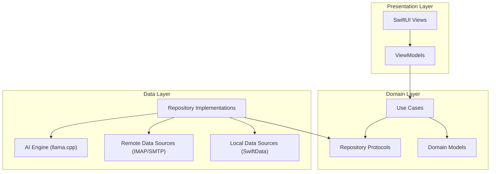
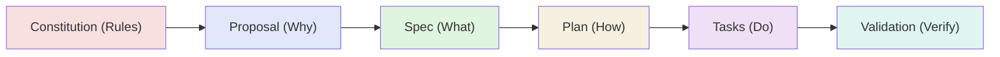
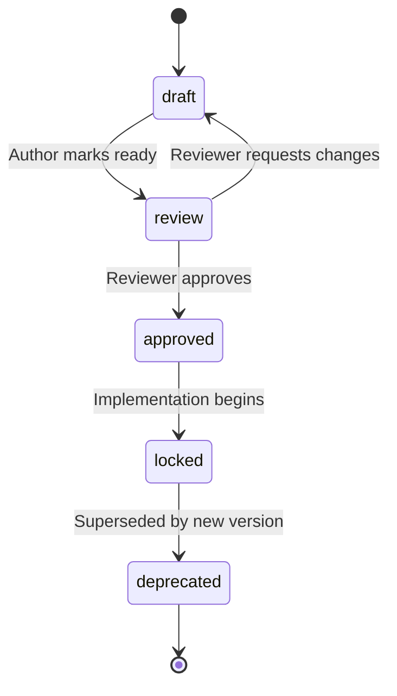

# Project Constitution

> The key words **MUST**, **MUST NOT**, **REQUIRED**, **SHALL**, **SHALL NOT**, **SHOULD**, **SHOULD NOT**, **RECOMMENDED**, **MAY**, and **OPTIONAL** in this document are to be interpreted as described in [RFC 2119](https://www.ietf.org/rfc/rfc2119.txt).

## 1. Purpose

This constitution defines the immutable constraints, principles, and rules that govern the project. All other project documents — specifications, proposals, plans, and code — **MUST** conform to this document. In any conflict between this constitution and another project document, this constitution prevails.

---

## 2. Core Principles

### P-01: Privacy by Default

- **Statement**: All user data **MUST** remain on the user's device. No data **SHALL** leave the device except to communicate with the user's own email service provider.
- **Rationale**: Privacy is the product's foundational value. Users choose this client specifically because their data stays local.
- **Implications**: No analytics services, no crash reporting to third-party servers, no cloud sync, no telemetry. All AI processing runs on-device. Diagnostic data, if collected, **MUST** remain local.

### P-02: Zero Third-Party Server Dependency

- **Statement**: The application **MUST NOT** connect to any server other than the user's configured email service provider(s), except for provider-mandated authentication endpoints (e.g., OAuth authorization servers) and one-time model downloads that transmit no user data (see LG-01, LG-02).
- **Rationale**: Every external connection is a potential data leak and a trust violation. The two exceptions are narrowly scoped: OAuth endpoints are required by the provider's own authentication flow, and model downloads transfer only static weight files with no user data sent.
- **Implications**: No REST API backends, no push notification relay servers, no remote config services. All features **MUST** function using only local resources and direct provider connections (IMAP/SMTP). Model download policy is defined in the proposal (Section 3.4.1).

### P-03: Local-First AI

- **Statement**: All AI features **MUST** run entirely on-device using local models.
- **Rationale**: AI features that phone home defeat the privacy guarantee.
- **Implications**: Models **MUST** be downloaded and cached locally. Inference **MUST** happen on-device. No prompts, embeddings, or user content **SHALL** be sent to remote AI services. Model acquisition strategy is defined in LG-01.

### P-04: Offline Capability

- **Statement**: The application **SHOULD** provide meaningful functionality without a network connection for previously synced data.
- **Rationale**: Local-first means local-functional. Users should read, search, and interact with synced email without connectivity.
- **Implications**: Synced emails, search indices, and AI categorizations **MUST** persist locally. Compose **MUST** queue messages for sending when connectivity resumes.

### P-05: Multi-Platform Intent

- **Statement**: Architecture and specifications **MUST** be designed with cross-platform expansion in mind, even when implementing for a single platform.
- **Rationale**: The project targets iOS first but will expand to macOS, Android, and other platforms. Platform-locked decisions made early create expensive rewrites later.
- **Implications**: Specs **MUST** be platform-independent. Business logic **SHOULD** be separated from UI. Platform-specific code **MUST** be isolated behind clean interfaces.

### P-06: Standard Protocols Over Proprietary APIs

- **Statement**: Email communication **MUST** use standard protocols (IMAP, SMTP) as the primary integration method.
- **Rationale**: Standard protocols work with any provider and reduce vendor lock-in.
- **Implications**: Gmail-specific features **MUST NOT** require the Gmail REST API. Provider-specific enhancements **MAY** be offered as optional layers but **MUST NOT** be required for core functionality.

### P-07: Security as a Requirement, Not a Feature

- **Statement**: All stored credentials **MUST** use platform-native secure storage (Keychain on Apple platforms). All network communication **MUST** use TLS. All local data **MUST** be protected by platform-level encryption at rest.
- **Rationale**: A privacy-focused client with weak security is a contradiction.
- **Implications**: No plaintext credential storage. No unencrypted network traffic. No insecure local data stores. Security **MUST** be validated in every release.

---

## 3. Technical Constraints

### TC-01: Supported Platforms (V1)

| Platform | Minimum Version | Framework |
|----------|----------------|-----------|
| iOS      | 17.0           | SwiftUI   |
| macOS    | 14.0 (Sonoma)  | SwiftUI (native target) |

### TC-02: Language and Frameworks

- Primary language: **Swift** (latest stable version)
- UI framework: **SwiftUI**
- Persistence: **SwiftData**
- AI runtime: **llama.cpp** (GGUF quantized models)
- Email protocols: **IMAP4rev1** (RFC 3501), **SMTP** (RFC 5321)
- Credential storage: **Apple Keychain Services**

### TC-03: Prohibited Dependencies

- **MUST NOT** include any third-party analytics SDK
- **MUST NOT** include any third-party crash reporting SDK
- **MUST NOT** include any ad framework
- **MUST NOT** depend on any remote configuration service
- **MUST NOT** use any proprietary email API as a required dependency

### TC-04: Performance Floors

| Metric | Target | Hard Limit |
|--------|--------|------------|
| App cold start (to interactive) | < 1.5s | 3s |
| Thread list scroll | 60 fps | No drops below 30 fps |
| Email open (cached) | < 300ms | 500ms |
| AI categorization (per email) | < 500ms | 2s |
| Search results (first page) | < 1s | 3s |
| Memory footprint (idle) | < 100MB | 200MB |

### TC-05: Accessibility

- All UI **MUST** meet WCAG 2.1 AA compliance
- All interactive elements **MUST** support VoiceOver
- Dynamic Type **MUST** be supported across all screens
- Color **MUST NOT** be the sole means of conveying information

### TC-06: Data Retention & Storage

#### Mailbox Size

- The client **MUST** support mailboxes of up to 50,000 emails per account for V1.
- The client **SHOULD** remain functional (no crashes, no data loss) with up to 100,000 emails per account, with degraded performance acceptable beyond 50K.
- The client **MUST** display a warning when local storage for a single account exceeds 2GB.

#### Sync Window & Retention

- Emails outside the configured sync window **MAY** be purged from local storage during maintenance.
- The client **MUST** retain all emails within the active sync window.
- When the user reduces the sync window, emails outside the new window **SHOULD** be purged within 24 hours.
- Purging local data **MUST NOT** delete emails from the server.

#### Cache Limits

| Cache Type | Default Limit | User Configurable | Eviction Policy |
|-----------|---------------|-------------------|-----------------|
| Email body cache (HTML/plain) | Retained for sync window | Via sync window setting | Oldest first when outside window |
| Attachment cache (downloaded files) | 500MB per account | Yes (Settings) | LRU eviction when limit exceeded |
| AI category/summary cache | No limit (stored on entity) | No (deleted with email) | Tied to email lifecycle |
| Search embedding index | No limit (stored locally) | No (deleted with email) | Tied to email lifecycle |
| AI model files | No limit | Yes (manual delete in Settings) | User-managed |

- The client **MUST** display per-account and total storage usage in Settings.
- The client **MUST** provide a "Clear Cache" action that removes downloaded attachments and regenerable caches without deleting emails or accounts.
- The client **SHOULD** proactively warn the user when total app storage exceeds 5GB.

#### Storage Budgeting

| Component | Expected Range (per account, 30-day window) |
|-----------|---------------------------------------------|
| Email metadata (SwiftData) | 50-200MB for 10K-50K emails |
| Email bodies | 100MB-1GB depending on email content |
| Attachments (downloaded) | 0-500MB (user-controlled) |
| Search index (embeddings) | 50-200MB for 10K-50K emails |
| AI models (shared across accounts) | 500MB-2GB depending on model |
| **Total estimate** | **700MB-4GB per account + models** |

- The client **MUST** document expected storage usage during onboarding before initial sync.
- The client **MUST NOT** allow unbounded storage growth — all caches **MUST** have a limit or lifecycle-based eviction.

---

## 4. Legal & Licensing

### LG-01: AI Model Licensing

- All AI models used by the client **MUST** have licenses that permit local redistribution and on-device inference in a commercial application.
- The model license **MUST** be reviewed and recorded before any model is added to the supported model list.
- The client **MUST** display model license information in Settings → About → AI Model Licenses.
- Models with restrictive licenses (e.g., non-commercial-only, share-alike that would apply to the client itself) **MUST NOT** be included.

| Candidate Model Family | License | Commercial Use | Redistribution | Status |
|------------------------|---------|---------------|---------------|--------|
| Llama 3 / 3.2 | Llama 3 Community License | Yes (under 700M MAU) | Yes | Eligible |
| Phi-3 / Phi-3.5 | MIT | Yes | Yes | Eligible |
| Mistral 7B | Apache 2.0 | Yes | Yes | Eligible |
| Gemma | Gemma Terms of Use | Yes | Yes (with terms) | Review required |

- The final model selection **MUST** be made only after license verification.
- Model files **MUST NOT** be bundled in the app binary submitted to the App Store. They **MUST** be downloaded post-install.

### LG-02: Gmail OAuth Requirements

- The client **MUST** comply with [Google's OAuth 2.0 Policies](https://developers.google.com/identity/protocols/oauth2/policies).
- The client **MUST** undergo Google's OAuth verification process before public release.
- The client **MUST** request only the minimum required OAuth scopes:
  - `https://mail.google.com/` (IMAP/SMTP access)
- The client **MUST** provide a privacy policy URL accessible from the OAuth consent screen and the app itself.
- The client **MUST** comply with Google's [API Services User Data Policy](https://developers.google.com/terms/api-services-user-data-policy), specifically the Limited Use requirements.
- The client **MUST NOT** use obtained tokens for any purpose other than direct IMAP/SMTP communication with Gmail.

### LG-03: App Store Privacy Disclosure

- The client **MUST** accurately complete the App Store Privacy Nutrition Label.
- Based on the architecture, the expected disclosures are:

| Data Type | Collected | Linked to User | Used for Tracking | Purpose |
|-----------|-----------|----------------|-------------------|---------|
| Email messages | No (stored locally only) | N/A | N/A | N/A |
| Email address | No (stored locally only) | N/A | N/A | N/A |
| Name | No (stored locally only) | N/A | N/A | N/A |
| Usage data | No | N/A | N/A | N/A |
| Diagnostics | No | N/A | N/A | N/A |

- **Note**: "Collected" in App Store terms means data transmitted off the device to the developer or a third party. Since all data remains local or goes only to the user's email provider, it is **not collected**.

- The privacy disclosure **MUST** be reviewed and updated with each release that changes data handling.
- The client **MUST** include an in-app privacy policy accessible from Settings.

### LG-04: Open-Source License Compliance

- All third-party dependencies **MUST** have their licenses documented in Settings → About → Open Source Licenses.
- License compliance **MUST** be validated before each release.
- The following licenses are pre-approved for use: MIT, Apache 2.0, BSD 2-Clause, BSD 3-Clause, ISC, Zlib.
- Copyleft licenses (GPL, LGPL, AGPL) **MUST NOT** be used unless reviewed and approved by the Core Team, with a documented compliance strategy.

---

## 5. Architectural Invariants

### AI-01: Layered Architecture

The codebase **MUST** follow a strict layered architecture. Dependencies **MUST** point inward only.



- Presentation **MUST NOT** directly access the Data layer
- Domain layer **MUST NOT** depend on any platform framework (no UIKit, no SwiftUI imports)
- Data layer **MUST** implement protocols defined in the Domain layer

### AI-02: Provider Abstraction

Email provider interactions **MUST** be abstracted behind a provider protocol. Adding a new provider **MUST NOT** require changes to the Domain or Presentation layers.

### AI-03: AI Engine Abstraction

The AI engine **MUST** be abstracted behind a protocol. Swapping the underlying model or runtime (e.g., from llama.cpp to Core ML) **MUST NOT** require changes outside the Data layer.

---

## 6. Process Requirements

### PR-01: Spec Before Code

- No feature implementation **SHALL** begin without an approved specification
- Spec status **MUST** be `approved` or `locked` before implementation starts

### PR-02: Testing Minimums

- All Domain layer use cases **MUST** have unit tests
- All Repository implementations **MUST** have integration tests
- All ViewModels **MUST** have unit tests
- UI flows **MUST** have at least one end-to-end test per critical path

### PR-03: Validation Before Merge

- All acceptance criteria defined in `validation.md` **MUST** pass before a feature is considered complete
- Performance metrics **MUST** be validated against TC-04 thresholds

### PR-04: Documentation

- Public API surfaces **MUST** have documentation comments
- Architectural decisions **MUST** be recorded in proposal documents
- Breaking changes **MUST** be recorded in a changelog

---

## 7. Spec Format Standard

This section defines the mandatory document format, hierarchy, lifecycle, and template for all project specifications. Every feature or change **MUST** follow this framework.

### SF-01: Document Hierarchy

All project work flows through a fixed document chain. Each document type has a distinct purpose and audience.



| Document | Purpose | Scope | Owner |
|----------|---------|-------|-------|
| **Constitution** | Immutable rules and principles all work must conform to | Project-wide | Core Team |
| **Proposal** | Justifies *why* a feature or project exists; evaluates alternatives | Platform-independent | Author → Core Team review |
| **Spec** | Defines *what* to build — requirements, data models, behaviors | Platform-independent | Author → Core Team review |
| **Plan** | Defines *how* to build it — architecture mapping, phases, dependencies | Platform-specific | Engineering Lead |
| **Tasks** | Defines *what to do* — discrete deliverables with checklists | Platform-specific | Engineering Lead |
| **Validation** | Defines *how to verify* — acceptance criteria, test plan, benchmarks | Platform-specific | QA Lead |

### SF-02: Document Lifecycle

Every document (except the Constitution) follows this lifecycle. No document **SHALL** skip a state.



| State | Meaning | Allowed Changes |
|-------|---------|-----------------|
| `draft` | Actively being written | Any |
| `review` | Content-complete, under review | Feedback-driven edits only |
| `approved` | Accepted by reviewers | Minor corrections only (typos, clarifications) |
| `locked` | Implementation in progress or complete | None — requires a new versioned document to change |
| `deprecated` | Superseded by a newer version | None |

- Moving to `review` **REQUIRES** the author marking the document ready.
- Moving to `approved` **REQUIRES** explicit reviewer approval.
- Moving to `locked` **REQUIRES** explicit owner approval.
- The Constitution uses a separate amendment process (see Section 1).

### SF-03: Spec Document Structure

Every spec **MUST** contain the following sections in this order. Sections marked **REQUIRED** must be present; sections marked **RECOMMENDED** should be present unless explicitly inapplicable.

#### Front Matter (REQUIRED)

YAML metadata block with: `title`, `version`, `status`, `created`, `updated`, `authors`, `reviewers`, `tags`, `depends-on`.

#### Section Breakdown

| # | Section | Requirement | Content |
|---|---------|-------------|---------|
| 1 | **Summary** | REQUIRED | 2-3 sentence plain-language overview |
| 2 | **Goals and Non-Goals** | REQUIRED | Bulleted goals using RFC 2119 keywords; explicit non-goals to prevent scope creep |
| 3 | **Functional Requirements (FRD)** | REQUIRED | Feature-by-feature behavioral specs. Each feature gets a subsection with: description, user-facing behavior, state diagrams (Mermaid), sequence diagrams (Mermaid), error handling |
| 4 | **Non-Functional Requirements (NFR)** | REQUIRED | Performance targets, security requirements, accessibility requirements, scalability constraints. Each with measurable thresholds |
| 5 | **Data Model** | REQUIRED | Entity definitions, relationships (Mermaid ERD), enums, constraints |
| 6 | **Architecture Overview** | RECOMMENDED | High-level component diagram (Mermaid). How components interact |
| 7 | **Platform-Specific Considerations** | RECOMMENDED | Per-platform deviations or additions to the common spec |
| 8 | **Alternatives Considered** | REQUIRED | What was evaluated and why it was rejected |
| 9 | **Open Questions** | REQUIRED | Numbered list with owner and target date. **MUST** be empty before status moves to `approved` |
| 10 | **Revision History** | REQUIRED | Table: Version, Date, Author, Change Summary |

#### Requirement ID Convention

Every requirement **MUST** have a unique, stable ID for traceability:

| Prefix | Meaning | Example |
|--------|---------|---------|
| `FR-` | Functional Requirement | `FR-SYNC-01: Initial full sync` |
| `NFR-` | Non-Functional Requirement | `NFR-PERF-01: Cold start < 1.5s` |
| `AC-` | Acceptance Criterion | `AC-F-05: IMAP client connectivity` |
| `G-` | Goal | `G-01: Full email CRUD` |
| `NG-` | Non-Goal | `NG-01: Non-Gmail providers` |
| `OQ-` | Open Question | `OQ-01: Model selection` |

### SF-04: Plan Document Structure

Every platform-specific plan **MUST** contain:

| # | Section | Content |
|---|---------|---------|
| 1 | **Scope** | Which spec sections are covered; platform deviations |
| 2 | **Platform Context** | OS versions, frameworks, device targets, design guidelines |
| 3 | **Architecture Mapping** | Spec architecture → concrete classes, files, modules (Mermaid class/flow diagrams) |
| 4 | **Implementation Phases** | Ordered phases with task tables (ID, description, dependencies) |
| 5 | **UI/UX Implementation** | Screen-by-screen breakdown, navigation flow, component sharing strategy |
| 6 | **Testing Strategy** | Test pyramid, test targets, device matrix |
| 7 | **Dependencies** | Third-party libraries with license and integration method |
| 8 | **Risks and Mitigations** | Platform-specific risks with likelihood, impact, mitigation |

### SF-05: Validation Document Structure

Every validation document **MUST** contain:

| # | Section | Content |
|---|---------|---------|
| 1 | **Traceability Matrix** | Maps every spec requirement (FR/NFR) → acceptance criteria → test cases |
| 2 | **Acceptance Criteria** | Given/When/Then format with RFC 2119 keywords and priority (Critical/High/Medium/Low) |
| 3 | **Edge Cases** | Error scenarios, boundary conditions, concurrency issues |
| 4 | **Performance Validation** | Metric, target, hard limit, measurement method, failure threshold |
| 5 | **Device Test Matrix** | Device, OS, role |
| 6 | **Sign-Off** | Reviewer, role, date, status |

### SF-06: Spec Template

The following template **MUST** be used when creating any new spec:

````markdown
---
title: "[Feature Name] — Specification"
version: "1.0.0"
status: draft
created: YYYY-MM-DD
updated: YYYY-MM-DD
authors: []
reviewers: []
tags: []
depends-on: [docs/constitution.md]
---

# Specification: [Feature Name]

> The key words **MUST**, **MUST NOT**, **REQUIRED**, **SHALL**, **SHALL NOT**,
> **SHOULD**, **SHOULD NOT**, **RECOMMENDED**, **MAY**, and **OPTIONAL** in this
> document are to be interpreted as described in RFC 2119.

## 1. Summary
<!-- 2-3 sentence overview -->

## 2. Goals and Non-Goals
### Goals
- **G-XX**: [Goal statement using RFC 2119 keyword]

### Non-Goals
- **NG-XX**: [Explicit exclusion]

## 3. Functional Requirements
### FR-[AREA]-XX: [Requirement Name]
- **Description**: [What the system must do]
- **Behavior**: [User-facing behavior]
- **Error Handling**: [What happens on failure]

## 4. Non-Functional Requirements
### NFR-[AREA]-XX: [Requirement Name]
- **Metric**: [What is measured]
- **Target**: [Desired value]
- **Hard Limit**: [Failure threshold]

## 5. Data Model
<!-- Mermaid ERD and entity definitions -->

## 6. Architecture Overview
<!-- Mermaid component diagram -->

## 7. Platform-Specific Considerations
### iOS
### macOS

## 8. Alternatives Considered
| Alternative | Pros | Cons | Rejected Because |
|-------------|------|------|-----------------|

## 9. Open Questions
| # | Question | Owner | Target Date |
|---|----------|-------|-------------|

## 10. Revision History
| Version | Date | Author | Change Summary |
|---------|------|--------|---------------|
````

---

## 8. Naming Conventions

### Code

| Element | Convention | Example |
|---------|-----------|---------|
| Types / Protocols | UpperCamelCase | `EmailThread`, `MailProvider` |
| Functions / Properties | lowerCamelCase | `fetchThreads()`, `isRead` |
| Constants | lowerCamelCase | `maxRetryCount` |
| Enum cases | lowerCamelCase | `.inbox`, `.sent` |
| Files | Match primary type | `EmailThread.swift` |

### Documentation

| Document | Convention | Example |
|----------|-----------|---------|
| Specs | `spec.md` or `SPEC-NNN-name.md` | `spec.md` |
| Proposals | `proposal.md` or `PROP-NNN-name.md` | `proposal.md` |
| Plans | `plan.md` inside platform dir | `ios-macos/plan.md` |

### Git

| Element | Convention | Example |
|---------|-----------|---------|
| Branches | `type/short-description` | `feat/thread-list-ui` |
| Commits | Conventional Commits | `feat: add email thread list view` |

---

## 9. Glossary

| Term | Definition |
|------|-----------|
| **Thread** | A group of related email messages sharing a common subject and references, displayed as a single conversation |
| **Provider** | An email service provider (e.g., Gmail, Outlook) accessed via standard protocols |
| **Local AI** | Machine learning models running entirely on-device without any network communication |
| **Sync Window** | The configurable time period (in days) for which emails are fully synchronized locally |
| **Categorization** | AI-driven classification of emails into categories (e.g., Primary, Promotions, Social, Updates) |
| **Smart Reply** | AI-generated short reply suggestions based on the content of a received email |
| **Summarization** | AI-generated concise summary of an email or email thread |
| **Codename** | The working project name used until branding is finalized |

---

## 10. Amendment Log

| # | Date | Description | Approved By |
|---|------|-------------|-------------|
| — | 2025-02-07 | Initial ratification | Core Team |
| 1 | 2025-02-07 | P-02 OAuth/model-download exceptions clarified; P-03 bundle contradiction fixed; LG-03 privacy table corrected. Status → locked. | Core Team |
