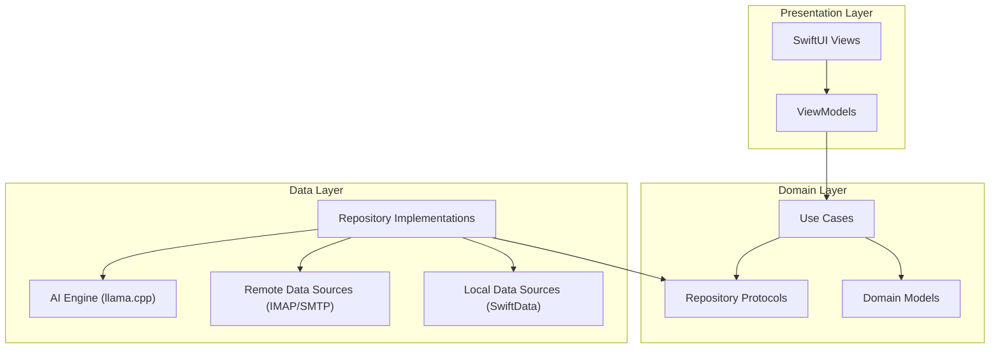

# Project Constitution

> The key words **MUST**, **MUST NOT**, **REQUIRED**, **SHALL**, **SHALL NOT**, **SHOULD**, **SHOULD NOT**, **RECOMMENDED**, **MAY**, and **OPTIONAL** in this document are to be interpreted as described in [RFC 2119](https://www.ietf.org/rfc/rfc2119.txt).

## 1. Purpose

This constitution defines the immutable constraints, principles, and rules that govern the project. All other project documents — specifications, proposals, plans, and code — **MUST** conform to this document. In any conflict between this constitution and another project document, this constitution prevails.

---

## 2. Core Principles

### P-01: Privacy by Default

- **Statement**: All user data **MUST** remain on the user's device. No data **SHALL** leave the device except to communicate with the user's own email service provider.
- **Rationale**: Privacy is the product's foundational value. Users choose this client specifically because their data stays local.
- **Implications**: No analytics services, no crash reporting to third-party servers, no cloud sync, no telemetry. All AI processing runs on-device. Diagnostic data, if collected, **MUST** remain local.

### P-02: Zero Third-Party Server Dependency

- **Statement**: The application **MUST NOT** connect to any server other than the user's configured email service provider(s).
- **Rationale**: Every external connection is a potential data leak and a trust violation.
- **Implications**: No REST API backends, no push notification relay servers, no remote config services. All features **MUST** function using only local resources and direct provider connections (IMAP/SMTP).

### P-03: Local-First AI

- **Statement**: All AI features **MUST** run entirely on-device using local models.
- **Rationale**: AI features that phone home defeat the privacy guarantee.
- **Implications**: Models **MUST** be bundled or downloaded once and cached locally. Inference **MUST** happen on-device. No prompts, embeddings, or user content **SHALL** be sent to remote AI services.

### P-04: Offline Capability

- **Statement**: The application **SHOULD** provide meaningful functionality without a network connection for previously synced data.
- **Rationale**: Local-first means local-functional. Users should read, search, and interact with synced email without connectivity.
- **Implications**: Synced emails, search indices, and AI categorizations **MUST** persist locally. Compose **MUST** queue messages for sending when connectivity resumes.

### P-05: Multi-Platform Intent

- **Statement**: Architecture and specifications **MUST** be designed with cross-platform expansion in mind, even when implementing for a single platform.
- **Rationale**: The project targets iOS first but will expand to macOS, Android, and other platforms. Platform-locked decisions made early create expensive rewrites later.
- **Implications**: Specs **MUST** be platform-independent. Business logic **SHOULD** be separated from UI. Platform-specific code **MUST** be isolated behind clean interfaces.

### P-06: Standard Protocols Over Proprietary APIs

- **Statement**: Email communication **MUST** use standard protocols (IMAP, SMTP) as the primary integration method.
- **Rationale**: Standard protocols work with any provider and reduce vendor lock-in.
- **Implications**: Gmail-specific features **MUST NOT** require the Gmail REST API. Provider-specific enhancements **MAY** be offered as optional layers but **MUST NOT** be required for core functionality.

### P-07: Security as a Requirement, Not a Feature

- **Statement**: All stored credentials **MUST** use platform-native secure storage (Keychain on Apple platforms). All network communication **MUST** use TLS. All local data **MUST** be protected by platform-level encryption at rest.
- **Rationale**: A privacy-focused client with weak security is a contradiction.
- **Implications**: No plaintext credential storage. No unencrypted network traffic. No insecure local data stores. Security **MUST** be validated in every release.

---

## 3. Technical Constraints

### TC-01: Supported Platforms (V1)

| Platform | Minimum Version | Framework |
|----------|----------------|-----------|
| iOS      | 17.0           | SwiftUI   |
| macOS    | 14.0 (Sonoma)  | SwiftUI (native target) |

### TC-02: Language and Frameworks

- Primary language: **Swift** (latest stable version)
- UI framework: **SwiftUI**
- Persistence: **SwiftData**
- AI runtime: **llama.cpp** (GGUF quantized models)
- Email protocols: **IMAP4rev1** (RFC 3501), **SMTP** (RFC 5321)
- Credential storage: **Apple Keychain Services**

### TC-03: Prohibited Dependencies

- **MUST NOT** include any third-party analytics SDK
- **MUST NOT** include any third-party crash reporting SDK
- **MUST NOT** include any ad framework
- **MUST NOT** depend on any remote configuration service
- **MUST NOT** use any proprietary email API as a required dependency

### TC-04: Performance Floors

| Metric | Target | Hard Limit |
|--------|--------|------------|
| App cold start (to interactive) | < 1.5s | 3s |
| Thread list scroll | 60 fps | No drops below 30 fps |
| Email open (cached) | < 300ms | 500ms |
| AI categorization (per email) | < 500ms | 2s |
| Search results (first page) | < 1s | 3s |
| Memory footprint (idle) | < 100MB | 200MB |

### TC-05: Accessibility

- All UI **MUST** meet WCAG 2.1 AA compliance
- All interactive elements **MUST** support VoiceOver
- Dynamic Type **MUST** be supported across all screens
- Color **MUST NOT** be the sole means of conveying information

---

## 4. Architectural Invariants

### AI-01: Layered Architecture

The codebase **MUST** follow a strict layered architecture. Dependencies **MUST** point inward only.

- Presentation **MUST NOT** directly access the Data layer
- Domain layer **MUST NOT** depend on any platform framework (no UIKit, no SwiftUI imports)
- Data layer **MUST** implement protocols defined in the Domain layer

### AI-02: Provider Abstraction

Email provider interactions **MUST** be abstracted behind a provider protocol. Adding a new provider **MUST NOT** require changes to the Domain or Presentation layers.

### AI-03: AI Engine Abstraction

The AI engine **MUST** be abstracted behind a protocol. Swapping the underlying model or runtime (e.g., from llama.cpp to Core ML) **MUST NOT** require changes outside the Data layer.

---

## 5. Process Requirements

### PR-01: Spec Before Code

- No feature implementation **SHALL** begin without an approved specification
- Spec status **MUST** be `approved` or `locked` before implementation starts

### PR-02: Testing Minimums

- All Domain layer use cases **MUST** have unit tests
- All Repository implementations **MUST** have integration tests
- All ViewModels **MUST** have unit tests
- UI flows **MUST** have at least one end-to-end test per critical path

### PR-03: Validation Before Merge

- All acceptance criteria defined in `validation.md` **MUST** pass before a feature is considered complete
- Performance metrics **MUST** be validated against TC-04 thresholds

### PR-04: Documentation

- Public API surfaces **MUST** have documentation comments
- Architectural decisions **MUST** be recorded in proposal documents
- Breaking changes **MUST** be recorded in a changelog

---

## 6. Naming Conventions

### Code

| Element | Convention | Example |
|---------|-----------|---------|
| Types / Protocols | UpperCamelCase | `EmailThread`, `MailProvider` |
| Functions / Properties | lowerCamelCase | `fetchThreads()`, `isRead` |
| Constants | lowerCamelCase | `maxRetryCount` |
| Enum cases | lowerCamelCase | `.inbox`, `.sent` |
| Files | Match primary type | `EmailThread.swift` |

### Documentation

| Document | Convention | Example |
|----------|-----------|---------|
| Specs | `spec.md` or `SPEC-NNN-name.md` | `spec.md` |
| Proposals | `proposal.md` or `PROP-NNN-name.md` | `proposal.md` |
| Plans | `plan.md` inside platform dir | `ios-macos/plan.md` |

### Git

| Element | Convention | Example |
|---------|-----------|---------|
| Branches | `type/short-description` | `feat/thread-list-ui` |
| Commits | Conventional Commits | `feat: add email thread list view` |

---

## 7. Glossary

| Term | Definition |
|------|-----------|
| **Thread** | A group of related email messages sharing a common subject and references, displayed as a single conversation |
| **Provider** | An email service provider (e.g., Gmail, Outlook) accessed via standard protocols |
| **Local AI** | Machine learning models running entirely on-device without any network communication |
| **Sync Window** | The configurable time period (in days) for which emails are fully synchronized locally |
| **Categorization** | AI-driven classification of emails into categories (e.g., Primary, Promotions, Social, Updates) |
| **Smart Reply** | AI-generated short reply suggestions based on the content of a received email |
| **Summarization** | AI-generated concise summary of an email or email thread |
| **Codename** | The working project name used until branding is finalized |

---

## 8. Amendment Log

| # | Date | Description | Approved By |
|---|------|-------------|-------------|
| — | 2025-02-07 | Initial ratification | Core Team |
