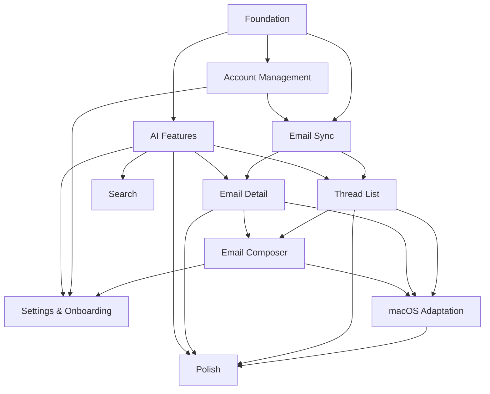

# Feature Index

> This directory contains all feature-specific documentation for the privacy-first email client.

## Document Hierarchy

```
Constitution (Rules) → Proposal (Why) → Feature Specs (What) → Feature Plans (How) → Tasks (Do) → Validation (Verify)
```

## Feature Map

| # | Feature | Spec | Plan | Tasks | Validation | Status |
|---|---------|------|------|-------|------------|--------|
| 1 | [Foundation](foundation/) | [spec](foundation/spec.md) | [plan](foundation/ios-macos/plan.md) | [tasks](foundation/ios-macos/tasks.md) | [validation](foundation/ios-macos/validation.md) | draft |
| 2 | [Account Management](account-management/) | [spec](account-management/spec.md) | [plan](account-management/ios-macos/plan.md) | [tasks](account-management/ios-macos/tasks.md) | [validation](account-management/ios-macos/validation.md) | draft |
| 3 | [Email Sync](email-sync/) | [spec](email-sync/spec.md) | [plan](email-sync/ios-macos/plan.md) | [tasks](email-sync/ios-macos/tasks.md) | [validation](email-sync/ios-macos/validation.md) | draft |
| 4 | [Thread List](thread-list/) | [spec](thread-list/spec.md) | [plan](thread-list/ios-macos/plan.md) | [tasks](thread-list/ios-macos/tasks.md) | [validation](thread-list/ios-macos/validation.md) | draft |
| 5 | [Email Detail](email-detail/) | [spec](email-detail/spec.md) | [plan](email-detail/ios-macos/plan.md) | [tasks](email-detail/ios-macos/tasks.md) | [validation](email-detail/ios-macos/validation.md) | draft |
| 6 | [Email Composer](email-composer/) | [spec](email-composer/spec.md) | [plan](email-composer/ios-macos/plan.md) | [tasks](email-composer/ios-macos/tasks.md) | [validation](email-composer/ios-macos/validation.md) | draft |
| 7 | [AI Features](ai-features/) | [spec](ai-features/spec.md) | [plan](ai-features/ios-macos/plan.md) | [tasks](ai-features/ios-macos/tasks.md) | [validation](ai-features/ios-macos/validation.md) | draft |
| 8 | [Search](search/) | [spec](search/spec.md) | [plan](search/ios-macos/plan.md) | [tasks](search/ios-macos/tasks.md) | [validation](search/ios-macos/validation.md) | draft |
| 9 | [Settings & Onboarding](settings-onboarding/) | [spec](settings-onboarding/spec.md) | [plan](settings-onboarding/ios-macos/plan.md) | [tasks](settings-onboarding/ios-macos/tasks.md) | [validation](settings-onboarding/ios-macos/validation.md) | draft |
| 10 | [macOS Adaptation](macos-adaptation/) | — | [plan](macos-adaptation/ios-macos/plan.md) | [tasks](macos-adaptation/ios-macos/tasks.md) | [validation](macos-adaptation/ios-macos/validation.md) | draft |
| 11 | [Polish](polish/) | — | [plan](polish/ios-macos/plan.md) | [tasks](polish/ios-macos/tasks.md) | [validation](polish/ios-macos/validation.md) | draft |

## Dependency Graph



## Cross-Cutting References

- **Constitution**: [docs/constitution.md](../constitution.md) — immutable project rules
- **Proposal**: [docs/proposal.md](../proposal.md) — project justification and threat model
- **Foundation Spec**: [foundation/spec.md](foundation/spec.md) — shared architecture, data model, security, storage, performance
