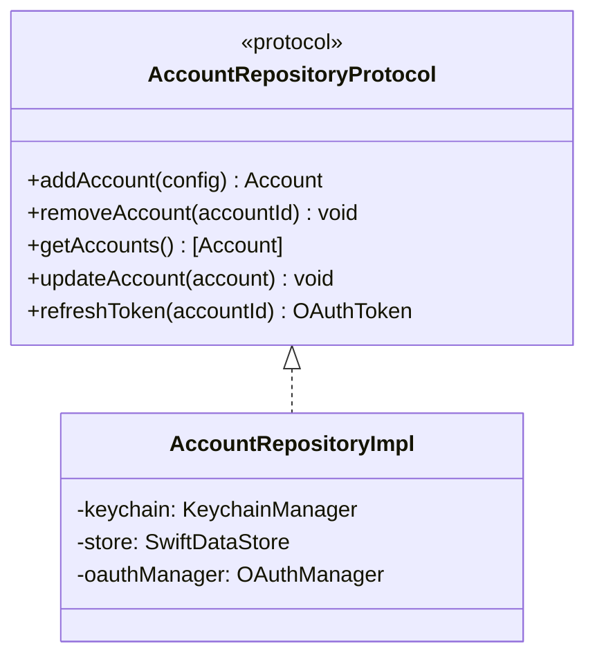

# Account Management — iOS/macOS Implementation Plan

> The key words **MUST**, **MUST NOT**, **REQUIRED**, **SHALL**, **SHALL NOT**, **SHOULD**, **SHOULD NOT**, **RECOMMENDED**, **MAY**, and **OPTIONAL** in this document are to be interpreted as described in [RFC 2119](https://www.ietf.org/rfc/rfc2119.txt).

---

## 1. Scope

This plan covers the implementation of account management: Keychain manager, OAuth 2.0 manager, and account repository. These are foundational components required before email sync can begin.

---

## 2. Platform Context

Refer to Foundation plan Section 2 for OS versions, device targets, and platform guidelines.

---

## 3. Architecture Mapping

### Key Classes

### Files

| File | Layer | Purpose |
|------|-------|---------|
| `KeychainManager.swift` | Data/Keychain | Secure token CRUD |
| `OAuthManager.swift` | Data/Network | Gmail OAuth 2.0 PKCE flow |
| `AccountRepositoryImpl.swift` | Data/Repositories | Account CRUD with cascade delete |
| `ManageAccountsUseCase.swift` | Domain/UseCases | Account business logic |

---

## 4. Implementation Phases

| Task ID | Description | Dependencies |
|---------|-------------|-------------|
| IOS-F-03 | Keychain manager implementation | IOS-F-01 (Foundation) |
| IOS-F-04 | OAuth 2.0 manager (Gmail XOAUTH2) | IOS-F-03 |
| IOS-F-09 | Account repository implementation | IOS-F-02, IOS-F-03, IOS-F-04 |

---

## 5. Risks and Mitigations

| Risk | Likelihood | Impact | Mitigation |
|------|-----------|--------|------------|
| OAuth token refresh reliability | Low | High | Implement proactive refresh (before expiry); clear error messaging for re-auth |
| Gmail XOAUTH2 IMAP auth issues | Low | High | Test early with real Gmail account; document known quirks |
