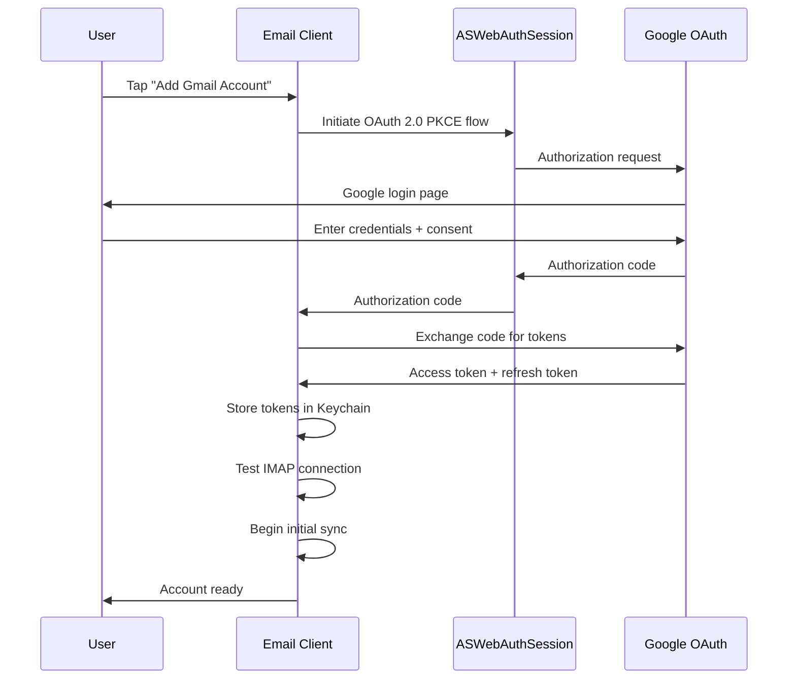

# Specification: Account Management

> The key words **MUST**, **MUST NOT**, **REQUIRED**, **SHALL**, **SHALL NOT**, **SHOULD**, **SHOULD NOT**, **RECOMMENDED**, **MAY**, and **OPTIONAL** in this document are to be interpreted as described in RFC 2119.

## 1. Summary

This specification defines account addition, configuration, and removal for Gmail accounts via OAuth 2.0. It covers the full OAuth flow, token management, multi-account support, and credential security.

---

## 2. Goals and Non-Goals

### Goals

- Support adding and removing multiple Gmail accounts via OAuth 2.0
- Store credentials securely in the platform Keychain
- Validate IMAP/SMTP connectivity before completing setup
- Allow per-account configuration (sync window, display name)

### Non-Goals

- Non-Gmail providers (V2)
- Shared mailboxes or delegation

---

## 3. Functional Requirements

### FR-ACCT-01: Account Addition via OAuth 2.0

- The client **MUST** support adding Gmail accounts via OAuth 2.0 (using `ASWebAuthenticationSession`).
- The client **MUST** store OAuth tokens in the platform Keychain.
- The client **MUST** support adding multiple accounts.
- The client **MUST** validate IMAP/SMTP connectivity before completing account setup.
- The client **MUST** display connection errors with actionable messages.

### FR-ACCT-02: Account Configuration

- The client **MUST** allow users to configure the sync window per account (7, 14, 30, 60, 90 days; default: 30 days).
- The client **MUST** allow users to set a display name per account.
- The client **MUST** allow users to remove an account, deleting all associated local data.
- The client **SHOULD** allow users to set a default sending account.

### FR-ACCT-03: Gmail OAuth Flow

### FR-ACCT-04: Token Management

- OAuth 2.0 tokens **MUST** be stored in the Keychain with `kSecAttrAccessibleWhenUnlockedThisDeviceOnly` protection level.
- Token refresh **MUST** happen transparently before token expiry.
- Refresh failure **MUST** prompt re-authentication; the client **MUST NOT** store user passwords.

### FR-ACCT-05: Account Removal and Data Deletion

- When an account is removed, the client **MUST** delete all associated local data (emails, folders, threads, attachments, search index, sync state, cached AI results).
- Keychain items for the account **MUST** be deleted.

---

## 4. Non-Functional Requirements

### NFR-ACCT-01: OAuth Token Security

- **Metric**: Keychain protection level
- **Target**: `kSecAttrAccessibleWhenUnlockedThisDeviceOnly` on all token entries
- **Hard Limit**: Tokens MUST NOT appear in any file outside the Keychain

### NFR-ACCT-02: Account Removal Speed

- **Metric**: Time to delete all account data
- **Target**: < 5 seconds
- **Hard Limit**: 10 seconds for 500 emails

---

## 5. Data Model

Refer to Foundation spec Section 5 for the Account entity definition. This feature operates on the Account entity and its Keychain-stored credentials.

---

## 6. Architecture Overview

Refer to Foundation spec Section 6. This feature uses:
- `ManageAccountsUseCase` → `AccountRepositoryProtocol` → `AccountRepositoryImpl`
- `AccountRepositoryImpl` → `KeychainManager` + `OAuthManager` + `SwiftDataStore`

---

## 7. Platform-Specific Considerations

### iOS
- OAuth flow uses `ASWebAuthenticationSession` which presents a system browser sheet.

### macOS
- OAuth flow uses `ASWebAuthenticationSession` which opens in the default browser.

---

## 8. Alternatives Considered

| Alternative | Pros | Cons | Rejected Because |
|-------------|------|------|-----------------|
| Gmail REST API | Richer API, push notifications | Requires Google API key, proprietary | Violates P-02 (third-party dependency), locks to Gmail |
| App passwords | Simpler auth | Google deprecating, less secure | Not future-proof, poor UX |

---

## 9. Open Questions

| # | Question | Owner | Target Date |
|---|----------|-------|-------------|
| OQ-04 | Gmail IMAP access requires "Allow less secure apps" to be deprecated — confirm OAuth-based XOAUTH2 IMAP auth works reliably | Backend Lead | Pre-plan |

---

## 10. Revision History

| Version | Date | Author | Change Summary |
|---------|------|--------|---------------|
| 1.0.0 | 2025-02-07 | Core Team | Extracted from monolithic spec v1.2.0 sections 5.1 and 7.1. |
