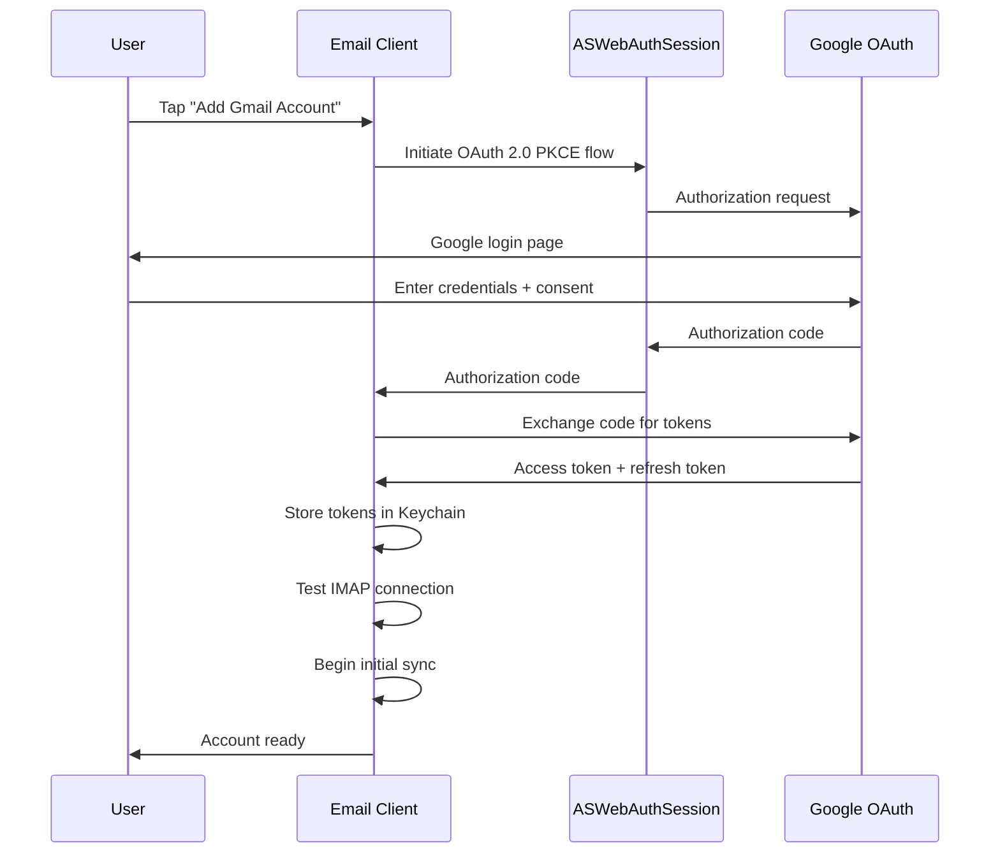

# Specification: Account Management

> The key words **MUST**, **MUST NOT**, **REQUIRED**, **SHALL**, **SHALL NOT**, **SHOULD**, **SHOULD NOT**, **RECOMMENDED**, **MAY**, and **OPTIONAL** in this document are to be interpreted as described in RFC 2119.

## 1. Summary

This specification defines account addition, configuration, and removal for Gmail accounts via OAuth 2.0. It covers the full OAuth flow, token management, multi-account support, and credential security.

---

## 2. Goals and Non-Goals

### Goals

- **G-01**: The client **MUST** support adding and removing multiple Gmail accounts via OAuth 2.0.
- **G-02**: The client **MUST** store credentials securely in the platform Keychain.
- **G-03**: The client **MUST** validate IMAP/SMTP connectivity before completing setup.
- **G-04**: The client **MUST** allow per-account configuration (sync window, display name).

### Non-Goals

- **NG-01**: Non-Gmail providers (V2).
- **NG-02**: Shared mailboxes or delegation.

---

## 3. Functional Requirements

### FR-ACCT-01: Account Addition via OAuth 2.0

- The client **MUST** support adding Gmail accounts via OAuth 2.0 (using `ASWebAuthenticationSession`).
- The client **MUST** store OAuth tokens in the platform Keychain.
- The client **MUST** support adding multiple accounts.
- The client **MUST** validate IMAP/SMTP connectivity before completing account setup.
- The client **MUST** request only the OAuth scope `https://mail.google.com/` (the only scope Google provides for IMAP/SMTP access; see Constitution LG-02).
- The client **MUST** display connection errors with actionable messages.

### FR-ACCT-02: Account Configuration

- The client **MUST** allow users to configure the sync window per account (7, 14, 30, 60, 90 days; default: 30 days).
- The client **MUST** allow users to set a display name per account.
- The client **MUST** allow users to remove an account, deleting all associated local data.
- The client **SHOULD** allow users to set a default sending account.

### FR-ACCT-03: Gmail OAuth Flow

- The OAuth authorization request **MUST** include a privacy policy URL accessible from the consent screen (per Constitution LG-02).

### FR-ACCT-04: Token Management

- OAuth 2.0 tokens **MUST** be stored in the Keychain with `kSecAttrAccessibleWhenUnlockedThisDeviceOnly` protection level.
- Token refresh **MUST** happen transparently before token expiry.
- On refresh failure, the client **MUST** retry up to 3 times with exponential backoff before prompting re-authentication.
- After retry exhaustion, the client **MUST** present a modal prompt explaining the session has expired and offering a "Re-authenticate" action that re-initiates the OAuth flow (FR-ACCT-03). If the user dismisses the prompt, the account **MUST** enter an `inactive` state (Account.isActive = false) where sync is suspended but local data is preserved. The account row **MUST** display a warning badge until re-authenticated.
- In-flight sync or send operations **MUST** be paused (not discarded) during re-authentication; queued sends **MUST** remain in `queued` state (see Foundation spec Section 5.5).
- The client **MUST NOT** store user passwords.
- The client **MUST** authenticate to Gmail IMAP and SMTP using the XOAUTH2 SASL mechanism (see Foundation spec Section 10.2).
- The client **MUST NOT** fall back to plaintext password authentication.

### FR-ACCT-05: Account Removal and Data Deletion

- When an account is removed, the client **MUST** delete all associated local data per Foundation FR-FOUND-03: Folders, EmailFolder associations, Emails, Threads, Attachments, and SearchIndex entries.
- Keychain items for the account **MUST** be deleted.

---

## 4. Non-Functional Requirements

### NFR-ACCT-01: OAuth Token Security

- **Metric**: Token storage location audit
- **Target**: 100% of OAuth tokens stored in Keychain with `kSecAttrAccessibleWhenUnlockedThisDeviceOnly`
- **Hard Limit**: 0 token occurrences in files, logs, or UserDefaults outside Keychain

### NFR-ACCT-02: Account Removal Speed

- **Metric**: Time to delete all account data
- **Target**: < 5 seconds for 50,000 emails (per Foundation NFR-STOR-01)
- **Hard Limit**: 15 seconds for 50,000 emails

---

## 5. Data Model

Refer to Foundation spec Section 5 for the Account entity definition. This feature operates on the Account entity and its Keychain-stored credentials.

---

## 6. Architecture Overview

Refer to Foundation spec Section 6. This feature uses:
- `ManageAccountsUseCase` → `AccountRepositoryProtocol` → `AccountRepositoryImpl`
- `AccountRepositoryImpl` → `KeychainManager` + `OAuthManager` + `SwiftDataStore`

---

## 7. Platform-Specific Considerations

### iOS
- OAuth flow uses `ASWebAuthenticationSession` which presents a system browser sheet.

### macOS
- OAuth flow uses `ASWebAuthenticationSession` which opens in the default browser.

---

## 8. Alternatives Considered

| Alternative | Pros | Cons | Rejected Because |
|-------------|------|------|-----------------|
| Gmail REST API | Richer API, push notifications | Requires Google API key, proprietary | Violates P-02 (third-party dependency), locks to Gmail |
| App passwords | Simpler auth | Google deprecating, less secure | Not future-proof, poor UX |

---

## 9. Release Prerequisites

- The client **MUST** complete Google's OAuth verification process before public release (per Constitution LG-02).

---

## 10. Open Questions

| # | Question | Owner | Target Date |
|---|----------|-------|-------------|
| ~~OQ-04~~ | ~~Gmail IMAP access requires "Allow less secure apps" to be deprecated — confirm OAuth-based XOAUTH2 IMAP auth works reliably~~ **RESOLVED**: XOAUTH2 is the required IMAP/SMTP auth mechanism for Gmail. See Foundation spec Section 10.2. | Backend Lead | Resolved |

---

## 11. Revision History

| Version | Date | Author | Change Summary |
|---------|------|--------|---------------|
| 1.0.0 | 2025-02-07 | Core Team | Extracted from monolithic spec v1.2.0 sections 5.1 and 7.1. |
| 1.1.0 | 2025-02-07 | Core Team | Review: Add G-XX/NG-XX IDs (SF-03), OAuth scope + XOAUTH2 SASL requirements (LG-02), token refresh retry/error handling, cascade delete alignment with FR-FOUND-03, NFR-ACCT-01 measurable threshold, add proposal dependency. |
| 1.2.0 | 2025-02-07 | Core Team | Review round 2: Define re-auth UX on token refresh exhaustion (inactive state + warning badge); scale NFR-ACCT-02 removal speed to 50K emails per NFR-STOR-01. |
| 1.3.0 | 2025-02-07 | Core Team | Review round 3: Add privacy policy URL requirement to FR-ACCT-03 (LG-02); add Section 9 release prerequisites for Google OAuth verification (LG-02). Status → locked. |
