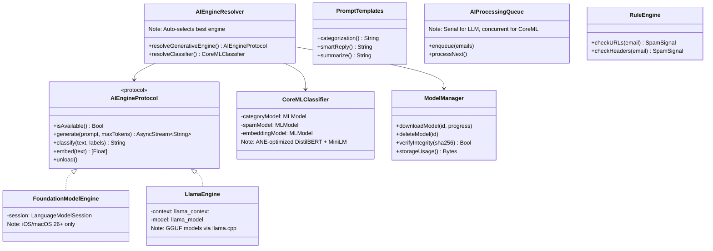
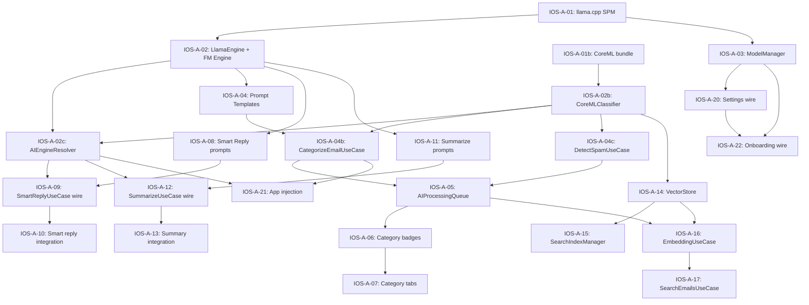

# AI Features — iOS/macOS Implementation Plan

---

## 1. Scope

This plan covers the full AI integration for the privacy-first email client:

- **Tiered engine scaffolding:** Foundation Models (iOS 26+) → llama.cpp (GGUF) → CoreML (DistilBERT)
- **Classification pipeline:** Email categorization + spam/phishing detection via CoreML/ANE
- **Generative pipeline:** Smart reply + thread summarization via Foundation Models or llama.cpp
- **Embedding pipeline:** Semantic search via all-MiniLM-L6-v2 CoreML model
- **Model management:** Download, verify, cache, delete GGUF models
- **UI integration:** Category badges, smart reply chips, summary cards, AI settings, onboarding step

Semantic search UI is in the Search feature plan. This plan covers embedding generation and storage.

---

## 2. Platform Context

### Device → Engine Matrix

| Device | RAM | Generative Engine | Classification | Embeddings |
|--------|-----|------------------|----------------|------------|
| iPhone 15 Pro+ (iOS 26+) | 8 GB | Foundation Models (3B, OS-managed) | DistilBERT (ANE, 3.47 ms) | all-MiniLM-L6-v2 (ANE) |
| iPhone 15 Pro (iOS 18-25) | 8 GB | Qwen3-1.7B (llama.cpp, Q4_K_M, 1 GB) | DistilBERT (ANE) | all-MiniLM-L6-v2 (ANE) |
| iPhone SE (4 GB) | 4 GB | Qwen3-0.6B (llama.cpp, Q4_K_M, 400 MB) | DistilBERT (ANE) | all-MiniLM-L6-v2 (ANE) |
| iPhone 12-14 (iOS 18) | 4-6 GB | Qwen3-0.6B or no generative | DistilBERT (ANE, A14+) | all-MiniLM-L6-v2 (ANE) |
| MacBook Air M1+ | 8-36 GB | Foundation Models or Qwen3-1.7B | DistilBERT (ANE) | all-MiniLM-L6-v2 (ANE) |
| MacBook Air M1+ (macOS 26+) | 8-36 GB | Foundation Models (3B) | DistilBERT (ANE) | all-MiniLM-L6-v2 (ANE) |

### Key Constraint: CoreML models are always available (bundled), generative models are optional (downloaded).

---

## 3. Architecture Mapping

### 3.1 Component Diagram

### 3.2 Existing Code Inventory

These files already exist and need to be **upgraded** (currently stubs):

| Existing File | Current State | Upgrade Needed |
|---------------|--------------|----------------|
| `Domain/Protocols/AIRepositoryProtocol.swift` | Protocol with categorize, summarize, smartReply, embed | Add `AIEngineProtocol` as separate generative abstraction |
| `Data/AI/StubAIRepository.swift` | Returns empty defaults | Replace with `AIRepositoryImpl` wiring real engines |
| `Domain/UseCases/SmartReplyUseCase.swift` | Wraps AIRepositoryProtocol.smartReply | Wire to `AIEngineResolver` for engine selection |
| `Domain/UseCases/SummarizeThreadUseCase.swift` | Wraps AIRepositoryProtocol.summarize | Wire to `AIEngineResolver` |
| `Domain/Models/AICategory.swift` | Enum: primary, social, promotions, updates, forums, uncategorized | No change needed |
| `Presentation/Settings/AIModelSettingsView.swift` | Simulated download progress | Wire to real `ModelManager` |
| `Presentation/Onboarding/OnboardingAIModelStep.swift` | Simulated download progress | Wire to real `ModelManager` |
| `Presentation/EmailDetail/AISummaryView.swift` | Card UI for summary display | No change needed |
| `Presentation/EmailDetail/SmartReplyView.swift` | Chip UI for smart replies | No change needed |
| `Presentation/Composer/SmartReplyChipView.swift` | Chip UI for composer | No change needed |
| `Tests/Mocks/MockAIRepository.swift` | Controllable mock | Add `MockAIEngine` for engine-level testing |

### 3.3 New Files to Create

| New File | Layer | Purpose |
|----------|-------|---------|
| `AIEngineProtocol.swift` | Domain/Protocols | Generative engine abstraction (generate, classify, embed, unload) |
| `FoundationModelEngine.swift` | Data/AI | Apple Foundation Models wrapper with `@Generable` structured output |
| `LlamaEngine.swift` | Data/AI | llama.cpp C-API wrapper (load, generate, unload) |
| `CoreMLClassifier.swift` | Data/AI | DistilBERT category + spam classifier, MiniLM embeddings |
| `AIEngineResolver.swift` | Data/AI | Runtime engine selection based on platform + memory |
| `ModelManager.swift` | Data/AI | GGUF download (resumable), SHA-256 verify, cache, delete |
| `PromptTemplates.swift` | Data/AI | Prompt construction for categorization, smart reply, summarization |
| `AIProcessingQueue.swift` | Data/AI | Background serial queue for batch classification + embedding |
| `RuleEngine.swift` | Data/AI | URL/header analysis for spam/phishing detection |
| `VectorStore.swift` | Data/Search | Embedding storage + cosine similarity search |
| `SearchIndexManager.swift` | Data/Search | Incremental index build during sync |
| `AIRepositoryImpl.swift` | Data/Repositories | Wires AIEngineResolver + CoreMLClassifier to AIRepositoryProtocol |
| `CategorizeEmailUseCase.swift` | Domain/UseCases | Email classification via CoreML (primary) or LLM (fallback) |
| `DetectSpamUseCase.swift` | Domain/UseCases | Spam/phishing detection via CoreML + RuleEngine |
| `GenerateEmbeddingUseCase.swift` | Domain/UseCases | Embedding generation for search index |

### 3.4 SPM Dependencies

| Package | Purpose | Integration |
|---------|---------|-------------|
| `llama.cpp` | GGUF model inference | Via `SpeziLLM` XCFramework or direct `llama.swift` SPM |
| CoreML | Classification + embeddings | System framework (no dependency) |
| FoundationModels | Apple's on-device LLM | System framework, iOS 26+ (no dependency) |

---

## 4. Implementation Phases

### Phase 1: Engine Scaffolding + CoreML Classification (IOS-A-01 to IOS-A-03)

| Task ID | Description | Dependencies | Effort |
|---------|-------------|-------------|--------|
| IOS-A-01 | llama.cpp SPM integration + build verification | Foundation complete | Medium |
| IOS-A-01b | CoreML model bundling (DistilBERT + MiniLM .mlpackage) | None | Low |
| IOS-A-02 | `AIEngineProtocol` + `LlamaEngine` wrapper + `FoundationModelEngine` wrapper | IOS-A-01 | High |
| IOS-A-02b | `CoreMLClassifier` wrapper (categorization + spam + embeddings) | IOS-A-01b | Medium |
| IOS-A-02c | `AIEngineResolver` — auto-selects best engine per device | IOS-A-02, IOS-A-02b | Medium |
| IOS-A-03 | `ModelManager` — download, verify, cache, delete GGUF models | IOS-A-01 | High |

### Phase 2: Classification Pipeline (IOS-A-04 to IOS-A-07)

| Task ID | Description | Dependencies | Effort |
|---------|-------------|-------------|--------|
| IOS-A-04 | `PromptTemplates` for categorization (LLM fallback) | IOS-A-02 | Low |
| IOS-A-04b | `CategorizeEmailUseCase` — CoreML primary, LLM fallback | IOS-A-02b, IOS-A-04 | Medium |
| IOS-A-04c | `DetectSpamUseCase` + `RuleEngine` | IOS-A-02b | Medium |
| IOS-A-05 | `AIProcessingQueue` — background batch categorize + spam-check after sync (embedding added in IOS-A-16) | IOS-A-04b, IOS-A-04c | Medium |
| IOS-A-06 | Category badges + spam warnings in thread list **and email detail** (category UI done, spam UI remaining) | IOS-A-05 | Low |
| IOS-A-07 | Category tab filtering in thread list (**done** — `CategoryTabBar.swift`, `ThreadListView.swift`) | IOS-A-06 | Low |

### Phase 3: Generative Pipeline (IOS-A-08 to IOS-A-13)

| Task ID | Description | Dependencies | Effort |
|---------|-------------|-------------|--------|
| IOS-A-08 | `PromptTemplates` for smart reply + Foundation Models `@Generable` | IOS-A-02 | Low |
| IOS-A-09 | Wire `SmartReplyUseCase` to real `AIEngineResolver` | IOS-A-08, IOS-A-02c | Medium |
| IOS-A-10 | Smart reply chips in email detail (already built) — integration test | IOS-A-09 | Low |
| IOS-A-11 | `PromptTemplates` for summarization | IOS-A-02 | Low |
| IOS-A-12 | Wire `SummarizeThreadUseCase` to real `AIEngineResolver` | IOS-A-11, IOS-A-02c | Medium |
| IOS-A-13 | Summary display in email detail (already built) — integration test | IOS-A-12 | Low |

### Phase 4: Embeddings + Search Index (IOS-A-14 to IOS-A-17)

| Task ID | Description | Dependencies | Effort |
|---------|-------------|-------------|--------|
| IOS-A-14 | `VectorStore` — embedding storage + cosine similarity | IOS-A-02b | Medium |
| IOS-A-15 | `SearchIndexManager` — incremental index build during sync | IOS-A-14 | Medium |
| IOS-A-16 | `GenerateEmbeddingUseCase` — batch embeddings via CoreML | IOS-A-14, IOS-A-05 | Medium |
| IOS-A-17 | `SearchEmailsUseCase` — semantic + exact combined search (delegated from Search plan) | IOS-A-16 | Medium |

### Phase 5: UI Integration + Onboarding (IOS-A-20 to IOS-A-22)

> **Note**: IOS-A-14 through IOS-A-17 are defined in Phase 4 above. IOS-A-18 is the Search UI task (tracked in the Search tasks file). Phase 5 uses IOS-A-20+ to avoid collision.

| Task ID | Description | Dependencies | Effort |
|---------|-------------|-------------|--------|
| IOS-A-20 | Wire `AIModelSettingsView` to real `ModelManager` | IOS-A-03 | Low |
| IOS-A-21 | Wire AI use cases into `VaultMailApp` environment injection | IOS-A-02c, IOS-A-04b | Medium |
| IOS-A-22 | Wire `OnboardingAIModelStep` to real `ModelManager` | IOS-A-03, IOS-A-20 | Low |

### Dependency Graph

---

## 5. Key Design Decisions

| Decision | Rationale |
|----------|-----------|
| CoreML for classification, llama.cpp for generation | DistilBERT on ANE achieves 3.47 ms — 100x faster than LLM-based classification. Use the right tool for each task. |
| Foundation Models as Tier 1 | Zero download cost, OS-managed, already tuned for email. Best UX for iOS 26+ users. |
| Qwen3-1.7B over Phi-3.5-mini | 1 GB vs 2.2 GB download. Qwen3-1.7B matches Qwen2.5-3B quality. Fits in 6 GB RAM. |
| Qwen3-0.6B as lightweight fallback | 400 MB download, fits in 4 GB RAM devices (iPhone SE). Acceptable quality for short tasks. |
| all-MiniLM-L6-v2 for embeddings | 22M params, 50 MB, 384-dim — proven semantic similarity quality in 1/100th the size of generative models. |
| Bundle CoreML models, download GGUF | CoreML models total ~150 MB (acceptable app size). GGUF models are 400 MB–1 GB (must be downloaded). |
| `AIEngineResolver` auto-selection | Users shouldn't choose engines. The resolver picks the best available based on device capabilities. |
| Hybrid processing queue | LLM tasks are serialized (prevents concurrent model loads). CoreML tasks (classification + embedding) may run concurrently since they are lightweight and ANE-backed. The `AIProcessingQueue` enforces this separation. |
| `AIEngineProtocol` is nonisolated | `AIEngineProtocol` and engine implementations **MUST NOT** be `@MainActor`. Inference runs on a background actor or nonisolated async context. Use cases remain `@MainActor` but dispatch to the engine via `Task` or call into a nonisolated engine. The existing `@MainActor` on `AIRepositoryProtocol` will be removed and replaced with nonisolated `async` methods; callers (views) already use `.task` which handles actor hops. |

---

## 6. Risks and Mitigations

| Risk | Likelihood | Impact | Mitigation |
|------|-----------|--------|------------|
| llama.cpp Swift integration complexity | Medium | High | Use `SpeziLLM` XCFramework (Stanford, production-tested); fallback to `llama.swift` SPM |
| AI model RAM on iPhone SE (4 GB) | High | High | Qwen3-0.6B fits; CoreML models use < 200 MB; model unloaded post-inference |
| DistilBERT fine-tuning dataset quality | Medium | Medium | Start with synthetic labels from Qwen3-1.7B; iterate with real user feedback |
| Foundation Models unavailable (region/device) | Medium | Low | Graceful fallback to llama.cpp; resolver handles automatically |
| App Store review: bundled CoreML models add 150 MB | Low | Low | Models are < 150 MB total; well within App Store norms |
| llama.cpp binary size impact | Medium | Medium | Use Metal-enabled build; strip unused architectures; expect ~5-10 MB framework |
| Prompt injection via email content | Medium | Medium | Sanitize HTML, strip scripts, limit input length in prompts |

---

## 7. Test Strategy

| Component | Test Type | Framework |
|-----------|----------|-----------|
| `AIEngineProtocol` implementations | Unit (mock model) | Swift Testing |
| `CoreMLClassifier` | Unit (bundled test model) | Swift Testing |
| `AIEngineResolver` | Unit (mock engines) | Swift Testing |
| `ModelManager` | Unit (file system mock) | Swift Testing |
| `PromptTemplates` | Unit (string validation) | Swift Testing |
| `CategorizeEmailUseCase` | Unit (MockAIEngine) | Swift Testing |
| `DetectSpamUseCase` | Unit (MockClassifier + MockRuleEngine) | Swift Testing |
| `SmartReplyUseCase` | Unit (already exists — 3 tests in `SummarizeSmartReplyUseCaseTests.swift`) | Swift Testing |
| `SummarizeThreadUseCase` | Unit (already exists — 3 tests in `SummarizeSmartReplyUseCaseTests.swift`) | Swift Testing |
| `VectorStore` | Unit (in-memory) | Swift Testing |
| `AIProcessingQueue` | Unit (mock engines) | Swift Testing |
| End-to-end inference | Integration (real model on CI) | Manual / XCTest |
