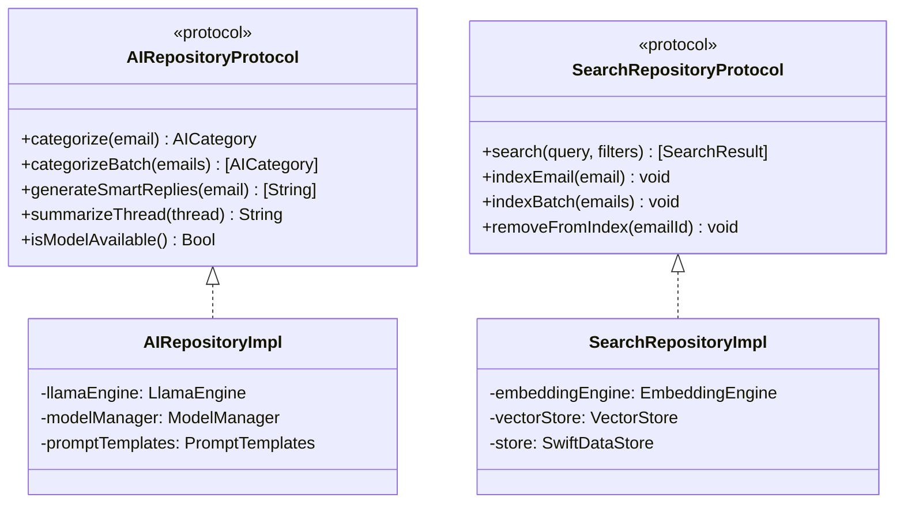

# AI Features — iOS/macOS Implementation Plan

---

## 1. Scope

This plan covers the full AI integration: llama.cpp setup, engine wrapper, model manager, categorization pipeline, smart reply pipeline, summarization pipeline, and AI model onboarding. Semantic search embedding/indexing is covered here; search UI is in the Search feature plan.

---

## 2. Platform Context

Refer to Foundation plan Section 2.

### AI-Specific Constraints

| Device | RAM | Model Constraint |
|--------|-----|-----------------|
| iPhone SE 3rd gen | 4GB | Must use 1-3B Q4 quantized models |
| MacBook Air M1 | 8GB | Can use larger models (up to 7B Q4) |

---

## 3. Architecture Mapping

### Key Classes

### Files

| File | Layer | Purpose |
|------|-------|---------|
| `LlamaEngine.swift` | Data/AI | llama.cpp wrapper |
| `EmbeddingEngine.swift` | Data/AI | Embedding generation |
| `ModelManager.swift` | Data/AI | Model download, cache, delete |
| `PromptTemplates.swift` | Data/AI | Prompt construction |
| `AIProcessingQueue.swift` | Data/AI | Background batch processing |
| `VectorStore.swift` | Data/Search | Embedding storage + similarity search |
| `SearchIndexManager.swift` | Data/Search | Index build + incremental update |
| `AIRepositoryImpl.swift` | Data/Repositories | AI protocol implementation |
| `SearchRepositoryImpl.swift` | Data/Repositories | Search protocol implementation |
| `CategorizeEmailUseCase.swift` | Domain/UseCases | Categorization logic |
| `SmartReplyUseCase.swift` | Domain/UseCases | Smart reply generation |
| `SummarizeThreadUseCase.swift` | Domain/UseCases | Thread summarization |
| `SearchEmailsUseCase.swift` | Domain/UseCases | Combined semantic + exact search |

---

## 4. Implementation Phases

| Task ID | Description | Dependencies |
|---------|-------------|-------------|
| IOS-A-01 | llama.cpp SPM package integration | Phase 1 (Foundation) |
| IOS-A-02 | LlamaEngine wrapper | IOS-A-01 |
| IOS-A-03 | Model manager (download, cache, delete) | IOS-A-02 |
| IOS-A-04 | Prompt templates for categorization | IOS-A-02 |
| IOS-A-05 | Categorization use case + background queue | IOS-A-04 |
| IOS-A-06 | Category badges in thread list | IOS-A-05, IOS-U-02 (Thread List) |
| IOS-A-07 | Category tab filtering | IOS-A-06 |
| IOS-A-08 | Prompt templates for smart reply | IOS-A-02 |
| IOS-A-09 | Smart reply use case | IOS-A-08 |
| IOS-A-10 | Smart reply chips in email detail | IOS-A-09, IOS-U-05 (Email Detail) |
| IOS-A-11 | Prompt templates for summarization | IOS-A-02 |
| IOS-A-12 | Summarization use case | IOS-A-11 |
| IOS-A-13 | Summary display in email detail | IOS-A-12, IOS-U-05 (Email Detail) |
| IOS-A-19 | AI model download in onboarding | IOS-A-03, IOS-U-13 (Settings & Onboarding) |

---

## 5. Risks and Mitigations

| Risk | Likelihood | Impact | Mitigation |
|------|-----------|--------|------------|
| llama.cpp Swift integration complexity | Medium | High | Spike in IOS-A-01; C interop via Swift bridging header |
| AI model RAM usage on iPhone SE (4GB) | High | High | Use smallest viable model (1-3B Q4); monitor memory; implement model unloading after inference |
