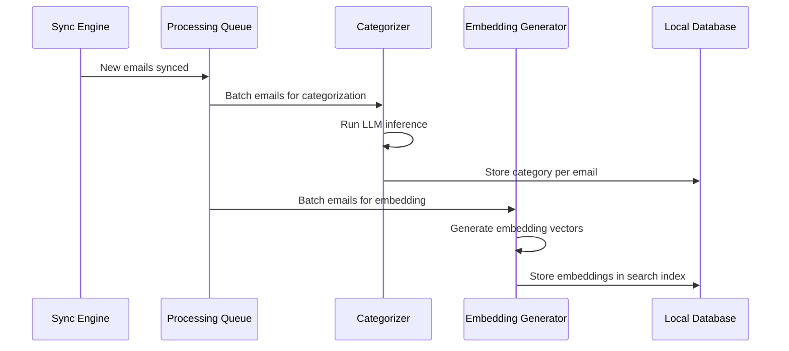

# Specification: AI Features

> The key words **MUST**, **MUST NOT**, **REQUIRED**, **SHALL**, **SHALL NOT**, **SHOULD**, **SHOULD NOT**, **RECOMMENDED**, **MAY**, and **OPTIONAL** in this document are to be interpreted as described in RFC 2119.

## 1. Summary

This specification defines all AI-powered features: the local LLM engine (llama.cpp), email categorization, smart reply generation, thread summarization, and the semantic search embedding pipeline. All AI processing runs entirely on-device.

---

## 2. Goals and Non-Goals

### Goals

- On-device LLM inference via llama.cpp with GGUF models
- Automatic email categorization into 5 categories
- Contextual smart reply suggestions (up to 3)
- Thread summarization (2-4 sentences)
- Semantic search via locally generated embeddings
- Graceful degradation when AI model is not downloaded

### Non-Goals

- Cloud-based AI inference
- Model fine-tuning on-device
- Custom user-trained categories

---

## 3. Functional Requirements

### FR-AI-01: Engine Requirements

- The AI engine **MUST** use llama.cpp with GGUF quantized models.
- Models **MUST** be downloaded on first launch or on demand (not bundled in the app binary).
- The client **MUST** display download progress and allow the user to cancel.
- The client **MUST** function without AI features if the model is not downloaded (graceful degradation).
- The client **MUST** allow the user to delete downloaded models to reclaim storage.
- The AI engine **MUST** expose a protocol-based interface so the underlying runtime can be swapped.

### FR-AI-02: Email Categorization

- The client **MUST** categorize each email into one of: Primary, Social, Promotions, Updates, Forums.
- Categorization **MUST** run locally using the LLM.
- Categorization **SHOULD** run in the background after sync completes.
- Categorization results **MUST** be cached locally (stored on the Email/Thread entity).
- The client **SHOULD** allow users to manually re-categorize an email (override AI decision).
- Re-categorization **SHOULD** be used as implicit feedback to improve future categorization (stored locally as preference signals).

### FR-AI-03: Smart Reply

- The client **MUST** generate up to 3 short reply suggestions for a given email.
- Suggestions **MUST** be contextually relevant to the email content.
- Suggestions **SHOULD** vary in tone (e.g., affirmative, declining, follow-up question).
- Generation **MUST** complete within 3 seconds on supported hardware.
- Generation **MUST** run asynchronously; UI **MUST NOT** block while generating.

### FR-AI-04: Thread Summarization

- The client **MUST** generate a concise summary (2-4 sentences) for any email thread.
- Summarization **MUST** be triggered on demand (user taps "Summarize") or automatically for threads with 3+ messages.
- Summaries **MUST** be cached locally.
- The summary **MUST** capture: key decisions, action items, and the latest status.

### FR-AI-05: Semantic Search Embeddings

- The client **MUST** support natural language search queries across all synced emails.
- Search **MUST** use locally generated embeddings for semantic matching.
- Embeddings **MUST** be generated and stored locally during the indexing phase of sync.
- The search index **MUST** update incrementally as new emails are synced.

### FR-AI-06: AI Processing Pipeline

---

## 4. Non-Functional Requirements

### NFR-AI-01: Categorization Speed

- **Metric**: Single email categorization time
- **Target**: < 500ms
- **Hard Limit**: 2 seconds on minimum-spec device

### NFR-AI-02: Batch Categorization Speed

- **Metric**: 100 email batch categorization time
- **Target**: < 30 seconds
- **Hard Limit**: 60 seconds

### NFR-AI-03: Smart Reply Speed

- **Metric**: Generation time for 3 suggestions
- **Target**: < 2 seconds
- **Hard Limit**: 3 seconds

### NFR-AI-04: Embedding Generation Speed

- **Metric**: 100 email embedding batch time
- **Target**: < 60 seconds
- **Hard Limit**: —

### NFR-AI-05: Memory During Inference

- **Metric**: Peak memory above baseline during AI inference
- **Target**: < 500MB additional
- **Hard Limit**: —

---

## 5. Data Model

Refer to Foundation spec Section 5. This feature writes to:
- `Email.aiCategory` and `Email.aiSummary` fields
- `Thread.aiCategory` and `Thread.aiSummary` fields
- `SearchIndex` entity (embeddings)

---

## 6. Architecture Overview

Refer to Foundation spec Section 6. This feature uses:
- `CategorizeEmailUseCase`, `SmartReplyUseCase`, `SummarizeThreadUseCase` → `AIRepositoryProtocol` → `AIRepositoryImpl`
- `AIRepositoryImpl` → `LlamaEngine` + `ModelManager` + `PromptTemplates` + `AIProcessingQueue`
- `SearchEmailsUseCase` → `SearchRepositoryProtocol` → `SearchRepositoryImpl`
- `SearchRepositoryImpl` → `EmbeddingEngine` + `VectorStore` + `SwiftDataStore`

---

## 7. Platform-Specific Considerations

### iOS
- AI inference limited by iPhone RAM (4GB on SE). Use smallest viable model (1-3B Q4).
- Model unloading after inference to free memory.

### macOS
- More RAM available (8GB+ M1). Can use larger models if available.
- Inference can run with lower priority in background.

---

## 8. Alternatives Considered

| Alternative | Pros | Cons | Rejected Because |
|-------------|------|------|-----------------|
| Cloud LLM API | Better accuracy, larger models | Privacy violation | Violates P-01 and P-02 |
| Rule-based categorization | No model needed | Lower accuracy, brittle | Does not generalize |
| Core ML models | Apple-native | Less flexible, limited model support | llama.cpp has broader GGUF model ecosystem |
| SQLite FTS5 only (no semantic) | No AI dependency | Keyword-only, misses semantic matches | G-05 requires semantic search |

---

## 9. Open Questions

| # | Question | Owner | Target Date |
|---|----------|-------|-------------|
| OQ-01 | Which specific GGUF model(s) should we target for V1? Candidates: Phi-3 Mini, Llama 3.2 1B/3B, Mistral 7B Q4 | AI Lead | Pre-plan |
| OQ-02 | Which embedding model for semantic search? Candidates: all-MiniLM-L6-v2, nomic-embed-text | AI Lead | Pre-plan |

---

## 10. Revision History

| Version | Date | Author | Change Summary |
|---------|------|--------|---------------|
| 1.0.0 | 2025-02-07 | Core Team | Extracted from monolithic spec v1.2.0 section 5.6. |
