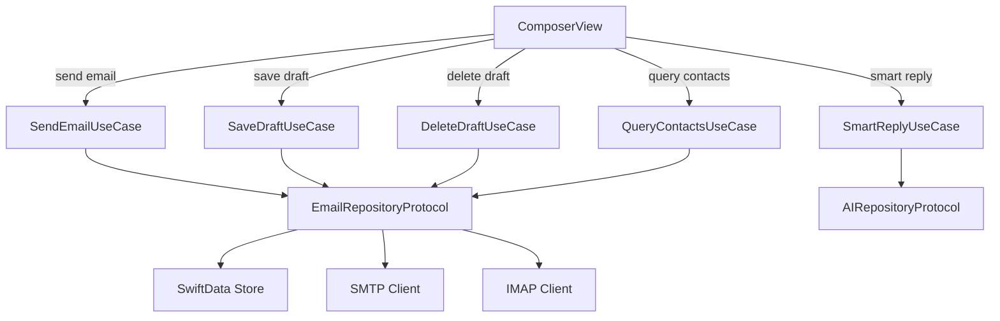

# Specification: Email Composer

> The key words **MUST**, **MUST NOT**, **REQUIRED**, **SHALL**, **SHALL NOT**, **SHOULD**, **SHOULD NOT**, **RECOMMENDED**, **MAY**, and **OPTIONAL** in this document are to be interpreted as described in RFC 2119.

## 1. Summary

This specification defines the email composition experience: composing new emails, replies, reply-all, and forwards. It covers composition modes with correct pre-filling, the undo-send mechanism with all edge cases, draft auto-save lifecycle with IMAP sync, contacts autocomplete privacy, attachment handling with size limits, send validation, and smart reply integration.

---

## 2. Goals and Non-Goals

### Goals

- **G-01**: Support all composition modes (new, reply, reply-all, forward) with correct pre-filling of recipients, subject, and body
- **G-02**: Client-side undo-send with configurable delay and complete edge case handling (app termination, background, offline)
- **G-03**: Auto-save drafts locally and sync to server Drafts folder with full lifecycle management
- **G-04**: Privacy-preserving contacts autocomplete — local data only, no system Contacts (per Constitution P-01)
- **G-05**: Full accessibility: VoiceOver, Dynamic Type, WCAG 2.1 AA compliance (per Constitution TC-05)
- **G-06**: Smart reply integration for reply composition (per Foundation G-04)

### Non-Goals

- **NG-01**: Rich text / HTML email composition (V1: plain text + basic formatting only)
- **NG-02**: Template or canned response library (deferred to V2)
- **NG-03**: Schedule send (deferred to V2)
- **NG-04**: Recipient group/distribution list management (deferred to V2)
- **NG-05**: iOS share extension (deferred to V1.1 — requires separate Xcode target and entitlements)

---

## 3. Functional Requirements

### FR-COMP-01: Composition

**Description**

The client **MUST** support composing new emails, replies, reply-all, and forwards. Each mode pre-fills fields differently based on the source email context.

**Composition Modes**

| Mode | Entry Point | To | CC | Subject | Body | Attachments |
|------|-------------|----|----|---------|------|-------------|
| New | Compose FAB (iOS) / ⌘N (macOS) | Empty | Empty | Empty | Empty | None |
| Reply | Reply button in Email Detail | Original sender (`Email.fromAddress`) | Empty | "Re: " + original subject | Quoted original body below cursor | None |
| Reply All | Reply All button in Email Detail | Original sender | All original To/CC recipients except self | "Re: " + original subject | Quoted original body below cursor | None |
| Forward | Forward button in Email Detail | Empty | Empty | "Fwd: " + original subject | Original body + forwarding header | Original attachments (re-downloadable) |

- Reply All **MUST** deduplicate: remove the user's own email address(es) from To and CC lists.
- For Reply and Reply All, the quoted original body **MUST** be prefixed with a header line: "On [date], [sender name] wrote:" followed by the `>` prefixed quoted content.
- For Forward, the original body **MUST** include a forwarding header: "---------- Forwarded message ----------" followed by From, Date, Subject, and To fields from the original email.
- The subject prefix ("Re:" or "Fwd:") **MUST NOT** be duplicated if the original subject already contains it.
- For Reply and Reply All, the `Email.inReplyTo` field **MUST** be set to the original email's `messageId`, and `Email.references` **MUST** append the original `messageId` to the existing references chain (per RFC 2822).

**Body Editor**

- V1 body editor provides plain text composition with basic inline formatting: **bold**, *italic*, and hyperlinks. Supported constructs are limited to these three — lists, headers, code blocks, images, and other Markdown constructs are NOT supported in V1.
- The composer **MUST** provide a formatting toolbar with bold, italic, and link buttons. The toolbar inserts Markdown-style syntax (`**bold**`, `*italic*`, `[text](url)`) behind the scenes — users do not need to type raw Markdown.
- On send, Markdown syntax **MUST** be converted to minimal safe HTML (only `<b>`, `<i>`, `<a>` tags). This is NOT rich text composition (per NG-01) — the editor remains plain text with lightweight formatting assistance.
- The body field **MUST NOT** support rich HTML editing, embedded images, or custom fonts (NG-01).
- Character limit: no hard limit in V1; the client **SHOULD** display a warning if body exceeds 100 KB.

**Attachment Handling**

- The client **MUST** support attaching files via the system file picker (iOS: `UIDocumentPickerViewController`; macOS: `NSOpenPanel`).
- The client **MUST** support attaching images from the photo library (iOS: `PHPickerViewController`) or camera (iOS: `UIImagePickerController` with `.camera` source).
- Total attachment size **MUST** display a warning when exceeding 25 MB (Gmail's per-email limit). The client **SHOULD** prevent sending if total exceeds 25 MB.
- Each attachment **MUST** display: filename, size, and a remove button.
- For Forward mode, original attachments **MUST** be listed and optionally removable by the user. If an original attachment has not been downloaded locally, it **MUST** be downloaded before sending the forward.
- If the device is offline when composing a forward, the user **MAY** compose and queue the forward. Undownloaded original attachments **MUST** be marked as pending; the client **MUST** attempt to download them when connectivity resumes. The forward **MUST NOT** be transmitted via SMTP until all attachments are available locally.
- Inline image insertion is a **SHOULD** — if supported, inserted via Markdown image syntax.
- **Note**: Cellular network warnings for large downloads are handled by Email Sync FR-SYNC-08 and apply during attachment *download* (Email Detail), not during composition or send. The 25 MB limit above applies regardless of network type.

**Send Validation**

- The Send button **MUST** be disabled until at least one valid email address exists in To, CC, or BCC.
- If the subject field is empty when Send is tapped, the client **SHOULD** display a confirmation: "Send without subject?"
- If the body is empty when Send is tapped, the client **SHOULD** display a confirmation: "Send empty message?"
- Invalid email addresses in recipient fields **MUST** be visually indicated (red highlight + icon, not color alone per NFR-COMP-03) and **MUST** prevent sending.

**View States**

The email composer **MUST** handle the following states:

| State | Display |
|-------|---------|
| Composing | Editor with all fields active |
| Sending (undo window) | Undo countdown toast; composer dismissed |
| Send in progress | Brief "Sending…" indicator (after undo window expires) |
| Send success | Toast: "Message sent" with navigation back to previous screen |
| Send failed | Error toast: "Couldn't send message. Tap to retry." Return to composer with all content preserved |
| Saving draft | Subtle "Saving…" indicator (non-blocking) |
| Discard confirmation | Alert: "Delete draft?" with "Delete" and "Keep Editing" options |

**Error Handling**

- If draft auto-save fails, the client **SHOULD** display a subtle warning but **MUST NOT** block composition.
- If SMTP send fails after the undo window, the client **MUST** preserve the email as `sendState = .failed` and display an error with retry option (cross-ref Email Sync FR-SYNC-07).
- If forward attachment download fails, the client **MUST** display an error and **MUST** prevent sending until the attachment is either successfully downloaded or removed by the user.

**Draft Auto-Save Lifecycle**

- Auto-save **MUST** trigger on first meaningful edit (not on empty composer open) and then every 30 seconds while content changes.
- Auto-save **MUST** persist to SwiftData with `Email.isDraft = true`. Local persistence is the primary guarantee — the draft is considered saved once written to SwiftData.
- Draft IMAP sync **SHOULD** use IMAP `APPEND` to the `[Gmail]/Drafts` folder. IMAP sync is best-effort: if the device is offline or the OAuth token is expired, local auto-save still succeeds and IMAP sync retries on next successful connection. The previous server draft version **MUST** be deleted (`STORE +FLAGS (\Deleted)` + `EXPUNGE`) before APPENDing the updated version.
- On dismiss without sending:
  - If content exists → save draft and display confirmation: "Draft saved"
  - If content is empty (no recipients, no subject, no body) → discard silently (no draft created)
- On successful send → delete draft from local store AND from server Drafts folder.
- Draft resume: drafts **MUST** appear in the Drafts folder in the sidebar. Tapping a draft **MUST** reopen the composer with all fields restored (To, CC, BCC, subject, body, attachments).
- If a draft is edited on another device (server conflict), the client **MUST** treat the server version as authoritative on next sync (per Email Sync FR-SYNC-05 conflict resolution).
- If a draft is currently open in the composer when a server conflict is detected during sync, the client **SHOULD** display a warning: "This draft was updated on another device. Reload?" with "Reload" (replaces local content with server version) and "Keep Local" (ignores server version until next save) options.

### FR-COMP-02: Undo-Send Mechanism

Undo-send is a purely client-side delay. The email **MUST NOT** be transmitted to the SMTP server during the undo window.

- The undo window is configurable: 0 (disabled), 5, 10, 15, or 30 seconds. Default: 5 seconds.
- When the user taps Send:
  1. The message is persisted to SwiftData with `sendState = .queued` and `isDraft = false` (see UI state mapping table below).
  2. A countdown toast/snackbar appears with an "Undo" button.
  3. No SMTP transmission occurs during this window.

**Undo-Send Edge Cases**

| Scenario | Behavior |
|----------|----------|
| User taps Undo | Send cancelled. Message returns to composer for editing. |
| Timer expires (app foregrounded) | SMTP send proceeds immediately. Message moves to Sent on success. |
| App enters background during undo window | Timer **pauses**. Resumes when app returns to foreground. |
| App terminated by OS during undo window | Message **MUST** be persisted as a draft (saved locally + synced to Drafts folder). It is **NOT** sent automatically on next launch. User must explicitly re-send. |
| App killed by user during undo window | Same as OS termination: saved as draft, not auto-sent. |
| Device loses network during undo window | Timer continues normally. On expiry, message enters the offline send queue (see Email Sync FR-SYNC-07). |
| Undo window set to 0 (disabled) | SMTP send proceeds immediately on tap with no undo option. |

**Persistence guarantee**: The message **MUST** be written to local storage (SwiftData) with `sendState = .queued` and `isDraft = false` **before** the undo countdown begins. This ensures no data loss if the app is terminated at any point.

**Post-Undo-Window Send Pipeline** (cross-ref Email Sync FR-SYNC-07)

- After the undo window expires, the message follows the Email Sync FR-SYNC-07 SMTP pipeline (it is already `sendState = .queued`).
- SMTP retry policy: 3 retries with exponential backoff (30s, 2m, 8m) per FR-SYNC-07.
- SMTP server rejections (e.g., recipient not found) **MUST NOT** be retried — set `sendState = .failed` immediately with the server error message (per FR-SYNC-07).
- After successful SMTP delivery, the client **MUST** APPEND the sent message to the Sent folder via IMAP (per FR-SYNC-07).
- If the device is offline when the undo window expires, the message enters the offline send queue (FR-SYNC-07 Offline Send Queue) with FIFO ordering and 24-hour max queue age.

**Composer UI States vs. Foundation sendState Mapping**

The undo-send mechanism uses composer-internal UI states that map to Foundation Section 5.5's `sendState` enum as follows:

| Composer UI State | Foundation `sendState` | `isDraft` | Description |
|-------------------|----------------------|-----------|-------------|
| Composing | `none` | `true` | User is editing in the composer |
| Undo Window Active | `queued` | `false` | User tapped Send; undo timer running; persisted before countdown |
| Undo Cancelled | `none` | `true` | User tapped Undo; reverted to draft |
| App Terminated During Undo | `none` | `true` | Saved as draft; NOT auto-sent on relaunch |
| Queued for SMTP | `queued` | `false` | Undo timer expired; awaiting SMTP pipeline |
| Sending | `sending` | `false` | SMTP transmission in progress |
| Sent | `sent` | `false` | SMTP delivery confirmed |
| Failed | `failed` | `false` | SMTP error after retries |

Foundation Section 5.5 defines `queued` as "includes undo-send delay period." The composer manages the undo timer locally — Email Sync FR-SYNC-07 picks up `queued` messages only after the undo window expires. The composer **MUST** prevent the Sync engine from processing `queued` messages while the local undo timer is still active.

**Send State Transitions** (Foundation `sendState` values shown)

```
none (draft) → queued       (user taps Send; persisted to SwiftData before countdown)
queued → none (draft)       (user taps Undo during undo window)
queued → none (draft)       (app terminated during undo window)
queued → sending            (undo timer expires; SMTP transmission begins)
sending → sent              (SMTP delivery confirmed; APPEND to Sent folder)
sending → failed            (SMTP error after 3 retries)
failed → queued             (user taps Retry)
```

### FR-COMP-03: Smart Reply Integration

- When composing a reply, the client **SHOULD** pre-populate up to 3 smart reply suggestions via `SmartReplyUseCase`.
- The user **MUST** be able to select a suggestion to insert it into the body, then edit freely.
- Smart reply generation **MUST** happen asynchronously and **MUST NOT** block the composer UI.
- If smart reply generation fails or is unavailable (model not downloaded, device unsupported per Foundation Section 11), the suggestion area **MUST** be hidden entirely (no error shown).
- Smart reply generation is handled by the AI Features spec.

### FR-COMP-04: Contacts Autocomplete Privacy

The recipient autocomplete feature **MUST** operate entirely from locally synced data, with no external contact lookups.

- Autocomplete data **MUST** be sourced exclusively from email headers (`From`, `To`, `CC`) of locally synced emails.
- The client **MUST NOT** access the system Contacts framework (`CNContact`, `ABAddressBook`). No contact permissions are requested.
- The client **MUST NOT** perform external contact directory lookups (LDAP, CardDAV, Google People API, etc.).
- The contact cache **MUST** be stored locally in SwiftData as `ContactCacheEntry` entities, scoped per account.
- Each contact entry stores: email address, display name (from email header), last seen date, frequency of appearance.
- The contact cache **MUST** be populated during email sync: when new emails are synced, `From`, `To`, and `CC` addresses **MUST** be extracted and upserted into `ContactCacheEntry` (update `lastSeenDate` and increment `frequency`). This extraction happens in the Email Sync pipeline, not on-demand in the composer.
- Autocomplete results **SHOULD** be ranked by frequency of correspondence (most frequent first).
- When an account is removed, all associated contact cache entries **MUST** be deleted (cascade).
- Contact data **MUST NOT** be shared, exported, or transmitted to any external service.
- Contact cache **SHOULD** be limited to 10,000 entries per account. When the limit is exceeded, entries with the lowest `frequency` and oldest `lastSeenDate` **SHOULD** be evicted (least-frequently-used, tie-broken by recency).
- For multi-account setups, the autocomplete **SHOULD** merge suggestions across all accounts, deduplicating by email address (keeping the most recent displayName and highest frequency).

---

## 4. Non-Functional Requirements

### NFR-COMP-01: Draft Save Latency

- **Metric**: Time for auto-save to persist draft to SwiftData
- **Target**: < 200ms
- **Hard Limit**: 500ms
- **Measurement**: Time interval from auto-save trigger to SwiftData persist confirmation on iPhone SE 3rd gen
- **Failure Threshold**: Fails if > 500ms on 3 consecutive saves

### NFR-COMP-02: Autocomplete Response Time

- **Metric**: Time from keystroke to suggestion list update
- **Target**: < 100ms
- **Hard Limit**: 300ms
- **Measurement**: Time from key event to visible suggestion list update on iPhone SE 3rd gen with 1,000+ cached contact entries
- **Failure Threshold**: Fails if > 300ms on 10 consecutive keystrokes

### NFR-COMP-03: Accessibility

- **WCAG 2.1 AA**: All UI elements **MUST** meet WCAG 2.1 AA contrast ratios (4.5:1 for normal text, 3:1 for large text/icons) per Constitution TC-05.
- **VoiceOver**: All fields (To, CC, BCC, Subject, Body) **MUST** be navigable and labeled. Recipient tokens **MUST** announce name/email and provide a remove custom action. Attachments **MUST** announce name, size, and provide a remove custom action. Formatting controls **MUST** be labeled. Send and Cancel buttons **MUST** be accessible with clear labels.
- **Dynamic Type**: All text **MUST** scale with Dynamic Type from accessibility extra small through accessibility 5 (xxxLarge). The body editor **MUST** respect Dynamic Type. Layout **MUST NOT** break or clip at any supported size.
- **Color Independence**: Send validation errors (invalid email addresses) **MUST** use icon/shape in addition to color — color **MUST NOT** be the sole indicator.
- **Reduce Motion**: Undo-send countdown animation **SHOULD** use a simple progress bar instead of animated transitions when "Reduce Motion" is enabled.

### NFR-COMP-04: Send Time

- **Metric**: Time from undo window expiry to SMTP delivery confirmation
- **Target**: < 3 seconds
- **Hard Limit**: 5 seconds
- **Cross-ref**: Email Sync NFR-SYNC-03
- **Measurement**: Time from `sendState = .queued` to `sendState = .sent` on iPhone SE 3rd gen with Wi-Fi connection
- **Failure Threshold**: Fails if > 5 seconds on 3 consecutive sends

---

## 5. Data Model

Refer to Foundation spec Section 5 for Email and Attachment entities. This feature creates/updates Email entities (draft state, send queue state via `Email.sendState`) and reads contact cache entries from SwiftData. Key fields consumed/written:

| Field | Entity | Usage |
|-------|--------|-------|
| `toAddresses` | Email | Recipient field — JSON array of strings (Foundation Section 5.6) |
| `ccAddresses` | Email | CC field — JSON array of strings |
| `bccAddresses` | Email | BCC field — JSON array of strings |
| `subject` | Email | Subject field |
| `bodyPlain` | Email | Body editor content (plain text) |
| `bodyHTML` | Email | Generated from basic formatting on send |
| `isDraft` | Email | Draft state flag (`true` during composition) |
| `sendState` | Email | Send pipeline state (Foundation Section 5.5: `none`, `queued`, `sending`, `failed`, `sent`). During undo window: `queued`. See FR-COMP-02 UI state mapping table. |
| `sendRetryCount` | Email | Retry tracking for SMTP send attempts |
| `sendQueuedDate` | Email | Queue timestamp for 24-hour max age (Foundation Section 8.1) |
| `inReplyTo` | Email | Reply threading — RFC 2822 Message-ID of the parent email |
| `references` | Email | Reply threading — space-delimited chain of Message-IDs (Foundation Section 5.6) |
| `fromAddress` | Email | Sender address (set from active account) |
| `messageId` | Email | RFC 2822 Message-ID generated on composition |

**Additional Feature-Local Entity: ContactCacheEntry**

| Field | Type | Description |
|-------|------|-------------|
| `id` | String (PK) | Unique identifier |
| `accountId` | String (FK) | Account scope — cascade delete on account removal |
| `emailAddress` | String | Contact email address (unique per account) |
| `displayName` | String? | Display name from email headers (optional) |
| `lastSeenDate` | Date | Last time this address appeared in synced email headers |
| `frequency` | Int | Number of times this address appeared (for ranking) |

The `ContactCacheEntry` entity is a **feature-local entity** introduced by this spec (not defined in Foundation Section 5). Storage: SwiftData `@Model` in the same `ModelContainer` as Foundation entities, but owned by this feature. Cascade delete when the associated account is removed. Not synced via IMAP, not shared with other features.

---

## 6. Architecture Overview

Refer to Foundation spec Section 6. This feature uses:



**Note**: Per project architecture (CLAUDE.md), this feature uses the MV (Model-View) pattern with `@Observable` services and SwiftUI native state management. No ViewModels — view logic is in the SwiftUI views using `@State`, `@Environment`, and `.task` modifiers. Per Foundation FR-FOUND-01, views **MUST** call domain use cases only — never repositories directly.

**Feature-Specific Use Cases**: The Foundation architecture diagram (Section 6) defines 8 core use cases including `SendEmailUseCase` and `SmartReplyUseCase`. This feature introduces additional **feature-specific use cases**: `SaveDraftUseCase`, `DeleteDraftUseCase`, and `QueryContactsUseCase`. These follow the same domain layer pattern (use case → repository) and are scoped to the Email Composer feature module.

---

## 7. Platform-Specific Considerations

### iOS

- **Presentation**: Modal sheet (`.sheet` modifier) from Thread List compose FAB or Email Detail reply/forward buttons. Full-screen sheet on compact width devices.
- **Keyboard avoidance**: Body editor **MUST** scroll above the keyboard. Recipient fields **MUST** remain accessible when the keyboard is visible.
- **Photo library**: `PHPickerViewController` for image selection (no direct Photos access — limited photos permission only). Camera: `UIImagePickerController` with `.camera` source (requires `NSCameraUsageDescription` in Info.plist).
- **Adaptive layout**: **MUST** support iPhone SE (375pt width) through iPhone Pro Max (430pt width). Both portrait and landscape orientations **MUST** be supported (per Foundation Section 7.1).
- **Dismiss**: Swipe-down to dismiss **SHOULD** trigger discard confirmation if content exists. Cancel button in the navigation bar.
- **Share extension**: Deferred to V1.1 (see NG-05).

### macOS

- **Window**: Separate `Window` scene. Multiple composer windows **MUST** be supported simultaneously (per Foundation Section 7.2).
- **Keyboard shortcuts** (per Foundation Section 7.2):
  - `⌘N` — New email (from anywhere in the app)
  - `⌘⇧D` — Send message
  - `⌘W` — Close composer (with discard confirmation if content exists)
  - `⌘S` — Save draft immediately
  - `⌘⇧A` — Attach file
  - `Tab` — Move between To, CC, BCC, Subject, Body fields
- **Drag-and-drop**: Files dragged onto the composer window **MUST** be added as attachments (per Foundation Section 7.2).
- **Toolbar**: macOS window toolbar with Send, Attach, and Formatting buttons.
- **Menu bar**: File → New Message, File → Save Draft, Message → Send, Edit → Attach File.

---

## 8. Alternatives Considered

| Alternative | Pros | Cons | Rejected Because |
|-------------|------|------|-----------------|
| Server-side undo (Gmail API) | Truly unsends | Requires proprietary API | Violates P-02 (no third-party server dependency) |
| System Contacts integration | Richer autocomplete | Privacy violation | Violates P-01 (no external data access) |
| Full rich-text editor (Quill/TipTap via WKWebView) | Feature parity with Gmail web | Complexity, performance, WKWebView overhead | V1 scope; basic formatting sufficient for launch |
| Auto-send on app relaunch after termination | No lost emails | Surprising behavior; user may have changed mind | Saved as draft; user explicitly re-sends (safer UX) |
| Draft sync via push (server-initiated) | Real-time multi-device draft sync | Requires push infrastructure | Violates P-02; poll-based sync sufficient for V1 |

---

## 9. Open Questions

None — all resolved.

---

## 10. Revision History

| Version | Date | Author | Change Summary |
|---------|------|--------|---------------|
| 1.0.0 | 2025-02-07 | Core Team | Extracted from monolithic spec v1.2.0 section 5.5. Includes undo-send edge cases (5.5.2) and contacts autocomplete privacy (5.5.4). |
| 1.3.0 | 2026-02-08 | Core Team | Review round 3 (team feedback): Added NG-05 (share extension deferred to V1.1). Clarified body editor: formatting toolbar with B/I/link buttons (users don't type raw Markdown), explicit Markdown scope (bold/italic/link only, no lists/headers/code), "minimal safe HTML" output wording. Changed draft IMAP sync from MUST to SHOULD (local-first — SwiftData is primary store, IMAP is best-effort). Added draft conflict UX when composer open: "Draft updated on another device. Reload?" dialog. Added forward-offline edge case: compose allowed, send blocked until all attachments available. Added contact cache population timing: upserted during email sync from From/To/CC headers. Replaced share extension in Section 7 iOS with deferral note. |
| 1.2.0 | 2026-02-08 | Core Team | Review round 2: Replaced `pendingSend` state diagram with Foundation sendState mapping table — `pendingSend`, `composing`, `draft` were composer-internal UI states, not Foundation enum values. Foundation `queued` already includes undo-send delay period (Section 5.5). Added UI state ↔ Foundation sendState ↔ isDraft mapping table to FR-COMP-02. Added contact cache eviction policy (10,000 per account, LFU + LRU) to FR-COMP-04 (Constitution TC-06 compliance). Added cellular warning editorial note to FR-COMP-01 Attachment Handling (cross-ref FR-SYNC-08). Updated sendState field description in Data Model to reference UI state mapping. |
| 1.1.0 | 2026-02-07 | Core Team | Review round 1: Added G-XX/NG-XX IDs (SF-03). Added Thread List and Email Detail to depends-on. Expanded FR-COMP-01 with composition modes table (new/reply/reply-all/forward pre-filling), body editor constraints (Markdown-style, no rich HTML), attachment handling (25MB limit, forward attachments, file/photo/camera pickers), send validation rules, view states table (composing/sending/success/failed/draft/discard), error handling, and draft auto-save lifecycle (30s timer, IMAP APPEND/DELETE, dismiss behavior, resume, server conflict). Expanded FR-COMP-02 with post-undo-window send pipeline (cross-ref FR-SYNC-07 SMTP retry, APPEND to Sent), send state transition diagram. Expanded FR-COMP-03 with graceful fallback. Expanded FR-COMP-04 with multi-account deduplication. Expanded NFR-COMP-01/02 with measurement methods and failure thresholds. Added NFR-COMP-03 (Accessibility: WCAG 2.1 AA, VoiceOver for tokens/attachments/controls, Dynamic Type, color independence, Reduce Motion). Added NFR-COMP-04 (Send Time cross-ref NFR-SYNC-03). Expanded Data Model with field usage table and ContactCacheEntry feature-local entity. Replaced architecture section with Mermaid diagram showing 5 use cases (FR-FOUND-01 compliance). Added MV pattern note (no ViewModels). Expanded iOS platform section (keyboard avoidance, photo picker, adaptive layout, dismiss, share extension). Expanded macOS section (multiple windows, keyboard shortcuts, drag-and-drop, toolbar, menu bar). Added 3 new alternatives considered. Cleared Open Questions (SF-03). |
