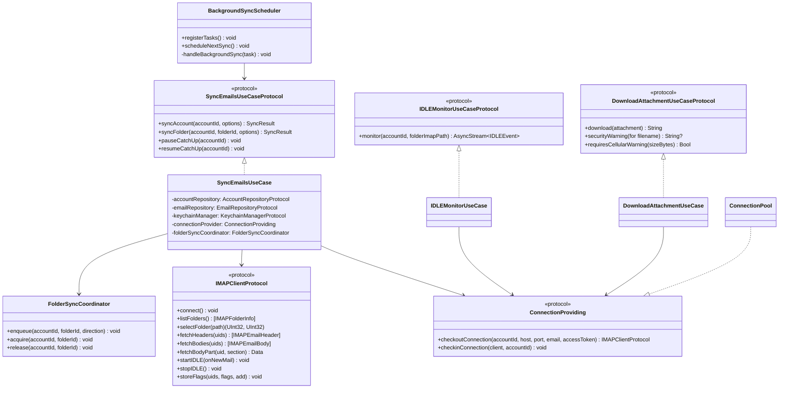

# Email Sync — iOS/macOS Implementation Plan

---

## 1. Scope

This plan covers the IMAP client, sync engine, SMTP client, email repository, and core domain use cases. These form the data engine that powers all email features.

**Current status (v1.3.0 docs update):** Existing IMAP sync is implemented and tested, but the new staged bootstrap + dual-cursor + on-scroll paging model from spec v1.3.0 is not implemented yet. This plan defines the required delta work.

---

## 2. Platform Context

Refer to Foundation plan Section 2 for OS versions, device targets, and platform guidelines.

- **Cross-platform:** All sync code compiles for both iOS and macOS. Platform-specific code (`BGAppRefreshTask`, `UIImage`-based favicons) is gated with `#if os(iOS)` / `#if canImport(UIKit)`.

---

## 3. Architecture Mapping

### Key Classes

### Files

| File | Layer | Purpose | Status |
|------|-------|---------|--------|
| `IMAPClient.swift` | Data/Network | IMAP connection and commands | Done |
| `IMAPSession.swift` | Data/Network | Connection lifecycle | Done |
| `ConnectionPool.swift` | Data/Network | Multi-account connection pooling via `ConnectionProviding` | Done |
| `IMAPClientProtocol.swift` | Domain/Protocols | Protocol for IMAP operations (enables mock injection) | Done |
| `MIMEDecoder.swift` | Data/Network | Content-Transfer-Encoding decode (base64, quoted-printable) | Done |
| `BackgroundSyncScheduler.swift` | Data/Sync | `BGAppRefreshTask` registration + handler (iOS only) | Done |
| `EmailRepositoryImpl.swift` | Data/Repositories | Email CRUD bridging IMAP + SwiftData | Done |
| `SyncEmailsUseCase.swift` | Domain/UseCases | Staged bootstrap sync, dual cursors, incremental + catch-up orchestration | Planned (v1.3.0 delta) |
| `IDLEMonitorUseCase.swift` | Domain/UseCases | Real-time IDLE monitoring via `AsyncStream<IDLEEvent>` | Done |
| `FolderSyncCoordinator.swift` | Domain/Sync | Per-folder single-writer coordination between IDLE/incremental/catch-up | Planned |
| `DownloadAttachmentUseCase.swift` | Domain/UseCases | Lazy IMAP body part fetch + transfer-encoding decode | Done |
| `ManageThreadActionsUseCase.swift` | Domain/UseCases | Archive/delete/star/read with IMAP flag sync | Done |
| `FetchThreadsUseCase.swift` | Domain/UseCases | Thread fetching with AI category filters + pagination | Done |
| `ManageAccountsUseCase.swift` | Domain/UseCases | Account CRUD + re-authentication | Done |
| `SMTPClient.swift` | Data/Network | Email sending (XOAUTH2, TLS, retry, send pipeline support) | Done |
| `ComposeEmailUseCase.swift` | Domain/UseCases | Send + offline queue orchestration (`.queued` → `.sending` → `.sent`/`.failed`) | Done |

### Presentation Wiring

| File | Integration Point |
|------|-------------------|
| `VaultMailApp.swift` | Creates `BackgroundSyncScheduler`, calls `registerTasks()` + `scheduleNextSync()` at launch |
| `ContentView.swift` | Passes `syncEmails` dependency to `OnboardingView` |
| `OnboardingView.swift` | Marks onboarding complete; first sync is triggered by thread list load |
| `ThreadListView.swift` | Current: inbox-first baseline sync flow. Target (v1.3.0 delta): staged bootstrap (first 30 Inbox headers), then background catch-up; `.refreshable` runs forward incremental sync |
| `MacOSMainView.swift` | Current: local DB pagination only when loading more. Target (v1.3.0 delta): iOS-parity two-stage paging (local page first, then `syncFolder(..., .catchUp)` fallback with guard matrix and boundary state) |
| `Config/VaultMail.entitlements` | `com.apple.developer.background-modes` = `fetch` |
| `VaultMail/Info.plist` | `BGTaskSchedulerPermittedIdentifiers` = `com.vaultmail.app.sync` |

---

## 4. Implementation Phases

| Task ID | Description | Spec FRs | Dependencies | Status |
|---------|-------------|----------|-------------|--------|
| IOS-F-05 | IMAP client (connect, authenticate, list folders, IDLE, connection management) | FR-SYNC-01, FR-SYNC-03, FR-SYNC-09 | IOS-F-04 (Account Management) | **Done** |
| IOS-F-06 | Existing sync engine baseline (full sync, incremental, IDLE monitor, background sync, threading, flag sync, attachments) | FR-SYNC-01, FR-SYNC-02, FR-SYNC-04, FR-SYNC-05, FR-SYNC-06, FR-SYNC-08, FR-SYNC-10 | IOS-F-05 | **Done (baseline)** |
| IOS-F-07 | SMTP client (send, queue) | FR-SYNC-07 | IOS-F-04 (Account Management) | **Done** |
| IOS-F-08 | Email repository implementation | All FRs | IOS-F-02 (Foundation), IOS-F-06, IOS-F-07 | **Done** (LRU cache remaining) |
| IOS-F-10 | Domain use cases (Sync, Fetch, Send, ManageAccounts, IDLE, Download, Actions) | Foundation Section 6 | IOS-F-08, IOS-F-09 (Account Management) | **Done** |
| IOS-F-11 | Staged first-login bootstrap (30 Inbox headers), non-blocking background catch-up, on-scroll older-mail paging | FR-SYNC-01, FR-SYNC-02, NFR-SYNC-06 | IOS-F-06 | Planned |
| IOS-F-12 | Dual-cursor checkpoint model (`forwardCursorUID`, `backfillCursorUID`) and resumable pause/resume semantics | FR-SYNC-02, FR-SYNC-04 | IOS-F-11 | Planned |
| IOS-F-13 | IDLE/catch-up overlap control with per-folder single-writer coordination | FR-SYNC-03, FR-SYNC-04 | IOS-F-11 | Planned |
| IOS-F-14 | Dedup fallback canonical key for missing/duplicate Message-ID | FR-SYNC-01, FR-SYNC-06 | IOS-F-06 | Planned |
| IOS-F-15 | macOS infinite-scroll catch-up parity with iOS ThreadList behavior | FR-SYNC-01, FR-SYNC-02, FR-SYNC-03 | IOS-F-11, IOS-F-12 | Planned |

---

### IOS-F-15 Design Notes (macOS Paging Parity)

- `MacOSMainView.loadMoreThreads()` uses a two-stage flow:
  - Stage 1: load next local DB page when `hasMorePages == true`
  - Stage 2: call `loadOlderFromServer()` catch-up fallback when local pages are exhausted
- `loadOlderFromServer()` guard matrix (must return no-op):
  - Unified mode (`selectedAccount == nil`)
  - Active search mode
  - Outbox/non-syncable folders
- Pagination state reset helper is required and must run on account/folder/category scope changes:
  - `reachedServerHistoryBoundary = false`
  - `syncStatusText = nil`
  - `paginationError = false`
- `MacThreadListContentView` contract:
  - Sentinel shown when `hasMorePages == true`, OR
  - Single-account folder context and `!reachedServerHistoryBoundary`
  - Footer status text reflects catch-up progress (`Syncing older mail...`, `Catch-up paused`)
  - Pagination error row exposes explicit retry that calls `onLoadMore()`

---

## 5. Key Design Decisions

| Decision | Rationale |
|----------|-----------|
| Sync logic in `SyncEmailsUseCase` (not separate `SyncEngine.swift`) | Follows MV pattern — use cases own business logic. No need for additional indirection layer. |
| `ConnectionProviding` protocol over direct `ConnectionPool` dependency | Enables mock injection for tests. `ConnectionPool` conforms via extension. |
| `IDLEMonitorUseCase` as separate use case (not embedded in sync) | IDLE has different lifecycle — long-lived stream vs. one-shot sync. Separate use case allows clean `.task(id:)` integration. |
| `BackgroundSyncScheduler` as `@Observable @MainActor` class | Matches app-wide services pattern. `@Observable` for future UI binding (sync status). iOS-only via `#if os(iOS)`. |
| Attachment download via lazy `FETCH BODY[section]` | Avoids downloading all attachments during sync. `bodySection` (MIME part ID) stored during initial sync for deferred fetch. |
| SHA256-based stable email ID (`stableId(accountId:, messageId:)`) | Ensures cross-folder dedup. Same email in INBOX and All Mail maps to single SwiftData record. |
| Dual-cursor checkpointing (`forwardCursorUID` + `backfillCursorUID`) | Separates new-mail incremental progress from historical catch-up progress; prevents ambiguous resume behavior after capped newest-first bootstrap. |
| First-render gate is 30 Inbox headers only | Optimizes perceived performance; user can interact immediately while remaining sync runs in background. |
| On-scroll older-mail paging is mandatory | Ensures users can access mail beyond bootstrap budget without waiting for full catch-up. |
| macOS paging mirrors iOS contract | `loadMoreThreads()` must run local page first, then catch-up fallback, with no-op guards in Unified/Search/Outbox/non-syncable contexts and deterministic state reset on scope change. |
| Per-folder single-writer sync coordination | Prevents race conditions when IDLE incremental and catch-up target the same folder. |

---

## 6. Risks and Mitigations

| Risk | Likelihood | Impact | Mitigation | Status |
|------|-----------|--------|------------|--------|
| IMAP protocol edge cases (Gmail quirks) | Medium | Medium | Extensive integration tests with real Gmail account; handle known Gmail IMAP quirks from proposal section 3.3.1 | Mitigated — IDLE 25-min timeout handled, UIDVALIDITY change detected |
| Cursor corruption/misalignment during migration | Medium | High | Nullable default-safe fields, migration verification tests, feature-flag rollout with legacy fallback path | Planned mitigation |
| IDLE/catch-up write contention on same folder | Medium | High | Per-folder single-writer coordinator; queued/preempt rules validated by tests | Planned mitigation |
| macOS catch-up accidentally triggered in wrong contexts (Unified/Search/Outbox) | Medium | High | Explicit guard matrix in `loadOlderFromServer()` + dedicated parity tests for no-op contexts and state reset | Planned mitigation |
| Bootstrap budget starvation in non-inbox folders | Medium | Medium | Allocator with minimum per-folder floor (20 headers) plus deterministic priority order | Planned mitigation |
| llama.cpp Swift integration for indexing | Medium | High | Spike in Phase 3; indexing can be added incrementally | Unchanged |
| Background sync iOS limitations | High | Medium | Implemented `BGAppRefreshTask` with 15-min interval and 30-sec budget; graceful expiration handler | **Resolved** |
| OAuth token expiry during long sync | Medium | Medium | Token refresh with fallback to keychain cached token; `SyncError.tokenRefreshFailed` propagated to UI | **Resolved** |

---

## 7. Test Coverage

| Test Suite | Tests | Scope |
|-----------|-------|-------|
| `IDLEMonitorUseCaseTests` | 5 | IDLE stream emission, error handling, connection lifecycle |
| `BackgroundSyncSchedulerTests` | 4 | Task identifier, initialization, registration, scheduling |
| `DownloadAttachmentUseCaseTests` | 20+ | IMAP download, base64/QP/7bit decode, security warnings, cellular warnings, errors |
| `SyncEmailsUseCaseTests` (new delta set) | Planned | Dual-cursor progression, staged bootstrap, pause/resume semantics, on-scroll paging triggers |
| `FolderSyncCoordinatorTests` (new) | Planned | Single-writer locking, IDLE/incremental/catch-up queuing rules |
| `MacOSMainViewPaginationTests` (new) | Planned | Two-stage mac paging flow, catch-up fallback guard matrix, state reset semantics |
| `MacThreadListContentViewTests` (new) | Planned | Sentinel visibility rule, status footer, pagination retry contract |
| All suites combined | 549 + delta | Baseline passing; v1.3.0 tests pending |
