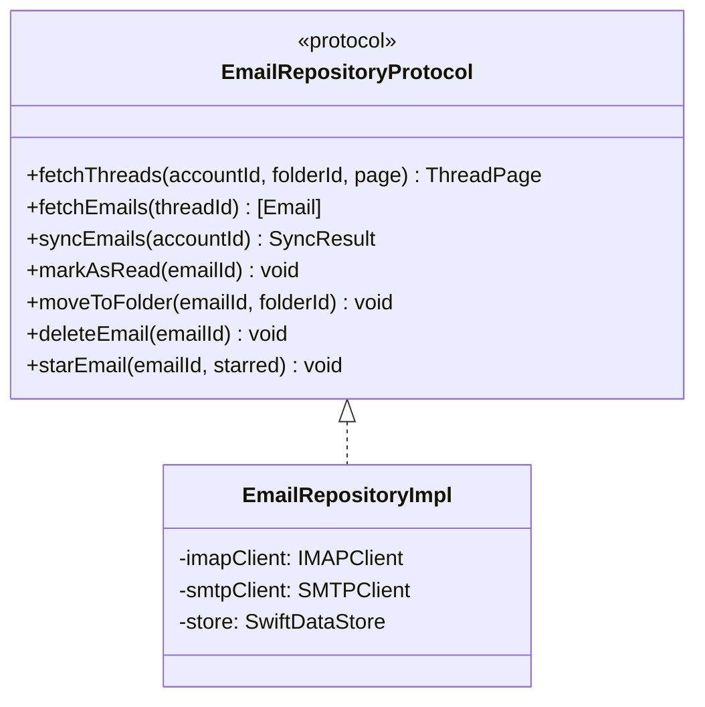

# Email Sync — iOS/macOS Implementation Plan

---

## 1. Scope

This plan covers the IMAP client, sync engine, SMTP client, email repository, and core domain use cases. These form the data engine that powers all email features.

---

## 2. Platform Context

Refer to Foundation plan Section 2 for OS versions, device targets, and platform guidelines.

---

## 3. Architecture Mapping

### Key Classes

### Files

| File | Layer | Purpose |
|------|-------|---------|
| `IMAPClient.swift` | Data/Network | IMAP connection and commands |
| `IMAPSession.swift` | Data/Network | Connection lifecycle |
| `ConnectionPool.swift` | Data/Network | Multi-account connection pooling |
| `SMTPClient.swift` | Data/Network | Email sending |
| `SyncEngine.swift` | Data/Network | Sync orchestration |
| `EmailRepositoryImpl.swift` | Data/Repositories | Email CRUD bridging IMAP/SMTP + SwiftData |
| `SyncEmailsUseCase.swift` | Domain/UseCases | Sync orchestration |
| `FetchThreadsUseCase.swift` | Domain/UseCases | Thread fetching with filters |
| `SendEmailUseCase.swift` | Domain/UseCases | Send + offline queue |

---

## 4. Implementation Phases

| Task ID | Description | Spec FRs | Dependencies |
|---------|-------------|----------|-------------|
| IOS-F-05 | IMAP client (connect, authenticate, list folders, connection management) | FR-SYNC-01, FR-SYNC-03, FR-SYNC-09 | IOS-F-04 (Account Management) |
| IOS-F-06 | Sync engine (full sync, incremental, IDLE, threading, flag sync, attachments) | FR-SYNC-01, FR-SYNC-02, FR-SYNC-04, FR-SYNC-05, FR-SYNC-06, FR-SYNC-08, FR-SYNC-10 | IOS-F-05 |
| IOS-F-07 | SMTP client (send, queue) | FR-SYNC-07 | IOS-F-04 (Account Management) |
| IOS-F-08 | Email repository implementation | All FRs | IOS-F-02 (Foundation), IOS-F-06, IOS-F-07 |
| IOS-F-10 | Domain use cases (Sync, Fetch, Send, ManageAccounts) | Foundation Section 6 | IOS-F-08, IOS-F-09 (Account Management) |

---

## 5. Risks and Mitigations

| Risk | Likelihood | Impact | Mitigation |
|------|-----------|--------|------------|
| IMAP protocol edge cases (Gmail quirks) | Medium | Medium | Extensive integration tests with real Gmail account; handle known Gmail IMAP quirks from proposal section 3.3.1 |
| llama.cpp Swift integration for indexing | Medium | High | Spike in Phase 3; indexing can be added incrementally |
| Background sync iOS limitations | High | Medium | Rely on background app refresh; document expected behavior |
