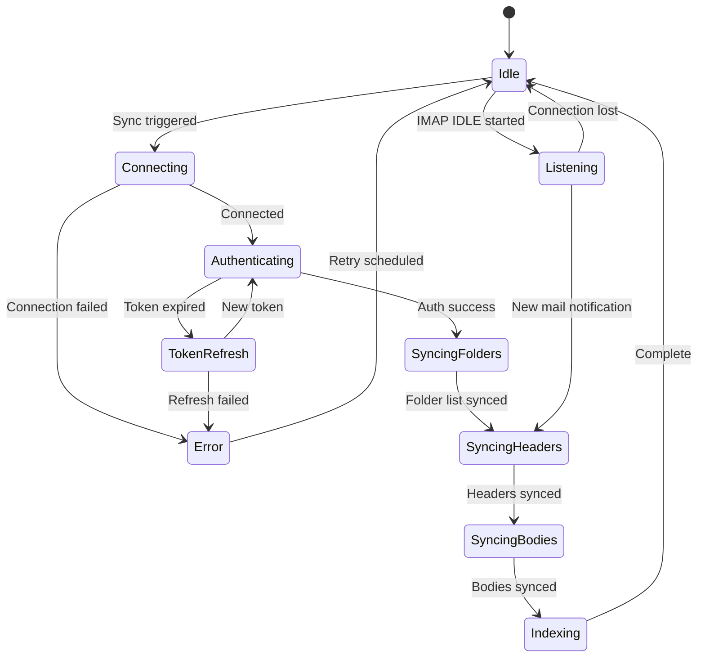
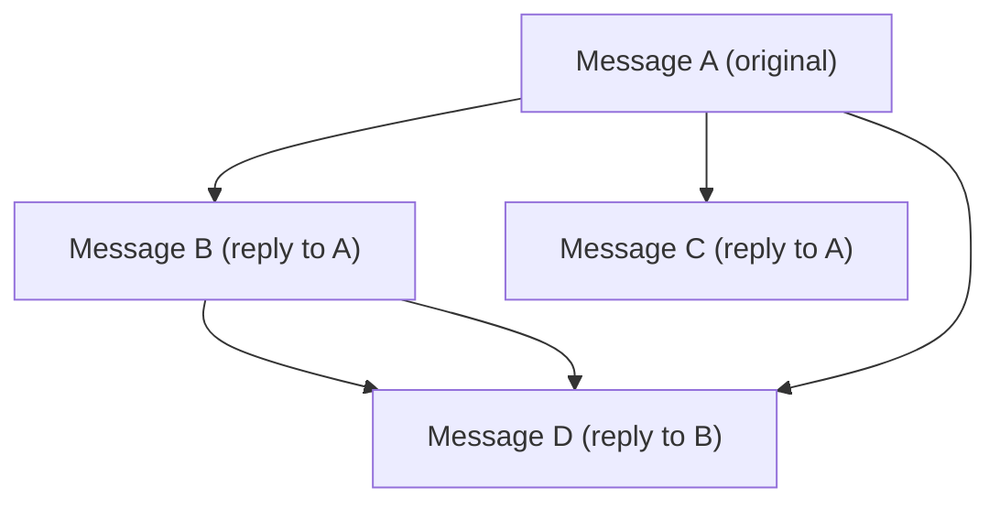

# Specification: Email Sync

> The key words **MUST**, **MUST NOT**, **REQUIRED**, **SHALL**, **SHALL NOT**, **SHOULD**, **SHOULD NOT**, **RECOMMENDED**, **MAY**, and **OPTIONAL** in this document are to be interpreted as described in RFC 2119.

## 1. Summary

This specification defines email synchronization via IMAP, email sending via SMTP, the offline send queue, thread grouping algorithm, and conflict resolution. It is the data engine that powers all email features.

---

## 2. Goals and Non-Goals

### Goals

- Reliable full and incremental sync via IMAP
- Real-time updates via IMAP IDLE
- Robust thread grouping from RFC headers
- Offline send queue with retry logic
- Bidirectional flag sync (read, starred)

### Non-Goals

- Push notifications via APNs (deferred per OQ-03)
- Non-Gmail IMAP providers (V2)

---

## 3. Functional Requirements

### FR-SYNC-01: Full Sync

- The client **MUST** perform a full sync of all folders within the configured sync window on first setup.
- The client **MUST** sync email headers and bodies for all emails within the sync window.

### FR-SYNC-02: Incremental Sync

- The client **MUST** perform incremental sync on app foreground (fetch only changes since last sync).
- The client **MUST** track sync state per folder (last seen UID, UIDVALIDITY).
- The client **MUST** handle UIDVALIDITY changes by re-syncing the affected folder.

### FR-SYNC-03: Real-Time Updates

- The client **MUST** use IMAP IDLE (RFC 2177) to receive real-time updates when the app is in the foreground.
- The client **SHOULD** use iOS background app refresh to periodically sync new emails.

### FR-SYNC-04: Sync State Machine

### FR-SYNC-05: Conflict Resolution

- Server state is authoritative for email metadata (read status, labels, folder membership).
- Local drafts and queued sends are authoritative locally until confirmed by the server.
- If a local action (mark read, delete) fails to sync, the client **MUST** retry up to 3 times with exponential backoff, then surface the error to the user.

### FR-SYNC-06: Threading Algorithm

The client **MUST** group emails into conversation threads locally using the following algorithm. This is the canonical threading logic — it does not rely on any provider-specific thread IDs.

**Step 1: Header Extraction**

For each synced email, extract:
- `Message-ID` — unique identifier for this email
- `In-Reply-To` — the `Message-ID` of the direct parent message
- `References` — ordered list of `Message-ID`s representing the full ancestry chain

**Step 2: Reference Graph Construction**

Build a directed graph where each `Message-ID` is a node. Edges are derived from:
- `In-Reply-To` → link this message to its parent
- `References` → link this message to all ancestors in the chain

**Step 3: Thread Grouping by Reference Chain**

All messages that share **any** `Message-ID` in their reference chains are grouped into the same thread. This is computed as connected components in the reference graph.

**Step 4: Subject-Based Fallback**

For messages with **no** `References` and **no** `In-Reply-To` headers (common in forwarded emails, some mailing lists, or broken clients):

1. Normalize the subject: strip prefixes `Re:`, `Fwd:`, `RE:`, `FW:`, `re:`, `fwd:` (case-insensitive, applied recursively), then trim leading/trailing whitespace.
2. Match against existing threads by exact normalized subject within the **same account**.
3. Subject-only grouping **MUST** be restricted to messages within a **30-day window** of each other to prevent false merges across unrelated conversations with the same subject.

**Step 5: Thread Metadata Computation**

For each thread, compute:
- `latestDate` — the most recent `dateSent` or `dateReceived` across all messages
- `messageCount` — total number of messages
- `unreadCount` — count of messages where `isRead == false`
- `participants` — deduplicated list of all From addresses
- `snippet` — first ~100 characters of the latest message body
- `subject` — subject of the root (earliest) message

**Gmail Mismatch Handling**

Gmail's internal threading algorithm may produce different groupings than this RFC-based algorithm. The client's local threading is authoritative. Differences between Gmail's web UI thread view and this client's thread view are expected and acceptable. The client **MUST NOT** attempt to replicate Gmail's proprietary threading logic.

**Limitations (V1)**

- Thread splitting is **not** supported. Users cannot manually separate a thread into two.
- Thread merging is **not** supported. Users cannot manually combine two threads.
- These are deferred to V2.

### FR-SYNC-07: Email Sending via SMTP

- The client **MUST** send email via SMTP.
- The client **MUST** queue emails for sending if offline, and send when connectivity is restored. See Proposal Section 3.5 (Offline Send Queue) for the full queue lifecycle, retry policy, and error handling.
- The client **MUST** move sent messages to the Sent folder via IMAP APPEND.
- The client **MUST** display clear error messages if sending fails.

---

## 4. Non-Functional Requirements

### NFR-SYNC-01: Incremental Sync Speed

- **Metric**: Time from foreground to updated thread list (10 new emails)
- **Target**: < 5 seconds
- **Hard Limit**: —

### NFR-SYNC-02: Initial Sync Speed

- **Metric**: Time from account setup to thread list displaying (1000 emails, Wi-Fi)
- **Target**: < 60 seconds
- **Hard Limit**: 120 seconds

---

## 5. Data Model

Refer to Foundation spec Section 5 for Email, Folder, Thread, and Attachment entities. This feature reads/writes all of them plus manages sync state metadata (last UID, UIDVALIDITY per folder).

---

## 6. Architecture Overview

Refer to Foundation spec Section 6. This feature uses:
- `SyncEmailsUseCase`, `FetchThreadsUseCase`, `SendEmailUseCase` → `EmailRepositoryProtocol` → `EmailRepositoryImpl`
- `EmailRepositoryImpl` → `IMAPClient` + `SMTPClient` + `SwiftDataStore`

---

## 7. Platform-Specific Considerations

### iOS
- Background app refresh for periodic sync (limited by iOS scheduling).
- IMAP IDLE active only while app is foregrounded.

### macOS
- IMAP IDLE can remain active while app window is open (no background restrictions).

---

## 8. Alternatives Considered

| Alternative | Pros | Cons | Rejected Because |
|-------------|------|------|-----------------|
| Gmail REST API | Push notifications, labels API | Proprietary, requires API key | Violates P-02, locks to Gmail |
| POP3 | Simpler protocol | No folders, no flags, no push | Missing essential features |
| Gmail thread IDs | Pre-computed threads | Proprietary, IMAP-incompatible | IMAP headers provide equivalent grouping |

---

## 9. Open Questions

| # | Question | Owner | Target Date |
|---|----------|-------|-------------|
| — | — | — | — |

---

## 10. Revision History

| Version | Date | Author | Change Summary |
|---------|------|--------|---------------|
| 1.0.0 | 2025-02-07 | Core Team | Extracted from monolithic spec v1.2.0 sections 5.2 and 5.5.2 (send behavior). Threading algorithm from v1.2.0 section 5.2.4. |
