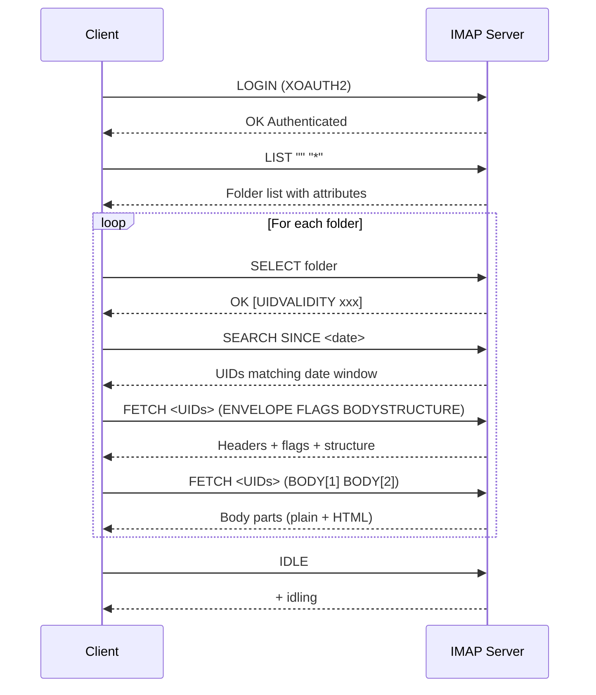
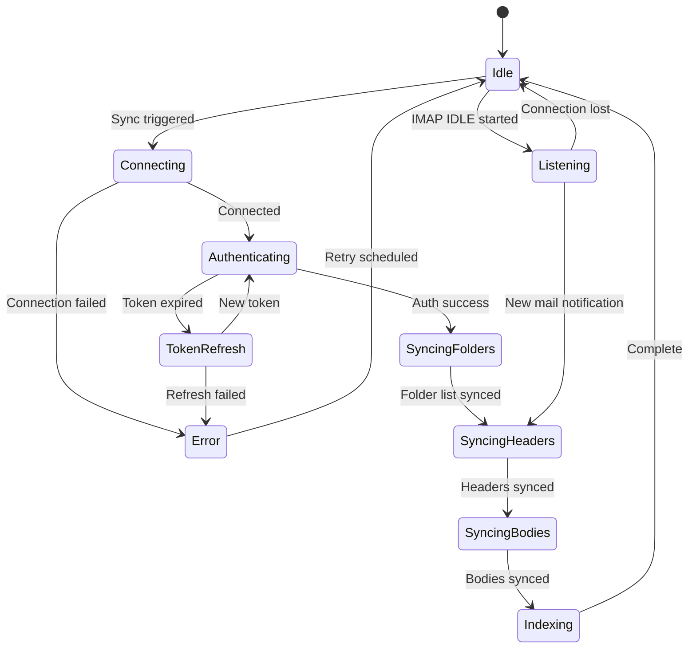
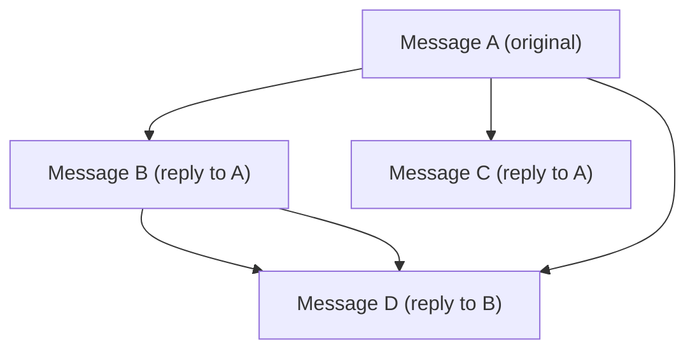

# Specification: Email Sync

> The key words **MUST**, **MUST NOT**, **REQUIRED**, **SHALL**, **SHALL NOT**, **SHOULD**, **SHOULD NOT**, **RECOMMENDED**, **MAY**, and **OPTIONAL** in this document are to be interpreted as described in [RFC 2119](https://www.ietf.org/rfc/rfc2119.txt).

## 1. Summary

This specification defines email synchronization via IMAP, email sending via SMTP, the offline send queue, thread grouping algorithm, bidirectional flag sync, attachment handling, connection management, conflict resolution, multi-account sync orchestration, unified inbox behavior, sync status observability, and sync diagnostics. It is the data engine that powers all email features.

---

## 2. Goals and Non-Goals

### Goals

- **G-01**: Reliable full and incremental sync via IMAP
- **G-02**: Real-time updates via IMAP IDLE
- **G-03**: Robust thread grouping from RFC headers
- **G-04**: Offline send queue with retry logic
- **G-05**: Bidirectional flag sync (read, starred)
- **G-06**: Concurrent multi-account sync with per-account error isolation
- **G-07**: Unified inbox across all accounts
- **G-08**: Sync status observability and diagnostics

### Non-Goals

- **NG-01**: Push notifications via APNs (deferred; Constitution P-02 prohibits third-party push services)
- **NG-02**: ~~Non-Gmail IMAP providers (V2)~~ → Addressed by Multi-Provider IMAP spec (docs/features/multi-provider-imap/spec.md)
- **NG-03**: Provider-specific sync behaviors (draft append, sent folder append, archive semantics per provider) — see Multi-Provider IMAP spec FR-MPROV-13

---

## 3. Functional Requirements

### FR-SYNC-01: Full Sync

**Description**

On first account setup, the client **MUST** perform a full sync:

1. **Folder discovery**: List all IMAP folders via `LIST "" "*"` and map Gmail special-use attributes to `FolderType` (see Foundation Section 5.3):
   - `\Inbox` → `inbox`
   - `\Sent` → `sent`
   - `\Drafts` → `drafts`
   - `\Trash` → `trash`
   - `\Junk` (Gmail Spam) → `spam`
   - `\All` (`[Gmail]/All Mail`) → **MUST NOT** be synced (redundant; contains all emails already in other folders)
   - `\Flagged` (`[Gmail]/Starred`) → `starred`
   - `\Important` → **MUST NOT** be synced as a folder; importance is a flag, not a mailbox
   - User-created Gmail labels → `custom`

   > **Note — Archive is virtual:** Gmail has no dedicated `[Gmail]/Archive` IMAP folder. "Archiving" in Gmail removes the `\Inbox` label, leaving the email only in `[Gmail]/All Mail`. Since All Mail is not synced (see above), the local "Archive" view is a virtual query: emails that were explicitly archived by the user are tracked via removal of their source-folder `EmailFolder` association. See FR-SYNC-10 Archive Behavior for details.

2. **Email sync**: For each folder, fetch all email headers and bodies whose `INTERNALDATE` falls within the configured sync window (see Account Management FR-ACCT-02; default 30 days). Use IMAP `SEARCH SINCE <date>` to identify matching UIDs.

   **Cross-folder deduplication**: Before creating a new `Email` entity, the client **MUST** check for an existing `Email` with the same `messageId` (RFC 2822 Message-ID) in the local store. If a match is found, the client **MUST** create only a new `EmailFolder` association linking the existing email to the current folder (and update flags if they differ). If no match is found, the client **MUST** create a new `Email` entity and its `EmailFolder` association. This ensures that emails appearing in multiple Gmail labels (e.g., Inbox + Starred) are stored as a single `Email` with multiple `EmailFolder` join entries.

3. **Body format handling**: For each email, use `FETCH BODYSTRUCTURE` to determine MIME structure:
   - **MUST** fetch `text/plain` part → store in `Email.bodyPlain`
   - **MUST** fetch `text/html` part → store in `Email.bodyHTML`
   - If only one format is available, the other field **MUST** be `nil`
   - Inline images within HTML bodies are **not** downloaded during sync (deferred to V2)
   - Maximum email body size: 10 MB. Bodies exceeding this limit **MUST** be truncated with a "message too large" indicator

4. **Attachment metadata**: During header sync, extract attachment metadata (filename, mimeType, sizeBytes) from `BODYSTRUCTURE` and persist as `Attachment` entities with `isDownloaded = false`. Content is not downloaded during sync (see FR-SYNC-08).

**Sync Sequence**



**Error Handling**

- If a folder fails to sync, the client **MUST** log the error, skip the folder, and continue with remaining folders. The failed folder **MUST** be retried on the next sync cycle.
- If the sync is interrupted (app killed, crash, network loss), partial progress **MUST** be preserved. See FR-SYNC-02 for checkpoint behavior.
- Network timeout during fetch **MUST** trigger a retry per FR-SYNC-09 connection management policy.

### FR-SYNC-02: Incremental Sync

**Description**

The client **MUST** perform incremental sync on app foreground, fetching only changes since the last sync.

**Change Detection**

1. **New messages**: `UID FETCH <lastUID+1>:*` to find messages with UIDs greater than the last synced UID.
2. **Flag updates**: Compare server flags for known UIDs with local state. Use `FETCH <known-UIDs> (FLAGS)` to detect read/starred changes made on other clients.
3. **Deletions**: Use `SEARCH ALL` or `UID SEARCH ALL` and compare with local UID set. UIDs present locally but absent on server are deleted locally.
4. **UIDVALIDITY changes**: If `UIDVALIDITY` returned by `SELECT` differs from stored `Folder.uidValidity`, the client **MUST** discard all local UIDs for that folder and perform a full re-sync of the folder.

**Sync State Tracking**

- The client **MUST** track per folder: `lastSyncedUID` (highest UID successfully synced) and `UIDVALIDITY` (stored in `Folder.uidValidity`).
- `lastSyncedUID` **MUST** be updated progressively — after each batch of emails is persisted, not only at sync completion. This ensures interrupted syncs resume from the last checkpoint.
- The IMAP UID for each email within each folder is stored in `EmailFolder.imapUID` (see Foundation Section 5.4).

**Error Handling**

- If incremental sync fails mid-way, the client **MUST** resume from the last persisted checkpoint (last updated `lastSyncedUID`) on the next sync attempt.
- If a single email fails to fetch, the client **MUST** skip it and continue; failed emails **MUST** be retried on the next sync cycle.

### FR-SYNC-03: Real-Time Updates

**Description**

The client **MUST** use IMAP IDLE (RFC 2177) to receive real-time email notifications when the app is in the foreground.

**IMAP IDLE Behavior**

- IDLE **MUST** monitor the INBOX folder only (IMAP IDLE operates on a single selected mailbox).
- The client **SHOULD** maintain a single IDLE connection per active account, subject to platform-specific resource limits defined in FR-SYNC-12 (e.g., iOS caps at 5 concurrent IDLE connections; accounts beyond the cap fall back to periodic polling).
- When the server sends an `EXISTS` response (new message), the client **MUST** break IDLE and trigger an incremental sync of the INBOX.
- The client **MUST** re-issue the IDLE command at the provider-specific refresh interval (per Multi-Provider IMAP FR-MPROV-09). For example, Gmail drops IDLE after ~29 minutes (re-issue every 25 min), Yahoo after ~5 minutes (re-issue every 4 min).
- If the IDLE connection drops unexpectedly, the client **MUST** re-establish it automatically with backoff per FR-SYNC-09.

**Background Sync (iOS)**

- The client **SHOULD** register a `BGAppRefreshTask` for periodic email sync.
- Background sync **MUST** be limited to headers-only fetch within a 30-second time budget.
- Background sync **MUST NOT** perform initial full sync — only incremental sync for already-configured accounts.

**Background Sync (macOS)**

- IMAP IDLE **MUST** remain active for all active accounts while any app window is open (macOS does not restrict background network connections for foreground apps). See Section 7 macOS Platform-Specific Considerations for full macOS IDLE requirements.

**Error Handling**

- IDLE connection failures **MUST** be retried per FR-SYNC-09 connection management policy.
- Background task timeout **MUST** gracefully save any partially fetched headers and terminate without error.

### FR-SYNC-04: Sync State Machine

The sync engine **MUST** implement the following state machine:



**Token Refresh**

When authentication fails due to an expired token, the sync engine **MUST** transition to the `TokenRefresh` state. Token refresh behavior is defined by Account Management FR-ACCT-04:

- In-flight sync operations **MUST** be paused (not discarded) during re-authentication.
- On successful refresh, the sync **MUST** resume from the `Authenticating` state with the new token.
- On refresh failure (max retries exceeded), the account **MUST** be deactivated (`isActive = false`) and the sync **MUST** transition to `Error`.

**Indexing**

The `Indexing` state performs text extraction for search:

- The client **MUST** populate `SearchIndex.content` with the plain-text content of each newly synced email (from `Email.bodyPlain`, or HTML-stripped `Email.bodyHTML` if plain text is unavailable).
- Embedding generation (for semantic search) is deferred to the AI Features specification and is **not** part of this state.
- Indexing failure **MUST NOT** block sync completion — if indexing fails for individual emails, the sync **MUST** still transition to `Idle` and the failed index entries **SHOULD** be retried asynchronously.

### FR-SYNC-05: Conflict Resolution

**Description**

- Server state is authoritative for email metadata (read status, flags, folder membership).
- Local drafts and queued sends are authoritative locally until confirmed by the server.
- If a local flag sync action (mark read, star, delete) fails to sync to the server, the client **MUST** retry up to 3 times with exponential backoff (5s, 15s, 45s), then surface the error to the user and revert the local state to match the server.

### FR-SYNC-06: Threading Algorithm

The client **MUST** group emails into conversation threads locally using the following algorithm. This is the canonical threading logic — it does not rely on any provider-specific thread IDs.

**Step 1: Header Extraction**

For each synced email, extract:
- `Message-ID` — unique identifier for this email
- `In-Reply-To` — the `Message-ID` of the direct parent message
- `References` — ordered list of `Message-ID`s representing the full ancestry chain

**Step 2: Reference Graph Construction**

Build a directed graph where each `Message-ID` is a node. Edges represent "is parent of" relationships, derived from:
- `In-Reply-To` → link the referenced message (parent) to this message (child)
- `References` → link each ancestor to the next in the chain



**Step 3: Thread Grouping by Reference Chain**

All messages that share **any** `Message-ID` in their reference chains are grouped into the same thread. This is computed as connected components in the reference graph.

**Step 4: Subject-Based Fallback**

For messages with **no** `References` and **no** `In-Reply-To` headers (common in forwarded emails, some mailing lists, or broken clients):

1. Normalize the subject: case-insensitively strip reply/forward prefixes (`Re:`, `Fwd:`, `RE:`, `FW:`, `Fw:`, etc.) recursively, then trim leading/trailing whitespace.
2. Match against existing threads by exact normalized subject within the **same account**.
3. Subject-only grouping **MUST** be restricted to messages within a **30-day window** of each other to prevent false merges across unrelated conversations with the same subject.

**Step 5: Thread Metadata Computation**

For each thread, compute:
- `latestDate` — the most recent `dateSent` or `dateReceived` across all messages
- `messageCount` — total number of messages
- `unreadCount` — count of messages where `isRead == false`
- `participants` — deduplicated list of all From addresses
- `snippet` — first ~100 characters of the latest message's `bodyPlain` (or HTML-stripped `bodyHTML` if plain text is unavailable). If the latest message has no body, use the subject.
- `subject` — subject of the root (earliest) message

**Gmail Mismatch Handling**

Gmail's internal threading algorithm may produce different groupings than this RFC-based algorithm. The client's local threading is authoritative. Differences between Gmail's web UI thread view and this client's thread view are expected and acceptable. The client **MUST NOT** attempt to replicate Gmail's proprietary threading logic.

**Limitations (V1)**

- Thread splitting is **not** supported. Users cannot manually separate a thread into two.
- Thread merging is **not** supported. Users cannot manually combine two threads.
- These are deferred to V2.

### FR-SYNC-07: Email Sending via SMTP

**Description**

- The client **MUST** send email via SMTP using the account's configured authentication mechanism (XOAUTH2 or PLAIN per Account Management spec and Multi-Provider IMAP FR-MPROV-02).
- The client **MUST** connect to the account's configured SMTP server using its configured port and security mode (implicit TLS or STARTTLS per Multi-Provider IMAP FR-MPROV-05).
- The client **MUST** construct valid MIME messages with appropriate headers (From, To, CC, BCC, Subject, Date, Message-ID, Content-Type).
- After successful SMTP delivery, the client **MUST** check the account's `requiresSentAppend` flag (from the provider registry, Multi-Provider IMAP FR-MPROV-13). If `requiresSentAppend` is `true`, the client **MUST** issue an IMAP `APPEND` to the provider's Sent folder with the `\Seen` flag. If `requiresSentAppend` is `false` (e.g., Gmail, which auto-copies sent messages server-side), the client **MUST NOT** APPEND to Sent (doing so would create duplicates).
- The client **MUST** display clear error messages if sending fails.

**Offline Send Queue**

When the device is offline, the client **MUST** queue emails for sending:

1. **Queue entry**: The email is persisted in SwiftData with `sendState = .queued` and a `queuedDate` timestamp.
2. **Display**: Queued emails **MUST** appear in a virtual "Outbox" view. The Outbox is **not** an IMAP folder — it is a filtered view of emails where `sendState ∈ {queued, sending, failed}`.
3. **Send attempt**: When connectivity is restored, the client **MUST** attempt to send queued emails in FIFO order.
4. **Retry policy**: If sending fails, the client **MUST** retry up to 3 times with exponential backoff (30 seconds, 2 minutes, 8 minutes). After 3 failures, set `sendState = .failed` and surface the error.
5. **Max queue age**: Queued emails older than 24 hours **MUST** be automatically moved to `sendState = .failed` with a "send timeout" error.
6. **User actions on failed**: The user **MAY** retry (re-queue) or discard (delete from SwiftData entirely) a failed email.

**Error Handling**

- SMTP authentication failure handling depends on the account's auth mechanism:
  - **OAuth accounts (XOAUTH2)**: SMTP auth failure **MUST** trigger token refresh per Account Management FR-ACCT-04. If refresh succeeds, retry the send. If refresh fails, set `sendState = .failed`.
  - **App-password accounts (PLAIN)**: SMTP auth failure **MUST NOT** trigger token refresh (there is no token to refresh). The client **MUST** set `sendState = .failed` and display "SMTP authentication failed for {email}. Please check your app password."
- SMTP server rejection (e.g., recipient not found) **MUST NOT** be retried — set `sendState = .failed` immediately with the server error message.
- Network errors **MUST** follow the retry policy above.

### FR-SYNC-08: Attachment Handling

**Description**

- Attachment metadata (filename, mimeType, sizeBytes) **MUST** be extracted from `BODYSTRUCTURE` during header sync and stored as `Attachment` entities with `isDownloaded = false`.
- Attachment content **MUST** be downloaded lazily — only when the user taps to view or save the attachment.
- Downloaded attachment content **MUST** be stored at `Attachment.localPath` with `isDownloaded = true`.
- The client **MUST** enforce the Constitution TC-06 attachment cache limit: 500 MB per account with LRU eviction. When the cache exceeds 500 MB, the least recently accessed attachments **MUST** have their local content deleted (reset `isDownloaded = false`, clear `localPath`).
- Attachments larger than 25 MB (Gmail's attachment limit) **MUST** display a warning before download on cellular networks.

**Error Handling**

- Attachment download failure **MUST** be retried up to 3 times with exponential backoff.
- If download fails after retries, the user **MUST** see an error with a "Retry" option.

### FR-SYNC-09: Connection Management

**Description**

- IMAP connections **MUST** use the account's configured security mode and port: implicit TLS (typically port 993) or STARTTLS (typically port 143) per the account's `imapSecurity` setting. See Multi-Provider IMAP FR-MPROV-05 for STARTTLS handshake requirements.
- SMTP connections **MUST** use the account's configured security mode and port: implicit TLS (typically port 465) or STARTTLS (typically port 587) per the account's `smtpSecurity` setting.
- Connection timeout: 30 seconds. If a connection is not established within 30 seconds, it **MUST** be considered failed.
- Connection retry policy: 3 retries with exponential backoff (5 seconds, 15 seconds, 45 seconds). After 3 failures, transition to `Error` state and surface to user.
- Maximum concurrent IMAP connections per account **MUST** be read from the account's resolved provider configuration (`maxConnections` field in the provider registry, Multi-Provider IMAP FR-MPROV-09). Default: 5 for unknown providers.
- IMAP IDLE refresh interval **MUST** be read from the account's resolved provider configuration (`idleRefreshInterval` field in the provider registry, Multi-Provider IMAP FR-MPROV-09). Default: 20 minutes for unknown providers.
- The client **MUST** implement connection pooling to reuse IMAP connections across sync operations within the same account.

**Error Handling**

- Connection pool exhaustion **MUST** queue operations until a connection becomes available, not open additional connections beyond the limit.
- Unexpected connection drops during sync **MUST** trigger automatic reconnection with the retry policy above.

### FR-SYNC-10: Flag Synchronization

**Description**

Bidirectional synchronization of email flags between local state and the IMAP server.

**Local → Server (push)**

- When the user marks an email as read locally, the client **MUST** execute `STORE +FLAGS (\Seen)` on the IMAP server.
- When the user marks as unread, the client **MUST** execute `STORE -FLAGS (\Seen)`.
- When the user stars an email, the client **MUST** execute `STORE +FLAGS (\Flagged)`.
- When the user unstars, the client **MUST** execute `STORE -FLAGS (\Flagged)`.
- Flag changes **MUST** be applied optimistically (update local state immediately) and synced to server asynchronously.
- If server sync fails, follow FR-SYNC-05 conflict resolution (3 retries, then revert).

**Server → Local (pull)**

- During incremental sync, the client **MUST** fetch current flags for known UIDs: `FETCH <UIDs> (FLAGS)`.
- If server flags differ from local flags, the server state **MUST** be applied locally (server is authoritative per FR-SYNC-05).

**Archive Behavior**

- Archive **MUST** be implemented as IMAP `COPY` to `[Gmail]/All Mail` followed by `STORE +FLAGS (\Deleted)` and `EXPUNGE` from the source folder.
- **Local state after archive**: The client **MUST** delete the `EmailFolder` association linking the email to the source folder. Since `[Gmail]/All Mail` is not synced, the email will have no remaining synced-folder associations. The email entity **MUST** be retained locally (not deleted) so it remains available in the conversation thread and search index. An "Archive" view **MUST** display emails that have been archived (i.e., emails with no remaining synced-folder associations that were not deleted or trashed).
- Delete **MUST** move to Trash via IMAP `COPY` to `[Gmail]/Trash` followed by `STORE +FLAGS (\Deleted)` and `EXPUNGE` from the source folder. If already in Trash, delete permanently via `STORE +FLAGS (\Deleted)` and `EXPUNGE`.

**Error Handling**

- Flag sync errors follow FR-SYNC-05 conflict resolution policy.

### FR-SYNC-11: Concurrent Multi-Account Sync Orchestration

**Description**

The sync engine **MUST** support syncing multiple accounts concurrently, with error isolation between accounts.

**Sync Coordinator**

A `SyncCoordinator` (or equivalent) **MUST** orchestrate multi-account sync:

1. **Foreground launch**: On app foreground, the coordinator **MUST** trigger sync for **all active accounts** concurrently using structured concurrency (`TaskGroup` or equivalent).
2. **Priority ordering**: The currently-viewed account **MUST** sync first (inbox-priority via `syncAccountInboxFirst`). Remaining accounts **MUST** begin sync concurrently after the active account's inbox completes.
3. **Independent tasks**: Each account's sync **MUST** run in an independent `Task`. A failure, timeout, or cancellation in one account **MUST NOT** block, cancel, or affect any other account's sync.
4. **Account switch trigger**: When the user switches to a different account, the client **MUST** trigger an incremental sync for that account if `lastSyncDate` is older than 5 minutes.

**State Machine Per Account**

- Each account **MUST** have its own independent sync state machine instance (per FR-SYNC-04).
- Token refresh failure on Account A **MUST NOT** interrupt or delay sync for Account B.
- Connection failures on one account **MUST NOT** exhaust retry budgets or connection pool resources for other accounts.

**Cancellation**

- When an account is removed (Account Management FR-ACCT-05), the coordinator **MUST** cancel all in-progress sync tasks for that account, disconnect its connection pool, and stop its IDLE monitor.
- When the app enters background, all non-background-safe sync tasks **MUST** be cancelled gracefully with checkpoint preservation (per FR-SYNC-02).

**Error Handling**

- If all accounts fail to sync, the client **MUST** display a combined error state.
- If some accounts succeed and others fail, the client **MUST** display threads from healthy accounts and show per-account error indicators (see FR-SYNC-17).

### FR-SYNC-12: Per-Account IDLE Monitoring

**Description**

The client **MUST** maintain concurrent IDLE connections for multiple accounts to provide real-time updates across all active accounts.

**Multi-Account IDLE**

- The client **MUST** maintain one IDLE connection per active account, each monitoring that account's INBOX folder.
- Each account's IDLE connection **MUST** use the provider-specific refresh interval from the provider registry (Multi-Provider IMAP FR-MPROV-09). For Gmail-only deployments, the default remains 25 minutes.
- IDLE connections **MUST** be fully independent — a disconnect or failure on one account **MUST NOT** affect IDLE connections for other accounts.

**Resource Limits**

- **On iOS**, the client **MUST** enforce a global maximum of **5 concurrent IDLE connections**. If the user has more than 5 active accounts, the most recently viewed accounts **MUST** be prioritized for IDLE. Deprioritized accounts fall back to periodic incremental sync every 5 minutes.
- **On macOS**, the IDLE connection limit **DOES NOT** apply — see Section 7 macOS Platform-Specific Considerations for macOS-specific IDLE behavior.
- Each IDLE connection counts against the account's connection pool limit (FR-SYNC-09).

**IDLE Event Routing**

- When an IDLE notification (`EXISTS`) arrives on any account, the client **MUST** trigger an incremental sync for **only that specific account's INBOX**.
- If the user is viewing a different account, the sync result **MUST** update the source account's unread counts and thread data in the background. A badge or visual indicator **MUST** reflect the new mail on the account switcher.
- If the user is viewing the "All Accounts" unified inbox, the new threads **MUST** appear inline in the unified list.

**Lifecycle**

- IDLE connections for all accounts **MUST** be started when the app enters the foreground.
- IDLE connections **MUST** be torn down gracefully when the app enters the background (iOS restriction).
- Adding a new account **MUST** start an IDLE connection for it. Removing an account **MUST** stop its IDLE connection.

**Error Handling**

- IDLE reconnection **MUST** use per-account exponential backoff (2s initial, doubling to 60s max) per FR-SYNC-09. Backoff state is per-account and independent.

### FR-SYNC-13: Background Sync for Multiple Accounts

**Description**

Background sync via `BGAppRefreshTask` **MUST** be adapted for efficient multi-account operation within the iOS 30-second time budget.

**Account Prioritization**

Within the background task, the client **MUST** sync accounts in the following priority order:

1. Accounts with the oldest `lastSyncDate` (most stale first).
2. If `lastSyncDate` is equal, accounts the user most recently viewed (tracked via a `lastViewedDate` field or equivalent).

**Time Budget Management**

- The client **MUST** check `Task.isCancelled` before starting each account's sync.
- If fewer than 10 seconds remain in the budget (estimated), the client **MUST** skip remaining accounts and save checkpoint state.
- Each account's background sync is headers-only (per FR-SYNC-03) and targets INBOX only.

**Follow-Up Scheduling**

- If not all accounts were synced within the budget, the client **SHOULD** schedule a follow-up `BGAppRefreshTask` for the remaining accounts.

**Error Handling**

- A background sync failure for one account **MUST NOT** prevent syncing of subsequent accounts.

### FR-SYNC-14: Per-Account Offline Send Queue

**Description**

The offline send queue (FR-SYNC-07) **MUST** operate correctly across multiple accounts with different providers and auth mechanisms.

**Account-Scoped Sending**

- Each queued email **MUST** be associated with the account it was composed from (via `Email.accountId`).
- When connectivity is restored, the queue processor **MUST** resolve SMTP credentials (OAuth token or app password) from the correct account's Keychain entry.
- The queue processor **MUST** connect to the correct account's SMTP server using its provider-specific settings (host, port, security mode, auth mechanism).

**Independent Delivery**

- If Account A's SMTP server is unreachable, queued emails for Account B **MUST** still be attempted.
- The queue processor **MUST** group queued emails by account and process each account's queue independently.

**Outbox Display**

- The Outbox view **MUST** display which account each queued email will be sent from (e.g., account avatar or email label).
- The default send account **MUST** be configurable in Settings (per Settings FR-SET-01).

**Error Handling**

- SMTP auth failure for an app-password account **MUST** display "SMTP authentication failed for {email}. Please check your app password." (no token refresh for PLAIN auth — unlike OAuth).
- SMTP auth failure for an OAuth account **MUST** trigger token refresh per Account Management FR-ACCT-04.

### FR-SYNC-15: Unified Inbox Behavior

**Description**

When the user selects "All Accounts" in the account switcher, the client **MUST** provide a unified inbox experience across all active accounts.

**Thread Interleaving**

- Threads from all active accounts **MUST** be interleaved by `latestDate` (newest first).
- Each thread **MUST** display an account indicator (colored dot, avatar, or email label) so the user can distinguish which account a thread belongs to.

**Sync Behavior**

- Pull-to-refresh in the unified view **MUST** trigger incremental sync for **all active accounts** concurrently.
- New-mail notifications from any account's IDLE connection **MUST** update the unified view in real time.

**Unread Counts**

- The unified inbox unread count **MUST** be the sum of INBOX unread counts across all active accounts.
- Category tab unread counts (Primary, Social, etc.) in unified view **MUST** aggregate across all accounts.

**Error Resilience**

- If one or more accounts are in an error state, the unified view **MUST** still display threads from healthy accounts.
- A per-account error indicator **MUST** appear (e.g., a banner or badge) for each account that failed to sync.

**Cross-Account Threading**

- Threads **MUST NOT** span accounts. Even if two accounts receive the same email conversation (e.g., personal and work), they **MUST** appear as separate thread entries in the unified view.
- Subject-based threading fallback (FR-SYNC-06 Step 4) **MUST** be scoped to a single account.

### FR-SYNC-16: Global Connection Pool Limits

**Description**

In addition to per-account connection limits (FR-SYNC-09), the client **MUST** enforce a global connection limit to prevent resource exhaustion on devices with many active accounts.

**Global Limit**

- The total number of IMAP connections across all accounts **MUST NOT** exceed **30**.
- If the global limit is reached, connection checkout requests **MUST** be queued with priority given to the currently-viewed account.
- When a connection is returned to any account's pool, the highest-priority waiting request (across all accounts) **MUST** be served first.

**Idle Connection Cleanup**

- **On iOS**, connections idle for more than **5 minutes** in non-active accounts (accounts the user is not currently viewing) **MUST** be closed proactively to free resources.
- **On macOS**, the idle connection cleanup timeout **SHOULD** be relaxed to **15 minutes** — see Section 7 macOS Platform-Specific Considerations.
- The connection pool **MUST** log (debug-level) when connections are closed due to idle timeout.

**Error Handling**

- If the global limit prevents a sync operation from starting, the operation **MUST** be queued (not failed). The queue timeout remains 30 seconds per FR-SYNC-09.

### FR-SYNC-17: Sync Status Observability

**Description**

The client **MUST** provide sync status visibility so the user can understand what is happening and diagnose issues.

**Per-Account Sync Status**

The client **MUST** track and expose the following per-account sync state:

| Field | Type | Description |
|-------|------|-------------|
| `syncState` | `SyncPhase` enum | Current phase: `idle`, `connecting`, `authenticating`, `syncingFolders`, `syncingHeaders`, `syncingBodies`, `indexing`, `error` |
| `lastSyncDate` | `Date?` | Timestamp of last successful sync completion |
| `lastSyncError` | `String?` | Human-readable description of the most recent sync error (nil if last sync succeeded) |
| `idleStatus` | `IDLEStatus` enum | `active`, `reconnecting`, `disconnected`, `unavailable` |
| `syncProgress` | `SyncProgress?` | Current sync progress (folders completed / total, emails fetched / total) |

**SyncProgress Model**

```
SyncProgress:
  - currentFolder: String (display name of folder being synced)
  - foldersCompleted: Int
  - foldersTotal: Int
  - emailsFetchedInCurrentFolder: Int
  - emailsTotalInCurrentFolder: Int
```

**Home Screen Indicators**

The thread list toolbar **MUST** display a compact sync status indicator:

1. **Syncing**: A small spinner with the text "Syncing..." visible in the toolbar or navigation bar area. If multiple accounts are syncing, show "Syncing N accounts...".
2. **Error**: An orange warning icon. Tapping it **MUST** reveal a popover or sheet listing which accounts have errors and what the errors are.
3. **Up to date**: No indicator (clean state). The last-synced time **MAY** be shown on long-press or in a detail popover.
4. **Offline**: A `wifi.slash` icon with "Offline" text. The client **MUST** use `NetworkMonitor.isConnected` to detect this state.
5. **IDLE active**: When IDLE is active and the sync is idle, a subtle "Live" indicator (small green dot or text) **MAY** be shown to signal that real-time updates are flowing.

**Account Switcher Badges**

- In the account switcher sheet, each account row **MUST** show:
  - A green checkmark if the account's last sync succeeded and `lastSyncDate` is within 10 minutes.
  - An orange warning icon if the account's last sync failed, with the error message visible on tap.
  - A spinner if the account is currently syncing.
  - A red badge if the account is inactive (requires re-authentication).

**Error Banner Persistence**

- Sync error banners **MUST** persist until the error is resolved (next successful sync) or the user explicitly dismisses them.
- Dismissing an error banner **MUST NOT** prevent the error from reappearing if the next sync also fails.
- If multiple accounts have errors, the banner **MUST** summarize: "Sync failed for N accounts" with a "Details" button.

**Accessibility**

- All sync status indicators **MUST** have `accessibilityLabel` descriptions (e.g., "Syncing 3 accounts", "Sync error on work@outlook.com: authentication failed").
- Sync state changes **MUST** be announced via `AccessibilityNotification.Announcement` for VoiceOver users.

### FR-SYNC-18: Sync Debug View

**Description**

The client **MUST** provide a debug/diagnostic view accessible from Settings for troubleshooting sync issues.

**Access**

- The sync debug view **MUST** be accessible from Settings → About → "Sync Diagnostics" (or equivalent).
- The view **MAY** be hidden behind a long-press or developer toggle in production builds, but **MUST** be available in `#if DEBUG` builds without any toggle.

**Content**

The sync debug view **MUST** display the following information per account:

1. **Account summary**: Email address, provider name, auth mechanism, IMAP host:port, SMTP host:port, connection security mode.
2. **Sync state**: Current `SyncPhase` (from FR-SYNC-17), `lastSyncDate`, `lastSyncError`.
3. **Connection pool**: Active connections / max connections, idle connections, queued waiters.
4. **IDLE status**: Active/reconnecting/disconnected, current IDLE folder, time since last IDLE re-issue, provider-specific refresh interval.
5. **Folder sync status**: Per-folder table showing folder name, type, `uidValidity`, `lastSyncDate`, email count, unread count.
6. **Send queue**: Number of queued/sending/failed emails for this account.
7. **Sync log**: A scrollable list of the last 100 sync events (timestamped), including:
   - Sync started/completed/failed
   - IDLE notifications received
   - Token refresh attempts
   - Connection pool checkout/checkin
   - Folder sync start/complete with email counts
   - Errors with full descriptions

**Sync Log Implementation**

- The sync engine **MUST** emit structured `SyncEvent` entries to a ring buffer (max 500 entries, LRU eviction).
- Each `SyncEvent` **MUST** contain: `timestamp`, `accountId`, `eventType` (enum), `detail` (String), `severity` (info/warning/error).
- The ring buffer **MUST** be in-memory only — no persistence to disk (privacy: Constitution P-01).
- The buffer **MUST** be accessible via an `@Observable` `SyncLogger` service injected via `@Environment`.

**Actions**

- A "Copy Log" button **MUST** allow the user to copy the sync log to the clipboard for sharing in support requests.
- A "Force Sync" button per account **MUST** trigger an immediate full sync regardless of `lastSyncDate`.
- A "Reset Sync State" button per account **MUST** clear `uidValidity`, `lastSyncedUID`, and `lastSyncDate` for all folders in that account, forcing a full re-sync on next sync trigger. This **MUST** require confirmation: "This will re-download all emails for this account. Continue?"

**Error Handling**

- The sync debug view **MUST** gracefully handle accounts with no sync history (newly added accounts that haven't synced yet).

---

## 4. Non-Functional Requirements

### NFR-SYNC-01: Incremental Sync Speed

- **Metric**: Time from foreground to updated thread list (10 new emails)
- **Target**: < 5 seconds
- **Hard Limit**: 10 seconds

### NFR-SYNC-02: Initial Sync Speed

- **Metric**: Time from account setup to thread list displaying (1000 emails, Wi-Fi)
- **Target**: < 60 seconds
- **Hard Limit**: 120 seconds

### NFR-SYNC-03: Send Email Time

- **Metric**: Time from send tap to SMTP delivery confirmation
- **Target**: < 3 seconds
- **Hard Limit**: 5 seconds
- **Derived from**: Foundation NFR-PERF-06

### NFR-SYNC-04: Memory During Sync

- **Metric**: Peak memory consumption above baseline during sync operations
- **Target**: ≤ 150 MB above baseline
- **Hard Limit**: 200 MB above baseline

### NFR-SYNC-05: Connection Security

- **Metric**: TLS protocol version and certificate validation
- **Target**: TLS 1.2 or higher for all IMAP and SMTP connections
- **Hard Limit**: Connections using TLS < 1.2 **MUST** be rejected
- Certificate validation **MUST** be enforced; self-signed certificates **MUST** be rejected
- Derived from: Foundation NFR-SEC-01, Constitution P-01

### NFR-SYNC-06: Multi-Account Sync Throughput

- **Metric**: Time from app foreground to all accounts showing updated thread lists (3 accounts, 10 new emails each, Wi-Fi)
- **Target**: < 15 seconds (active account inbox < 5 seconds, remaining accounts complete within 15 seconds)
- **Hard Limit**: 30 seconds

### NFR-SYNC-07: Per-Account Error Isolation

- **Metric**: Impact of one account's failure on other accounts
- **Target**: A sync failure, auth failure, or connection timeout on any single account **MUST** have zero impact on other accounts' sync operations, IDLE connections, or send queues
- **Hard Limit**: Zero cross-account failure propagation

### NFR-SYNC-08: Global Connection Resource Usage

- **Metric**: Total IMAP connections across all accounts
- **Target**: ≤ 30 concurrent connections system-wide
- **Hard Limit**: Must not exceed 30 connections. Idle connections on non-active accounts **MUST** be reclaimed within 5 minutes on iOS, 15 minutes on macOS (see Section 7).

### NFR-SYNC-09: Sync Status Latency

- **Metric**: Time from sync state change to UI indicator update
- **Target**: < 500 ms
- **Hard Limit**: 1 second. Sync state changes **MUST** be reflected in toolbar indicators and account switcher badges within this window.

---

## 5. Data Model

Refer to Foundation spec Section 5 for Email, Folder, EmailFolder, Thread, and Attachment entities. This feature reads/writes all of them plus manages sync state metadata:

- `Folder.uidValidity` — per-folder UIDVALIDITY (Foundation Section 5.4)
- `Folder.lastSyncDate` — timestamp of last successful sync
- `EmailFolder.imapUID` — per-folder IMAP UID for each email (Foundation Section 5.4)
- `Email.messageId`, `Email.inReplyTo`, `Email.references` — threading headers (Foundation Section 5.1)
- `Email.sendState` — send queue state tracking (Foundation Section 5.5)
- `Attachment.isDownloaded`, `Attachment.localPath` — lazy download tracking
- `SearchIndex.content` — plain-text search index populated during Indexing state

### New Enumerations (v1.3.0)

**SyncPhase** (FR-SYNC-17)

```swift
public enum SyncPhase: String, Sendable {
    case idle
    case connecting
    case authenticating
    case syncingFolders
    case syncingHeaders
    case syncingBodies
    case indexing
    case error
}
```

**IDLEStatus** (FR-SYNC-12)

```swift
public enum IDLEStatus: String, Sendable {
    case active         // IDLE command issued, listening for notifications
    case reconnecting   // Connection lost, attempting reconnect with backoff
    case disconnected   // Not connected (app backgrounded, or error)
    case unavailable    // Account deprioritized (exceeded global IDLE limit)
}
```

**SyncEvent** (FR-SYNC-18)

```swift
public struct SyncEvent: Sendable {
    let timestamp: Date
    let accountId: String
    let eventType: SyncEventType
    let detail: String
    let severity: SyncEventSeverity
}

public enum SyncEventType: String, Sendable {
    case syncStarted, syncCompleted, syncFailed
    case idleNotification, idleReconnect, idleDisconnected
    case tokenRefreshAttempt, tokenRefreshSuccess, tokenRefreshFailed
    case connectionCheckout, connectionCheckin, connectionTimeout
    case folderSyncStarted, folderSyncCompleted
    case error
}

public enum SyncEventSeverity: String, Sendable {
    case info, warning, error
}
```

---

## 6. Architecture Overview

Refer to Foundation spec Section 6. This feature uses:
- `SyncCoordinator` → orchestrates multi-account sync via `TaskGroup`, manages per-account IDLE monitors, exposes per-account `SyncPhase` for the UI (FR-SYNC-11)
- `SyncEmailsUseCase`, `FetchThreadsUseCase`, `SendEmailUseCase` → `EmailRepositoryProtocol` → `EmailRepositoryImpl`
- `EmailRepositoryImpl` → `IMAPClient` + `SMTPClient` + `SwiftDataStore`
- `IMAPClient` manages connection pooling, IDLE, and all IMAP protocol operations
- `SMTPClient` manages SMTP connections and MIME message construction
- `SyncLogger` → in-memory ring buffer of `SyncEvent` entries, `@Observable` for UI consumption (FR-SYNC-18)

### Key Architectural Decisions (v1.3.0)

1. **SyncCoordinator is the orchestration layer** — it owns the `TaskGroup` for concurrent multi-account sync, manages per-account IDLE monitors, and exposes per-account `SyncPhase` for the UI. Views observe the coordinator, not individual sync use cases.
2. **SyncLogger is in-memory only** — per Constitution P-01, no sync logs are persisted to disk. The ring buffer is ephemeral and cleared on app termination.
3. **Per-account state machines** — each account gets an independent state machine instance so failures are fully isolated.

---

## 7. Platform-Specific Considerations

### iOS
- Background app refresh via `BGAppRefreshTask` for periodic incremental sync (headers-only, 30s budget). See FR-SYNC-13 for multi-account background sync prioritization.
- IMAP IDLE active only while app is foregrounded. When app enters background, IDLE connections **MUST** be terminated gracefully.
- Initial sync **MUST NOT** be performed in background — only foreground.
- The global IDLE connection limit of **5** (FR-SYNC-12) applies due to device resource constraints.
- Sync status indicators (FR-SYNC-17) appear in the navigation bar toolbar area.

### macOS

**IDLE Behavior**

- IMAP IDLE **MUST** remain active for **all active accounts** while any app window is open. macOS does not restrict background network for foreground apps.
- The global IDLE connection limit of 5 (FR-SYNC-12) **DOES NOT** apply on macOS. The client **MUST** maintain one IDLE connection per active account without an artificial cap, since the macOS sidebar displays all accounts simultaneously and users expect real-time unread counts across all visible accounts.
- IDLE connections **MUST** be torn down only when the last app window is closed (app termination or `applicationShouldTerminate`), not on window deactivation or loss of focus.

**Background Sync**

- `BGAppRefreshTask` (FR-SYNC-13) is **not available** on macOS. Background sync **MUST** instead use a periodic `Timer` (interval: 5 minutes) to trigger incremental sync for all accounts whose `lastSyncDate` is older than 5 minutes.
- The periodic timer **MUST** run as long as the app is open. It serves as a fallback for accounts whose IDLE connections have dropped.
- Full incremental sync (headers + bodies) **MAY** run in the timer callback since macOS has no time-budget limitation.

**Sidebar Multi-Account Visibility**

- The macOS sidebar displays all accounts and their folder trees simultaneously (per macOS Adaptation FR-MAC-02). This means:
  - Unread counts for **every account's every folder** are visible at all times.
  - Per-account IDLE monitoring (FR-SYNC-12) is **critical** on macOS — without it, non-selected accounts show stale unread counts.
  - Per-account sync status indicators (FR-SYNC-17) **MUST** appear inline in the sidebar next to each account name (spinner while syncing, warning icon on error), not only in the toolbar.

**Sync Status in Sidebar**

- Each account row in the macOS sidebar **MUST** show:
  - A spinner if the account is currently syncing.
  - An orange warning icon if the account's last sync failed (tooltip with error message on hover).
  - A red badge if the account is inactive (requires re-authentication).
  - Normal state (no indicator) when the account is up-to-date and IDLE is active.
- The sidebar bottom bar **MAY** show a global sync summary (e.g., "All accounts synced" or "2 accounts have errors").

**Multi-Window Considerations**

- If the user opens multiple compose windows (FR-MAC-07), each compose window's send operation **MUST** route through the correct account's SMTP pipeline. The compose window **MUST** display which account is sending.
- The Sync Debug View (FR-SYNC-18) on macOS **MUST** be accessible from the macOS Settings window (Cmd+comma) → About tab → "Sync Diagnostics", consistent with FR-MAC-10.

**Connection Pool**

- On macOS, the idle connection cleanup timeout (FR-SYNC-16) for non-active accounts **SHOULD** be relaxed to **15 minutes** (vs 5 minutes on iOS), since macOS has more available resources and all accounts are visible in the sidebar.

---

## 8. Alternatives Considered

| Alternative | Pros | Cons | Rejected Because |
|-------------|------|------|-----------------|
| Gmail REST API | Push notifications, labels API | Proprietary, requires API key | Violates P-02, locks to Gmail |
| POP3 | Simpler protocol | No folders, no flags, no push | Missing essential features |
| Gmail thread IDs | Pre-computed threads | Proprietary, IMAP-incompatible | IMAP headers provide equivalent grouping |

---

## 9. Open Questions

| # | Question | Owner | Target Date |
|---|----------|-------|-------------|
| OQ-01 | Should the Sync Debug View be available in production builds (hidden behind long-press) or `#if DEBUG` only? | Core Team | Before FR-SYNC-18 implementation |
| OQ-02 | Should the global IDLE connection limit (5) be configurable, or is 5 sufficient for all realistic usage? | Engineering Lead | Before FR-SYNC-12 implementation |
| OQ-03 | For the "Copy Log" action in the Sync Debug View, should we strip account email addresses from the log for privacy before copying? | Core Team | Before FR-SYNC-18 implementation |

---

## 10. Revision History

| Version | Date | Author | Change Summary |
|---------|------|--------|---------------|
| 1.0.0 | 2025-02-07 | Core Team | Extracted from monolithic spec v1.2.0 sections 5.2 and 5.5.2 (send behavior). Threading algorithm from v1.2.0 section 5.2.4. |
| 1.1.0 | 2026-02-07 | Core Team | Review round 1: Added G-XX/NG-XX IDs. Added FR-SYNC-08 (Attachments), FR-SYNC-09 (Connection Management), FR-SYNC-10 (Flag Sync). Expanded FR-SYNC-01 with folder discovery, body format handling, sync sequence diagram, sync window cross-ref. Expanded FR-SYNC-02 with progressive checkpointing, change detection details. Expanded FR-SYNC-03 with IDLE behavior, background refresh details. Expanded FR-SYNC-04 with token refresh cross-ref and Indexing definition. Inlined send queue lifecycle into FR-SYNC-07 (removed Proposal reference). Defined virtual Outbox. Added error handling to all FRs. Added NFR-SYNC-03 (Send Time), NFR-SYNC-04 (Memory), NFR-SYNC-05 (Security). Set NFR-SYNC-01 hard limit to 10s. Resolved all ambiguities. Status → locked. |
| 1.2.0 | 2026-02-07 | Core Team | Post-lock compliance fixes: PL-01 — aligned Foundation spec to 24h queue age (Foundation v1.4.0). PL-02 — fixed `\Jstrash` typo → `\Junk` (RFC 6154). PL-03 — removed non-existent `[Gmail]/Archive` folder mapping; added virtual archive explanation and local state handling for archive operations. PL-04 — added explicit cross-folder deduplication strategy using `messageId`. |
| 1.3.0 | 2026-02-16 | Core Team | Multi-account sync gap analysis. Unlocked spec for multi-account requirements. Added G-06/G-07/G-08 goals, NG-03 non-goal. Added FR-SYNC-11 (Concurrent Multi-Account Sync Orchestration), FR-SYNC-12 (Per-Account IDLE Monitoring), FR-SYNC-13 (Background Sync for Multiple Accounts), FR-SYNC-14 (Per-Account Offline Send Queue), FR-SYNC-15 (Unified Inbox Behavior), FR-SYNC-16 (Global Connection Pool Limits), FR-SYNC-17 (Sync Status Observability), FR-SYNC-18 (Sync Debug View). Added NFR-SYNC-06 through NFR-SYNC-09. Added `SyncPhase`, `IDLEStatus`, `SyncEvent` data model types. Updated architecture with `SyncCoordinator` and `SyncLogger`. Added OQ-01 through OQ-03. Status → draft (pending review). |
| 1.3.1 | 2026-02-16 | Core Team | PR review fixes (round 1). **P1**: FR-SYNC-07 — made SMTP sending provider-agnostic (removed hardcoded `smtp.gmail.com` and XOAUTH2-only; defers to provider config for host, port, security, and auth mechanism). Fixed sent-folder APPEND contradiction: now checks `requiresSentAppend` flag instead of unconditionally appending. **P2**: FR-SYNC-12 — added platform qualifier to IDLE connection limit (iOS-only MUST; macOS exempt per Section 7). FR-SYNC-16 — added platform qualifier to idle connection cleanup timeout (5 min iOS, 15 min macOS). NFR-SYNC-08 — aligned hard limit text with platform-specific timeouts. |
| 1.3.2 | 2026-02-16 | Core Team | PR review fixes (round 2). **P1**: FR-SYNC-09 — removed hardcoded Gmail connection rules (`imap.gmail.com`, max 5, 25 min IDLE); now defers to provider registry for IMAP/SMTP host/port/security, `maxConnections`, and `idleRefreshInterval`. FR-SYNC-03 — made IDLE refresh interval provider-configurable (was hardcoded 25 min). **P2**: FR-SYNC-03 macOS — upgraded IDLE from MAY to MUST for all active accounts (aligned with Section 7 macOS IDLE requirements). |
| 1.3.3 | 2026-02-16 | Core Team | PR review fixes (round 3). **P1**: FR-SYNC-07 — SMTP auth failure handling now differentiates by auth mechanism: OAuth triggers token refresh, PLAIN displays credential error (was blanket "trigger token refresh" that conflicted with FR-SYNC-14 for app-password accounts). **P2**: FR-SYNC-03 — downgraded per-account IDLE from MUST to SHOULD with explicit deferral to FR-SYNC-12 resource limits (was unqualified MUST that conflicted with iOS 5-cap). |
