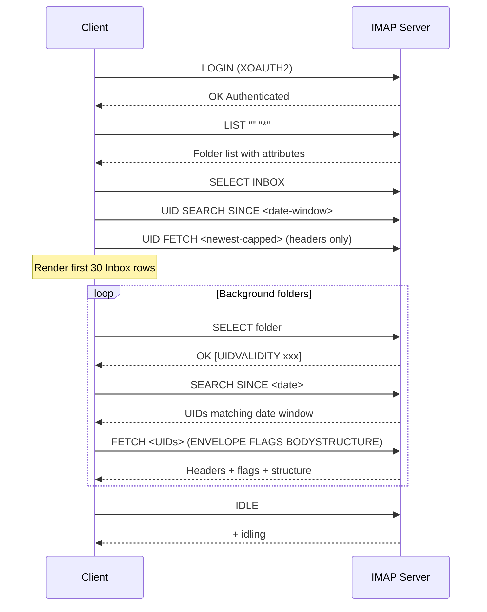
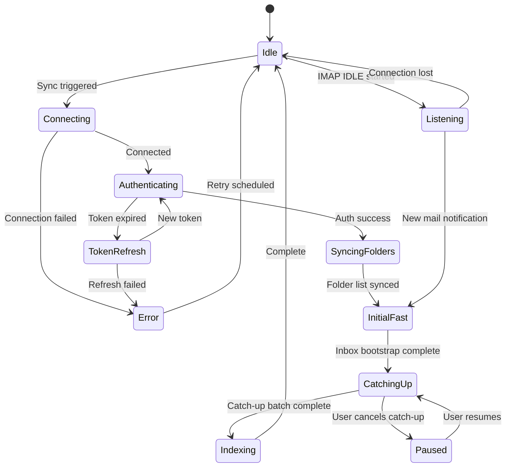

# Specification: Email Sync

> The key words **MUST**, **MUST NOT**, **REQUIRED**, **SHALL**, **SHALL NOT**, **SHOULD**, **SHOULD NOT**, **RECOMMENDED**, **MAY**, and **OPTIONAL** in this document are to be interpreted as described in [RFC 2119](https://www.ietf.org/rfc/rfc2119.txt).

## 1. Summary

This specification defines email synchronization via IMAP, email sending via SMTP, the offline send queue, thread grouping algorithm, bidirectional flag sync, attachment handling, connection management, and conflict resolution. It is the data engine that powers all email features.

---

## 2. Goals and Non-Goals

### Goals

- **G-01**: Reliable full and incremental sync via IMAP
- **G-02**: Real-time updates via IMAP IDLE
- **G-03**: Robust thread grouping from RFC headers
- **G-04**: Offline send queue with retry logic
- **G-05**: Bidirectional flag sync (read, starred)

### Non-Goals

- **NG-01**: Push notifications via APNs (deferred; Constitution P-02 prohibits third-party push services)
- **NG-02**: Non-Gmail IMAP providers (V2)

---

## 3. Functional Requirements

### FR-SYNC-01: Initial Bootstrap Sync and Full Catch-Up

**Description**

On first account setup, the client **MUST** run a staged bootstrap sync optimized for fast first paint, then continue full catch-up in background:

1. **Folder discovery**: List all IMAP folders via `LIST "" "*"` and map Gmail special-use attributes to `FolderType` (see Foundation Section 5.3):
   - `\Inbox` → `inbox`
   - `\Sent` → `sent`
   - `\Drafts` → `drafts`
   - `\Trash` → `trash`
   - `\Junk` (Gmail Spam) → `spam`
   - `\All` (`[Gmail]/All Mail`) → **MUST NOT** be synced (redundant; contains all emails already in other folders)
   - `\Flagged` (`[Gmail]/Starred`) → `starred`
   - `\Important` → **MUST NOT** be synced as a folder; importance is a flag, not a mailbox
   - User-created Gmail labels → `custom`

   > **Note — Archive is virtual:** Gmail has no dedicated `[Gmail]/Archive` IMAP folder. "Archiving" in Gmail removes the `\Inbox` label, leaving the email only in `[Gmail]/All Mail`. Since All Mail is not synced (see above), the local "Archive" view is a virtual query: emails that were explicitly archived by the user are tracked via removal of their source-folder `EmailFolder` association. See FR-SYNC-10 Archive Behavior for details.

2. **Stage B (Inbox bootstrap, blocking for first render)**: Fetch the newest Inbox headers first and render the thread list as soon as the first page is available.
   - First-render target: **30 Inbox headers**.
   - This stage **MUST** be headers-only (no body prefetch).
   - The UI **MUST NOT** wait for other folders before becoming interactive.

3. **Stage C (priority folders, non-blocking)**: Fetch recent headers for remaining folders in background using a capped budget allocator.
   - Default account bootstrap cap: **500 headers** (background budget, not render gate).
   - Default split: Inbox 60%, Sent 20%, Others 20%.
   - Minimum floor: **20 headers** per enabled priority folder to avoid starvation when cap allows.

4. **Stage D (historical catch-up, non-blocking)**: Continue fetching older messages in background until the configured sync window is covered.
   - Catch-up **MUST** be pausable and resumable.
   - Catch-up cancellation **MUST** keep persisted progress (no rollback of completed batches).

5. **On-scroll older-mail paging**: If the user scrolls beyond locally available messages, the client **MUST** fetch older headers on demand from the server and append them immediately (without waiting for background catch-up completion).
   - Local pagination **MUST** be attempted first from persisted storage.
   - When local pagination is exhausted (`hasMorePages == false`) in a single-account folder view, the client **MUST** trigger backward catch-up paging (`syncFolder(..., options: .catchUp)`).
   - The client **MUST** continue paging until a server-history boundary or sync-window boundary is reached.
   - **Context guards**: Catch-up paging **MUST NOT** run and **MUST** return no-op in:
     - Unified inbox mode (`selectedAccount == nil`)
     - Outbox or other non-syncable/virtual folders
     - Active search mode
   - **UI state reset contract**: When account, folder, or category scope changes, pagination UI state **MUST** reset:
     - `reachedServerHistoryBoundary = false`
     - `syncStatusText = nil`
     - `paginationError = false`
   - **Pagination sentinel visibility**: The load-more sentinel **MUST** be shown when either:
     - `hasMorePages == true`, or
     - Single-account folder context with `reachedServerHistoryBoundary == false`

6. **Cross-folder deduplication**: Before creating a new `Email` entity, the client **MUST** check for an existing email identity in this order:
   - Primary key: `messageId` (RFC 2822 Message-ID) within the same account.
   - Fallback canonical key for missing/duplicate Message-ID edge cases (normalized header hash).
   If a match is found, the client **MUST** create only a new `EmailFolder` association linking the existing email to the current folder (and update flags if they differ). If no match is found, the client **MUST** create a new `Email` entity and its `EmailFolder` association.

7. **Body format handling**: For each email selected for body hydration (detail open, explicit prefetch, or background hydration policy), use `FETCH BODYSTRUCTURE` to determine MIME structure:
   - **MUST** fetch and persist `text/plain` when available → store in `Email.bodyPlain`
   - **MUST** fetch and persist `text/html` when available → store in `Email.bodyHTML`
   - If only one format is available, the other field **MUST** be `nil`
   - Inline images within HTML bodies are **not** downloaded during sync (deferred to V2)
   - Maximum email body size: 10 MB. Bodies exceeding this limit **MUST** be truncated with a "message too large" indicator

8. **Attachment metadata**: During header sync, extract attachment metadata (filename, mimeType, sizeBytes) from `BODYSTRUCTURE` and persist as `Attachment` entities with `isDownloaded = false`. Content is not downloaded during sync (see FR-SYNC-08).

**Sync Sequence**

**Error Handling**

- If a folder fails to sync, the client **MUST** log the error, skip the folder, and continue with remaining folders. The failed folder **MUST** be retried on the next sync cycle.
- If the sync is interrupted (app killed, crash, network loss), partial progress **MUST** be preserved. See FR-SYNC-02 for checkpoint behavior.
- Network timeout during fetch **MUST** trigger a retry per FR-SYNC-09 connection management policy.

### FR-SYNC-02: Dual-Direction Incremental and Catch-Up Sync

**Description**

The client **MUST** support two explicit sync directions: forward incremental sync for new arrivals and backward catch-up sync for historical mail.

**Change Detection**

1. **Forward incremental (new messages)**: `UID FETCH <forwardCursorUID+1>:*` to find messages with UIDs greater than the highest persisted forward cursor.
2. **Flag updates**: Compare server flags for known UIDs with local state. Use `FETCH <known-UIDs> (FLAGS)` to detect read/starred changes made on other clients.
3. **Deletions**: Use `SEARCH ALL` or `UID SEARCH ALL` and compare with local UID set. UIDs present locally but absent on server are deleted locally.
4. **Backward catch-up (historical)**: Fetch messages older than the persisted backfill boundary (`backfillCursorUID`) in deterministic pages to continue history loading.
5. **UIDVALIDITY changes**: If `UIDVALIDITY` returned by `SELECT` differs from stored `Folder.uidValidity`, the client **MUST** reset both cursors for that folder and restart folder bootstrap.

**Sync State Tracking**

- The client **MUST** track per folder:
  - `forwardCursorUID`: highest UID successfully persisted for forward incremental sync.
  - `backfillCursorUID`: oldest UID boundary successfully persisted for backward catch-up.
  - `UIDVALIDITY` (stored in `Folder.uidValidity`).
- Both cursors **MUST** be updated progressively after each committed batch, not only at sync completion.
- The IMAP UID for each email within each folder is stored in `EmailFolder.imapUID` (see Foundation Section 5.4).

**Catch-Up Paging State**

- Backward catch-up paging **MUST** keep `backfillCursorUID` monotonic toward older ranges as batches commit.
- Exhausted catch-up (no new emails returned) **MUST** set a local "history boundary reached" state so repeated scroll events do not trigger redundant network fetches until scope changes.
- On account/folder/category scope changes, the client **MUST** reset catch-up paging UI state (`reachedServerHistoryBoundary`, `syncStatusText`, `paginationError`) before evaluating further paging/cursor transitions.

**Error Handling**

- If forward incremental fails mid-way, the client **MUST** resume from `forwardCursorUID`.
- If catch-up fails mid-way, the client **MUST** resume from `backfillCursorUID`.
- If a single email fails to fetch, the client **MUST** skip it and continue; failed emails **MUST** be retried on the next sync cycle.

### FR-SYNC-03: Real-Time Updates

**Description**

The client **MUST** use IMAP IDLE (RFC 2177) to receive real-time email notifications when the app is in the foreground.

**IMAP IDLE Behavior**

- IDLE **MUST** monitor the INBOX folder only (IMAP IDLE operates on a single selected mailbox).
- The client **MUST** maintain a single IDLE connection per active account.
- When the server sends an `EXISTS` response (new message), the client **MUST** break IDLE and trigger an incremental sync of the INBOX.
- Gmail drops IDLE connections after approximately 29 minutes. The client **MUST** re-issue the IDLE command every 25 minutes to maintain the connection.
- If the IDLE connection drops unexpectedly, the client **MUST** re-establish it automatically with backoff per FR-SYNC-09.
- IDLE-triggered incremental sync and catch-up sync **MUST NOT** mutate the same folder concurrently. A per-folder single-writer lock (or equivalent serialized queue) **MUST** enforce this.

**Background Sync (iOS)**

- The client **SHOULD** register a `BGAppRefreshTask` for periodic email sync.
- Background sync **MUST** be limited to headers-only fetch within a 30-second time budget.
- Background sync **MUST NOT** perform initial full sync — only incremental sync for already-configured accounts.

**Background Sync (macOS)**

- IMAP IDLE **MAY** remain active while the app window is open (macOS does not restrict background network connections for foreground apps).

**Error Handling**

- IDLE connection failures **MUST** be retried per FR-SYNC-09 connection management policy.
- Background task timeout **MUST** gracefully save any partially fetched headers and terminate without error.

### FR-SYNC-04: Sync State Machine

The sync engine **MUST** implement the following state machine:

**Token Refresh**

When authentication fails due to an expired token, the sync engine **MUST** transition to the `TokenRefresh` state. Token refresh behavior is defined by Account Management FR-ACCT-04:

- In-flight sync operations **MUST** be paused (not discarded) during re-authentication.
- On successful refresh, the sync **MUST** resume from the `Authenticating` state with the new token.
- On refresh failure (max retries exceeded), the account **MUST** be deactivated (`isActive = false`) and the sync **MUST** transition to `Error`.

**Indexing**

The `Indexing` state performs text extraction for search:

- The client **MUST** populate `SearchIndex.content` with the plain-text content of each newly synced email (from `Email.bodyPlain`, or HTML-stripped `Email.bodyHTML` if plain text is unavailable).
- Embedding generation (for semantic search) is deferred to the AI Features specification and is **not** part of this state.
- Indexing failure **MUST NOT** block sync completion — if indexing fails for individual emails, the sync **MUST** still transition to `Idle` and the failed index entries **SHOULD** be retried asynchronously.

### FR-SYNC-05: Conflict Resolution

**Description**

- Server state is authoritative for email metadata (read status, flags, folder membership).
- Local drafts and queued sends are authoritative locally until confirmed by the server.
- If a local flag sync action (mark read, star, delete) fails to sync to the server, the client **MUST** retry up to 3 times with exponential backoff (5s, 15s, 45s), then surface the error to the user and revert the local state to match the server.

### FR-SYNC-06: Threading Algorithm

The client **MUST** group emails into conversation threads locally using the following algorithm. This is the canonical threading logic — it does not rely on any provider-specific thread IDs.

**Step 1: Header Extraction**

For each synced email, extract:
- `Message-ID` — unique identifier for this email
- `In-Reply-To` — the `Message-ID` of the direct parent message
- `References` — ordered list of `Message-ID`s representing the full ancestry chain

**Dedup Identity Requirement**

Before threading, email identity **MUST** be resolved using the FR-SYNC-01 dedup hierarchy:
1. `messageId` when valid.
2. Canonical fallback key when `messageId` is missing or unreliable.
This prevents false merges/splits in providers or messages with malformed headers.

**Step 2: Reference Graph Construction**

Build a directed graph where each `Message-ID` is a node. Edges represent "is parent of" relationships, derived from:
- `In-Reply-To` → link the referenced message (parent) to this message (child)
- `References` → link each ancestor to the next in the chain

**Step 3: Thread Grouping by Reference Chain**

All messages that share **any** `Message-ID` in their reference chains are grouped into the same thread. This is computed as connected components in the reference graph.

**Step 4: Subject-Based Fallback**

For messages with **no** `References` and **no** `In-Reply-To` headers (common in forwarded emails, some mailing lists, or broken clients):

1. Normalize the subject: case-insensitively strip reply/forward prefixes (`Re:`, `Fwd:`, `RE:`, `FW:`, `Fw:`, etc.) recursively, then trim leading/trailing whitespace.
2. Match against existing threads by exact normalized subject within the **same account**.
3. Subject-only grouping **MUST** be restricted to messages within a **30-day window** of each other to prevent false merges across unrelated conversations with the same subject.

**Step 5: Thread Metadata Computation**

For each thread, compute:
- `latestDate` — the most recent `dateSent` or `dateReceived` across all messages
- `messageCount` — total number of messages
- `unreadCount` — count of messages where `isRead == false`
- `participants` — deduplicated list of all From addresses
- `snippet` — first ~100 characters of the latest message's `bodyPlain` (or HTML-stripped `bodyHTML` if plain text is unavailable). If the latest message has no body, use the subject.
- `subject` — subject of the root (earliest) message

**Gmail Mismatch Handling**

Gmail's internal threading algorithm may produce different groupings than this RFC-based algorithm. The client's local threading is authoritative. Differences between Gmail's web UI thread view and this client's thread view are expected and acceptable. The client **MUST NOT** attempt to replicate Gmail's proprietary threading logic.

**Limitations (V1)**

- Thread splitting is **not** supported. Users cannot manually separate a thread into two.
- Thread merging is **not** supported. Users cannot manually combine two threads.
- These are deferred to V2.

### FR-SYNC-07: Email Sending via SMTP

**Description**

- The client **MUST** send email via SMTP with XOAUTH2 authentication (see Account Management spec for XOAUTH2 formatting).
- The client **MUST** connect to `smtp.gmail.com` on port 465 (implicit TLS) or port 587 (STARTTLS).
- The client **MUST** construct valid MIME messages with appropriate headers (From, To, CC, BCC, Subject, Date, Message-ID, Content-Type).
- The client **MUST** move sent messages to the Sent folder via IMAP APPEND after successful SMTP delivery.
- The client **MUST** display clear error messages if sending fails.

**Offline Send Queue**

When the device is offline, the client **MUST** queue emails for sending:

1. **Queue entry**: The email is persisted in SwiftData with `sendState = .queued` and a `queuedDate` timestamp.
2. **Display**: Queued emails **MUST** appear in a virtual "Outbox" view. The Outbox is **not** an IMAP folder — it is a filtered view of emails where `sendState ∈ {queued, sending, failed}`.
3. **Send attempt**: When connectivity is restored, the client **MUST** attempt to send queued emails in FIFO order.
4. **Retry policy**: If sending fails, the client **MUST** retry up to 3 times with exponential backoff (30 seconds, 2 minutes, 8 minutes). After 3 failures, set `sendState = .failed` and surface the error.
5. **Max queue age**: Queued emails older than 24 hours **MUST** be automatically moved to `sendState = .failed` with a "send timeout" error.
6. **User actions on failed**: The user **MAY** retry (re-queue) or discard (delete from SwiftData entirely) a failed email.

**Error Handling**

- SMTP authentication failure **MUST** trigger token refresh per Account Management FR-ACCT-04.
- SMTP server rejection (e.g., recipient not found) **MUST NOT** be retried — set `sendState = .failed` immediately with the server error message.
- Network errors **MUST** follow the retry policy above.

### FR-SYNC-08: Attachment Handling

**Description**

- Attachment metadata (filename, mimeType, sizeBytes) **MUST** be extracted from `BODYSTRUCTURE` during header sync and stored as `Attachment` entities with `isDownloaded = false`.
- Attachment content **MUST** be downloaded lazily — only when the user taps to view or save the attachment.
- Downloaded attachment content **MUST** be stored at `Attachment.localPath` with `isDownloaded = true`.
- The client **MUST** enforce the Constitution TC-06 attachment cache limit: 500 MB per account with LRU eviction. When the cache exceeds 500 MB, the least recently accessed attachments **MUST** have their local content deleted (reset `isDownloaded = false`, clear `localPath`).
- Attachments larger than 25 MB (Gmail's attachment limit) **MUST** display a warning before download on cellular networks.

**Error Handling**

- Attachment download failure **MUST** be retried up to 3 times with exponential backoff.
- If download fails after retries, the user **MUST** see an error with a "Retry" option.

### FR-SYNC-09: Connection Management

**Description**

- IMAP connections **MUST** use TLS on port 993 (implicit TLS to `imap.gmail.com`).
- SMTP connections **MUST** use TLS on port 465 (implicit TLS) or STARTTLS on port 587 (to `smtp.gmail.com`).
- Connection timeout: 30 seconds. If a connection is not established within 30 seconds, it **MUST** be considered failed.
- Connection retry policy: 3 retries with exponential backoff (5 seconds, 15 seconds, 45 seconds). After 3 failures, transition to `Error` state and surface to user.
- Maximum concurrent IMAP connections per account: 5 (Gmail's limit).
- IMAP IDLE refresh interval: 25 minutes (Gmail drops IDLE connections after ~29 minutes).
- The client **MUST** implement connection pooling to reuse IMAP connections across sync operations within the same account.

**Error Handling**

- Connection pool exhaustion **MUST** queue operations until a connection becomes available, not open additional connections beyond the limit.
- Unexpected connection drops during sync **MUST** trigger automatic reconnection with the retry policy above.

### FR-SYNC-10: Flag Synchronization

**Description**

Bidirectional synchronization of email flags between local state and the IMAP server.

**Local → Server (push)**

- When the user marks an email as read locally, the client **MUST** execute `STORE +FLAGS (\Seen)` on the IMAP server.
- When the user marks as unread, the client **MUST** execute `STORE -FLAGS (\Seen)`.
- When the user stars an email, the client **MUST** execute `STORE +FLAGS (\Flagged)`.
- When the user unstars, the client **MUST** execute `STORE -FLAGS (\Flagged)`.
- Flag changes **MUST** be applied optimistically (update local state immediately) and synced to server asynchronously.
- If server sync fails, follow FR-SYNC-05 conflict resolution (3 retries, then revert).

**Server → Local (pull)**

- During incremental sync, the client **MUST** fetch current flags for known UIDs: `FETCH <UIDs> (FLAGS)`.
- If server flags differ from local flags, the server state **MUST** be applied locally (server is authoritative per FR-SYNC-05).

**Archive Behavior**

- Archive **MUST** be implemented as IMAP `COPY` to `[Gmail]/All Mail` followed by `STORE +FLAGS (\Deleted)` and `EXPUNGE` from the source folder.
- **Local state after archive**: The client **MUST** delete the `EmailFolder` association linking the email to the source folder. Since `[Gmail]/All Mail` is not synced, the email will have no remaining synced-folder associations. The email entity **MUST** be retained locally (not deleted) so it remains available in the conversation thread and search index. An "Archive" view **MUST** display emails that have been archived (i.e., emails with no remaining synced-folder associations that were not deleted or trashed).
- Delete **MUST** move to Trash via IMAP `COPY` to `[Gmail]/Trash` followed by `STORE +FLAGS (\Deleted)` and `EXPUNGE` from the source folder. If already in Trash, delete permanently via `STORE +FLAGS (\Deleted)` and `EXPUNGE`.

**Error Handling**

- Flag sync errors follow FR-SYNC-05 conflict resolution policy.

---

## 4. Non-Functional Requirements

### NFR-SYNC-01: Incremental Sync Speed

- **Metric**: Time from foreground to updated thread list (10 new emails)
- **Target**: < 5 seconds
- **Hard Limit**: 10 seconds

### NFR-SYNC-02: Initial Sync Speed

- **Metric**: Time from account setup completion to initial-window catch-up completion (1000 emails persisted, Wi-Fi)
- **Target**: < 60 seconds
- **Hard Limit**: 120 seconds
- **Interpretation**: This is a **background completion metric** (data completeness), not a first-render metric.

### NFR-SYNC-06: Time to First Inbox

- **Metric**: Time from account setup completion to first Inbox rows visible
- **Target**: < 3 seconds (P50), < 8 seconds (P95)
- **Hard Limit**: 10 seconds

### NFR-SYNC-03: Send Email Time

- **Metric**: Time from send tap to SMTP delivery confirmation
- **Target**: < 3 seconds
- **Hard Limit**: 5 seconds
- **Derived from**: Foundation NFR-PERF-06

### NFR-SYNC-04: Memory During Sync

- **Metric**: Peak memory consumption above baseline during sync operations
- **Target**: ≤ 150 MB above baseline
- **Hard Limit**: 200 MB above baseline

### NFR-SYNC-05: Connection Security

- **Metric**: TLS protocol version and certificate validation
- **Target**: TLS 1.2 or higher for all IMAP and SMTP connections
- **Hard Limit**: Connections using TLS < 1.2 **MUST** be rejected
- Certificate validation **MUST** be enforced; self-signed certificates **MUST** be rejected
- Derived from: Foundation NFR-SEC-01, Constitution P-01

---

## 5. Data Model

Refer to Foundation spec Section 5 for Email, Folder, EmailFolder, Thread, and Attachment entities. This feature reads/writes all of them plus manages sync state metadata:

- `Folder.uidValidity` — per-folder UIDVALIDITY (Foundation Section 5.4)
- `Folder.forwardCursorUID` — highest persisted UID for forward incremental sync
- `Folder.backfillCursorUID` — oldest persisted UID boundary for catch-up sync
- `Folder.initialFastCompleted` — whether first-render bootstrap is complete
- `Folder.catchUpStatus` — `idle|running|paused|completed|error`
- `Folder.lastSyncDate` — timestamp of last successful sync
- `EmailFolder.imapUID` — per-folder IMAP UID for each email (Foundation Section 5.4)
- `Email.messageId`, `Email.inReplyTo`, `Email.references` — threading headers (Foundation Section 5.1)
- `Email.sendState` — send queue state tracking (Foundation Section 5.5)
- `Attachment.isDownloaded`, `Attachment.localPath` — lazy download tracking
- `SearchIndex.content` — plain-text search index populated during Indexing state

---

## 6. Architecture Overview

Refer to Foundation spec Section 6. This feature uses:
- `SyncEmailsUseCase`, `FetchThreadsUseCase`, `ComposeEmailUseCase` → `EmailRepositoryProtocol` → `EmailRepositoryImpl`
- `EmailRepositoryImpl` → `IMAPClient` + `SMTPClient` + `SwiftDataStore`
- `IMAPClient` manages connection pooling, IDLE, and all IMAP protocol operations
- `SMTPClient` manages SMTP connections and MIME message construction
- `SyncEmailsUseCase` orchestrates the state machine (FR-SYNC-04) and coordinates IMAP operations

---

## 7. Platform-Specific Considerations

### iOS
- Background app refresh via `BGAppRefreshTask` for periodic incremental sync (headers-only, 30s budget).
- IMAP IDLE active only while app is foregrounded. When app enters background, IDLE is terminated gracefully.
- Initial sync **MUST NOT** be performed in background — only foreground.

### macOS
- IMAP IDLE **MAY** remain active while the app window is open (macOS does not restrict background network for foreground apps).
- No background task budget limitations — full incremental sync may run when triggered by a timer.

---

## 8. Alternatives Considered

| Alternative | Pros | Cons | Rejected Because |
|-------------|------|------|-----------------|
| Gmail REST API | Push notifications, labels API | Proprietary, requires API key | Violates P-02, locks to Gmail |
| POP3 | Simpler protocol | No folders, no flags, no push | Missing essential features |
| Gmail thread IDs | Pre-computed threads | Proprietary, IMAP-incompatible | IMAP headers provide equivalent grouping |

---

## 9. Open Questions

| # | Question | Owner | Target Date |
|---|----------|-------|-------------|
| — | None — all resolved | — | — |

---

## 10. Revision History

| Version | Date | Author | Change Summary |
|---------|------|--------|---------------|
| 1.0.0 | 2025-02-07 | Core Team | Extracted from monolithic spec v1.2.0 sections 5.2 and 5.5.2 (send behavior). Threading algorithm from v1.2.0 section 5.2.4. |
| 1.1.0 | 2026-02-07 | Core Team | Review round 1: Added G-XX/NG-XX IDs. Added FR-SYNC-08 (Attachments), FR-SYNC-09 (Connection Management), FR-SYNC-10 (Flag Sync). Expanded FR-SYNC-01 with folder discovery, body format handling, sync sequence diagram, sync window cross-ref. Expanded FR-SYNC-02 with progressive checkpointing, change detection details. Expanded FR-SYNC-03 with IDLE behavior, background refresh details. Expanded FR-SYNC-04 with token refresh cross-ref and Indexing definition. Inlined send queue lifecycle into FR-SYNC-07 (removed Proposal reference). Defined virtual Outbox. Added error handling to all FRs. Added NFR-SYNC-03 (Send Time), NFR-SYNC-04 (Memory), NFR-SYNC-05 (Security). Set NFR-SYNC-01 hard limit to 10s. Resolved all ambiguities. Status → locked. |
| 1.2.0 | 2026-02-07 | Core Team | Post-lock compliance fixes: PL-01 — aligned Foundation spec to 24h queue age (Foundation v1.4.0). PL-02 — fixed `\Jstrash` typo → `\Junk` (RFC 6154). PL-03 — removed non-existent `[Gmail]/Archive` folder mapping; added virtual archive explanation and local state handling for archive operations. PL-04 — added explicit cross-folder deduplication strategy using `messageId`. |
| 1.3.0 | 2026-02-27 | Core Team | First-login UX and checkpoint redesign: staged bootstrap sync (first 30 Inbox headers as render gate), non-blocking background catch-up budget, on-scroll older-mail paging, dual cursors (`forwardCursorUID` + `backfillCursorUID`), catch-up pause/resume semantics, IDLE-vs-catch-up single-writer coordination, and dedup fallback canonical key for missing/duplicate Message-ID edge cases. |
