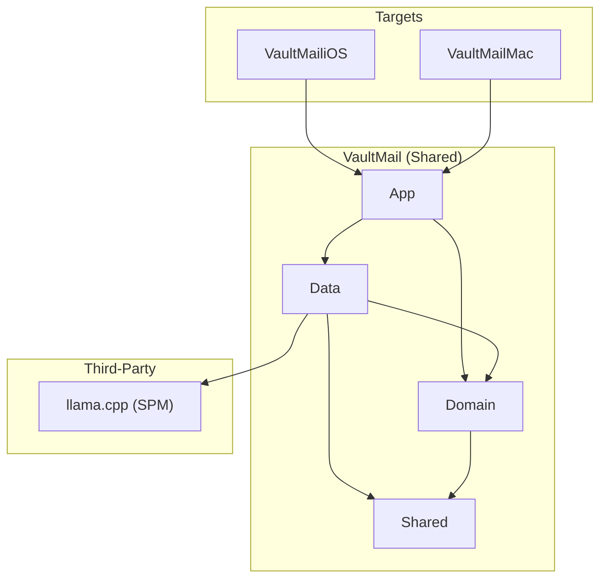
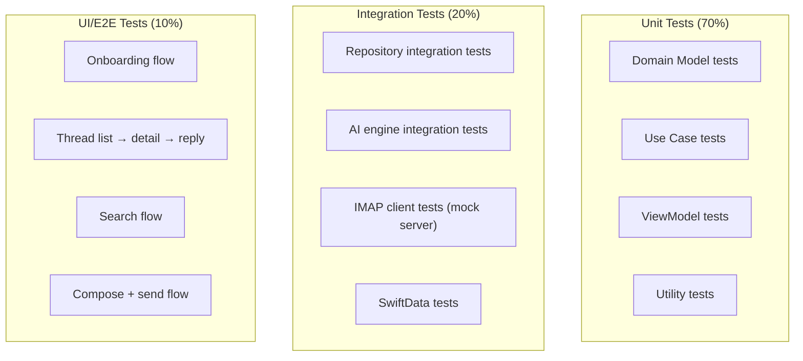

# Foundation — iOS/macOS Implementation Plan

> The key words **MUST**, **MUST NOT**, **REQUIRED**, **SHALL**, **SHALL NOT**, **SHOULD**, **SHOULD NOT**, **RECOMMENDED**, **MAY**, and **OPTIONAL** in this document are to be interpreted as described in [RFC 2119](https://www.ietf.org/rfc/rfc2119.txt).

---

## 1. Scope

This plan covers the foundational infrastructure for the privacy-first email client: Xcode project scaffolding, SwiftData model definitions, shared architecture setup, test strategy, and third-party dependency integration.

---

## 2. Platform Context

| Dependency | Version | Purpose |
|-----------|---------|---------|
| iOS | 17.0+ | Minimum deployment target |
| macOS | 14.0+ (Sonoma) | Minimum deployment target |
| Swift | 5.9+ | Language |
| SwiftUI | 5.0+ | UI framework |
| SwiftData | 1.0+ | Persistence |
| Xcode | 15.0+ | Build toolchain |

### Device Targets

| Device | Minimum |
|--------|---------|
| iPhone | iPhone SE 3rd gen (A15, 4GB RAM) |
| Mac | Any Apple Silicon Mac (M1+, 8GB RAM) |

### Platform Guidelines

- iOS: Apple Human Interface Guidelines (iOS 17)
- macOS: Apple Human Interface Guidelines (macOS 14)
- Accessibility: WCAG 2.1 AA, VoiceOver, Dynamic Type

---

## 3. Architecture Mapping

### 3.1 Project Structure

```
VaultMail/
├── VaultMail.xcodeproj
├── VaultMail/                      # Shared code
│   ├── App/
│   │   ├── VaultMailApp.swift
│   │   └── AppState.swift
│   ├── Domain/
│   │   ├── Models/
│   │   │   ├── Account.swift
│   │   │   ├── Folder.swift
│   │   │   ├── Email.swift
│   │   │   ├── Thread.swift
│   │   │   ├── Attachment.swift
│   │   │   ├── AICategory.swift
│   │   │   └── SearchResult.swift
│   │   ├── UseCases/
│   │   └── Protocols/
│   │       ├── EmailRepository.swift
│   │       ├── AccountRepository.swift
│   │       ├── AIRepository.swift
│   │       └── SearchRepository.swift
│   ├── Data/
│   │   ├── Persistence/
│   │   ├── Network/
│   │   ├── AI/
│   │   ├── Search/
│   │   ├── Keychain/
│   │   └── Repositories/
│   └── Shared/
│       ├── Extensions/
│       ├── Utilities/
│       └── Constants.swift
├── VaultMailiOS/
├── VaultMailMac/
└── Tests/
    ├── DomainTests/
    ├── DataTests/
    ├── ViewModelTests/
    └── IntegrationTests/
```

### 3.2 Module Dependency Graph



### 3.3 Shared Component Strategy

| Component | Shared? | Notes |
|-----------|---------|-------|
| ViewModels | Yes | All ViewModels shared between iOS and macOS |
| Domain Models | Yes | Identical across platforms |
| Use Cases | Yes | Identical across platforms |
| Data Layer | Yes | Identical across platforms |
| SwiftUI Views | Partial | Simple components shared; complex layouts platform-specific |
| Navigation | No | iOS uses NavigationStack; macOS uses NavigationSplitView |

---

## 4. Implementation Phases

| Task ID | Description | Dependencies |
|---------|-------------|-------------|
| IOS-F-01 | Xcode project setup with iOS + macOS targets | — |
| IOS-F-02 | SwiftData model definitions (all entities) | IOS-F-01 |

---

## 5. Testing Strategy

### 5.1 Test Pyramid



### 5.2 Test Targets

| Target | What It Tests | Tools |
|--------|--------------|-------|
| `DomainTests` | Models, use cases, protocols | XCTest |
| `DataTests` | Repositories, SwiftData, Keychain, IMAP/SMTP (mocked) | XCTest, mock servers |
| `ViewModelTests` | ViewModel logic with mocked use cases | XCTest |
| `IntegrationTests` | End-to-end repository flows with real SwiftData | XCTest |
| `UITests` | Critical user flows | XCUITest |

### 5.3 Device Testing Matrix

| Device | OS | Purpose |
|--------|-----|---------|
| iPhone SE 3rd gen | iOS 17 | Minimum spec, small screen |
| iPhone 15 Pro | iOS 17 | Performance baseline |
| MacBook Air M1 | macOS 14 | Minimum Mac spec |
| MacBook Pro M3 | macOS 14 | Performance baseline |

---

## 6. Third-Party Dependencies

| Dependency | Purpose | License | Integration |
|-----------|---------|---------|-------------|
| llama.cpp | LLM inference engine | MIT | SPM |

All other functionality uses Apple-provided frameworks (SwiftUI, SwiftData, Security, Network, WebKit for HTML rendering).

**IMAP/SMTP client**: Evaluate building a thin Swift wrapper around Network.framework vs. using an existing Swift IMAP library. Decision to be made during Task IOS-F-05 (in email-sync feature).

---

## 7. Risks and Mitigations

| Risk | Likelihood | Impact | Mitigation |
|------|-----------|--------|------------|
| SwiftData performance with large datasets | Medium | Medium | Profile early with 50K+ email dataset; fallback to raw SQLite for search index if needed |
| Cross-platform code sharing friction | Low | Medium | Define shared vs. platform-specific boundaries early; use #if os() sparingly |
