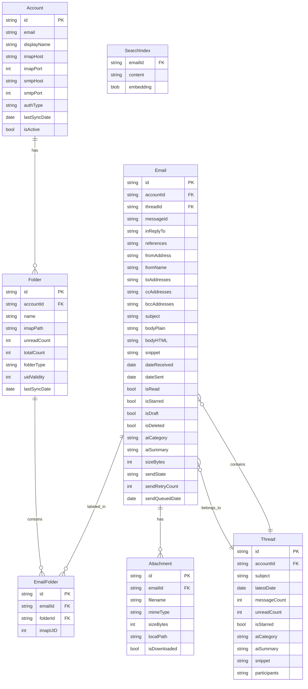

# Specification: Foundation

> The key words **MUST**, **MUST NOT**, **REQUIRED**, **SHALL**, **SHALL NOT**, **SHOULD**, **SHOULD NOT**, **RECOMMENDED**, **MAY**, and **OPTIONAL** in this document are to be interpreted as described in RFC 2119.

## 1. Summary

This specification defines the shared architectural foundation for the privacy-first email client: the data model, architectural layers, security baseline, storage management, legal compliance, and performance requirements. All feature-specific specs depend on this document for cross-cutting concerns.

---

## 2. Goals and Non-Goals

### Goals

- **G-01**: The client **MUST** provide full email functionality (read, compose, reply, forward, delete, archive) via IMAP/SMTP.
- **G-02**: The client **MUST** support multiple Gmail accounts simultaneously.
- **G-03**: The client **MUST** display emails in a threaded conversation view.
- **G-04**: The client **MUST** provide AI-powered email categorization, smart reply suggestions, and thread summarization using a local LLM.
- **G-05**: The client **MUST** provide AI-powered semantic search across synced emails.
- **G-06**: The client **MUST** run on both iOS and macOS as a native application.
- **G-07**: The client **MUST NOT** transmit any user data to servers other than the user's email provider.
- **G-08**: The client **MUST** support offline access for previously synced emails.

### Non-Goals (V1)

- **NG-01**: Support for email providers other than Gmail (deferred to V2).
- **NG-02**: Calendar or contacts integration.
- **NG-03**: Email encryption (S/MIME, PGP) beyond transport-level TLS.
- **NG-04**: Rich text / HTML email composition (V1 supports plain text and basic formatting).
- **NG-05**: Shared mailboxes or delegation.
- **NG-06**: Email rules / filters automation.
- **NG-07**: Widgets or app extensions.

---

## 3. Functional Requirements

### FR-FOUND-01: Clean Architecture Layering

- The application **MUST** follow a three-layer architecture: Presentation → Domain → Data.
- The Domain layer **MUST NOT** depend on the Data layer or Presentation layer directly.
- Dependencies **MUST** be inverted via repository protocols defined in the Domain layer and implemented in the Data layer.

### FR-FOUND-02: Cross-Platform Code Sharing

- Domain models, use cases, and repository protocols **MUST** be shared across iOS and macOS targets.
- Platform-specific code (navigation, layout) **MUST** be isolated in platform-specific targets.

### FR-FOUND-03: Data Model Cascade Deletes

- Deleting an Account **MUST** cascade delete all associated Folders, EmailFolder associations, Emails, Threads, Attachments, and SearchIndex entries.
- Deleting a Folder **MUST** remove all EmailFolder associations for that folder. If removing a folder association leaves an Email with no remaining associations and the removed folder is not Trash, the Email **MUST** be moved to the archive folder (All Mail for Gmail). If the removed folder is Trash and no other associations remain, the Email **MUST** be permanently deleted.
- Deleting an Email **MUST** cascade delete all associated EmailFolder associations and Attachments.

---

## 4. Non-Functional Requirements

### NFR-PERF-01: Cold Start Time

- **Metric**: Time from app launch to interactive thread list
- **Target**: < 1.5 seconds
- **Hard Limit**: 3 seconds on minimum-spec devices

### NFR-PERF-02: Thread List Scroll Performance

- **Metric**: Scroll frame rate with 500+ threads
- **Target**: 60 fps
- **Hard Limit**: 30 fps

### NFR-PERF-03: Email Open Time

- **Metric**: Time from tap to content visible (cached email)
- **Target**: < 300ms
- **Hard Limit**: 500ms

### NFR-PERF-04: Memory Usage (Idle)

- **Metric**: Memory footprint with app in foreground, no active operation
- **Target**: < 100MB
- **Hard Limit**: 200MB

### NFR-PERF-05: Initial Sync Time

- **Metric**: Time from account setup to thread list displaying (1000 emails, Wi-Fi)
- **Target**: < 60 seconds
- **Hard Limit**: 120 seconds

### NFR-PERF-06: Send Email Time

- **Metric**: Time from send tap to SMTP completion (after undo delay)
- **Target**: < 3 seconds
- **Hard Limit**: 5 seconds

### NFR-SEC-01: TLS Enforcement

- All IMAP connections **MUST** use TLS (port 993).
- All SMTP connections **MUST** use TLS (port 465 or STARTTLS on 587).
- The client **MUST** validate server certificates; certificate pinning **MAY** be implemented.

### NFR-SEC-02: Data at Rest Encryption

- On **iOS**, all email data **MUST** be stored using SwiftData, which inherits iOS Data Protection (encrypted at rest when device is locked).
- On **macOS**, data-at-rest protection relies on FileVault rather than per-file Data Protection classes. The client **SHOULD** recommend FileVault enablement during onboarding.
- The client **SHOULD** support an optional app lock (biometric or passcode) as an additional layer.
- AI models stored locally do not require encryption (they contain no user data), but the client **MUST** allow users to delete downloaded models via Settings.

### NFR-SEC-03: No Third-Party Connections

- The application **MUST NOT** connect to any server other than the user's configured email service provider(s) and the associated OAuth endpoints.
- Zero connections to analytics, crash reporting, or third-party AI services.

### NFR-STOR-01: Mailbox Size Support

- The client **MUST** support up to 50,000 emails per account.
- The client **SHOULD** remain functional with up to 100,000 emails (degraded performance acceptable).
- The client **MUST** display a warning when account storage exceeds 2GB.

### NFR-STOR-02: Total App Storage

- The client **SHOULD** warn the user when total app storage exceeds 5GB.
- The client **MUST** display total app storage usage in Settings.

---

## 5. Data Model

### 5.1 Entity Relationship Diagram

### 5.2 AI Category Enum

| Value | Description |
|-------|------------|
| `primary` | Direct, personal communication |
| `social` | Social network notifications and messages |
| `promotions` | Marketing, deals, offers |
| `updates` | Bills, receipts, statements, confirmations |
| `forums` | Mailing lists, group discussions |
| `uncategorized` | Not yet processed by AI |

> **Smart reply suggestions** are generated on-demand when the user views an email (see AI Features FR-AI-03). They are **not** cached in the data model — each invocation produces fresh suggestions based on the current conversation context. The `aiCategory` and `aiSummary` fields are the only persisted AI outputs.

### 5.3 Folder Type Enum

The `folderType` values are provider-agnostic domain concepts. The IMAP mapping column below shows the **Gmail V1 provider mapping**. Future providers will define their own mappings for these standard folder types.

| Value | Gmail IMAP Mapping (V1) |
|-------|------------------------|
| `inbox` | INBOX |
| `sent` | [Gmail]/Sent Mail |
| `drafts` | [Gmail]/Drafts |
| `trash` | [Gmail]/Trash |
| `spam` | [Gmail]/Spam |
| `archive` | [Gmail]/All Mail |
| `starred` | [Gmail]/Starred |
| `custom` | User-created labels |

### 5.4 IMAP Sync State Fields

- `Folder.uidValidity`: The IMAP UIDVALIDITY value for this folder. If the server's UIDVALIDITY changes, the client **MUST** re-sync the entire folder (see Email Sync spec FR-SYNC-02).
- `EmailFolder.imapUID`: The IMAP UID for this email within this specific folder. UIDs are folder-scoped in IMAP — the same email (by `messageId`) can have different UIDs in different folders.
- These fields are critical for incremental sync correctness and **MUST** be populated during sync.

### 5.5 Send State Enum

| Value | Description |
|-------|------------|
| `none` | Normal received email, not in send pipeline |
| `queued` | Composed and queued for sending (includes undo-send delay period) |
| `sending` | SMTP transmission in progress |
| `failed` | Send failed after retries; user action required |
| `sent` | Successfully delivered via SMTP |

> State machine transitions are defined in the Email Composer spec (FR-COMP-02) and Email Sync spec (FR-SYNC-07).

### 5.6 Multi-Value Field Serialization

Fields storing multiple values use the following formats:

| Field | Entity | Format |
|-------|--------|--------|
| `toAddresses` | Email | JSON array of strings: `["alice@example.com", "bob@example.com"]` |
| `ccAddresses` | Email | JSON array of strings (same as `toAddresses`) |
| `bccAddresses` | Email | JSON array of strings (same as `toAddresses`) |
| `references` | Email | Space-delimited Message-IDs per RFC 2822: `"<id1@host> <id2@host>"` |
| `participants` | Thread | JSON array of objects: `[{"name": "Alice", "email": "alice@example.com"}]` |

---

## 6. Architecture Overview

```mermaid
graph TD
    subgraph Presentation
        TL["Thread List Screen"]
        ED["Email Detail Screen"]
        EC["Email Composer Screen"]
        ST["Settings Screen"]
        OB["Onboarding Screen"]
        AC["Account Management Screen"]
    end

    subgraph Domain
        UC_Sync["SyncEmailsUseCase"]
        UC_Fetch["FetchThreadsUseCase"]
        UC_Send["SendEmailUseCase"]
        UC_Cat["CategorizeEmailUseCase"]
        UC_Reply["SmartReplyUseCase"]
        UC_Sum["SummarizeThreadUseCase"]
        UC_Search["SearchEmailsUseCase"]
        UC_Acct["ManageAccountsUseCase"]
        DM["Domain Models"]
        RP["Repository Protocols"]
    end

    subgraph Data
        ER["EmailRepository"]
        AR["AccountRepository"]
        AIR["AIRepository"]
        SR["SearchRepository"]
        IMAP["IMAP Client"]
        SMTP["SMTP Client"]
        SD["SwiftData Store"]
        LLM["llama.cpp Engine"]
        EMB["Embedding Engine"]
        KC["Keychain Manager"]
    end

    TL --> UC_Fetch
    TL --> UC_Cat
    ED --> UC_Sum
    ED --> UC_Reply
    EC --> UC_Send
    ST --> UC_Acct
    OB --> UC_Acct
    AC --> UC_Acct
    TL --> UC_Search

    UC_Sync --> RP
    UC_Fetch --> RP
    UC_Send --> RP
    UC_Cat --> RP
    UC_Reply --> RP
    UC_Sum --> RP
    UC_Search --> RP
    UC_Acct --> RP

    ER --> RP
    AR --> RP
    AIR --> RP
    SR --> RP

    ER --> IMAP
    ER --> SMTP
    ER --> SD
    AR --> KC
    AR --> SD
    AIR --> LLM
    SR --> EMB
    SR --> SD
```

---

## 7. Platform-Specific Considerations

### 7.1 iOS

- **MUST** follow Apple Human Interface Guidelines.
- **MUST** support iPhone screen sizes (SE to Pro Max).
- **MUST** support both portrait and landscape orientations.
- Layouts **SHOULD** use adaptive sizing patterns (e.g., `NavigationSplitView`) to ease future iPad support, but iPad is not in V1 scope.

### 7.2 macOS

- **MUST** provide a native macOS window with standard menu bar items.
- **MUST** support keyboard shortcuts for common actions (Cmd+N for new email, Cmd+R for reply, Cmd+Delete for delete, Cmd+F for search).
- **MUST** support multiple windows (e.g., compose in a separate window).
- **SHOULD** support a three-pane layout: sidebar (accounts/folders) | thread list | email detail.
- **MUST** support native macOS drag-and-drop for attachments.
- **MUST** support the macOS toolbar and sidebar patterns.

---

## 8. Storage & Data Retention

Refer to Constitution TC-06 for hard limits.

### 8.1 Cache Management

| Cache | Limit | Eviction | User Control |
|-------|-------|----------|-------------|
| Downloaded attachments | 500MB per account | LRU when limit exceeded | Configurable limit in Settings |
| Email bodies | Sync window | Purged when outside window | Via sync window setting |
| AI results (category, summary) | Tied to email lifecycle | Deleted with email | None (automatic) |
| Search embeddings | Tied to email lifecycle | Deleted with email | None (automatic) |
| AI models | No automatic limit | None | Manual delete in Settings |
| Offline send queue | 72h max age per message | Failed after 72h; sent messages removed | User can retry or discard |
| Draft autosaves | Tied to composer lifecycle | Deleted when sent, discarded, or synced to Drafts folder | None (automatic) |

### 8.2 Storage Visibility

- The client **MUST** display per-account storage breakdown in Settings (emails, attachments, search index).
- The client **MUST** display total app storage usage.
- The client **MUST** provide a "Clear Cache" action (removes attachments and regenerable caches, preserves emails and accounts).

### 8.3 Sync Window Retention

- When the sync window is reduced, emails outside the new window **SHOULD** be purged from local storage within 24 hours.
- Purging local data **MUST NOT** delete emails from the IMAP server.
- The client **MUST** inform the user that reducing the sync window will remove local copies of older emails.

---

## 9. Security Considerations

### 9.1 Data in Transit

- All IMAP connections **MUST** use TLS (port 993).
- All SMTP connections **MUST** use TLS (port 465 or STARTTLS on 587).
- The client **MUST** validate server certificates; certificate pinning **MAY** be implemented.

### 9.2 Data at Rest

- On **iOS**, SwiftData inherits iOS Data Protection (encrypted at rest when device is locked).
- On **macOS**, data-at-rest protection relies on FileVault; the client **SHOULD** recommend FileVault enablement during onboarding.
- The client **SHOULD** support an optional app lock (biometric or passcode) as an additional layer.
- AI models stored locally do not require encryption (they contain no user data), but **MUST** be user-deletable via Settings.
- See NFR-SEC-02 for normative requirements.

### 9.3 Data Deletion

- When an account is removed, the client **MUST** delete all associated local data (emails, attachments, search index, sync state, cached AI results).
- Keychain items for the account **MUST** be deleted.
- The client **SHOULD** provide a "wipe all data" option in settings.

---

## 10. Legal & Compliance

### 10.1 AI Model Licensing

- All AI models **MUST** have licenses permitting commercial use and local redistribution.
- Model license details **MUST** be displayed in Settings → About → AI Model Licenses.
- Models **MUST NOT** be bundled in the App Store binary; they **MUST** be downloaded post-install.
- Refer to Constitution LG-01 for the pre-approved model list and license review requirements.

### 10.2 Gmail OAuth Compliance

- The client **MUST** complete Google's OAuth verification process before public release.
- The client **MUST** request only the scope `https://mail.google.com/`. This is the **only** OAuth scope Google provides for IMAP/SMTP access — Google deprecated narrower IMAP-specific scopes. Despite appearing broad, it is the minimum required scope for IMAP/SMTP OAuth.
- The client **MUST** authenticate to Gmail IMAP and SMTP servers using the XOAUTH2 SASL mechanism (IMAP `AUTHENTICATE XOAUTH2`, SMTP `AUTH XOAUTH2`).
- The client **MUST NOT** fall back to plaintext password authentication.
- The client **MUST** comply with Google's API Services User Data Policy (Limited Use requirements).
- The client **MUST** provide a privacy policy URL on the OAuth consent screen.
- Refer to Constitution LG-02 for full requirements.

### 10.3 App Store Privacy Disclosure

- The client **MUST** accurately complete the App Store Privacy Nutrition Label for each release.
- The client **MUST** include an in-app privacy policy accessible from Settings.
- Expected disclosure: data collected locally for app functionality only; no data collected for tracking; no data shared with third parties.
- Refer to Constitution LG-03 for the detailed disclosure matrix.

---

## 11. Performance Requirements

| Scenario | Target | Hard Limit | Measurement |
|----------|--------|------------|-------------|
| Cold start | < 1.5s | 3s | Time from launch to interactive thread list |
| Thread list scroll | 60 fps | 30 fps | On min-spec device with 500+ threads |
| Email open (cached) | < 300ms | 500ms | Tap to content visible |
| AI categorization (single) | < 500ms | 2s | Wall clock on min-spec device |
| AI batch categorization (100) | < 30s | 60s | Background processing time |
| Embedding generation (100) | < 60s | — | Background processing time |
| Search first results (10K corpus) | < 1s | 3s | Query submit to first results |
| Memory idle | < 100MB | 200MB | Foreground, no activity |
| Memory during AI | < 500MB above baseline | — | Peak during inference |
| Initial sync (1K emails) | < 60s | 120s | On Wi-Fi |
| Incremental sync (10 emails) | < 5s | — | Foreground to updated list |
| Send email | < 3s | 5s | After undo delay |

> **Model assumption**: AI performance targets assume a quantized model in the 1–3B parameter range (Q4_K_M). Model selection is tracked in AI Features spec OQ-01.
>
> **Graceful degradation**: If AI inference exceeds Hard Limit thresholds on a device, the client **MUST** fall back to non-AI operation (no categorization, no summaries, keyword-only search) and inform the user. The client **MUST NOT** crash or block the UI due to AI resource constraints.

---

## 12. Alternatives Considered

See [Proposal — Section 4](../../proposal.md#4-alternatives-considered) for architectural alternatives. Feature-level alternatives:

| Feature | Alternative | Reason Rejected |
|---------|------------|----------------|
| Thread grouping | Gmail API thread IDs | Requires proprietary API; IMAP References/In-Reply-To headers provide equivalent grouping |
| Categorization | Rule-based classifier | Lower accuracy than LLM; brittle to maintain; does not generalize |
| Search | SQLite FTS5 only | No semantic understanding; keyword-only search misses relevant results |
| Sync | POP3 instead of IMAP | No folder sync, no server-side state management, no IDLE push |

---

## 13. Open Questions

| # | Question | Owner | Target Date |
|---|----------|-------|-------------|
| ~~OQ-03~~ | ~~Should notification strategy be background-fetch-only or should we explore Apple Push Notification with a minimal relay?~~ **RESOLVED**: Background-fetch + IMAP IDLE only. A push notification relay would violate Constitution P-02 ("no push notification relay servers"). New email detection relies on IMAP IDLE (real-time when connected) and iOS background app refresh (periodic when backgrounded). | Core Team | Resolved |
| ~~OQ-05~~ | ~~Maximum supported mailbox size for V1?~~ **RESOLVED**: 50K supported, 100K functional with degraded perf. See Constitution TC-06 and Section 4 (NFR-STOR-01). | Core Team | Resolved |

---

## 14. Revision History

| Version | Date | Author | Change Summary |
|---------|------|--------|---------------|
| 1.0.0 | 2025-02-07 | Core Team | Extracted from monolithic spec v1.2.0. Contains cross-cutting architecture, data model, security, storage, legal, and performance content. |
| 1.1.0 | 2025-02-07 | Core Team | Address 8 review findings: Gmail labels many-to-many model (EmailFolder join entity), IMAP UID/UIDVALIDITY fields, macOS encryption nuance, OAuth scope rationale + XOAUTH2, outbox/draft storage, AI degradation note, iPad scope fix, folder enum annotation. |
| 1.2.0 | 2025-02-07 | Core Team | Review round 2: Fix cascade delete Trash logic (prevent unintended resurrection into Archive); add sendState enum table (SF-06 compliance). |
| 1.3.0 | 2025-02-07 | Core Team | Review round 3: Resolve OQ-03 (background-fetch per P-02, all OQs now resolved); add Section 5.6 multi-value field serialization formats; add smart reply on-demand note. Status → locked. |
