# Specification: macOS Native Experience

> The key words **MUST**, **MUST NOT**, **REQUIRED**, **SHALL**, **SHALL NOT**, **SHOULD**, **SHOULD NOT**, **RECOMMENDED**, **MAY**, and **OPTIONAL** in this document are to be interpreted as described in [RFC 2119](https://www.ietf.org/rfc/rfc2119.txt).

## 1. Summary

This specification defines the macOS-native user experience for the email client. The macOS target **MUST** deliver a native three-pane layout using `NavigationSplitView`, a persistent sidebar for folder and account navigation, a macOS toolbar with action buttons and search, native keyboard shortcuts, multi-window support, and platform-appropriate interactions (right-click context menus, drag-and-drop, hover states). All domain logic, use cases, data models, and repositories are shared with iOS — this spec governs **presentation-layer behavior on macOS only**. It fulfills Foundation G-06 ("native application on both iOS and macOS") and Foundation Section 7.2 (macOS platform requirements).

---

## 2. Goals and Non-Goals

### Goals

- **G-01**: The macOS client **MUST** render as a native three-pane email application (sidebar | thread list | email detail) per Foundation Section 7.2
- **G-02**: The macOS client **MUST** use `NavigationSplitView` for multi-column layout — it **MUST NOT** use `NavigationStack` as the root navigation container
- **G-03**: The macOS client **MUST** provide a persistent sidebar with account selector, folder tree, and unread counts
- **G-04**: The macOS client **MUST** provide a native macOS toolbar with action buttons, compose button, and search field
- **G-05**: The macOS client **MUST** support keyboard shortcuts for all common email actions per Foundation Section 7.2
- **G-06**: The macOS client **MUST** support right-click context menus on threads and messages
- **G-07**: The macOS client **MUST** support native macOS drag-and-drop for attachments per Foundation Section 7.2
- **G-08**: The macOS client **MUST** provide standard menu bar items with keyboard shortcuts per Foundation Section 7.2
- **G-09**: The macOS client **MUST** render HTML email content via `WKWebView` using `NSViewRepresentable` (not iOS `UIViewRepresentable`)
- **G-10**: The macOS client **MUST** support multiple windows per Foundation Section 7.2 (compose in separate window)
- **G-11**: The macOS client **MUST** reuse all domain models, use cases, and repository implementations from the shared iOS/macOS codebase — no domain-layer duplication

### Non-Goals

- **NG-01**: Touch Bar support (deprecated by Apple)
- **NG-02**: macOS Catalyst — the client uses native SwiftUI, not Catalyst
- **NG-03**: Menu bar extra / status bar icon (deferred to V2)
- **NG-04**: Notification Center widgets (deferred to V2; also NG-07 in Foundation)
- **NG-05**: AppleScript / Shortcuts automation support (deferred to V2)
- **NG-06**: Custom macOS icon dock badge beyond unread count (deferred to V2)
- **NG-07**: Split-screen (macOS Stage Manager tiling) — standard `WindowGroup` behavior is sufficient
- **NG-08**: Saved searches in the sidebar (deferred to V2)

---

## 3. Functional Requirements

### FR-MAC-01: Three-Pane Layout

**Description**

The macOS client **MUST** use `NavigationSplitView` with three columns as the root navigation container. This replaces the iOS `NavigationStack` + `BottomTabBar` pattern entirely on macOS.

**Column Definitions**

| Column | SwiftUI Role | Content | Min Width | Ideal Width |
|--------|-------------|---------|-----------|-------------|
| Sidebar | `sidebar` | Account selector, folder tree | 180pt | 220pt |
| Content | `content` | Thread list with category tabs | 280pt | 340pt |
| Detail | `detail` | Email detail (threaded conversation) | 400pt | Remaining |

**Column Visibility State Diagram**

```mermaid
stateDiagram-v2
    [*] --> ThreeColumn: App launch (default)
    ThreeColumn --> TwoColumn_NoSidebar: Toggle sidebar (⌘⌥S)
    TwoColumn_NoSidebar --> ThreeColumn: Toggle sidebar (⌘⌥S)
    ThreeColumn --> TwoColumn_NoDetail: No thread selected
    TwoColumn_NoDetail --> ThreeColumn: Thread selected
    ThreeColumn --> SingleColumn: Window too narrow (< min width)
    SingleColumn --> ThreeColumn: Window resized wider

    state ThreeColumn {
        Sidebar --> Content: Folder selection
        Content --> Detail: Thread selection
    }
```



**Column Visibility**

- The client **MUST** support collapsing the sidebar column via the standard macOS sidebar toggle button (in the toolbar).
- When the sidebar is collapsed, the content and detail columns **MUST** expand to fill the available space.
- Column visibility state **SHOULD** persist across app launches using `@SceneStorage` or `@AppStorage`.
- The client **MUST** support the `.automaticColumnVisibility` behavior for standard macOS pane management.

**Empty States**

| Condition | Display |
|-----------|---------|
| No account configured | Full-window onboarding flow (no split view) |
| No folder selected | Content column: "Select a folder" placeholder |
| No thread selected | Detail column: `ContentUnavailableView` with "No Conversation Selected" message and mail icon |
| Empty folder | Content column: "No emails in [Folder Name]" with folder icon |

**Platform Guard**

- The `BottomTabBar` component **MUST NOT** render on macOS. It **MUST** be guarded with `#if os(iOS)`.
- The iOS `NavigationStack(path:)` root container in `ContentView` **MUST** be replaced with `NavigationSplitView` on macOS via `#if os(macOS)` / `#if os(iOS)` platform conditional.

**Error Handling**

- If `NavigationSplitView` state restoration fails, the client **MUST** fall back to the default column visibility without crashing.

### FR-MAC-02: Sidebar — Folder and Account Navigation

**Description**

The sidebar column **MUST** provide persistent, always-visible navigation for accounts and folders. This replaces the iOS pattern of modal sheets for folder browsing (FolderListView) and account switching (AccountSwitcherSheet).

**Sidebar Structure**

```
┌──────────────┐
│ 📮 Accounts  │  ← Section header
│ ▼ user@gmail │  ← Account (expandable)
│   Inbox (5)  │
│   Starred    │
│   Sent       │
│   Drafts (1) │
│   Spam (2)   │
│   Trash      │
│   Archive    │
│   Outbox     │  ← Virtual folder (FR-TL-04)
│ ── Labels ── │  ← Section divider
│   Work       │
│   Personal   │
│   Receipts   │
│              │
│ ▶ other@gmail│  ← Collapsed account
│              │
│ Unified Inbox│  ← Special entry
└──────────────┘
```

**Account Display**

- Each configured account **MUST** be displayed as an expandable section with the account email address.
- The currently active account **MUST** be visually distinguished (bold text or highlight).
- Clicking an account header **MUST** expand/collapse its folder tree.
- The sidebar **MUST** display a "Unified Inbox" entry above or below the per-account sections. Selecting it **MUST** show merged threads from all accounts sorted by `latestDate` (per Thread List FR-TL-04).
- In Unified Inbox mode, per-account folder trees **SHOULD** remain visible but greyed out. The user **MUST** select a specific account to navigate to its non-Inbox folders (per Thread List FR-TL-04 — system folders are per-account in unified mode).

**Folder Tree**

- System folders **MUST** be displayed in the following fixed order per account: Inbox, Starred, Sent, Drafts, Spam, Trash, Archive.
- The Outbox virtual folder **MUST** appear after Archive (per Thread List FR-TL-04 and Email Sync FR-SYNC-07).
- Custom Gmail labels **MUST** appear in a "Labels" section below system folders, sorted alphabetically.
- Each folder **MUST** display an unread badge count when `unreadCount > 0` (per Thread List FR-TL-04).
- Drafts **MUST** display the draft count as a badge.
- Outbox **MUST** display the queued + failed count as a badge.

**Selection Behavior**

- Selecting a folder **MUST** update the content column (thread list) to show threads for that folder.
- Folder selection **MUST** apply immediately without animation delay or loading sheet.
- The selected folder **MUST** be visually highlighted with the standard macOS sidebar selection style (`.listStyle(.sidebar)` default).
- Selecting a folder **MUST** reset the thread list to page 1 and the "All" category tab.

**List Style**

- The sidebar **MUST** use `.listStyle(.sidebar)` for native macOS sidebar appearance.
- The sidebar **MUST NOT** use `.listStyle(.insetGrouped)` or `.listStyle(.plain)` — these are iOS patterns.

**Error Handling**

- If folder list cannot be loaded for an account, the account section **MUST** display "Unable to load folders" with a "Retry" button.
- If unread counts are unavailable, badges **MUST** show "—" (per Thread List FR-TL-04).

### FR-MAC-03: macOS Toolbar

**Description**

The macOS client **MUST** provide a native toolbar using SwiftUI's `.toolbar` modifier with macOS-appropriate placements. This replaces the iOS bottom tab bar and inline action buttons.

**Toolbar Layout**

```
[📝 Compose] [🗑 Delete] [📦 Archive] [📁 Move] [🏳 Flag] [📖 Unread] [🔄 Sync] | [🔍 Search Field] | [⋯ More]
```

**Toolbar Items**

| Item | Placement | Icon | Action | Keyboard Shortcut | Enabled When |
|------|-----------|------|--------|-------------------|-------------|
| Compose | `.primaryAction` | `square.and.pencil` | Open compose sheet or window (see FR-MAC-08) | `⌘N` | Always |
| Delete | `.secondaryAction` | `trash` | Delete selected thread(s) (Thread List FR-TL-03) | `⌘⌫` | Thread(s) selected |
| Archive | `.secondaryAction` | `archivebox` | Archive selected thread(s) (Thread List FR-TL-03) | `⌘⇧A` | Thread(s) selected |
| Move | `.secondaryAction` | `folder` | Present "Move to Folder" sheet (Thread List FR-TL-03) | `⌘⇧M` | Thread(s) selected |
| Flag/Star | `.secondaryAction` | `star` / `star.fill` | Toggle star on selected thread(s) | `⌘⇧L` | Thread(s) selected |
| Mark Read/Unread | `.secondaryAction` | `envelope` / `envelope.open` | Toggle read state (Thread List FR-TL-03) | `⌘⇧U` | Thread(s) selected |
| Sync | `.secondaryAction` | `arrow.clockwise` | Trigger incremental sync (Email Sync FR-SYNC-02) | `⌃⇧R` | Always |
| Search | `.automatic` | — | Inline `TextField` search field | `⌘F` | Always |
| Sidebar Toggle | `.navigation` | `sidebar.leading` | Toggle sidebar visibility | `⌘⌥S` | Always |

**Search Field**

- The toolbar **MUST** include an inline search field using SwiftUI's `.searchable` modifier with `.toolbar` placement.
- Search **MUST** use the same `SearchEmailsUseCase` as iOS (see Search spec).
- Search results **MUST** replace the thread list in the content column while active.
- Pressing `Escape` **MUST** dismiss the search and restore the previous folder view.
- Search **MUST** implement the same 300ms debounce behavior as iOS (Search spec).

**Toolbar State**

- Action buttons (Delete, Archive, Move, Flag, Mark Unread) **MUST** be disabled (greyed out) when no thread is selected.
- When a thread is selected, the buttons **MUST** enable and operate on the selected thread(s).
- In multi-select mode (see FR-MAC-05), toolbar actions **MUST** apply to all selected threads as a batch (per Thread List FR-TL-03).
- The Star button icon **MUST** toggle between `star` and `star.fill` based on the selected thread's current state.
- The Read/Unread button icon **MUST** toggle between `envelope` (mark unread) and `envelope.open` (mark read) based on the selected thread's state.

**Error Handling**

- If a toolbar action fails (e.g., archive fails to sync), the client **MUST** revert the optimistic update and display an error toast: "Couldn't [action]. Click to retry." (per Thread List FR-TL-03 and Email Sync FR-SYNC-05).

### FR-MAC-04: Thread List (Content Column)

**Description**

The thread list **MUST** render in the content column of the `NavigationSplitView`. It reuses the same thread data, view states, and category filtering as iOS (Thread List FR-TL-01, FR-TL-02) with macOS-specific interaction patterns.

**Selection Model**

- Single-click on a thread **MUST** select it and display the email detail in the detail column. This **MUST NOT** push a new navigation view (unlike iOS).
- The selected thread **MUST** be highlighted with the standard macOS list selection style.
- Selection state **MUST** be managed via a `@State` or `@Binding` property bound to `NavigationSplitView`'s `selection` parameter — not via `NavigationPath`.

**Category Tabs**

- Category tabs (All, Primary, Social, Promotions, Updates) **MUST** be displayed as a segmented control or horizontal pill bar above the thread list within the content column — not in the sidebar.
- Category tab behavior **MUST** match Thread List FR-TL-02 (local filter, instant switch, AI fallback).

**Thread Row Content**

- Thread row content **MUST** match Thread List FR-TL-01 (sender avatar, sender name, subject, snippet, timestamp, unread indicator, star, attachment icon, AI category badge).
- The macOS thread list row **MAY** display slightly more information than iOS (e.g., wider snippet preview) due to available column width.

**Pagination**

- Pagination **MUST** follow Thread List FR-TL-01 (cursor-based, 25 per page, infinite scroll with sentinel row).

**View States**

- View states **MUST** match Thread List FR-TL-01 (Loading, Loaded, Empty, Empty Filtered, Error, Offline).

**Error Handling**

- Error handling for thread fetching and pagination **MUST** match Thread List FR-TL-01.

### FR-MAC-05: Thread Interactions (macOS)

**Description**

Thread interactions on macOS **MUST** use platform-appropriate patterns (context menus, keyboard selection, multi-select) instead of iOS gesture patterns (swipe actions).

**Context Menu (Right-Click)**

- Right-click on any thread row **MUST** present a context menu with the following actions:

| Menu Item | Action | Use Case |
|-----------|--------|----------|
| Reply | Open composer in reply mode | — (navigates to Composer) |
| Reply All | Open composer in reply-all mode | — (navigates to Composer) |
| Forward | Open composer in forward mode | — (navigates to Composer) |
| — | Separator | — |
| Archive | Archive thread | `ManageThreadActionsUseCase` |
| Delete | Move to Trash | `ManageThreadActionsUseCase` |
| Move to Folder… | Present folder picker | `ManageThreadActionsUseCase` |
| — | Separator | — |
| Mark as Read / Unread | Toggle read state | `ManageThreadActionsUseCase` |
| Star / Unstar | Toggle star | `ManageThreadActionsUseCase` |

**Thread Selection State Diagram**

```mermaid
stateDiagram-v2
    [*] --> None: No selection
    None --> Single: Click thread
    Single --> None: Click selected (deselect)
    Single --> Single: Click different thread
    Single --> Multi: ⌘-click another thread
    Single --> Multi: ⇧-click (range)
    Multi --> Multi: ⌘-click (toggle individual)
    Multi --> Multi: ⇧-click (extend range)
    Multi --> Single: Click single thread (reset)
    Multi --> None: Escape key

    state Single {
        [*] --> DetailShown: Detail column shows thread
    }

    state Multi {
        [*] --> BatchSummary: Detail column shows "[N] selected"
    }
```



**Multi-Select**

- `⌘`-click **MUST** toggle individual thread selection (add/remove from selection).
- `⇧`-click **MUST** select a contiguous range of threads from the last selected thread to the clicked thread.
- When multiple threads are selected:
  - The detail column **SHOULD** display a summary: "[N] conversations selected" with available batch actions.
  - Toolbar actions **MUST** apply to all selected threads (per Thread List FR-TL-03 batch actions).
  - Right-click context menu **MUST** apply to all selected threads.

**Swipe Actions**

- Swipe gestures on macOS trackpads **MAY** be supported for archive (swipe right) and delete (swipe left) as a convenience, matching Thread List FR-TL-03. This is **OPTIONAL** for V1.

**Error Handling**

- Batch action errors **MUST** follow Thread List FR-TL-03 (report failure count, keep failed threads selected for retry).

### FR-MAC-06: Email Detail (Detail Column)

**Description**

The email detail **MUST** render in the detail column of the `NavigationSplitView`. It reuses the same thread display, message expand/collapse, AI integration, and attachment handling as iOS (Email Detail FR-ED-01 through FR-ED-05) with macOS-specific rendering.

**HTML Rendering**

- HTML email content **MUST** be rendered using `WKWebView` via `NSViewRepresentable` on macOS.
- The macOS HTML renderer **MUST** apply the same sanitization rules as iOS (Email Detail FR-ED-04): no JavaScript, blocked remote content, tracking pixel stripping, link safety.
- The macOS `WKWebView` wrapper **MUST** be a separate file from the iOS `UIViewRepresentable` wrapper, guarded by `#if os(macOS)` / `#if os(iOS)` platform conditionals.
- HTML rendering configuration (disabled JavaScript, non-persistent data store, sanitization pipeline) **MUST** be shared via a common configuration layer or protocol — sanitization logic **MUST NOT** be duplicated between platforms.

**Attachment Preview**

- Attachment preview on macOS **MUST** use macOS-native Quick Look (`QLPreviewPanel` or SwiftUI's Quick Look integration via `.quickLookPreview()`).
- Downloaded attachments **MUST** support drag-and-drop from the attachment row to Finder or other apps (per Foundation Section 7.2).
- Attachment sharing **MUST** use `NSSharingServicePicker` (macOS share sheet) instead of `UIActivityViewController`.

**Toolbar Actions (Detail)**

- Reply, Reply All, and Forward buttons **MUST** be displayed in the detail column header or the macOS toolbar.
- Archive and Delete **MUST** be accessible from the toolbar (FR-MAC-03). After archive/delete, the detail column **MUST** show the next thread in the list (if available) or the "No Conversation Selected" placeholder.

**Hover States**

- Links in rendered HTML **MUST** display the destination URL on hover via a tooltip or the macOS status bar (per Email Detail FR-ED-04 link safety).

**Keyboard Navigation Within Thread**

- `↑` / `↓` **MUST** navigate between messages within the thread.
- `⏎` **MUST** expand/collapse the selected message.
- `⌘R` **MUST** reply to the latest message.
- `⌘⇧R` **MUST** reply all to the latest message.
- `⌘⇧E` **MUST** forward the latest message.
- (Per Email Detail Section 7, macOS subsection.)

**Error Handling**

- Error handling **MUST** match Email Detail FR-ED-01 (view states, mark-as-read revert, action revert with toast).

### FR-MAC-07: Keyboard Shortcuts

**Description**

The macOS client **MUST** support comprehensive keyboard shortcuts for all common email actions. Shortcuts **MUST** be implemented using SwiftUI's `.commands` modifier on the `WindowGroup` scene and `.keyboardShortcut()` on individual controls.

**Global Keyboard Shortcuts (Menu Bar Commands)**

| Shortcut | Action | Menu | Context |
|----------|--------|------|---------|
| `⌘N` | New email (compose) | File | Always |
| `⌘F` | Focus search field | Edit | Always |
| `⌘⌫` | Delete selected thread(s) | Message | Thread(s) selected |
| `⌘⇧A` | Archive selected thread(s) | Message | Thread(s) selected |
| `⌘⇧U` | Toggle read/unread | Message | Thread(s) selected |
| `⌘⇧L` | Toggle star/flag | Message | Thread(s) selected |
| `⌘⇧M` | Move to folder | Message | Thread(s) selected |
| `⌘R` | Reply | Message | Thread selected |
| `⌘⇧R` | Reply all | Message | Thread selected |
| `⌘⇧E` | Forward | Message | Thread selected |
| `⌃⇧R` | Sync / refresh | View | Always |
| `⌘,` | Settings | App | Always (built-in) |
| `⌘W` | Close window | Window | Always (built-in) |
| `⌘Q` | Quit | App | Always (built-in) |

**List Navigation Shortcuts**

| Shortcut | Action | Context |
|----------|--------|---------|
| `↑` / `↓` | Navigate threads in list | Thread list focused |
| `⏎` | Open selected thread (show in detail) | Thread list focused |
| `⌥⌘N` | Next unread thread | Thread list focused |
| `Space` | Scroll email detail | Detail column focused |

**Menu Bar Structure**

The client **MUST** provide the following custom menu bar menus via `.commands`:

- **File**: New Email (`⌘N`)
- **Edit**: Find (`⌘F`), Select All (`⌘A`)
- **Message**: Reply (`⌘R`), Reply All (`⌘⇧R`), Forward (`⌘⇧E`), Archive (`⌘⇧A`), Delete (`⌘⌫`), Mark Read/Unread (`⌘⇧U`), Star/Unstar (`⌘⇧L`), Move to Folder… (`⌘⇧M`)
- **View**: Sidebar Toggle (`⌘⌥S`), Refresh (`⌃⇧R`)

**Error Handling**

- If a keyboard shortcut triggers an action that fails, the error handling **MUST** follow the same pattern as the equivalent toolbar/menu action (toast with retry).

### FR-MAC-08: Multi-Window Support

**Description**

The macOS client **MUST** support opening the email composer in a separate window per Foundation Section 7.2.

**Compose Window**

- The client **MUST** support opening compose in a new macOS window using `WindowGroup` with a unique identifier or `Window` scene.
- The compose window **MUST** support all composer functionality (recipients, subject, body, attachments) identical to the sheet-based composer on iOS (Email Composer spec).
- The compose window **SHOULD** have a default size of 600×500pt and **SHOULD** be resizable.
- Multiple compose windows **MAY** be open simultaneously (e.g., one reply and one new email).
- Closing a compose window with unsaved content **MUST** prompt "Save as Draft?" with Save, Discard, and Cancel options.

**Main Window**

- The client **MUST** support at least one main window with the three-pane layout.
- Opening a new main window (via `⌘N` with no compose context) **MAY** be supported in V1 but is **OPTIONAL**.

**Error Handling**

- If the compose window fails to open, the client **MUST** fall back to presenting the composer as a sheet within the main window.

### FR-MAC-09: macOS Attachment Handling

**Description**

Attachment picking and previewing on macOS **MUST** use macOS-native APIs instead of iOS-specific `UIDocumentPickerViewController` and `PhotosUI.PhotosPicker`.

**File Picker**

- The client **MUST** use `fileImporter` (SwiftUI native) or `NSOpenPanel` for file selection on macOS.
- The file picker **MUST** support selecting multiple files.
- The file picker **MUST NOT** use `UIDocumentPickerViewController` or `PhotosUI.PhotosPicker` — these are iOS-only and **MUST** be guarded with `#if os(iOS)`.

**Drag-and-Drop**

- The composer **MUST** accept files dropped onto the attachment area or message body to add them as attachments.
- Downloaded attachments in the email detail **MUST** be draggable to Finder or other apps (per Foundation Section 7.2).
- Drag-and-drop **MUST** use SwiftUI's `draggable` and `dropDestination` modifiers or `NSItemProvider`.

**Share Sheet**

- Attachment sharing **MUST** use `NSSharingServicePicker` on macOS instead of `UIActivityViewController`.

### FR-MAC-10: Window Configuration

**Description**

The macOS window **MUST** be configured with appropriate sizing and behavior.

**Window Sizing**

| Property | Value |
|----------|-------|
| Default size | 1200 × 800 pt |
| Minimum size | 800 × 600 pt |
| Remember size on relaunch | Yes (via `@SceneStorage` or `.defaultSize` + `.windowResizability(.contentMinSize)`) |

**Window Title**

- The window title **MUST** display the app name.
- The window subtitle **MAY** display the currently selected folder and account (e.g., "Inbox — user@gmail.com").

**macOS Scene Configuration**

```swift
// Required scene configuration (conceptual)
WindowGroup {
    MacOSMainView()
}
.defaultSize(width: 1200, height: 800)
.windowResizability(.contentMinSize)
.commands { AppCommands() }

Settings {
    SettingsView()
}
```

---

## 4. Non-Functional Requirements

### NFR-MAC-01: Window Responsiveness

- **Metric**: Time from window appearance to interactive three-pane layout with cached data
- **Target**: < 500ms
- **Hard Limit**: 1s
- **Measurement**: Time from `WindowGroup` scene activation to first thread row visible with sidebar and detail rendered. Measured with ≥1 cached thread in SwiftData. First-launch without cached data is excluded from this NFR (covered by Foundation NFR-PERF-05 initial sync time).

### NFR-MAC-02: Column Resize Performance

- **Metric**: Frame rate during column drag-resize
- **Target**: 60 fps
- **Hard Limit**: 30 fps
- **Measurement**: Instruments Core Animation profiling while resizing sidebar/content divider with 500+ threads loaded

### NFR-MAC-03: Keyboard Shortcut Latency

- **Metric**: Time from keypress to visible action result
- **Target**: < 100ms for local actions (star, read/unread), < 300ms for actions requiring data reload (delete, archive)
- **Hard Limit**: 500ms
- **Measurement**: Profiler from key event to UI update completion

### NFR-MAC-04: Accessibility (macOS)

- **WCAG 2.1 AA**: All UI elements **MUST** meet WCAG 2.1 AA contrast ratios (per Constitution TC-05).
- **VoiceOver (macOS)**: All three columns **MUST** be navigable via VoiceOver. Sidebar folders, thread rows, and email messages **MUST** each be individually accessible with appropriate labels.
- **Full Keyboard Access**: The entire app **MUST** be operable using only the keyboard (Tab to move focus between columns, arrow keys within columns, Enter to select).
- **Dynamic Type**: macOS does not have system-wide Dynamic Type. The client **SHOULD** respect the system font size setting. Text **MUST NOT** clip or break at any standard macOS font size setting.
- **Reduce Motion**: Column transitions and animations **SHOULD** respect the "Reduce Motion" accessibility preference.

### NFR-MAC-05: Memory (macOS)

- **Metric**: Memory usage with three-pane layout, 500+ threads in list, email detail loaded with HTML content
- **Target**: ≤ 150 MB above baseline
- **Hard Limit**: ≤ 300 MB above baseline
- **Measurement**: Xcode Memory Debugger after navigating through 50 threads in the detail pane
- **Note**: macOS WKWebView HTML rendering may use more memory than iOS due to larger rendering surface. Multiple open compose windows add memory overhead.

---

## 5. Data Model

This feature introduces **no new data model entities**. All entities (Account, Folder, EmailFolder, Email, Thread, Attachment, SearchIndex, TrustedSender) are defined in Foundation spec Section 5 and Email Detail spec Section 5.

**Additional View-Level State (Not Persisted to SwiftData)**

| State | Type | Scope | Persistence |
|-------|------|-------|-------------|
| `selectedAccount` | `Account?` | Sidebar | `@State` — per-session only |
| `selectedFolder` | `Folder?` | Sidebar → Content | `@State` — per-session only |
| `selectedThreadID` | `String?` | Content → Detail | `@State` — per-session only |
| `columnVisibility` | `NavigationSplitViewVisibility` | Layout | `@SceneStorage` — persisted |
| `sidebarExpandedAccounts` | `Set<String>` | Sidebar | `@SceneStorage` — persisted |

These are presentation-state properties only. They **MUST NOT** be stored in SwiftData — they are ephemeral UI state managed via SwiftUI property wrappers.

---

## 6. Architecture Overview

### Platform Fork Strategy


**Key Principle**: The platform fork happens at the **root container level only** (`ContentView` on iOS → `MacOSMainView` on macOS). Shared child views (thread rows, message bubbles, composer, AI summary, smart replies, attachment rows) are reused across both platforms with minimal `#if os()` conditionals for platform-specific styling.

### Use Case Reuse

All use cases are called identically on macOS and iOS. No use case changes are required:

| Use Case | Called From (iOS) | Called From (macOS) | Change Required |
|----------|-------------------|---------------------|-----------------|
| `FetchThreadsUseCase` | `ThreadListView` | `ThreadListContentView` | None |
| `FetchEmailDetailUseCase` | `EmailDetailView` | `EmailDetailView` | None |
| `ManageThreadActionsUseCase` | `ThreadListView` swipe/menu | Toolbar / context menu / keyboard | None |
| `SearchEmailsUseCase` | Search bottom tab | Toolbar search field | None |
| `ComposeEmailUseCase` | Composer sheet | Composer window/sheet | None |
| `SyncEmailsUseCase` | Pull-to-refresh | Toolbar sync button / `⌃⇧R` | None |
| `DownloadAttachmentUseCase` | Tap attachment | Tap attachment / drag | None |
| `IDLEMonitorUseCase` | `.task` on ThreadListView | `.task` on MacOSMainView | None |

### HTML Rendering Architecture


**Shared Logic**: `HTMLSanitizer`, `TrackingBlocklist`, and `HTMLRenderConfiguration` (JavaScript disabled, non-persistent data store, link interception) **MUST** be shared code. Only the `ViewRepresentable` wrapper differs per platform.

---

## 7. Platform-Specific Considerations

### iOS (No Changes)

- The iOS presentation layer remains unchanged. This spec does not modify any iOS behavior.
- iOS continues to use `NavigationStack`, `BottomTabBar`, modal sheets for folders/accounts, and `UIViewRepresentable` for WKWebView.
- The `#if os(iOS)` guards added by this spec **MUST NOT** alter existing iOS behavior.

### macOS

- All macOS-specific behavior is defined in this spec's functional requirements (FR-MAC-01 through FR-MAC-10).
- macOS Settings **MUST** continue to use the `Settings` scene (⌘,) as currently implemented.
- macOS **MUST NOT** display the iOS bottom tab bar, iOS navigation bar title display mode (`.navigationBarTitleDisplayMode`), or iOS-specific list styles (`.insetGrouped`).

---

## 8. Alternatives Considered

| Alternative | Pros | Cons | Rejected Because |
|-------------|------|------|-----------------|
| Mac Catalyst instead of native SwiftUI | Faster port, less code | Non-native feel, limited macOS API access, cannot use NSViewRepresentable | Constitution TC-02 mandates SwiftUI; Catalyst produces inferior macOS UX |
| Two-column layout (sidebar + detail only, no thread list column) | Simpler implementation | Loses the ability to scan thread list while reading email; doesn't match user expectations from Outlook/Mail | Foundation Section 7.2 recommends three-pane layout; reference apps (Outlook, Mail) all use three panes |
| Shared NavigationStack with `.navigationSplitViewStyle(.balanced)` | Code reuse | NavigationStack fundamentally single-column; NavigationSplitView is the correct tool for multi-column | NavigationStack cannot provide simultaneous sidebar + content + detail visibility |
| Electron / web-based macOS wrapper | Cross-platform with web | Non-native, large memory footprint, breaks privacy model | Constitution P-01 (privacy), TC-02 (Swift + SwiftUI mandate) |
| Keep iOS layout on macOS (status quo) | Zero development effort | Product team rejects; users perceive as non-native mobile port | Direct feedback from product team; Foundation G-06 requires native experience |
| Separate macOS project / codebase | Maximum platform customization | Doubles maintenance, divergent features, code duplication | Constitution P-05 (multi-platform architecture must share code); FR-FOUND-02 (cross-platform code sharing) |

---

## 9. Open Questions

| # | Question | Resolution |
|---|----------|------------|
| ~~OQ-01~~ | ~~Should compose always open in a new window on macOS, or should it default to a sheet with an "Open in Window" option?~~ | **RESOLVED**: Default to sheet (consistent with iOS flow). Add an "Open in Window" button in the composer toolbar. FR-MAC-08 already specifies both modes — sheet is primary, window is secondary. |
| ~~OQ-02~~ | ~~Should we support opening an individual email thread in its own window (double-click to open in new window)?~~ | **RESOLVED**: Deferred to V2. V1 scope is the three-pane layout. Thread detail always renders in the detail column. |
| ~~OQ-03~~ | ~~Should the sidebar support drag-and-drop of threads onto folders for moving messages in V1?~~ | **RESOLVED**: Deferred to V2. V1 uses context menu "Move to Folder…" and toolbar Move button. Drag-to-folder requires additional Transferable conformance and drop target handling that adds scope risk. |
| ~~OQ-04~~ | ~~What minimum macOS version should be targeted — macOS 14 (Sonoma) or macOS 15 (Sequoia)?~~ | **RESOLVED**: macOS 15 (Sequoia). NavigationSplitView column visibility persistence and `.inspector` modifier improvements in macOS 15 reduce workaround code. macOS 14 market share is declining and the app has no existing macOS user base to support. |
| ~~OQ-05~~ | ~~Should we display a status bar at the bottom of the main window?~~ | **RESOLVED**: Deferred to V2. The toolbar already shows sync state via the Sync button. Adding a status bar increases layout complexity for V1 with marginal benefit. |

---

## 10. Revision History

| Version | Date | Author | Change Summary |
|---------|------|--------|---------------|
| 1.0.0 | 2026-02-12 | Core Team | Initial draft. Comprehensive macOS native experience specification covering three-pane layout (FR-MAC-01), sidebar (FR-MAC-02), toolbar (FR-MAC-03), thread list adaptation (FR-MAC-04), macOS interactions (FR-MAC-05), email detail with NSViewRepresentable HTML rendering (FR-MAC-06), keyboard shortcuts and menu bar (FR-MAC-07), multi-window compose (FR-MAC-08), macOS attachment handling (FR-MAC-09), and window configuration (FR-MAC-10). Five NFRs defined (window responsiveness, column resize, keyboard latency, accessibility, memory). Architecture diagrams for platform fork strategy and HTML rendering sharing. Five open questions flagged for review. |
| 1.1.0 | 2026-02-12 | Core Team | Review round 1: Resolved ⌘⇧R shortcut conflict — changed Sync/Refresh to ⌃⇧R (was conflicting with Reply All). Changed Forward shortcut from ⌘⇧F to ⌘⇧E (Outlook convention — avoids conflict with macOS Find in Page convention). Added missing `email-sync/spec.md` to depends-on. Removed undocumented "saved searches" from sidebar column definition and added NG-08 to defer to V2. Added Mermaid state diagrams for column visibility (FR-MAC-01) and thread selection (FR-MAC-05) per Constitution SF-03. Fixed `.windowResizability(.contentSize)` to `.contentMinSize` (FR-MAC-10) for correct free-resize behavior. Clarified NFR-MAC-01 measurement scope (requires ≥1 cached thread, first-launch excluded). Replaced iOS language ("Tap to retry", "Tapping") with macOS conventions ("Click to retry", "Clicking"). |
| 1.2.0 | 2026-02-12 | Core Team | Lock for development: Resolved all 5 open questions — OQ-01 (compose defaults to sheet with "Open in Window" option), OQ-02 (thread-in-window deferred to V2), OQ-03 (drag-to-folder deferred to V2), OQ-04 (minimum macOS 15 Sequoia), OQ-05 (status bar deferred to V2). Status → locked. |
