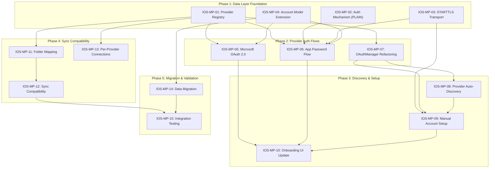

# Multi-Provider IMAP — iOS/macOS Implementation Plan

> The key words **MUST**, **MUST NOT**, **REQUIRED**, **SHALL**, **SHALL NOT**, **SHOULD**, **SHOULD NOT**, **RECOMMENDED**, **MAY**, and **OPTIONAL** in this document are to be interpreted as described in [RFC 2119](https://www.ietf.org/rfc/rfc2119.txt).

---

## 1. Scope

This plan covers extending VaultMail from Gmail-only to support any IMAP email provider: Outlook, Yahoo, iCloud, and generic IMAP servers. It includes the provider configuration registry, multi-mechanism authentication (XOAUTH2 + PLAIN), STARTTLS transport, Microsoft OAuth 2.0, app-password flows, auto-discovery, manual account setup, provider-agnostic folder mapping, OAuthManager refactoring, Account model migration, and sync compatibility layer. Multi-account sync orchestration (FR-SYNC-11 through FR-SYNC-18) is tracked separately in the Email Sync tasks.

**Pre-requisites:** All existing email sync infrastructure (IOS-F-05 through IOS-F-10) is done. The IMAP client, sync engine, SMTP client, connection pool, and domain use cases are implemented and tested.

---

## 2. Platform Context

Refer to Foundation plan Section 2 for OS versions, device targets, and platform guidelines.

- **Cross-platform:** All provider registry, auth, and folder-mapping code compiles for both iOS and macOS. Platform-specific code (STARTTLS socket handling, `ASWebAuthenticationSession` presentation) is gated with `#if os(iOS)` / `#if os(macOS)`.
- **Dependency on Email Sync:** Multi-account sync orchestration (SyncCoordinator, per-account IDLE, unified inbox, sync status UI, debug view) is specified in the Email Sync spec (FR-SYNC-11 through FR-SYNC-18) and tracked in the Email Sync task breakdown.

---

## 3. Architecture Mapping

### Component Dependency Graph

### Key Files (New)

| File | Layer | Purpose | Spec FR |
|------|-------|---------|---------|
| `ProviderRegistry.swift` | Data/Config | Built-in provider configs, domain lookup | FR-MPROV-01 |
| `EmailProvider.swift` | Domain/Models | Provider enum + ConnectionSecurity + AuthMechanism | FR-MPROV-01 |
| `PLAINAuthenticator.swift` | Data/Network | SASL PLAIN auth for IMAP and SMTP | FR-MPROV-02 |
| `STARTTLSConnection.swift` | Data/Network | STARTTLS upgrade for IMAP (143) and SMTP (587) | FR-MPROV-05 |
| `MicrosoftOAuthConfig.swift` | Data/Network | Microsoft Entra OAuth endpoints, id_token decode | FR-MPROV-03 |
| `AppPasswordEntryView.swift` | Presentation | App password UI with provider instructions | FR-MPROV-04 |
| `AutoDiscoveryService.swift` | Data/Network | Mozilla ISPDB + DNS SRV + MX heuristic | FR-MPROV-06 |
| `ManualSetupView.swift` | Presentation | Manual server config form + connection test | FR-MPROV-07 |
| `IMAPFolderMapper.swift` | Data/Sync | RFC 6154 + provider name fallback + heuristic | FR-MPROV-08 |
| `ProviderSelectionView.swift` | Presentation | Email-first provider selection | FR-MPROV-11 |
| `OAuthProviderConfig.swift` | Domain/Models | Provider-configurable OAuth config + EmailResolutionStrategy | FR-MPROV-12 |
| `ConnectionTestView.swift` | Presentation | IMAP/SMTP connection test checklist | FR-MPROV-07 |

### Key Files (Modified)

| File | Change | Spec FR |
|------|--------|---------|
| `Account.swift` (SwiftData model) | Add `provider`, `imapSecurity`, `smtpSecurity` nullable fields | FR-MPROV-10 |
| `OAuthManager.swift` | Accept `OAuthProviderConfig` param, add id_token decode | FR-MPROV-12 |
| `IMAPClient.swift` | Add STARTTLS handshake + PLAIN auth | FR-MPROV-02, FR-MPROV-05 |
| `SMTPClient.swift` / `SMTPSession.swift` | Add STARTTLS handshake + PLAIN auth | FR-MPROV-02, FR-MPROV-05 |
| `ConnectionPool.swift` | Per-provider maxConnections + global 30-cap | FR-MPROV-09, FR-MPROV-14 |
| `SyncEmailsUseCase.swift` | Inject provider-agnostic folder mapper, sent append, draft append | FR-MPROV-13 |
| `KeychainManager.swift` | Add `apppassword.{accountId}` key pattern | FR-MPROV-02 |
| `OnboardingView.swift` | Replace Gmail-only with provider selection | FR-MPROV-11 |

---

## 4. Implementation Phases

### Phase 1: Data Layer Foundation

| Task ID | Description | Spec FRs | Dependencies | Est |
|---------|-------------|----------|-------------|-----|
| IOS-MP-01 | Provider configuration registry | FR-MPROV-01 | — | S |
| IOS-MP-02 | SASL PLAIN authentication for IMAP and SMTP | FR-MPROV-02 | — | M |
| IOS-MP-03 | STARTTLS transport support | FR-MPROV-05 | — | L |
| IOS-MP-04 | Account model extensions (SwiftData migration) | FR-MPROV-10 | — | S |

### Phase 2: Provider Authentication Flows

| Task ID | Description | Spec FRs | Dependencies | Est |
|---------|-------------|----------|-------------|-----|
| IOS-MP-05 | Microsoft OAuth 2.0 (Entra) with id_token claims | FR-MPROV-03 | IOS-MP-01, IOS-MP-04 | L |
| IOS-MP-06 | App password authentication flow (iCloud/Yahoo/generic) | FR-MPROV-04 | IOS-MP-01, IOS-MP-02, IOS-MP-03 | M |
| IOS-MP-07 | OAuthManager refactoring (provider-configurable) | FR-MPROV-12 | IOS-MP-01 | M |

### Phase 3: Discovery & Account Setup

| Task ID | Description | Spec FRs | Dependencies | Est |
|---------|-------------|----------|-------------|-----|
| IOS-MP-08 | Provider auto-discovery (ISPDB + DNS SRV + MX) | FR-MPROV-06 | IOS-MP-07 | L |
| IOS-MP-09 | Manual account setup UI + connection testing | FR-MPROV-07 | IOS-MP-03, IOS-MP-08 | M |
| IOS-MP-10 | Onboarding and provider selection UI | FR-MPROV-11 | IOS-MP-05, IOS-MP-06, IOS-MP-09 | M |

### Phase 4: Sync Compatibility

| Task ID | Description | Spec FRs | Dependencies | Est |
|---------|-------------|----------|-------------|-----|
| IOS-MP-11 | Provider-agnostic folder mapping | FR-MPROV-08 | IOS-MP-01 | M |
| IOS-MP-12 | Sync compatibility layer (archive, delete, draft, sent, flags) | FR-MPROV-13 | IOS-MP-11 | L |
| IOS-MP-13 | Per-provider connection pool configuration | FR-MPROV-09, FR-MPROV-14 | IOS-MP-01 | S |

### Phase 5: Migration & Validation

| Task ID | Description | Spec FRs | Dependencies | Est |
|---------|-------------|----------|-------------|-----|
| IOS-MP-14 | Data migration validation | FR-MPROV-15 | IOS-MP-04 | M |
| IOS-MP-15 | End-to-end integration testing (all providers) | NFR-MPROV-04, NFR-MPROV-05 | All above | L |

**Size Legend:** S = Small (< 1 day), M = Medium (1-2 days), L = Large (3+ days)

---

## 5. Key Design Decisions

| Decision | Rationale |
|----------|-----------|
| Provider registry as static data (not remote config) | Simplicity, offline-first. Registry changes ship with app updates. Constitution TC-03 discourages unnecessary remote dependencies. |
| Single `OAuthManager` with `OAuthProviderConfig` (not one per provider) | Avoids code duplication — token exchange, PKCE, refresh logic is identical across providers. Only endpoints and scopes differ. |
| `IMAPFolderMapper` with strategy pattern (not per-provider classes) | Single mapper dispatches to provider-specific name maps. Keeps folder mapping logic centralized and testable. |
| STARTTLS via socket-level TLS upgrade (not NWConnection) | NWConnection does not natively support in-place TLS upgrade. Fallback to `CFStream` or POSIX socket + Security.framework for STARTTLS handshake. |
| App-level defaults for nullable SwiftData fields (not write-on-upgrade) | Computed properties returning defaults for `nil` avoids migration failure risk. No `VersionedSchema` needed. |
| `EmailResolutionStrategy` enum (not URL-based resolver) | Gmail uses user-provided email (no API call needed). Outlook uses id_token JWT claims. Enum makes the two strategies explicit and type-safe. |
| id_token JWT claims for Outlook email (not Graph API) | Outlook access token is scoped to `outlook.office365.com` — cannot call Graph API. OIDC `id_token` contains email claim at no additional cost. |

---

## 6. Third-Party Dependencies

| Dependency | Purpose | Status |
|-----------|---------|--------|
| `ASWebAuthenticationSession` | OAuth flows (Gmail + Microsoft) | System framework, already used |
| Mozilla ISPDB | Auto-discovery for unknown providers | Public HTTP API, no authentication needed |
| DNS SRV lookup | Auto-discovery fallback | System DNS resolver |
| None added | No new SPM dependencies | Constitution TC-03 compliance |

---

## 7. Risks and Mitigations

| Risk | Likelihood | Impact | Mitigation |
|------|-----------|--------|------------|
| NWConnection STARTTLS limitation | High | High | Spike STARTTLS implementation early (IOS-MP-03). Fallback to CFStream or POSIX sockets. Test against Outlook SMTP (587) and iCloud SMTP (587). |
| Azure AD app registration delays | Medium | High | IOS-MP-05 blocked until client ID is registered. Mock OAuth responses for development. |
| Yahoo IDLE 5-minute timeout | Medium | Medium | Provider registry configures 4-min refresh. Already handled by provider-configurable IDLE interval. |
| SwiftData lightweight migration failure | Low | High | Nullable fields ensure automatic migration. Unit test with pre-migration data. Graceful recovery flow (FR-MPROV-15). |
| Microsoft 365 tenant-specific auth | Medium | Medium | Using `/common/` endpoint supports both consumer and organizational accounts. Deferred per OQ-03 if tenant-specific issues arise. |
| Provider-specific IMAP quirks | Medium | Medium | Test against real accounts for each provider. Document known quirks in integration test suite. |

---

## 8. Revision History

| Version | Date | Author | Change Summary |
|---------|------|--------|---------------|
| 1.0.0 | 2026-02-16 | Core Team | Initial plan. 15 tasks across 5 phases covering provider registry, multi-auth, STARTTLS, Microsoft OAuth, app passwords, auto-discovery, manual setup, folder mapping, sync compatibility, Account model migration, and integration testing. Based on multi-provider IMAP spec v1.1.3 and email sync spec v1.3.4. |
