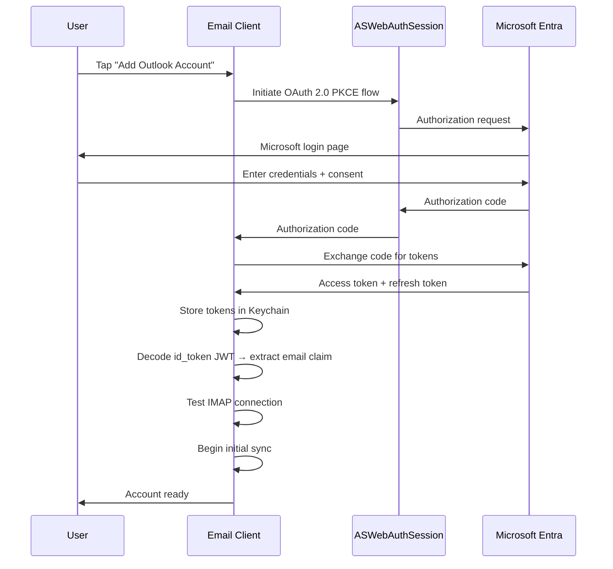
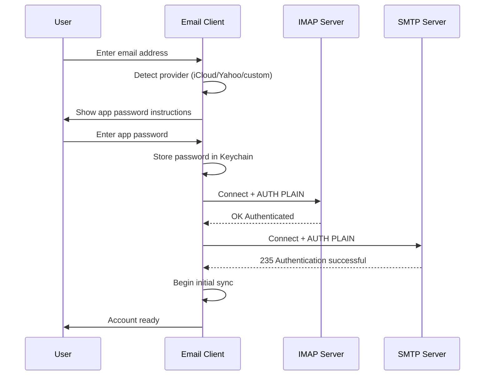
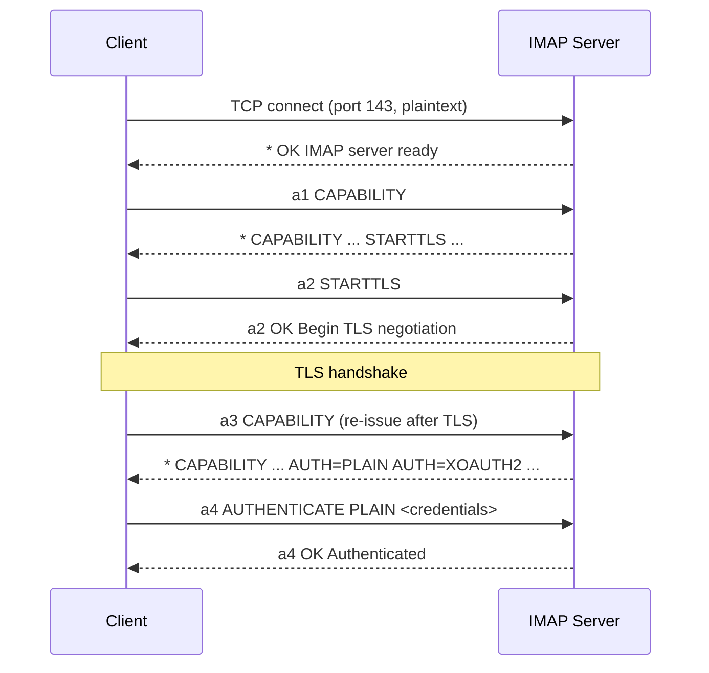
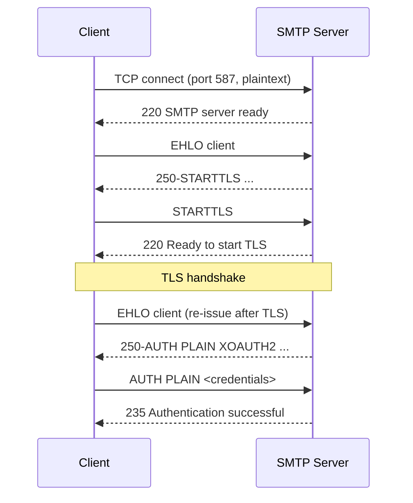
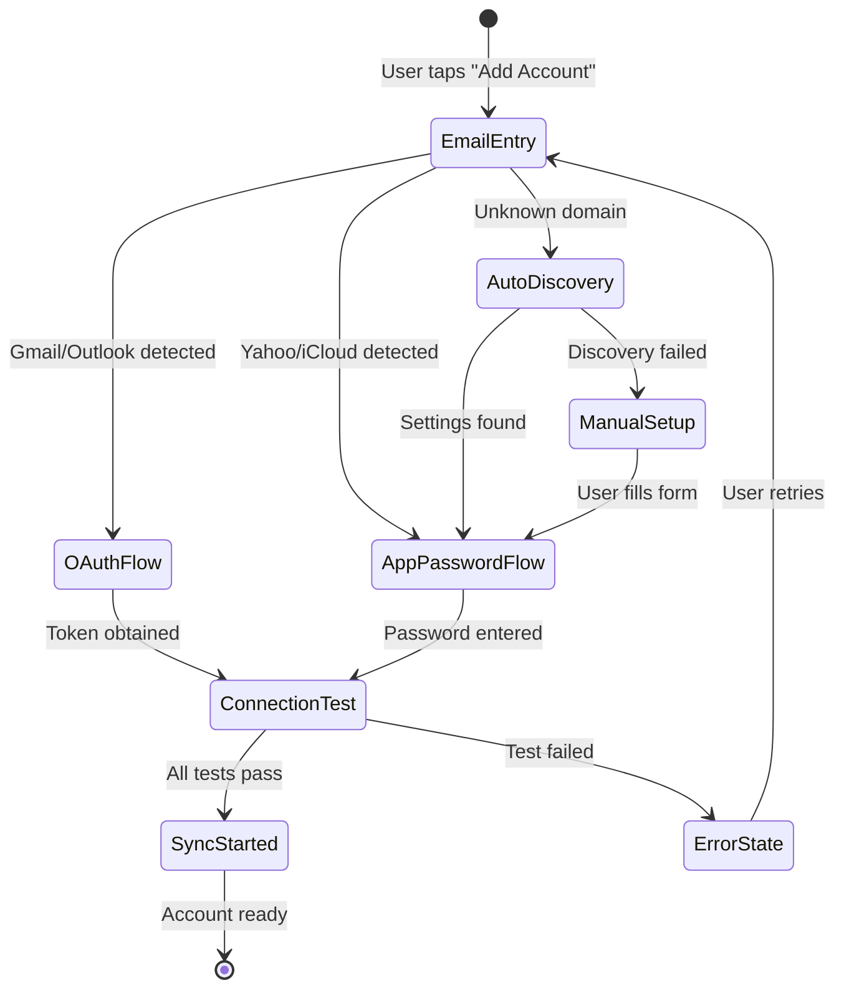
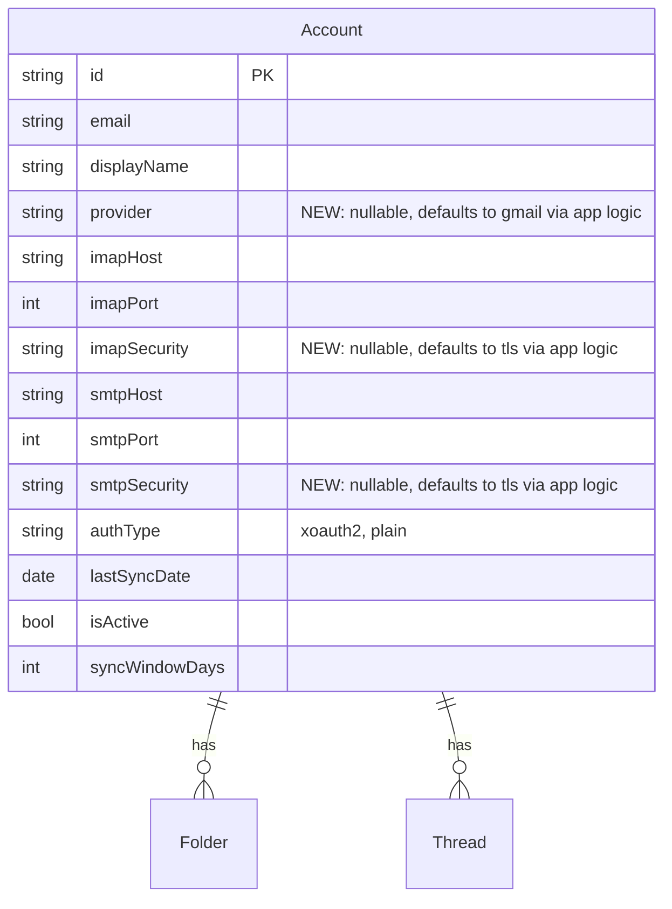
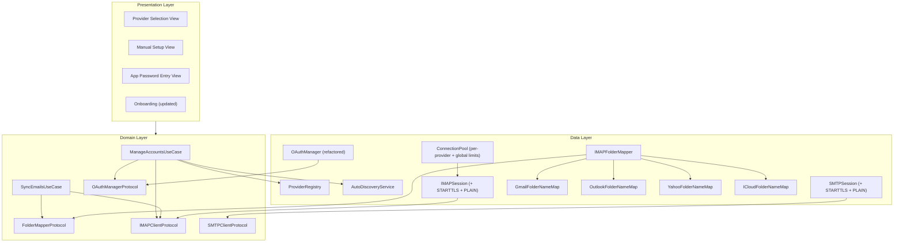

# Specification: Multi-Provider IMAP

> The key words **MUST**, **MUST NOT**, **REQUIRED**, **SHALL**, **SHALL NOT**, **SHOULD**, **SHOULD NOT**, **RECOMMENDED**, **MAY**, and **OPTIONAL** in this document are to be interpreted as described in [RFC 2119](https://www.ietf.org/rfc/rfc2119.txt).

## 1. Summary

This specification extends VaultMail from Gmail-only to support any email service provider via standard IMAP/SMTP. It defines a provider configuration registry, multi-mechanism authentication (OAuth 2.0 + app passwords), STARTTLS transport support, provider-agnostic folder mapping, auto-discovery of server settings, and a manual account setup flow. All changes are confined to the Data layer and Presentation layer; the Domain layer remains provider-agnostic per Constitution AI-02.

---

## 2. Goals and Non-Goals

### Goals

- **G-01**: The client **MUST** support adding accounts from any IMAP-compatible email provider, not only Gmail.
- **G-02**: The client **MUST** support OAuth 2.0 authentication for Gmail and Microsoft Outlook/Office 365.
- **G-03**: The client **MUST** support app-password authentication (SASL PLAIN) for iCloud, Yahoo, and generic IMAP providers.
- **G-04**: The client **MUST** support both implicit TLS and STARTTLS connection modes for IMAP and SMTP.
- **G-05**: The client **MUST** auto-detect provider configuration from the user's email domain when possible.
- **G-06**: The client **MUST** provide a manual server configuration UI for providers that cannot be auto-detected.
- **G-07**: The client **MUST** map IMAP folders to local `FolderType` using RFC 6154 SPECIAL-USE attributes as the primary strategy, with provider-specific name fallbacks.
- **G-08**: All existing features (threading, search, AI, sync, offline) **MUST** continue to work identically across all providers.

### Non-Goals

- **NG-01**: ProtonMail support — ProtonMail requires a desktop Bridge application that is not available on iOS. ProtonMail **SHALL NOT** be supported until Proton provides a mobile-compatible API or SDK.
- **NG-02**: Exchange ActiveSync (EAS) — only standard IMAP/SMTP is in scope per Constitution P-06.
- **NG-03**: Provider-specific features beyond standard IMAP (e.g., Gmail labels API, Microsoft Graph API).
- **NG-04**: IMAP COMPRESS extension (RFC 4978).
- **NG-05**: IMAP CONDSTORE/QRESYNC extensions (RFC 7162) — deferred to V3 optimization pass.

---

## 3. Functional Requirements

### FR-MPROV-01: Provider Configuration Registry

**Description**

The client **MUST** maintain a built-in registry of known email providers with pre-configured server settings. This registry is used for auto-detection and to pre-fill account setup fields.

**Provider Registry Schema**

Each provider entry **MUST** contain:

| Field | Type | Description |
|-------|------|-------------|
| `provider` | `EmailProvider` enum | Unique provider identifier |
| `displayName` | `String` | Human-readable name (e.g., "Gmail", "Outlook") |
| `domains` | `[String]` | Email domains that map to this provider |
| `imapHost` | `String` | IMAP server hostname |
| `imapPort` | `Int` | IMAP server port |
| `imapSecurity` | `ConnectionSecurity` | `.tls` or `.starttls` |
| `smtpHost` | `String` | SMTP server hostname |
| `smtpPort` | `Int` | SMTP server port |
| `smtpSecurity` | `ConnectionSecurity` | `.tls` or `.starttls` |
| `authMechanism` | `AuthMechanism` | `.xoauth2` or `.plain` (see Section 5 enum and Alternatives Considered for OAUTHBEARER rejection) |
| `oauthConfig` | `OAuthProviderConfig?` | OAuth endpoints, client ID, scopes (nil for password-based providers) |
| `maxConnections` | `Int` | Maximum concurrent IMAP connections per account |
| `idleRefreshInterval` | `TimeInterval` | Seconds between IDLE re-issue |
| `folderNameMap` | `[String: FolderType]` | Provider-specific IMAP folder name → `FolderType` fallback mapping |
| `excludedFolders` | `[String]` | IMAP folder paths to exclude from sync |
| `requiresSentAppend` | `Bool` | Whether the client must APPEND to Sent folder after SMTP send (Gmail = `false`, all others = `true`) |

**Built-in Provider Entries**

| Provider | Domains | IMAP Host | SMTP Host | Auth | Max Conn | IDLE Refresh |
|----------|---------|-----------|-----------|------|----------|-------------|
| Gmail | `gmail.com`, `googlemail.com` | `imap.gmail.com:993/TLS` | `smtp.gmail.com:465/TLS` | XOAUTH2 | 15 | 25 min |
| Outlook | `outlook.com`, `hotmail.com`, `live.com`, `msn.com` | `outlook.office365.com:993/TLS` | `smtp.office365.com:587/STARTTLS` | XOAUTH2 | 8 | 25 min |
| Yahoo | `yahoo.com`, `ymail.com`, `aol.com` | `imap.mail.yahoo.com:993/TLS` | `smtp.mail.yahoo.com:465/TLS` | PLAIN | 5 | 4 min |
| iCloud | `icloud.com`, `me.com`, `mac.com` | `imap.mail.me.com:993/TLS` | `smtp.mail.me.com:587/STARTTLS` | PLAIN | 10 | 25 min |

**Error Handling**

- If a provider entry cannot be found for a given email domain, the client **MUST** fall back to auto-discovery (FR-MPROV-06) and then manual setup (FR-MPROV-07).

### FR-MPROV-02: Multi-Mechanism Authentication

**Description**

The client **MUST** support the following SASL authentication mechanisms for IMAP and SMTP:

1. **XOAUTH2** (RFC 7628 derivative) — for Gmail and Outlook
2. **PLAIN** (RFC 4616) — for iCloud, Yahoo, and generic IMAP providers using app passwords

**XOAUTH2 Authentication**

- The XOAUTH2 token format **MUST** be: `base64("user=" + email + "\x01" + "auth=Bearer " + accessToken + "\x01" + "\x01")`
- This format is identical for both Gmail and Microsoft — the existing `formatXOAUTH2String` implementation is reusable.
- The client **MUST** detect XOAUTH2 support via the IMAP `CAPABILITY` response (`AUTH=XOAUTH2`).

**PLAIN Authentication**

- The PLAIN token format **MUST** be: `base64("\0" + username + "\0" + password)`
- The username **MUST** be the user's full email address.
- The password is the app-specific password (not the account's primary password).
- `AUTH PLAIN` **MUST** only be used over TLS-encrypted connections (implicit TLS or after STARTTLS upgrade). The client **MUST NOT** send PLAIN credentials over unencrypted connections.
- The client **MUST** detect PLAIN support via the IMAP `CAPABILITY` response (`AUTH=PLAIN`).

**Mechanism Selection**

The client **MUST** select the authentication mechanism in the following priority order:

1. Use the `authMechanism` from the provider registry if the account's provider is known.
2. If the provider is unknown (manual setup), inspect the IMAP `CAPABILITY` response:
   - If `AUTH=XOAUTH2` is advertised and OAuth config is available → use XOAUTH2.
   - If `AUTH=PLAIN` is advertised → use PLAIN.
   - If neither is advertised → report an unsupported authentication error to the user.

**Credential Storage**

- OAuth tokens **MUST** be stored in the Keychain per Account Management FR-ACCT-04.
- App passwords **MUST** be stored in the Keychain with `kSecAttrAccessibleWhenUnlockedThisDeviceOnly` protection level, identical to OAuth tokens.
- The client **MUST NOT** store app passwords in UserDefaults, files, or SwiftData.

**Error Handling**

- Authentication failure with PLAIN **MUST** display "Invalid email or app password. Please check your credentials and try again."
- Authentication failure with XOAUTH2 **MUST** trigger token refresh per Account Management FR-ACCT-04.
- If the server does not advertise any supported auth mechanism, the client **MUST** display "This server does not support any compatible authentication method."

### FR-MPROV-03: Microsoft OAuth 2.0 Support

**Description**

The client **MUST** support OAuth 2.0 for Microsoft accounts (Outlook.com, Hotmail, Live, Office 365) using Microsoft Entra (Azure AD).

**OAuth Configuration**

| Setting | Value |
|---------|-------|
| Auth endpoint | `https://login.microsoftonline.com/common/oauth2/v2.0/authorize` |
| Token endpoint | `https://login.microsoftonline.com/common/oauth2/v2.0/token` |
| Scopes | `https://outlook.office365.com/IMAP.AccessAsUser.All https://outlook.office365.com/SMTP.Send offline_access openid email profile` |
| PKCE | Yes (S256) |
| Redirect URI | Custom URL scheme registered in Azure AD app registration |

**OAuth Flow**

The Microsoft OAuth flow **MUST** follow the same pattern as Gmail (Account Management FR-ACCT-03) using `ASWebAuthenticationSession`:



**Email Resolution**

- The token response includes an `id_token` (JWT) because the `openid email profile` scopes are requested. The client **MUST** decode the `id_token` claims to resolve the user's email address.
- The client **MUST** extract the `email` claim from the `id_token`. If the `email` claim is absent, the client **MUST** fall back to the `preferred_username` claim.
- The `id_token` **MUST** be validated per standard OIDC rules (issuer, audience, expiry) before extracting claims.
- The client **MUST NOT** call the Microsoft Graph API (`/v1.0/me`) for email resolution. The access token is scoped to `outlook.office365.com` (IMAP/SMTP) and is **not** a valid Graph API token. Calling Graph with an Outlook-audience token will result in a `401 Unauthorized` error.

**Token Refresh**

- Microsoft refresh tokens **MUST** follow the same retry policy as Gmail (3 retries with exponential backoff per Account Management FR-ACCT-04).
- The token endpoint for refresh is the same as the initial exchange endpoint.

**External Prerequisites**

- The app **MUST** be registered in the Microsoft Entra (Azure AD) portal before Outlook support is functional.
- The app registration **MUST** request `IMAP.AccessAsUser.All`, `SMTP.Send`, `openid`, `email`, and `profile` delegated permissions.
- The redirect URI **MUST** be registered in the app registration matching the iOS custom URL scheme.
- The `User.Read` Graph permission is **NOT** required — email resolution uses the `id_token` OIDC claims instead of the Graph API.

**Error Handling**

- If the user cancels the Microsoft login, the client **MUST** return to the provider selection screen.
- If token exchange fails, the client **MUST** display "Failed to authenticate with Microsoft. Please try again."
- Multi-tenant (`/common/`) auth **MUST** be used to support both consumer (Outlook.com) and organizational (M365) accounts.

### FR-MPROV-04: App Password Authentication Flow

**Description**

For providers that do not support OAuth 2.0 (iCloud, Yahoo, generic IMAP), the client **MUST** provide an app-password entry flow.

**User Flow**



**App Password Instructions**

The client **MUST** display provider-specific instructions for generating an app password:

- **iCloud**: "Go to appleid.apple.com → Sign-In and Security → App-Specific Passwords → Generate. Two-factor authentication must be enabled."
- **Yahoo**: "Go to login.yahoo.com → Account Security → Generate app password. Two-factor authentication must be enabled."
- **Generic**: "Contact your email provider for IMAP access credentials. You may need an app-specific password if your provider requires two-factor authentication."

Each instruction screen **SHOULD** include a button to open the provider's password generation page in the system browser.

**Validation**

- After the user enters credentials, the client **MUST** test the IMAP connection before completing setup.
- If IMAP authentication fails, the client **MUST** display the error and allow retry without re-entering the email address.
- The client **MUST** also test the SMTP connection. If SMTP fails but IMAP succeeds, the client **MUST** warn the user that receiving will work but sending will not until SMTP is configured correctly.

**Error Handling**

- "Authentication failed" → display "Invalid email or app password" with a retry option.
- "Connection refused" → display "Could not connect to server. Please check the server address and port."
- "TLS handshake failed" → display "Secure connection failed. The server may not support TLS."

### FR-MPROV-05: STARTTLS Transport Support

**Description**

The client **MUST** support STARTTLS connection upgrading for both IMAP (port 143) and SMTP (port 587), in addition to existing implicit TLS support (ports 993/465).

**Connection Security Modes**

The client **MUST** support three connection security modes:

| Mode | Behavior | Typical Ports |
|------|----------|---------------|
| `.tls` (Implicit TLS) | TLS handshake immediately upon TCP connection | IMAP 993, SMTP 465 |
| `.starttls` | Connect plaintext, issue STARTTLS command, upgrade to TLS | IMAP 143, SMTP 587 |
| `.none` | No encryption (for development/testing only) | — |

**STARTTLS Handshake — IMAP**



**STARTTLS Handshake — SMTP**



**Implementation Requirements**

- After receiving the server's OK response to the STARTTLS command, the client **MUST** perform a full TLS handshake before sending any further data.
- After TLS upgrade, the client **MUST** re-issue `CAPABILITY` (IMAP) or `EHLO` (SMTP) to discover TLS-dependent capabilities (many servers only advertise auth mechanisms after TLS).
- Certificate validation **MUST** be enforced per Email Sync NFR-SYNC-05. Self-signed certificates **MUST** be rejected.
- If the server does not advertise `STARTTLS` in its capabilities but the connection security mode is `.starttls`, the client **MUST** abort the connection and report an error.
- The `.none` connection mode **MUST NOT** be available in production builds. It **MAY** be available in `#if DEBUG` builds only.

**Network.framework Considerations**

- `NWConnection` does not natively support upgrading an existing plaintext connection to TLS. The implementation **MUST** use one of:
  - (a) Create the initial connection without TLS, send STARTTLS, then create a new `NWConnection` with TLS options on the same socket (if the API supports it), OR
  - (b) Use `NWProtocolTLS.Options` with `sec_protocol_options_set_tls_pre_shared_key_identity_hint` for deferred TLS, OR
  - (c) Fall back to `CFStream`-based sockets or a raw POSIX socket + `Security.framework` for the TLS upgrade if `NWConnection` cannot support in-place upgrade.
- The chosen approach **MUST** be documented in the implementation plan and tested against Outlook SMTP (587/STARTTLS) and iCloud SMTP (587/STARTTLS).

**Error Handling**

- STARTTLS not supported by server → "This server does not support secure connections. Cannot proceed."
- TLS handshake failure → "Secure connection could not be established. Please verify the server address."
- Certificate validation failure → "Server certificate is invalid or untrusted."

### FR-MPROV-06: Provider Auto-Discovery

**Description**

When the user enters an email address with an unrecognized domain, the client **SHOULD** attempt to auto-discover IMAP/SMTP server settings before falling back to manual setup.

**Discovery Chain**

The client **MUST** attempt discovery in the following order, stopping at the first successful result:

1. **Built-in registry lookup** (FR-MPROV-01) — instant, no network required.
2. **Mozilla ISPDB** — query `https://autoconfig.thunderbird.net/v1.1/{domain}` for XML configuration. This database covers thousands of email providers.
3. **DNS SRV records** — query `_imap._tcp.{domain}` and `_submission._tcp.{domain}` per RFC 6186.
4. **MX record heuristic** — resolve MX records for the domain and attempt to infer the provider (e.g., MX pointing to `*.google.com` → Gmail, `*.outlook.com` → Outlook).
5. **Manual setup** (FR-MPROV-07) — if all auto-discovery fails.

**Mozilla ISPDB Parsing**

- The client **MUST** parse the XML response for `<incomingServer type="imap">` and `<outgoingServer type="smtp">` elements.
- Extract: `<hostname>`, `<port>`, `<socketType>` (SSL = implicit TLS, STARTTLS = STARTTLS), `<authentication>` (plain, OAuth2).
- The client **MUST** cache successful ISPDB lookups in UserDefaults to avoid repeated network requests.

**DNS SRV Record Parsing**

- Query `_imap._tcp.{domain}` → parse target host and port for IMAP.
- Query `_submission._tcp.{domain}` → parse target host and port for SMTP.
- If SRV records exist, use the returned host/port and default to `.starttls` for IMAP port 143 or `.tls` for IMAP port 993.

**Error Handling**

- All auto-discovery failures are non-fatal. The client **MUST** proceed silently to the next discovery method in the chain.
- If all discovery methods fail, the client **MUST** present the manual setup form (FR-MPROV-07) with a message: "We couldn't auto-detect your email settings. Please enter them manually."
- Auto-discovery **MUST** timeout within 10 seconds per method (30 seconds total for the full chain).
- Mozilla ISPDB queries transmit only the email domain (not the full email address or any user data), complying with Constitution P-01.

### FR-MPROV-07: Manual Account Setup

**Description**

The client **MUST** provide a manual account setup flow for email providers that cannot be auto-detected or are not in the built-in registry.

**Required Fields**

| Field | Default | Validation |
|-------|---------|------------|
| Email Address | (user-entered) | Valid email format |
| Display Name | Local part of email | Non-empty |
| IMAP Server | (auto-detected or blank) | Valid hostname |
| IMAP Port | `993` | 1–65535 |
| IMAP Security | `.tls` | `.tls` or `.starttls` |
| SMTP Server | (auto-detected or blank) | Valid hostname |
| SMTP Port | `587` | 1–65535 |
| SMTP Security | `.starttls` | `.tls` or `.starttls` |
| Authentication | `App Password` | `OAuth 2.0` or `App Password` |
| Password | (user-entered) | Non-empty (for app password auth) |

**Connection Test**

- After the user fills in all fields, the client **MUST** test both IMAP and SMTP connectivity before completing setup.
- The test **MUST** attempt: TCP connect → TLS/STARTTLS → authenticate → disconnect.
- Results **MUST** be displayed as a checklist:
  - IMAP connection: pass/fail
  - IMAP authentication: pass/fail
  - SMTP connection: pass/fail
  - SMTP authentication: pass/fail
- The user **MUST** be able to proceed only when all four checks pass.

**Error Handling**

- Individual test failures **MUST** display specific, actionable error messages (e.g., "IMAP authentication failed — check your password", "SMTP connection refused — check the server address and port").
- The user **MUST** be able to edit fields and re-test without starting over.

### FR-MPROV-08: Provider-Agnostic Folder Mapping

**Description**

The client **MUST** replace the Gmail-specific `GmailFolderMapper` with a provider-agnostic folder mapping strategy that works across all IMAP providers.

**Mapping Strategy (Priority Order)**

1. **RFC 6154 SPECIAL-USE attributes** (primary) — check the LIST response for standard attributes:

   | IMAP Attribute | FolderType |
   |---------------|------------|
   | `\Inbox` (or path = `INBOX`) | `.inbox` |
   | `\Sent` | `.sent` |
   | `\Drafts` | `.drafts` |
   | `\Trash` | `.trash` |
   | `\Junk` | `.spam` |
   | `\Flagged` | `.starred` |
   | `\All` | `.archive` |

2. **Provider-specific name fallback** (secondary) — if SPECIAL-USE attributes are absent, match against the provider's `folderNameMap` from the registry:

   **Gmail fallback names:**
   | IMAP Path | FolderType |
   |-----------|------------|
   | `[Gmail]/Sent Mail` | `.sent` |
   | `[Gmail]/Drafts` | `.drafts` |
   | `[Gmail]/Trash` | `.trash` |
   | `[Gmail]/Spam` | `.spam` |
   | `[Gmail]/Starred` | `.starred` |
   | `[Gmail]/All Mail` | `.archive` |

   **Outlook fallback names:**
   | IMAP Path | FolderType |
   |-----------|------------|
   | `Sent Items` or `Sent` | `.sent` |
   | `Drafts` | `.drafts` |
   | `Deleted Items` or `Trash` | `.trash` |
   | `Junk Email` or `Junk` | `.spam` |
   | `Archive` | `.archive` |

   **Yahoo fallback names:**
   | IMAP Path | FolderType |
   |-----------|------------|
   | `Sent` | `.sent` |
   | `Draft` | `.drafts` |
   | `Trash` | `.trash` |
   | `Bulk Mail` | `.spam` |
   | `Archive` | `.archive` |

   **iCloud fallback names:**
   | IMAP Path | FolderType |
   |-----------|------------|
   | `Sent Messages` | `.sent` |
   | `Drafts` | `.drafts` |
   | `Deleted Messages` | `.trash` |
   | `Junk` | `.spam` |
   | `Archive` | `.archive` |

3. **Generic name heuristic** (tertiary) — if neither SPECIAL-USE nor provider-specific names match, apply case-insensitive substring matching:
   - Contains `sent` → `.sent`
   - Contains `draft` → `.drafts`
   - Contains `trash` or `deleted` → `.trash`
   - Contains `junk` or `spam` or `bulk` → `.spam`
   - Contains `archive` → `.archive`
   - Contains `starred` or `flagged` → `.starred`
   - Otherwise → `.custom`

**Excluded Folders**

Each provider entry in the registry defines an `excludedFolders` list. Additionally, the client **MUST** exclude:

- Folders with the `\Noselect` attribute (non-leaf containers).
- Gmail: `[Gmail]/All Mail`, `[Gmail]/Important` (per Email Sync FR-SYNC-01).
- iCloud: `Notes` folder (syncs with Apple Notes, not email).

**Error Handling**

- If folder discovery returns zero syncable folders, the client **MUST** display "No email folders found. Please check your account configuration."

### FR-MPROV-09: Per-Provider Connection Configuration

**Description**

Connection pool limits and IDLE refresh intervals **MUST** be configurable per provider, not globally hardcoded.

**Connection Limits**

| Provider | Max Concurrent IMAP Connections |
|----------|-------------------------------|
| Gmail | 15 |
| Outlook | 8 |
| Yahoo | 5 |
| iCloud | 10 |
| Custom | 5 (conservative default) |

- The `ConnectionPool` **MUST** read `maxConnections` from the account's resolved provider configuration.
- The existing `ConnectionPool` constructor already accepts `maxConnectionsPerAccount` as a parameter — no architectural change is required.

**IDLE Refresh Intervals**

| Provider | IDLE Refresh Interval |
|----------|----------------------|
| Gmail | 25 minutes |
| Outlook | 25 minutes |
| Yahoo | 4 minutes |
| iCloud | 25 minutes |
| Custom | 20 minutes (safe default) |

- Yahoo drops IDLE connections after approximately 5 minutes. The client **MUST** re-issue IDLE every 4 minutes for Yahoo accounts.
- The IDLE loop in `IMAPClient` **MUST** read the refresh interval from the account's provider configuration rather than from a global constant.

**Error Handling**

- If the connection limit is exceeded, existing queuing behavior (per Email Sync FR-SYNC-09) applies unchanged.

### FR-MPROV-10: Account Model Extensions

**Description**

The `Account` SwiftData model **MUST** be extended with new fields to support multi-provider configuration.

**New Fields**

| Field | Type | SwiftData Schema | App-Level Default | Description |
|-------|------|-----------------|-------------------|-------------|
| `provider` | `String?` | Optional (nullable) | `"gmail"` | Provider identifier (maps to `EmailProvider` enum) |
| `imapSecurity` | `String?` | Optional (nullable) | `"tls"` | Connection security: `"tls"` or `"starttls"` |
| `smtpSecurity` | `String?` | Optional (nullable) | `"tls"` | Connection security: `"tls"` or `"starttls"` |

**Existing Fields (Unchanged)**

The following existing fields already support multi-provider scenarios:
- `imapHost`, `imapPort` — configurable per account
- `smtpHost`, `smtpPort` — configurable per account
- `authType` — already a `String` field (`"xoauth2"`, `"plain"`)

**Migration Strategy**

SwiftData lightweight migration adds new fields as **nullable** (`nil`). No explicit migration code or `VersionedSchema` is required. The app **MUST** apply defaults at the application layer:

1. **Schema**: The three new fields **MUST** be declared as `String?` (optional) in the `@Model` class. This ensures SwiftData's automatic lightweight migration succeeds — it simply adds nullable columns.
2. **App-level backfill**: On first access after upgrade, any Account with `provider == nil` **MUST** be treated as `provider = "gmail"`, `imapSecurity = "tls"`, `smtpSecurity = "tls"`. This **SHOULD** be implemented via computed properties that return defaults for `nil` values, rather than a write-on-upgrade migration pass.
3. **New accounts**: When creating new accounts, all three fields **MUST** be populated explicitly (never left as `nil`).

### FR-MPROV-11: Onboarding and Account Setup UI

**Description**

The onboarding and "Add Account" flows **MUST** be updated to support multiple providers.

**Provider Selection**

When the user taps "Add Account", the client **MUST** present a provider selection screen:

1. **Email-first approach**: A single email input field at the top. As the user types, the client auto-detects the provider from the domain.
2. **Quick-add buttons**: Below the email field, show branded buttons for common providers (Gmail, Outlook, Yahoo, iCloud).
3. **"Other" option**: A button to proceed to manual setup (FR-MPROV-07).

**Flow Based on Detection**



**UI Text Updates**

- Replace all instances of "Gmail account" with "email account" in onboarding text.
- Replace "Sign in with Google" with provider-specific text (e.g., "Sign in with Microsoft" for Outlook).
- The welcome screen **MUST** state: "Add your email account. Works with Gmail, Outlook, Yahoo, iCloud, and any IMAP provider."

**Accessibility**

- All new form fields **MUST** have `accessibilityLabel` and `accessibilityHint`.
- The provider selection buttons **MUST** be accessible via VoiceOver with descriptive labels (e.g., "Add Gmail account", "Add Outlook account").
- Connection test results **MUST** be announced via `AccessibilityNotification.Announcement`.

### FR-MPROV-12: OAuthManager Refactoring

**Description**

The `OAuthManager` **MUST** be refactored from a Gmail-hardcoded implementation to a provider-configurable service.

**OAuthProviderConfig**

```
OAuthProviderConfig:
  - authEndpoint: URL
  - tokenEndpoint: URL
  - clientId: String
  - scopes: String
  - redirectScheme: String
  - emailResolution: EmailResolutionStrategy
```

**EmailResolutionStrategy** defines how to resolve the user's email address after OAuth:

```
enum EmailResolutionStrategy:
  case userProvided            // Use the email address the user entered before OAuth (e.g., Gmail)
  case idTokenClaims           // Decode id_token JWT claims: email, then preferred_username (e.g., Outlook)
```

- `.userProvided` — The user enters their email address before the OAuth flow begins (email-first approach per FR-MPROV-11). The email is validated implicitly when the IMAP connection test succeeds. No additional API call is needed.
- `.idTokenClaims` — The `id_token` returned in the OAuth token response contains the user's email in its JWT claims. Used when the OAuth provider's login flow determines the email (e.g., Microsoft accounts where the user may have multiple aliases).

**Built-in OAuth Configs**

| Provider | Auth Endpoint | Token Endpoint | Client ID | Scopes | Email Resolution |
|----------|--------------|---------------|-----------|--------|-----------------|
| Gmail | `accounts.google.com/o/oauth2/v2/auth` | `oauth2.googleapis.com/token` | (existing) | `https://mail.google.com/` | `.userProvided` |
| Outlook | `login.microsoftonline.com/common/oauth2/v2.0/authorize` | `login.microsoftonline.com/common/oauth2/v2.0/token` | (Azure AD app) | `https://outlook.office365.com/IMAP.AccessAsUser.All https://outlook.office365.com/SMTP.Send offline_access openid email profile` | `.idTokenClaims` |

> **Note**: Gmail scopes **MUST** be exactly `https://mail.google.com/` per Account Management FR-ACCT-01 and Constitution LG-02 (minimal scope principle). The `email profile` OIDC scopes are **not** requested for Gmail because email resolution uses the user-provided address, not a userinfo endpoint or id_token.

**Protocol Change**

The `OAuthManagerProtocol` **MUST** be extended to accept an `OAuthProviderConfig` parameter:

- `authenticate(config: OAuthProviderConfig) async throws -> OAuthToken`
- `refreshToken(_ token: OAuthToken, config: OAuthProviderConfig) async throws -> OAuthToken`
- `formatXOAUTH2String(email: String, accessToken: String) -> String` — unchanged (format is provider-agnostic)

**Error Handling**

- OAuth errors **MUST** remain provider-agnostic (`OAuthError` enum is already generic).
- Provider-specific error messages from Microsoft (e.g., "admin consent required") **SHOULD** be surfaced to the user.

### FR-MPROV-13: Email Sync Compatibility

**Description**

The sync engine (`SyncEmailsUseCase`) **MUST** work identically across all providers with the following adjustments:

**Folder Mapper Injection**

- `SyncEmailsUseCase` **MUST** use the provider-agnostic folder mapper (FR-MPROV-08) instead of directly calling `GmailFolderMapper`.
- The mapper **MUST** be resolved based on the account's `provider` field.

**Archive Behavior**

- Gmail archive behavior (Email Sync FR-SYNC-10) is Gmail-specific: `COPY` to `[Gmail]/All Mail` + `STORE \Deleted` + `EXPUNGE`.
- For non-Gmail providers, archive **MUST** be implemented as: `COPY` to the provider's Archive folder (if one exists) + `STORE +FLAGS (\Deleted)` + `EXPUNGE` from source. If no archive folder exists, the client **MUST** display "This provider does not have an archive folder. Move to a specific folder instead?"

**Delete Behavior**

- All providers: `COPY` to Trash folder + `STORE +FLAGS (\Deleted)` + `EXPUNGE` from source.
- The Trash folder is identified via the folder mapper (FR-MPROV-08).

**IMAP IDLE**

- IDLE behavior remains the same across all providers. Only the refresh interval varies (per FR-MPROV-09).

**Draft Sync Behavior**

- Gmail auto-saves drafts to `[Gmail]/Drafts` with the `\Draft` flag.
- For non-Gmail providers, after saving a draft locally, the client **MUST** issue IMAP `APPEND` to the provider's Drafts folder (identified via FR-MPROV-08) with the `\Draft` flag.
- If the provider's Drafts folder cannot be identified, the client **MUST** save the draft locally only and display a warning: "Drafts cannot be synced to this provider."

**Sent Folder Post-Send Behavior**

- Gmail automatically copies sent messages to the Sent folder server-side. The client **MUST NOT** issue an IMAP `APPEND` to Sent for Gmail accounts (this would create duplicates).
- For all non-Gmail providers (Outlook, Yahoo, iCloud, custom), the client **MUST** issue an IMAP `APPEND` to the provider's Sent folder after successful SMTP delivery. The message **MUST** include the `\Seen` flag.
- The provider behavior **MUST** be encoded in the provider registry as a `requiresSentAppend: Bool` field (Gmail = `false`, all others = `true`).

**Flag Support Variance**

- Not all providers support `\Flagged` (starred). If the server rejects a `STORE +FLAGS (\Flagged)` command with `NO`, the client **MUST** surface the error: "This provider does not support starred emails." The local star state **MUST** be reverted.
- The client **MUST** always attempt flag operations and handle rejection gracefully, rather than pre-checking provider capabilities.

### FR-MPROV-14: Multi-Account Sync (Cross-Reference)

> **Note**: Multi-account sync orchestration, IDLE monitoring, background sync, offline send queue, unified inbox, sync observability, and sync diagnostics are defined in the **Email Sync spec** (FR-SYNC-11 through FR-SYNC-18). This spec defines only the provider-specific aspects; the Email Sync spec is the single source of truth for all sync behavior.

The multi-provider connection pool **MUST** enforce a global limit in addition to per-provider limits (FR-MPROV-09):

- The total number of IMAP connections across all accounts **MUST NOT** exceed **30**.
- If the global limit is reached, connection checkout requests **MUST** be queued with priority given to the currently-viewed account.
- When a connection is returned to any account's pool, the highest-priority waiting request (across all accounts) **MUST** be served first.
- Idle connection cleanup timeouts are **platform-specific** and defined in the Email Sync spec (FR-SYNC-16): 5 minutes on iOS, 15 minutes on macOS.
- The connection pool **MUST** log (debug-level) when connections are closed due to idle timeout.
- If the global limit prevents a sync operation from starting, the operation **MUST** be queued (not failed). The queue timeout remains 30 seconds per Email Sync FR-SYNC-09.

### FR-MPROV-15: Data Migration Validation

**Description**

The SwiftData migration for new Account model fields (FR-MPROV-10) **MUST** be validated to ensure zero data loss for existing accounts.

**Default Handling for Pre-Existing Accounts**

- On app upgrade, SwiftData lightweight migration adds the three new nullable columns. Existing rows will have `nil` for `provider`, `imapSecurity`, and `smtpSecurity`.
- The app **MUST** treat `nil` values as defaults: `provider = "gmail"`, `imapSecurity = "tls"`, `smtpSecurity = "tls"` (per FR-MPROV-10 migration strategy). This is handled at the application layer via computed properties, **not** via a write-on-upgrade migration pass.
- The migration **MUST NOT** alter any existing sync state (`uidValidity`, `lastSyncDate`, `lastSyncedUID`, folder data, emails, threads).

**Migration Failure**

- If the SwiftData lightweight migration fails, the app **MUST NOT** crash.
- The app **MUST** present a recovery flow: "Your email data needs to be refreshed. Your accounts are safe." → trigger re-authentication flow for all accounts.
- Keychain credentials **MUST** survive a migration failure (they are stored independently of SwiftData).

**Validation**

- The migration **MUST** be tested with accounts that have active sync state (UIDs, UIDVALIDITY, folders, threads, emails) to verify nothing is lost.
- A unit test **MUST** verify that pre-migration Account entities load correctly with default values for new fields.

---

## 4. Non-Functional Requirements

### NFR-MPROV-01: Auto-Discovery Speed

- **Metric**: Time from email entry to provider detection (auto-discovery chain)
- **Target**: < 5 seconds
- **Hard Limit**: 10 seconds per method, 30 seconds total

### NFR-MPROV-02: Connection Test Speed

- **Metric**: Time to complete all four connection tests (IMAP connect, IMAP auth, SMTP connect, SMTP auth)
- **Target**: < 10 seconds
- **Hard Limit**: 30 seconds (each test has a 30s timeout per Email Sync FR-SYNC-09)

### NFR-MPROV-03: Credential Security

- **Metric**: Credential storage audit
- **Target**: 100% of credentials (OAuth tokens AND app passwords) stored in Keychain with `kSecAttrAccessibleWhenUnlockedThisDeviceOnly`
- **Hard Limit**: 0 credential occurrences in files, logs, UserDefaults, or SwiftData

### NFR-MPROV-04: Provider Parity

- **Metric**: Feature parity across providers
- **Target**: All core features (sync, search, threading, send, offline queue, AI categorization) **MUST** work identically across Gmail, Outlook, Yahoo, iCloud, and generic IMAP
- **Hard Limit**: No provider-specific feature regressions

### NFR-MPROV-05: Backward Compatibility

- **Metric**: Existing Gmail account functionality
- **Target**: Existing Gmail accounts **MUST** continue to work without any user action after upgrade
- **Hard Limit**: Zero data loss or re-authentication required for existing accounts

### NFR-MPROV-06: STARTTLS Security

- **Metric**: TLS protocol version after STARTTLS upgrade
- **Target**: TLS 1.2 or higher for all STARTTLS connections
- **Hard Limit**: Connections using TLS < 1.2 **MUST** be rejected (per Email Sync NFR-SYNC-05)

### NFR-MPROV-07: Global Connection Resource Usage

- **Metric**: Total IMAP connections across all accounts
- **Target**: ≤ 30 concurrent connections system-wide
- **Hard Limit**: Must not exceed 30 connections. Idle connection reclaim timeouts are platform-specific per Email Sync FR-SYNC-16 and NFR-SYNC-08 (5 min iOS, 15 min macOS).

> **Note**: Multi-account sync throughput (NFR-SYNC-06), error isolation (NFR-SYNC-07), and sync status latency (NFR-SYNC-09) are defined in the Email Sync spec.

---

## 5. Data Model

### New Enumerations

**EmailProvider**

```swift
public enum EmailProvider: String, Codable, Sendable {
    case gmail
    case outlook
    case yahoo
    case icloud
    case custom
}
```

**ConnectionSecurity**

```swift
public enum ConnectionSecurity: String, Codable, Sendable {
    case tls       // Implicit TLS (ports 993, 465)
    case starttls  // STARTTLS upgrade (ports 143, 587)
}
```

**AuthMechanism**

```swift
public enum AuthMechanism: String, Codable, Sendable {
    case xoauth2   // Gmail, Outlook
    case plain      // iCloud, Yahoo, generic IMAP
}
```

> **Note**: `SyncPhase`, `IDLEStatus`, and `SyncEvent` types are defined in the Email Sync spec (Section 5).

### Account Model Changes



All existing relationships (Account → Folder, Account → Thread, etc.) remain unchanged.

### Keychain Schema Extension

App passwords are stored with the same Keychain access pattern as OAuth tokens:

| Item | Key Pattern | Value | Protection |
|------|------------|-------|------------|
| OAuth access token | `oauth.access.{accountId}` | Token string | `kSecAttrAccessibleWhenUnlockedThisDeviceOnly` |
| OAuth refresh token | `oauth.refresh.{accountId}` | Token string | `kSecAttrAccessibleWhenUnlockedThisDeviceOnly` |
| App password | `apppassword.{accountId}` | Password string | `kSecAttrAccessibleWhenUnlockedThisDeviceOnly` |

---

## 6. Architecture Overview

### Component Interaction



> **Note**: `SyncCoordinator`, `SyncLogger`, `SyncStatusIndicator`, and `SyncDebugView` are defined in the Email Sync spec (Section 6). This diagram shows only the provider-specific components introduced by this spec.

### Key Architectural Decisions

1. **Domain layer unchanged** — per Constitution AI-02, adding a new provider **MUST NOT** require Domain layer changes. The `FolderMapperProtocol` is the only new Domain protocol; all other changes are in Data and Presentation.
2. **Provider registry is Data layer** — it contains server configuration, which is infrastructure detail.
3. **Folder mapper uses strategy pattern** — a single `IMAPFolderMapper` dispatches to provider-specific name maps based on the account's `provider` field.
4. **OAuthManager is provider-configurable** — a single implementation accepts different `OAuthProviderConfig` values, not one implementation per provider.

---

## 7. Platform-Specific Considerations

### iOS

- `ASWebAuthenticationSession` is used for OAuth flows (Gmail and Outlook). The system browser sheet handles both providers.
- App password entry uses a standard `SecureField` with Keychain integration.
- Auto-discovery network requests use `URLSession` with a 10-second timeout per request.
- STARTTLS implementation **MUST** be tested on physical devices (Network.framework behavior may differ between simulator and device for TLS upgrades).

### macOS

- `ASWebAuthenticationSession` opens in the default browser for OAuth flows.
- Manual setup form uses macOS-native form styling.
- Auto-discovery behavior is identical to iOS.

---

## 8. Alternatives Considered

| Alternative | Pros | Cons | Rejected Because |
|-------------|------|------|-----------------|
| Use `swift-nio-imap` library | Full IMAP protocol support, community-maintained | Pre-1.0 library, large dependency, SwiftNIO dependency chain | Constitution TC-03 discourages unnecessary dependencies; custom IMAP client is already implemented and working |
| Microsoft Graph API instead of IMAP | Rich API, push notifications | Proprietary, violates P-06, requires separate code path | P-06 mandates standard protocols; IMAP is supported by Outlook |
| Yahoo OAuth 2.0 | No app passwords needed | Yahoo blocks new OAuth app registrations for mail scope | Not feasible for new apps; app passwords are the practical path |
| Support OAUTHBEARER (RFC 7628) | Yahoo supports it | Only Yahoo uses it, and OAuth registration is blocked | No practical benefit over PLAIN with app passwords for Yahoo |
| Single OAuthManager per provider | Clean separation | Code duplication (refresh, token exchange logic is identical) | A configurable single implementation avoids duplication |
| Support ProtonMail via Bridge | Privacy-focused users want it | Bridge is desktop-only, no iOS support | NG-01: not feasible for mobile |

---

## 9. Open Questions

| # | Question | Owner | Target Date |
|---|----------|-------|-------------|
| OQ-01 | What is the Azure AD app registration client ID and redirect URI for Microsoft OAuth? | Core Team | Before Outlook implementation |
| OQ-02 | Does `NWConnection` support in-place TLS upgrade for STARTTLS, or do we need an alternative socket approach? | Engineering Lead | Before STARTTLS implementation |
| OQ-03 | Should Microsoft 365 organizational accounts (with tenant-specific auth) be supported in V1, or only consumer Outlook.com accounts? | Core Team | Before Outlook implementation |
| OQ-04 | Should the Mozilla ISPDB auto-discovery cache be time-limited (e.g., 30 days) or permanent? | Engineering Lead | Before auto-discovery implementation |

> **Note**: Open questions about sync debug view visibility (OQ-01), IDLE connection limits (OQ-02), and log privacy (OQ-03) have been moved to the Email Sync spec.

---

## 10. Revision History

| Version | Date | Author | Change Summary |
|---------|------|--------|---------------|
| 1.0.0 | 2026-02-11 | Core Team | Initial draft. Defines multi-provider IMAP support: provider registry, XOAUTH2 + PLAIN auth, STARTTLS, Outlook OAuth, app password flow, auto-discovery, manual setup, provider-agnostic folder mapping, per-provider connection config, Account model extensions, onboarding UI updates, OAuthManager refactoring, and sync compatibility. |
| 1.1.0 | 2026-02-16 | Core Team | Multi-account sync gap analysis. Extended FR-MPROV-13 with draft sync, sent folder post-send, and flag support variance behaviors. Added `requiresSentAppend` to provider registry schema. Added FR-MPROV-14 (Multi-Account Sync cross-reference + global connection pool limits) and FR-MPROV-15 (Data Migration Validation). Added NFR-MPROV-07 (Global Connection Resource Usage). Moved sync orchestration, IDLE monitoring, background sync, send queue, unified inbox, observability, and debug view requirements to Email Sync spec v1.3.0 (FR-SYNC-11 through FR-SYNC-18) as the canonical location for all sync behavior. |
| 1.1.1 | 2026-02-16 | Core Team | PR review fixes (round 1). **P1**: Fixed Outlook OAuth token audience conflict — replaced Graph API `/me` email resolution with `id_token` JWT claims (`openid email profile` scopes); added OIDC validation requirements; updated sequence diagram and external prerequisites. **P2**: Removed `.oauthbearer` from FR-MPROV-01 registry schema `authMechanism` (contradicted Section 5 enum and Alternatives Considered). **P3**: Unified migration semantics — fields are `String?` (nullable) in SwiftData schema, app-level computed properties apply defaults for `nil`; removed contradictory "defaulted" language from FR-MPROV-10 and aligned FR-MPROV-15. |
| 1.1.2 | 2026-02-16 | Core Team | PR review fixes (round 2). **P2**: FR-MPROV-14 — replaced hardcoded 5-minute idle cleanup with cross-reference to Email Sync FR-SYNC-16 platform-specific timeouts (5 min iOS, 15 min macOS). NFR-MPROV-07 — same alignment. **P2**: FR-MPROV-12 — replaced `emailResolverURL: URL` with `emailResolution: EmailResolutionStrategy` enum (`.userinfoEndpoint(URL)` for Gmail, `.idTokenClaims` for Outlook) to match Outlook's id_token-based resolution. Fixed Outlook scopes to use fully-qualified resource scopes (`https://outlook.office365.com/...`) matching FR-MPROV-03. |
| 1.1.3 | 2026-02-16 | Core Team | PR review fixes (round 3). **P2**: FR-MPROV-12 — fixed Gmail OAuth scope to `https://mail.google.com/` only (was `https://mail.google.com/ email profile` which violated Account Management FR-ACCT-01 and Constitution LG-02 minimal scope principle). Replaced `.userinfoEndpoint` with `.userProvided` strategy for Gmail (email resolution uses user-entered address validated via IMAP connection test, no userinfo API call needed). Added explicit note on Gmail scope compliance. |
| 1.2.0 | 2026-02-17 | Core Team | **Spec locked for implementation.** All 15 functional requirements (FR-MPROV-01 through FR-MPROV-15), 7 non-functional requirements (NFR-MPROV-01 through NFR-MPROV-07), and downstream artifacts (plan, tasks, validation) are finalized. 4 open questions (OQ-01 through OQ-04) remain as pre-implementation blockers tracked in tasks.md. Implementation order: STARTTLS spike first to derisk; IOS-MP-05 (Outlook OAuth) deferred until Azure AD app registration resolves OQ-01. |
