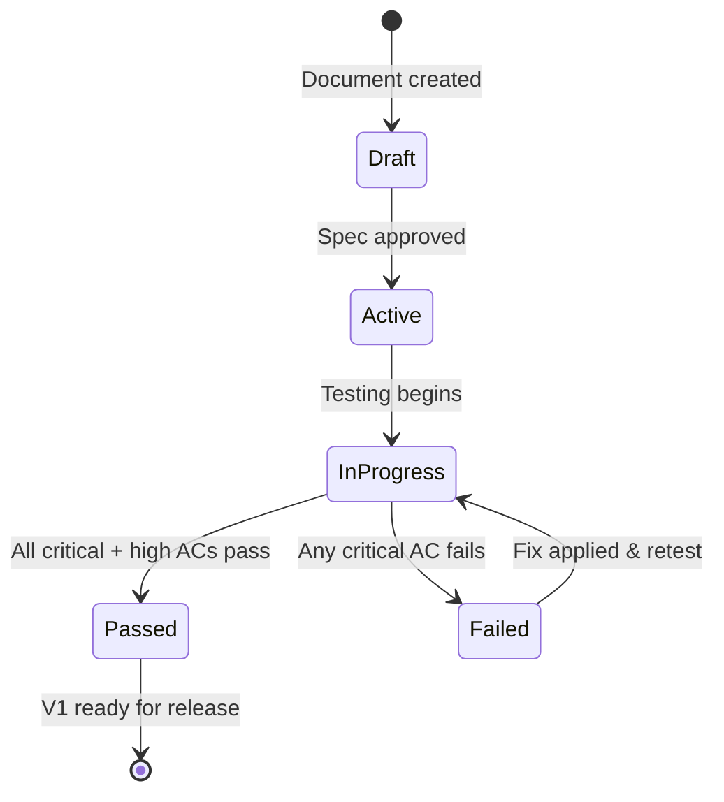

# Polish — Validation: Acceptance Criteria & Test Plan

> The key words **MUST**, **MUST NOT**, **REQUIRED**, **SHALL**, **SHALL NOT**, **SHOULD**, **SHOULD NOT**, **RECOMMENDED**, **MAY**, and **OPTIONAL** in this document are to be interpreted as described in [RFC 2119](https://www.ietf.org/rfc/rfc2119.txt).

---

## 1. Traceability Matrix

| Req ID | Requirement Summary | Keyword | Test Case IDs | Platform | Status |
|--------|-------------------|---------|---------------|----------|--------|
| G-07 | No third-party data transmission | MUST | AC-SEC-01 | Both | — |
| G-08 | Offline access | MUST | AC-P-04 | Both | — |

---

## 2. Acceptance Criteria

---

**AC-P-01**: Accessibility

- **Given**: The app is running with VoiceOver enabled
- **When**: The user navigates all screens
- **Then**: Every interactive element **MUST** have an accessible label
  AND navigation **MUST** be possible using VoiceOver gestures alone
  AND Dynamic Type at the largest accessibility size **MUST NOT** cause text truncation that hides information
  AND no information **MUST** be conveyed by color alone
- **Priority**: High

---

**AC-P-02**: Performance

- **Given**: The app is profiled on minimum spec devices (iPhone SE 3rd gen, MacBook Air M1)
- **When**: Performance is measured
- **Then**: Cold start **MUST** be under 3 seconds (target: 1.5s)
  AND thread list scroll **MUST** maintain 60fps (hard floor: 30fps)
  AND opening a cached email **MUST** be under 500ms (target: 300ms)
  AND AI categorization per email **MUST** be under 2 seconds (target: 500ms)
  AND search first results **MUST** appear within 3 seconds (target: 1s)
  AND idle memory **MUST** be under 200MB (target: 100MB)
- **Priority**: Critical

---

**AC-P-03**: Memory Under AI Load

- **Given**: The AI model is loaded and performing inference
- **When**: Memory usage is measured
- **Then**: Peak memory during inference **MUST NOT** exceed 500MB above baseline
  AND after inference completes, the model **SHOULD** be unloaded within 30 seconds of idle
  AND if system memory pressure is detected, the model **MUST** be unloaded immediately
- **Priority**: High

---

**AC-P-04**: Offline Mode

- **Given**: The device is in airplane mode with previously synced emails
- **When**: The user interacts with the app
- **Then**: The thread list **MUST** display all synced threads
  AND tapping a thread **MUST** display the cached email content
  AND search **MUST** work against locally indexed data
  AND composing and sending **MUST** queue the email with a "will send when online" indicator
  AND when connectivity resumes, queued emails **MUST** send automatically
  AND sync **MUST** resume automatically on connectivity restoration
- **Priority**: High

---

**AC-SEC-01**: No Third-Party Data Transmission

- **Given**: A network traffic monitor (e.g., Charles Proxy) is configured
- **When**: The app is used through a full session (sync, read, compose, send, search, AI operations)
- **Then**: The only network connections **MUST** be to `imap.gmail.com`, `smtp.gmail.com`, and `oauth2.googleapis.com`
  AND zero connections to any analytics, crash reporting, or third-party AI service **MUST** be observed
  AND all connections **MUST** use TLS
- **Priority**: Critical

---

## 3. Edge Cases

Refer to all feature-specific edge cases. The full validation suite (IOS-P-08) exercises all edge cases across all features.

---

## 4. Performance Validation

Refer to Foundation validation Section 4 for the complete performance metrics table.

---

## 5. Validation Workflow

---

## 6. Device Test Matrix

Refer to Foundation validation Section 5 for the complete device test matrix.

---

## 7. Sign-Off

| Reviewer | Role | Date | Status |
|----------|------|------|--------|
| — | Spec Author | — | — |
| — | QA Lead | — | — |
| — | Engineering Lead | — | — |
