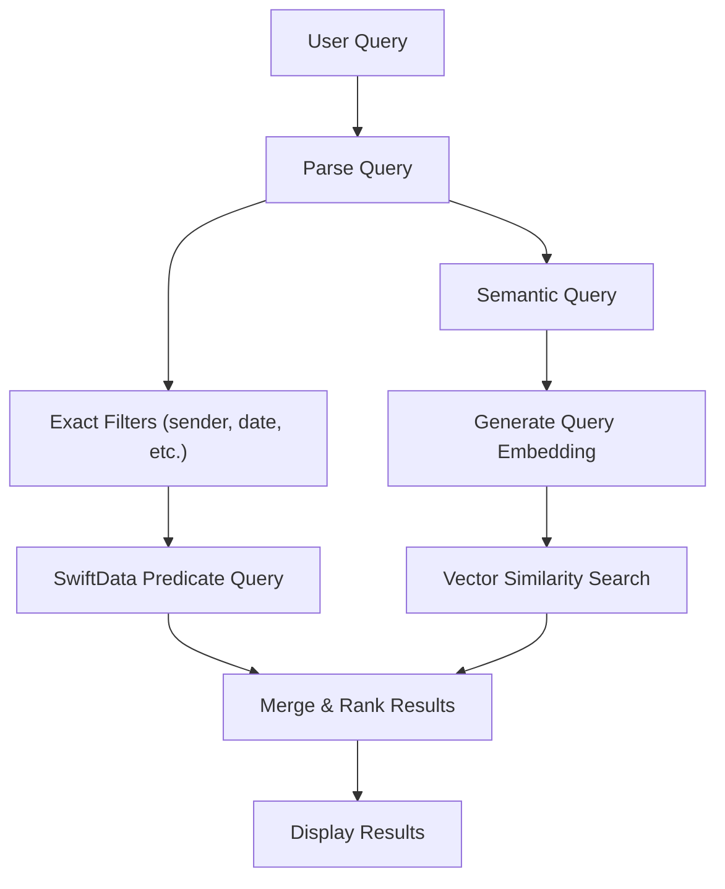

# Specification: Search

> The key words **MUST**, **MUST NOT**, **REQUIRED**, **SHALL**, **SHALL NOT**, **SHOULD**, **SHOULD NOT**, **RECOMMENDED**, **MAY**, and **OPTIONAL** in this document are to be interpreted as described in RFC 2119.

## 1. Summary

This specification defines the search feature — combining keyword-based exact matching with AI-powered semantic search. It covers the search UI, query parsing, filter system, and result display.

---

## 2. Goals and Non-Goals

### Goals

- Free-text search across all synced emails
- Combined semantic + exact-match search
- Search filters (sender, date, attachment, category, account)
- Search result display as thread list

### Non-Goals

- Server-side IMAP SEARCH (all search is local)
- Saved search / search folders
- Search across non-synced emails

---

## 3. Functional Requirements

### FR-SEARCH-01: Search Interface

- The client **MUST** provide a search bar accessible from the thread list.
- The client **MUST** support free-text search input.
- The client **SHOULD** display recent searches.
- The client **SHOULD** provide search filters: sender, date range, has attachment, category, account.
- The client **MUST** display search results as a thread list with highlighted matching terms.
- The client **MUST** support tapping a search result to navigate to the email detail.

### FR-SEARCH-02: Search Architecture

### FR-SEARCH-03: Result Ranking

- Search results **MUST** be ranked by relevance.
- Exact-match results and semantic-match results are merged with exact matches weighted higher for filter-based queries.
- Search **MUST** also support exact-match queries for sender, subject, and date range.

---

## 4. Non-Functional Requirements

### NFR-SEARCH-01: Search Speed

- **Metric**: Time from query submit to first results visible (10K email corpus)
- **Target**: < 1 second
- **Hard Limit**: 3 seconds

---

## 5. Data Model

Refer to Foundation spec Section 5 for SearchIndex entity. This feature reads SearchIndex (embeddings) and Email/Thread entities for exact-match queries.

---

## 6. Architecture Overview

Refer to Foundation spec Section 6. This feature uses:
- `SearchEmailsUseCase` → `SearchRepositoryProtocol` → `SearchRepositoryImpl`
- `SearchRepositoryImpl` → `EmbeddingEngine` (query embedding) + `VectorStore` (similarity search) + `SwiftDataStore` (exact match)
- Embedding engine and vector store are shared with AI Features (FR-AI-05)

---

## 7. Platform-Specific Considerations

### iOS
- Search presented from thread list search bar
- Results displayed in same thread list format

### macOS
- Search field in toolbar (Cmd+F focuses)
- Results displayed in thread list pane

---

## 8. Alternatives Considered

| Alternative | Pros | Cons | Rejected Because |
|-------------|------|------|-----------------|
| SQLite FTS5 only | No AI dependency, fast | Keyword-only, misses semantic matches | G-05 requires semantic search |
| IMAP SEARCH | No local index needed | Requires network, slower, limited query | Must work offline |

---

## 9. Open Questions

| # | Question | Owner | Target Date |
|---|----------|-------|-------------|
| — | — | — | — |

---

## 10. Revision History

| Version | Date | Author | Change Summary |
|---------|------|--------|---------------|
| 1.0.0 | 2025-02-07 | Core Team | Extracted from monolithic spec v1.2.0 section 5.7. |
