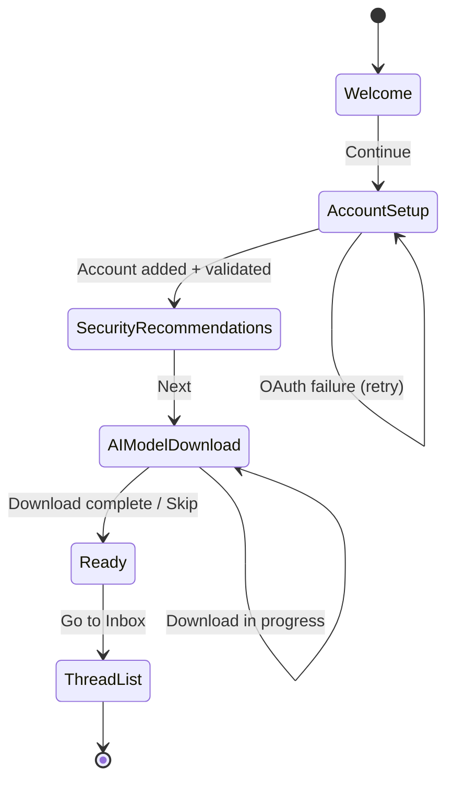
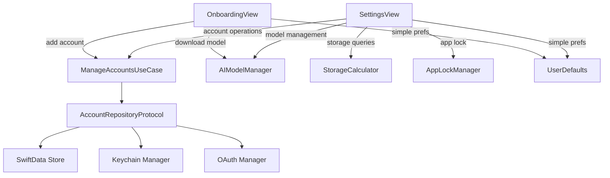

# Specification: Settings & Onboarding

> The key words **MUST**, **MUST NOT**, **REQUIRED**, **SHALL**, **SHALL NOT**, **SHOULD**, **SHOULD NOT**, **RECOMMENDED**, **MAY**, and **OPTIONAL** in this document are to be interpreted as described in RFC 2119.

## 1. Summary

This specification defines the settings screen and first-launch onboarding flow. The settings screen provides all V1 configuration options: account management, sync preferences, AI model management, storage and data management, security (app lock), appearance, notifications, and legal compliance (privacy policy, licenses). The onboarding flow guides first-time users through privacy messaging, Gmail account setup via OAuth, security recommendations, optional AI model download with informed consent, and expected storage disclosure before initial sync.

---

## 2. Goals and Non-Goals

### Goals

- **G-01**: Comprehensive settings screen for all V1 configuration (accounts, sync, AI, appearance, security, storage, legal compliance)
- **G-02**: First-launch onboarding with privacy value proposition and security recommendations
- **G-03**: AI model download integration with informed consent — display source URL, file size, and license before download (per Proposal Section 3.4.1)
- **G-04**: 5 or fewer onboarding screens/steps
- **G-05**: Full accessibility: VoiceOver, Dynamic Type, WCAG 2.1 AA compliance (per Constitution TC-05)
- **G-06**: Per-account storage visibility and data management (per Foundation Section 8.2)
- **G-07**: App lock with biometric/passcode for additional privacy (per Foundation Section 9.2)
- **G-08**: In-app privacy policy and AI model license display (per Constitution LG-02, LG-03, Foundation Section 10.1)

### Non-Goals

- **NG-01**: In-app tutorial beyond onboarding (deferred to V2)
- **NG-02**: Settings export/import
- **NG-03**: Remote configuration
- **NG-04**: Custom cryptographic key derivation from biometrics (app lock uses the system biometric check via `LAContext` for authentication gating only — no cryptographic keys are derived from biometric data)
- **NG-05**: Data export (deferred to V2 — scope and format undefined for V1)

---

## 3. Functional Requirements

### FR-SET-01: Settings Screen

**Description**

The client **MUST** provide a settings screen accessible from the main navigation (Thread List toolbar/sidebar). The settings screen is organized into logical sections, each containing related configuration options. All settings changes **MUST** persist across app restarts (see NFR-SET-01).

**Settings Sections**

| Section | Setting | Type | Default | Cross-ref |
|---------|---------|------|---------|-----------|
| Accounts | Per-account settings | Section | — | FR-SET-02 |
| Composition | Default account | Picker | First added | FR-ACCT-02 |
| Composition | Undo send delay | Picker (0/5/10/15/30s) | 5 seconds | Email Composer FR-COMP-02 |
| Appearance | Theme | System/Light/Dark | System | — |
| Appearance | Category tabs visible | Toggle per category | All on | Thread List FR-TL-02 |
| AI Features | AI model management | Section | — | FR-SET-04 |
| Notifications | Per-account notifications | Toggle per account | On | — |
| Security | App lock | Toggle | Off | Foundation Section 9.2 |
| Data Management | Storage, cache, wipe | Section | — | FR-SET-03 |
| About | Version, licenses, privacy | Section | — | FR-SET-05 |

**Behavioral Details**

- **Sync window**: Per-account picker (7/14/30/60/90 days, default 30). When the sync window is reduced, the client **MUST** display a confirmation: "Reducing the sync window will remove local copies of older emails. Server emails are not affected." Purge of local emails outside the new window **SHOULD** occur within 24 hours (per Foundation Section 8.3). Purging **MUST NOT** delete emails from the IMAP server.
- **Default account**: Picker listing all active accounts. Used for new email compositions (cross-ref FR-ACCT-02). If only one account exists, this setting **SHOULD** be hidden.
- **Undo send delay**: Picker (0 = disabled, 5, 10, 15, 30 seconds; default 5s). Change applies to the next send. Cross-ref Email Composer FR-COMP-02.
- **Category tabs visible**: Toggle per category (Primary, Social, Promotions, Updates). All on by default. When a category is hidden, threads in that category still appear in the "All" tab (cross-ref Thread List FR-TL-02). If AI features are unavailable (model not downloaded), category toggles **SHOULD** be disabled with a note: "Download AI model to enable categories."
- **Notifications**: Per-account toggle to enable/disable new email notifications. Notifications are driven by IMAP IDLE and background fetch only — no push notification relay server (per Constitution P-02).
  - **Foreground (IMAP IDLE active)**: When new mail arrives via IDLE, the client **MUST** display an in-app banner notification (non-persistent) and update the unread badge count. No system notification is generated while the app is foregrounded.
  - **Background (BGAppRefreshTask)**: When background fetch detects new mail, the client **SHOULD** post a local notification via `UNUserNotificationCenter` (title: sender name, body: subject line, badge: updated unread count). Local notifications do not require a push relay server.
  - **IMAP IDLE inactive (background on iOS)**: IMAP IDLE is terminated when the app enters background on iOS (per Email Sync FR-SYNC-03). New mail detection in background relies solely on `BGAppRefreshTask`.
  - **Notification permission**: The client **MUST** request notification permission (`UNUserNotificationCenter.requestAuthorization(options: [.alert, .badge, .sound])`) before posting local notifications. Permission **SHOULD** be requested on the first background-fetch-eligible event or when the user enables per-account notifications — not during onboarding. If the user denies system notification permission, the per-account toggle **MUST** remain functional (controlling in-app banners) but the client **SHOULD** display a note: "System notifications are disabled. Enable in iOS Settings to receive background alerts." with a button to open system Settings (`UIApplication.openSettingsURLString`).
- **Theme**: System/Light/Dark. Theme changes **MUST** apply immediately to the entire app (via SwiftUI `preferredColorScheme`).
- **App lock**: Toggle to require biometric (Face ID / Touch ID) or device passcode to open the app. Uses `LAContext.evaluatePolicy(.deviceOwnerAuthentication)` from LocalAuthentication framework, which handles both biometric and passcode fallback automatically. App lock applies at the app boundary only: cold launch and return from background (after the app has been in background for more than a few seconds). There is no within-app re-authentication for specific screens or actions in V1. Cross-ref Foundation Section 9.2.
- **Data management**: See FR-SET-03.
- **About**: See FR-SET-05.

**View States**

| State | Display |
|-------|---------|
| Default | Grouped list with all settings sections |
| Per-account editing | Account settings expanded (sync window, display name) |
| AI model downloading | Download progress bar with cancel button |
| AI model download failed | Error message with retry option |
| Storage loading | Loading indicator while calculating storage usage |
| Clear cache confirmation | Alert: "This will remove cached attachments and data. Emails and accounts will not be affected." with "Clear" and "Cancel" |
| Wipe all data confirmation | Critical alert: "This will delete ALL local data including emails, accounts, and AI models. This cannot be undone. You will need to set up the app again." with "Delete Everything" (destructive) and "Cancel" |
| App lock enrollment | System biometric/passcode prompt |

**Error Handling**

- If storage calculation fails, display "Unable to calculate storage" with a retry option.
- If AI model download fails (network error, checksum mismatch), display error with reason and retry option.
- If AI model SHA-256 checksum mismatch, **MUST** delete the corrupted file and display "Download verification failed. Please retry."
- If clear cache fails, display error and preserve existing data.
- If app lock biometric enrollment fails, the system automatically falls back to device passcode (handled by `LAContext`).

### FR-OB-01: Onboarding Flow

**Description**

The client **MUST** display a first-launch onboarding flow when no accounts are configured (first install or after all accounts/data are wiped). The onboarding flow guides the user through privacy messaging, account setup, security configuration, and optional AI model download. The flow **MUST** complete in 5 or fewer screens/steps.

**Onboarding Steps**

| Step | Screen | Content | Required | Next |
|------|--------|---------|----------|------|
| 1 | Welcome | Privacy value proposition: "Your emails stay on your device. No servers. No tracking. No compromise." App logo and branding. | Required (display) | Continue |
| 2 | Account Setup | "Add your Gmail account" with Add Account button. Invokes OAuth 2.0 PKCE flow via `ASWebAuthenticationSession` (cross-ref Account Management FR-ACCT-01, FR-ACCT-03). IMAP/SMTP connectivity **MUST** be validated before completing (FR-ACCT-01). At least one account **MUST** be added before proceeding. | Required (action) | Next (after ≥ 1 account added) |
| 3 | Security Recommendations | "Protect your data" screen per Proposal Section 6.4. Advise: (1) enable device passcode and biometric authentication, (2) enable app lock for additional privacy, (3) use encrypted backups, (4) keep the device OS updated, (5) review connected accounts periodically. On macOS: **SHOULD** also recommend FileVault enablement (per Foundation Section 9.2). Optional: toggle to enable app lock directly from this step. | Required (display), Optional (actions) | Next |
| 4 | AI Model Download | Per Proposal Section 3.4.1: display model source URL, file size, and license **before** download begins. Download button with progress indicator. Skip option clearly labeled: "Skip — the app works without AI features." SHA-256 integrity verification after download. Expected storage usage disclosure per Constitution TC-06: "The client MUST document expected storage usage during onboarding before initial sync." The disclosure **MUST** display a concrete range derived from the TC-06 Storage Budgeting table. For the first account with a 30-day default sync window, display: "Syncing your email typically uses 500 MB – 2 GB of storage on this device, depending on email volume. AI features require an additional 500 MB – 2 GB." If the sync window or account count differs, the client **SHOULD** adjust the range proportionally. Cross-ref TC-06 Storage Budgeting: email metadata 50–200 MB, email bodies 100 MB – 1 GB, attachments 0–500 MB, search index 50–200 MB, AI models 500 MB – 2 GB; total estimate 700 MB – 4 GB per account + models. | Required (display), Optional (download) | Next / Skip |
| 5 | Ready | Brief feature tour: swipe gestures (archive/delete), AI categorization, smart reply, search. "You're all set" confirmation with "Go to Inbox" button. | Required (display) | Go to Inbox |

**Post-Onboarding Behavior**

- On completion, the client **MUST** trigger initial sync for all added accounts (cross-ref Email Sync FR-SYNC-01).
- The client **MUST** navigate to the Thread List (Inbox view).
- The client **MUST** persist that onboarding is complete (`isOnboardingComplete` flag in UserDefaults) so it does not re-display on subsequent launches.
- If the user removes all accounts from Settings (FR-SET-02), the client **MUST** re-trigger the onboarding flow. This ensures the user always has at least one account configured and sees the privacy messaging again.

**Onboarding Error Handling**

| Scenario | Behavior |
|----------|----------|
| OAuth flow cancelled by user | Return to Account Setup screen, allow retry or try different account |
| OAuth flow network failure | Display "Network unavailable. Check your connection and try again." with Retry |
| OAuth token exchange fails | Display "Authentication failed. Please try again." with Retry |
| IMAP/SMTP validation fails after OAuth | Display "Couldn't connect to Gmail. Please check account permissions." with Retry |
| AI model download network failure | Display "Download failed. You can download later in Settings." with Skip option |
| AI model SHA-256 checksum mismatch | Delete corrupted file, display "Download verification failed. Please retry." with Retry and Skip |
| AI model download cancelled by user | Return to download screen with Skip option available |

**Onboarding Flow Diagram**



### FR-SET-02: Account Settings Surface

**Description**

The settings screen **MUST** surface account-related configuration defined in the Account Management spec. All account operations are performed via `ManageAccountsUseCase` (per Foundation FR-FOUND-01).

- The client **MUST** list all configured accounts with email address and active/inactive status indicator.
- Per-account settings:
  - **Sync window**: Picker (7/14/30/60/90 days, default 30) per FR-ACCT-02.
  - **Display name**: Editable text field per FR-ACCT-02.
- **Add Account** button: invokes OAuth 2.0 flow per FR-ACCT-01/FR-ACCT-03. IMAP/SMTP connectivity **MUST** be validated before completing setup.
- **Remove Account**: **MUST** display a destructive confirmation: "Remove [email]? All local emails, drafts, and cached data for this account will be deleted." On confirmation, cascade delete per FR-ACCT-05 (Folders, EmailFolder, Emails, Threads, Attachments, SearchIndex, Keychain items). If this is the last account, removing it **MUST** re-trigger the onboarding flow.
- **Inactive account**: If an account has entered `inactive` state due to token refresh exhaustion (FR-ACCT-04), the account row **MUST** display a warning badge with a "Re-authenticate" action that re-initiates the OAuth flow. Inactive accounts **MUST NOT** be silently hidden.

### FR-SET-03: Storage & Data Management

**Description**

The settings screen **MUST** provide storage visibility and data management actions per Foundation Sections 8.1, 8.2, and 9.3.

- **Storage usage display**: The client **MUST** display per-account storage breakdown (emails, downloaded attachments, search index) and total app storage usage (per Foundation Section 8.2).
- **Warnings**:
  - Per-account storage exceeding 2 GB **MUST** display a warning (per Foundation Section 8.2).
  - Total app storage exceeding 5 GB **SHOULD** display a proactive warning.
- **Attachment cache limit**: Configurable per account, default 500 MB. LRU eviction when limit exceeded (per Foundation Section 8.1).
- **"Clear Cache"**: Removes downloaded attachments and regenerable caches (search embeddings, AI category cache) **without** deleting emails, accounts, or AI models. The client **MUST** display the amount of space that will be freed before confirmation (per Foundation Section 8.2).
- **"Wipe All Data"**: Deletes all accounts, emails, AI models, caches, and Keychain items. **MUST** require a critical destructive confirmation dialog. After wipe, the client **MUST** re-trigger the onboarding flow (per Foundation Section 9.3).

### FR-SET-04: AI Model Management

**Description**

The settings screen **MUST** provide AI model management per Foundation Section 10.1 and Proposal Section 3.4.1.

- **Model status display**: Not downloaded / Downloading (with progress) / Downloaded.
- **Model details**: File size, source URL.
- **Before download**: The client **MUST** display the model source URL, file size, and license (per Proposal Section 3.4.1).
- **Download**: **MUST** use HTTPS. **MUST** be resumable (HTTP Range requests). **MUST** perform SHA-256 integrity verification after download. If verification fails, **MUST** delete the corrupted file and prompt re-download.
- **Delete model**: **MUST** display confirmation: "Deleting the AI model will disable smart categories, smart reply, and thread summarization." On deletion, AI features **MUST** degrade gracefully (hidden, not errored — per Foundation Section 11).
- **License info**: Accessible via Settings > About > AI Model Licenses (per Constitution LG-01, Foundation Section 10.1).

### FR-SET-05: Privacy & Legal

**Description**

The settings screen **MUST** provide access to legal and privacy information per Constitution LG-02, LG-03, and Foundation Section 10.3.

- **In-app privacy policy**: Accessible from Settings > About > Privacy Policy. The same URL **MUST** be provided on the OAuth consent screen (per Constitution LG-02).
- **Open Source Licenses**: Page listing all third-party dependency licenses.
- **AI Model Licenses**: Page listing AI model license details (model name, license type, source — per Constitution LG-01, Foundation Section 10.1).
- **App version**: Display version number and build number.

---

## 4. Non-Functional Requirements

### NFR-SET-01: Settings Persistence

- **Metric**: Settings changes persist across app restarts
- **Target**: Immediate persistence (written before UI confirms change)
- **Hard Limit**: < 1 second
- **Measurement**: Change a setting, force-quit the app, relaunch — setting must reflect the change
- **Failure Threshold**: Fails if any setting reverts after force-quit

### NFR-SET-02: Accessibility

- **WCAG 2.1 AA**: All UI elements **MUST** meet WCAG 2.1 AA contrast ratios (4.5:1 for normal text, 3:1 for large text/icons) per Constitution TC-05.
- **VoiceOver**: All settings controls **MUST** be navigable and labeled. Toggle switches **MUST** announce current state (on/off). Pickers **MUST** announce selected value. Account list items **MUST** announce email address and active/inactive status. Onboarding screens **MUST** be fully navigable with descriptive labels.
- **Dynamic Type**: All text **MUST** scale with Dynamic Type from accessibility extra small through accessibility 5 (xxxLarge). Layout **MUST NOT** break or clip at any supported size.
- **Color Independence**: Status indicators (inactive account badge, download states, storage warnings) **MUST** use icon/shape in addition to color — color **MUST NOT** be the sole indicator.
- **Reduce Motion**: Onboarding transitions **SHOULD** use crossfade instead of slide animations when "Reduce Motion" is enabled.

### NFR-SET-03: Onboarding Completion Time

- **Metric**: Time from first onboarding screen to Thread List visible (excluding AI model download time)
- **Target**: < 2 minutes for a user with one Gmail account ready
- **Hard Limit**: 5 minutes (including OAuth flow latency)
- **Measurement**: Stopwatch from Welcome screen appearing to Thread List appearing on iPhone SE 3rd gen
- **Failure Threshold**: Fails if > 5 minutes on 3 consecutive attempts

### NFR-SET-04: Settings Save Latency

- **Metric**: Time from user changing a setting to persistence confirmation
- **Target**: < 100ms
- **Hard Limit**: 500ms
- **Measurement**: Time from toggle/picker change event to UserDefaults/SwiftData write confirmation on iPhone SE 3rd gen
- **Failure Threshold**: Fails if > 500ms on 3 consecutive changes

### NFR-SET-05: Storage Calculation Time

- **Metric**: Time from opening Data Management section to display of per-account storage breakdown
- **Target**: < 2 seconds
- **Hard Limit**: 5 seconds
- **Measurement**: Time from navigation to Data Management section to all per-account breakdown values rendered on iPhone SE 3rd gen with 10K emails per account
- **Failure Threshold**: Fails if > 5 seconds on 3 consecutive attempts

---

## 5. Data Model

Refer to Foundation spec Section 5 for Account entity (per-account settings are stored on the Account entity in SwiftData). Simple app-wide preferences are stored in UserDefaults. No new SwiftData entities are introduced by this feature.

**Settings Storage Strategy**

| Setting | Storage | Key/Field | Rationale |
|---------|---------|-----------|-----------|
| Sync window | Account entity (SwiftData) | `Account.syncWindowDays` | Per-account relational data (FR-ACCT-02) |
| Display name | Account entity (SwiftData) | `Account.displayName` | Per-account relational data (FR-ACCT-02) |
| Default sending account | UserDefaults | `defaultSendingAccountId` | Simple account ID reference |
| Undo send delay | UserDefaults | `undoSendDelaySeconds` | Simple integer value |
| Theme | UserDefaults | `appTheme` | Simple string value |
| Category tab visibility | UserDefaults | `categoryTabVisibility` | JSON dictionary (category → Bool) |
| App lock enabled | UserDefaults | `appLockEnabled` | Simple boolean (LAContext handles biometric state) |
| Notification preferences | UserDefaults | `notificationPreferences` | JSON dictionary (accountId → Bool) |
| Attachment cache limit | UserDefaults | `attachmentCacheLimitMB` | Simple integer per account |
| Onboarding completed | UserDefaults | `isOnboardingComplete` | Simple boolean flag |

**Settings Enums**

```
AppTheme: system | light | dark
UndoSendDelay: 0 | 5 | 10 | 15 | 30 (seconds)
SyncWindow: 7 | 14 | 30 | 60 | 90 (days)
```

---

## 6. Architecture Overview

Refer to Foundation spec Section 6. This feature uses:



**Note**: Per project architecture (CLAUDE.md), this feature uses the MV (Model-View) pattern with `@Observable` services and SwiftUI native state management. No ViewModels — view logic is in the SwiftUI views using `@State`, `@Environment`, and `.task` modifiers. Per Foundation FR-FOUND-01, views **MUST** call domain use cases only — never repositories directly.

**Feature-Specific Services**: `AppLockManager` wraps `LAContext` for biometric/passcode evaluation. `StorageCalculator` queries SwiftData for per-account and total storage usage. `SettingsStore` is an `@Observable` service that reads/writes UserDefaults-backed preferences. These are feature-scoped services, not domain use cases.

---

## 7. Platform-Specific Considerations

### iOS

- **Settings presentation**: `NavigationStack` with grouped `List` using `.listStyle(.insetGrouped)`. Accessible from Thread List toolbar.
- **Onboarding presentation**: Full-screen modal via `.fullScreenCover`. Step navigation using a `TabView` with `.tabViewStyle(.page)` or custom step-based flow with progress indicator dots.
- **App lock**: Uses `LAContext.evaluatePolicy(.deviceOwnerAuthentication)` which handles Face ID, Touch ID, and device passcode fallback automatically.
- **Adaptive layout**: **MUST** support iPhone SE (375pt width) through iPhone Pro Max (430pt width). Both portrait and landscape orientations **MUST** be supported (per Foundation Section 7.1).
- **Photo picker**: Not applicable to this feature.
- **Deep link**: Settings **SHOULD** be accessible via a consistent navigation path from any screen.

### macOS

- **Settings presentation**: Uses the macOS `Settings` scene pattern (`Settings { SettingsView() }`). Opened via `⌘,` (standard macOS convention). Tab-based or sidebar-based section navigation.
- **Onboarding presentation**: Window-based flow using a dedicated `Window` scene. Centered on screen with appropriate sizing.
- **App lock**: Uses the same `LAContext` API; Touch ID on Mac or device password.
- **FileVault**: Security recommendations step **SHOULD** include a recommendation to enable FileVault for full-disk encryption (per Foundation Section 9.2).
- **Keyboard shortcuts**: `⌘,` — Open Settings (standard macOS convention).
- **Multiple windows**: Settings window is a singleton — opening Settings when already open **SHOULD** bring the existing window to front.

---

## 8. Alternatives Considered

| Alternative | Pros | Cons | Rejected Because |
|-------------|------|------|-----------------|
| System Settings integration (iOS Settings.bundle) | Native feel on iOS | Limited customization; can't show storage breakdown or AI model management | Need app-specific settings not supported by system |
| No onboarding flow | Faster to first use | Confusing first experience; no privacy messaging | Account setup is required; privacy messaging is critical to brand |
| Wizard-style onboarding (10+ steps) | More thorough setup | User fatigue; high abandonment rate | 5 screens max balances thoroughness with completion rate |
| SwiftData for all preferences | Unified storage layer | Overhead for simple key-value data; requires ModelContainer setup for every read | UserDefaults is simpler and more appropriate for non-relational preferences |
| Skip security recommendations screen | Fewer onboarding steps (4 instead of 5) | Misses key privacy messaging opportunity | Proposal Section 6.4 explicitly recommends it; aligns with privacy-first brand |

---

## 9. Open Questions

None — all resolved.

---

## 10. Revision History

| Version | Date | Author | Change Summary |
|---------|------|--------|---------------|
| 1.0.0 | 2025-02-07 | Core Team | Extracted from monolithic spec v1.2.0 sections 5.8 and 5.9. |
| 1.2.0 | 2026-02-08 | Core Team | Team review feedback (v1.1.0 → v1.2.0): F-01 — added notification UX behavioral detail (in-app banner for foreground IDLE, local notification for background fetch via UNUserNotificationCenter, notification permission flow with denied-state handling). F-02 — clarified app lock scope (app boundary only: cold launch + background return; no within-app re-authentication in V1). F-03 — replaced `[estimated range]` placeholder with concrete storage ranges from Constitution TC-06 Storage Budgeting table (500 MB – 2 GB per account + 500 MB – 2 GB AI). F-05 — added NFR-SET-05 (storage calculation time: < 2s target, 5s hard limit). F-06 — reworded NG-04 to clarify "custom cryptographic key derivation from biometrics." |
| 1.1.0 | 2026-02-08 | Core Team | Full review: Added G-XX/NG-XX IDs (SF-03). Expanded depends-on to include Proposal, Account Management, Email Sync, Email Composer, Thread List. Expanded FR-SET-01 with behavioral details for every setting (sync window purge confirmation, category tab AI dependency, app lock via LAContext, theme immediate apply), view states table (8 states), and error handling. Expanded FR-OB-01 with 5-step detail table (welcome, OAuth account setup with IMAP validation, security recommendations per Proposal 6.4, AI model download per Proposal 3.4.1 with SHA-256/skip, ready with initial sync trigger), post-onboarding behavior (persist flag, trigger sync, re-trigger on all accounts removed), error handling table (7 scenarios), Mermaid state diagram. Added FR-SET-02 (account settings surface: per-account config, add/remove account, inactive badge per FR-ACCT-04). Added FR-SET-03 (storage & data management: per-account breakdown, clear cache, wipe all data per Foundation 8.2/9.3). Added FR-SET-04 (AI model management: status, URL/size/license, resumable download, SHA-256, delete per Proposal 3.4.1). Added FR-SET-05 (privacy & legal: in-app privacy policy per LG-02, open source licenses, AI model licenses per LG-01). Expanded NFR-SET-01 with measurement method and failure threshold. Added NFR-SET-02 (accessibility per TC-05). Added NFR-SET-03 (onboarding completion time). Added NFR-SET-04 (settings save latency). Replaced data model with storage strategy table and settings enums. Replaced architecture with Mermaid diagram and MV pattern note. Expanded platform-specific for iOS (NavigationStack, fullScreenCover, LAContext, adaptive layout) and macOS (Settings scene, Cmd+comma, FileVault recommendation). Added 3 alternatives. Resolved Open Questions (Export Data deferred as NG-05, re-onboarding on all accounts removed). |
