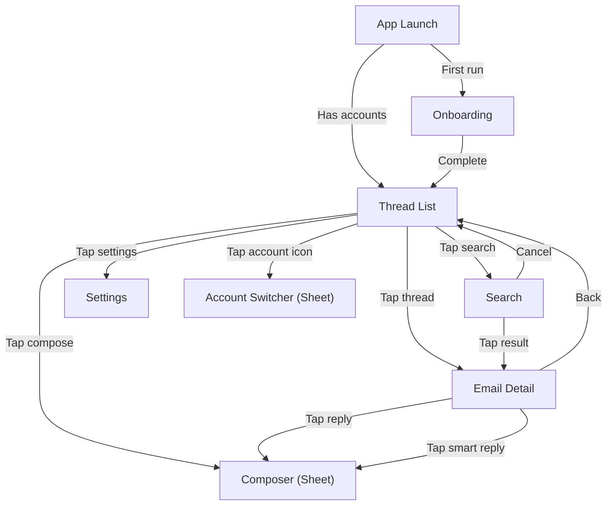

# Thread List — iOS/macOS Implementation Plan

---

## 1. Scope

This plan covers the thread list screen implementation: navigation structure, thread list view, thread row component, gestures, and account switcher.

---

## 2. Platform Context

Refer to Foundation plan Section 2 for OS versions, device targets, and platform guidelines.

---

## 3. Architecture Mapping

### iOS Navigation Flow



### iOS Thread Row Layout

```
┌──────────────────────────────────────────────────────────┐
│ [Avatar] Sender Name              2:30 PM  [★] [📎]     │
│          Subject line goes here...          [Primary]    │
│          Snippet of the latest message in this thread... │
│          ● (unread indicator)                            │
└──────────────────────────────────────────────────────────┘
```

### Files

| File | Layer | Purpose |
|------|-------|---------|
| `iOSNavigationRouter.swift` | iOS/Navigation | Route definitions, navigation state |
| `ThreadListView.swift` | iOS/Views/ThreadList | Main thread list screen |
| `ThreadListViewModel.swift` | iOS/Views/ThreadList | Data fetching, filtering, sorting |
| `ThreadRowView.swift` | iOS/Views/ThreadList | Individual thread row |
| `AvatarView.swift` | iOS/Views/Components | Sender avatar |
| `CategoryBadgeView.swift` | iOS/Views/Components | AI category badge |

---

## 4. Implementation Phases

| Task ID | Description | Dependencies |
|---------|-------------|-------------|
| IOS-U-01 | iOS navigation structure + router | Phase 1 (Foundation + Account Management + Email Sync) |
| IOS-U-02 | Thread list view + view model | IOS-U-01, IOS-F-10 (Email Sync) |
| IOS-U-03 | Thread row component (avatar, snippet, badges) | IOS-U-02 |
| IOS-U-04 | Pull-to-refresh + swipe actions | IOS-U-02 |
| IOS-U-12 | Account switcher + multi-account thread list | IOS-U-02 |

---

## 5. Risks and Mitigations

| Risk | Likelihood | Impact | Mitigation |
|------|-----------|--------|------------|
| Thread list scroll jank with 500+ threads | Medium | High | Use LazyVStack, avoid complex view recomputations, profile early |
