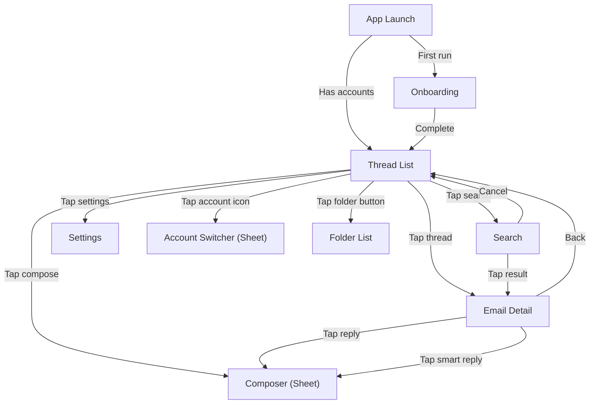
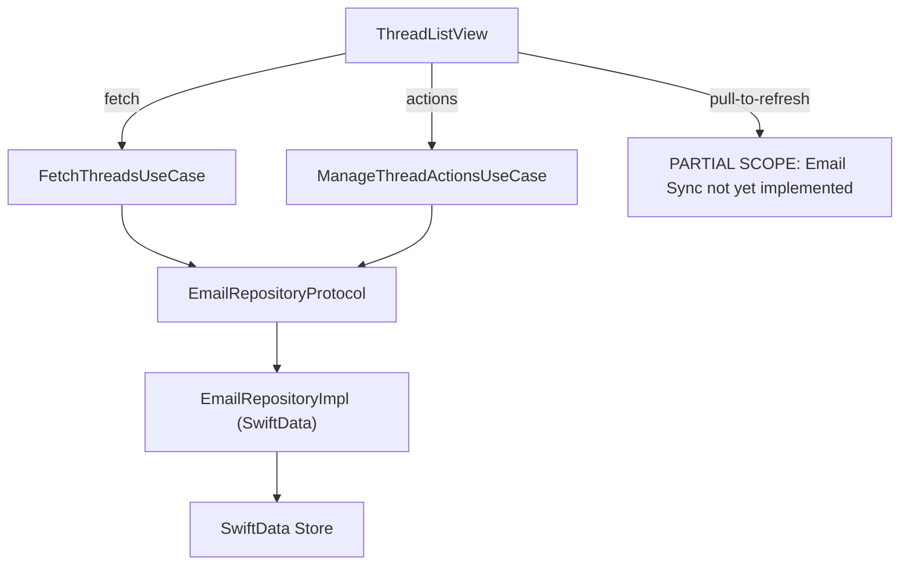

# Thread List — iOS/macOS Implementation Plan

---

## 1. Scope

This plan covers the thread list screen implementation: navigation structure, thread list view, thread row component, gestures, folder navigation, account switcher, and Outbox display. It is the first UI feature and the primary user-facing screen.

This plan also covers the **domain layer extensions** (new use cases, repository protocol expansion, Participant model) and the **data layer** (SwiftData repository implementation) required to support the thread list feature.

---

## 2. Platform Context

Refer to Foundation plan Section 2 for OS versions, device targets, and platform guidelines.

---

## 3. Spec Review Decisions

During plan review, the following ambiguities and gaps from the spec were resolved:

| # | Issue | Resolution |
|---|-------|------------|
| 1 | Thread↔Folder has no direct relationship (path: Folder→EmailFolder→Email→Thread) | Use case resolves the join in 3 steps; acceptable perf for V1 at 500 threads |
| 2 | `EmailRepositoryProtocol` too thin for pagination | Extend with ~15 new methods for paginated queries, actions, and batch ops |
| 3 | Compose button: spec says "FAB or toolbar button" | Toolbar trailing button (standard iOS SwiftUI pattern, not FAB) |
| 4 | iOS folder access: spec says "sidebar or navigation menu" | Toolbar leading button navigates to `FolderListView` (no persistent sidebar on iPhone) |
| 5 | Outbox is virtual, no `FolderType` enum value | Computed filter: emails where `sendState ∈ {queued, sending, failed}` |
| 6 | Category tab persistence "per folder" | In-memory `@State` dictionary `[String: AICategory?]` keyed by folderId, not persisted across launches |
| 7 | Account indicator in unified view: spec says "colored dot or small avatar" | Colored dot derived from deterministic hash of account id |
| 8 | "Most recent sender" for avatar: `participants` field format unclear | `Thread.participants` is a JSON string. New `Participant` model: `Codable Sendable` struct with `name: String?`, `email: String`, with static `decode(from:)` / `encode(_:)` methods |
| 9 | Spec references `NavigationRouter.swift` with @Observable route state | Not needed — SwiftUI's built-in `NavigationStack` with `navigationDestination(for:)` is sufficient. No separate router file |
| 10 | Spec references individual use cases (ArchiveThreadUseCase, DeleteThreadUseCase, etc.) | Consolidated into two use cases: `FetchThreadsUseCase` (read operations) and `ManageThreadActionsUseCase` (write operations) for simplicity |

---

## 4. Architecture Mapping

### iOS Navigation Flow



### iOS Thread Row Layout

```
┌──────────────────────────────────────────────────────────┐
│ [Avatar] Sender Name              2:30 PM  [★] [📎]     │
│          Subject line goes here...          [Primary]    │
│          Snippet of the latest message in this thread... │
│          ● (unread indicator)                            │
└──────────────────────────────────────────────────────────┘
```

### Architecture Layers



### Thread-to-Folder Query Strategy

SwiftData cannot join across 3 relationships (Folder→EmailFolder→Email→Thread) in a single `#Predicate`. The repository implementation uses a 3-step strategy:

1. Fetch `EmailFolder` entries for the target `folderId`
2. Collect unique `threadId` values via the Email relationship
3. Fetch `Thread` objects by those IDs, applying category/cursor/limit filters

### Pagination Strategy

Cursor-based using `latestDate`:
- **Page 1**: `cursor = nil` → fetch first 25 by `latestDate` DESC
- **Page N**: `cursor = lastThread.latestDate` → fetch where `latestDate < cursor`
- Fetch `limit + 1` rows; if returned count > limit, `hasMore = true`, drop last
- Stable across concurrent inserts (unlike offset-based pagination)

---

## 5. File Inventory

### New Source Files (22)

All under `VaultMailPackage/Sources/VaultMailFeature/`:

| # | Path | Layer | Purpose |
|---|------|-------|---------|
| 1 | `Domain/Errors/ThreadListError.swift` | Domain | Error enum: fetchFailed, actionFailed, threadNotFound, folderNotFound |
| 2 | `Domain/Models/Participant.swift` | Domain | Codable Sendable struct for JSON participant parsing |
| 3 | `Domain/UseCases/FetchThreadsUseCase.swift` | Domain | Protocol + impl: paginated thread queries, unread counts, folder list, outbox |
| 4 | `Domain/UseCases/ManageThreadActionsUseCase.swift` | Domain | Protocol + impl: archive, delete, toggleRead, toggleStar, move (single + batch) |
| 5 | `Data/Repositories/EmailRepositoryImpl.swift` | Data | @MainActor SwiftData implementation of extended EmailRepositoryProtocol |
| 6 | `Shared/Models/ThreadPage.swift` | Shared | `ThreadPage` struct: threads array, nextCursor, hasMore |
| 7 | `Shared/Extensions/Date+RelativeFormat.swift` | Shared | Relative timestamp formatting for thread row |
| 8 | `Presentation/ThreadList/ThreadListView.swift` | Presentation | Main thread list screen with state management, pagination, toolbar |
| 9 | `Presentation/ThreadList/ThreadRowView.swift` | Presentation | Thread row: avatar, sender, subject, snippet, indicators |
| 10 | `Presentation/ThreadList/CategoryTabBar.swift` | Presentation | Horizontal category filter tabs with unread badges |
| 11 | `Presentation/ThreadList/CategoryBadgeView.swift` | Presentation | AI category colored pill badge |
| 12 | `Presentation/ThreadList/AvatarView.swift` | Presentation | Sender avatar with initials + deterministic color |
| 13 | `Presentation/ThreadList/UndoToastView.swift` | Presentation | Floating undo toast with 5s auto-dismiss |
| 14 | `Presentation/ThreadList/MultiSelectToolbar.swift` | Presentation | Bottom toolbar for batch actions in multi-select mode |
| 15 | `Presentation/ThreadList/MoveToFolderSheet.swift` | Presentation | Folder picker sheet for Move action |
| 16 | `Presentation/ThreadList/FolderListView.swift` | Presentation | System folders + custom labels + Outbox with badges |
| 17 | `Presentation/ThreadList/OutboxRowView.swift` | Presentation | Outbox email row: send state, retry/cancel |
| 18 | `Presentation/ThreadList/AccountSwitcherSheet.swift` | Presentation | Account list sheet with unified inbox option |
| 19 | `Presentation/ThreadList/AccountIndicatorView.swift` | Presentation | Colored dot for unified mode account indicator |
| 20 | `Presentation/ThreadList/EmailDetailPlaceholder.swift` | Presentation | Placeholder for Email Detail (future feature) |
| 21 | `Presentation/ThreadList/ComposerPlaceholder.swift` | Presentation | Placeholder for Composer (future feature) |
| 22 | `Presentation/ThreadList/SearchPlaceholder.swift` | Presentation | Placeholder for Search (future feature) |

### New Test Files (6)

All under `VaultMailPackage/Tests/VaultMailFeatureTests/`:

| # | Path | Tests |
|---|------|-------|
| 1 | `Mocks/MockEmailRepository.swift` | In-memory mock implementing full extended protocol |
| 2 | `ParticipantTests.swift` | JSON decode/encode, nil, empty, malformed, round-trip |
| 3 | `FetchThreadsUseCaseTests.swift` | Pagination, category filter, unified merge, outbox, unread counts, errors |
| 4 | `ManageThreadActionsUseCaseTests.swift` | Archive/delete/read/star/move single + batch, errors |
| 5 | `EmailRepositoryImplTests.swift` | SwiftData integration: pagination, category, unified, mutations, outbox |
| 6 | `DateRelativeFormatTests.swift` | All 5 timestamp buckets, edge cases (midnight, year boundary) |

### Modified Files (4)

| # | Path | Changes |
|---|------|---------|
| 1 | `Domain/Protocols/EmailRepositoryProtocol.swift` | Add ~15 new method signatures for pagination, actions, and batch ops |
| 2 | `Shared/Constants.swift` | Add `threadListPageSize = 25` |
| 3 | `ContentView.swift` | Replace `mainAppView` placeholder with `ThreadListView`, add use case properties |
| 4 | `VaultMailApp.swift` | Wire `EmailRepositoryImpl`, `FetchThreadsUseCase`, `ManageThreadActionsUseCase` |

---

## 6. Implementation Phases

### Phase 1: Domain Layer Extensions

**Goal**: Extend repository protocol, add error type, add Participant model, add ThreadPage.

| Task ID | File | Description |
|---------|------|-------------|
| IOS-U-06 | `ThreadListError.swift` | Error enum for thread list operations |
| IOS-U-06 | `Participant.swift` | Codable Sendable struct for JSON participant parsing |
| IOS-U-06 | `EmailRepositoryProtocol.swift` | Add ~15 new method signatures |
| IOS-U-06 | `Constants.swift` | Add `threadListPageSize = 25` |
| IOS-U-06 | `ThreadPage.swift` | Pagination result struct |
| — | `MockEmailRepository.swift` | In-memory mock for testing |
| — | `ParticipantTests.swift` | Participant model unit tests |

### Phase 2: Use Cases

**Goal**: Create FetchThreadsUseCase and ManageThreadActionsUseCase with full test coverage.

| Task ID | File | Description |
|---------|------|-------------|
| IOS-U-07 | `FetchThreadsUseCase.swift` | Protocol + @MainActor impl for paginated queries |
| IOS-U-08 | `ManageThreadActionsUseCase.swift` | Protocol + @MainActor impl for thread actions |
| — | `FetchThreadsUseCaseTests.swift` | Pagination, filtering, unified, outbox, error tests |
| — | `ManageThreadActionsUseCaseTests.swift` | Single + batch action tests, error propagation |

### Phase 3: Data Layer — Repository Implementation

**Goal**: SwiftData implementation of extended EmailRepositoryProtocol.

| Task ID | File | Description |
|---------|------|-------------|
| IOS-U-09 | `EmailRepositoryImpl.swift` | @MainActor SwiftData queries using 3-step join strategy |
| — | `EmailRepositoryImplTests.swift` | Integration tests with in-memory ModelContainer |

### Phase 4: Thread Row Component (IOS-U-03)

**Goal**: Build pure view components with no data fetching dependencies.

| Task ID | File | Description |
|---------|------|-------------|
| IOS-U-03 | `ThreadRowView.swift` | Full thread row with accessibility |
| IOS-U-03 | `AvatarView.swift` | Initials avatar with deterministic color |
| IOS-U-03 | `CategoryBadgeView.swift` | AI category colored pill badge |
| IOS-U-03 | `Date+RelativeFormat.swift` | Relative timestamp formatting |
| — | `DateRelativeFormatTests.swift` | Timestamp format unit tests |

### Phase 5: Thread List View + Category Tabs (IOS-U-01, IOS-U-02)

**Goal**: Main thread list screen with category filtering and pagination.

| Task ID | File | Description |
|---------|------|-------------|
| IOS-U-01/02 | `ThreadListView.swift` | Main view with NavigationStack, state management, pagination |
| IOS-U-02 | `CategoryTabBar.swift` | Horizontal filter tabs with unread badges |
| — | `ContentView.swift` | Replace placeholder with ThreadListView |
| — | `VaultMailApp.swift` | Wire repository + use cases |

### Phase 6: Interactions (IOS-U-04)

**Goal**: Pull-to-refresh, swipe gestures, undo toast, multi-select with batch actions.

| Task ID | File | Description |
|---------|------|-------------|
| IOS-U-04 | `UndoToastView.swift` | Floating bottom toast with 5s auto-dismiss |
| IOS-U-04 | `MultiSelectToolbar.swift` | Bottom toolbar for batch actions |
| IOS-U-04 | `MoveToFolderSheet.swift` | Folder picker for Move action |
| IOS-U-04 | `ThreadListView.swift` (modify) | Add swipe actions, refreshable, multi-select |
| IOS-U-04 | `ThreadRowView.swift` (modify) | Add checkbox overlay for multi-select |

### Phase 7: Folder Navigation + Outbox (IOS-U-05)

**Goal**: Folder list and virtual Outbox.

| Task ID | File | Description |
|---------|------|-------------|
| IOS-U-05 | `FolderListView.swift` | System folders + labels + Outbox with badges |
| IOS-U-05 | `OutboxRowView.swift` | Send state display with retry/cancel |
| IOS-U-05 | `ThreadListView.swift` (modify) | Toolbar folder button, folder selection |

### Phase 8: Account Switcher + Unified Inbox (IOS-U-12)

**Goal**: Multi-account navigation and unified inbox.

| Task ID | File | Description |
|---------|------|-------------|
| IOS-U-12 | `AccountSwitcherSheet.swift` | Account list with unified option |
| IOS-U-12 | `AccountIndicatorView.swift` | Colored dot for unified mode |
| IOS-U-12 | `ThreadListView.swift` (modify) | Account button, unified mode |
| IOS-U-12 | `ThreadRowView.swift` (modify) | Optional account color indicator |

### Phase 9: Navigation Placeholders + Final Wiring

**Goal**: Add placeholder destinations for features not yet built.

| Task ID | File | Description |
|---------|------|-------------|
| — | `EmailDetailPlaceholder.swift` | Placeholder for Email Detail |
| — | `ComposerPlaceholder.swift` | Placeholder for Composer |
| — | `SearchPlaceholder.swift` | Placeholder for Search |
| — | `ThreadListView.swift` (modify) | Wire navigation destinations |

---

## 7. Key Design Details

### Undo Toast Flow

1. Optimistically remove thread from `@State threads` array
2. Show `UndoToastView` with 5s `Task.sleep` timer
3. On timer expiry → call `manageThreadActions.archiveThread(id:)` or `.deleteThread(id:)`
4. On "Undo" tap → cancel timer task, re-insert thread at original index
5. On action failure → re-insert thread, show error toast with retry

### Accessibility (NFR-TL-03)

- Every `ThreadRowView`: `.accessibilityElement(children: .combine)` with single label: "From [sender], [subject], [snippet], [time], [unread/read], [starred/not starred]"
- Swipe actions available via VoiceOver custom actions
- All text uses `.font(.body)` etc. (scales with Dynamic Type)
- **Color independence**: Unread = bold font weight + blue dot, Star = filled star shape, Category = text label inside badge
- `@Environment(\.accessibilityReduceMotion)` for cross-dissolve swipe animations

### PARTIAL SCOPE Annotations

The following features are stubbed with `// PARTIAL SCOPE` annotations, pending dependency availability:
- **Pull-to-refresh sync**: calls use case but Email Sync not yet implemented
- **Server sync on swipe actions**: optimistic UI works, server sync stubbed
- **AI category availability**: V1 stub always returns false (AI model not yet integrated)

---

## 8. Risks and Mitigations

| Risk | Likelihood | Impact | Mitigation |
|------|-----------|--------|------------|
| Thread list scroll jank with 500+ threads | Medium | High | Use LazyVStack, avoid complex view recomputations, profile with Instruments early |
| Pagination cursor edge cases (concurrent sync + scroll) | Medium | Medium | Cursor-based on `latestDate`; stable across inserts; fetch `limit + 1` for hasMore detection |
| AI category not available at launch | High | Low | Hide category tabs entirely when AI unavailable; all threads in single list |
| Dynamic Type breaking layout at largest sizes | Medium | Medium | Test all accessibility sizes early; use flexible layout with `.lineLimit` and truncation |
| Thread↔Folder join performance at scale | Low | Medium | 3-step query with Set-based dedup; acceptable for V1 at 500 threads per plan |
| Email Sync dependency not ready | Medium | Low | Code against EmailRepositoryProtocol; sync triggers are PARTIAL SCOPE stubs |

---

## 9. Revision History

| Version | Date | Author | Change Summary |
|---------|------|--------|---------------|
| 1.0.0 | 2026-02-07 | Core Team | Initial plan from spec v1.2.0 |
| 1.1.0 | 2026-02-07 | Core Team | Added navigation flow, thread row layout, file list, implementation phases, risks |
| 2.0.0 | 2026-02-08 | Core Team | Major revision: Added spec review decisions (9 resolved ambiguities). Replaced NavigationRouter with built-in NavigationStack. Consolidated individual use cases into FetchThreadsUseCase + ManageThreadActionsUseCase. Added full domain layer (Participant model, ThreadListError, ThreadPage, repository extensions). Added data layer (EmailRepositoryImpl with 3-step join strategy). Expanded file inventory: 22 new source files, 6 test files, 4 modified files. Added 9-phase implementation sequence. Added pagination strategy, undo toast flow, accessibility design, PARTIAL SCOPE annotations. Status → approved |
