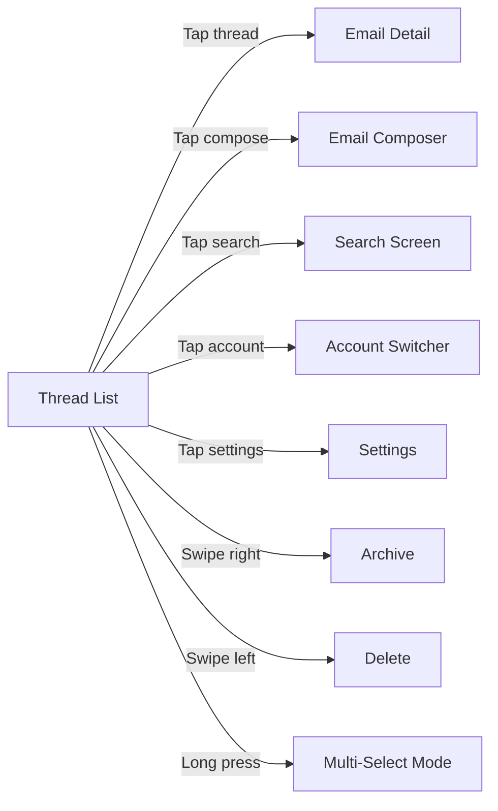

# Specification: Thread List

> The key words **MUST**, **MUST NOT**, **REQUIRED**, **SHALL**, **SHALL NOT**, **SHOULD**, **SHOULD NOT**, **RECOMMENDED**, **MAY**, and **OPTIONAL** in this document are to be interpreted as described in RFC 2119.

## 1. Summary

This specification defines the thread list screen — the primary view of the email client. It covers thread display, sorting, category filtering, gestures, multi-select, account switching, and navigation.

---

## 2. Goals and Non-Goals

### Goals

- Display emails grouped by thread, sorted by most recent date
- Provide category-based filtering (All, Primary, Social, Promotions, Updates)
- Support gestures (pull-to-refresh, swipe archive/delete, multi-select)
- Multi-account navigation with unified inbox

### Non-Goals

- Thread splitting or manual thread management (V2)
- Custom sort orders beyond date

---

## 3. Functional Requirements

### FR-TL-01: Thread Display

- The client **MUST** display emails grouped by thread.
- Each thread row **MUST** show: sender name(s)/avatar(s), subject line, snippet (first ~100 chars of latest message body), timestamp, unread indicator, star indicator, attachment indicator, AI category badge.
- The client **MUST** display threads sorted by most recent message date (newest first).

### FR-TL-02: Category Filtering

- The client **MUST** support category tabs/filters: All, Primary, Social, Promotions, Updates.
- AI category badges are provided by the AI Features spec. If AI is unavailable, all threads show in the "All" tab.

### FR-TL-03: Gestures and Interactions

- The client **MUST** support pull-to-refresh to trigger manual sync.
- The client **MUST** support swipe gestures: swipe right to archive, swipe left to delete.
- The client **MUST** support batch selection with multi-select mode (activated by long-press).

### FR-TL-04: Account Switcher

- The client **MUST** display an account switcher for multi-account navigation.
- The client **SHOULD** display a unified inbox across all accounts.
- In unified view, threads **MUST** indicate which account they belong to.

### FR-TL-05: Navigation

---

## 4. Non-Functional Requirements

### NFR-TL-01: Scroll Performance

- **Metric**: Scroll frame rate with 500+ threads
- **Target**: 60 fps
- **Hard Limit**: 30 fps on minimum-spec device

### NFR-TL-02: List Load Time

- **Metric**: Time from screen display to first threads visible
- **Target**: < 200ms (cached data)
- **Hard Limit**: < 500ms

---

## 5. Data Model

Refer to Foundation spec Section 5 for Thread entity. This feature reads Thread entities (read-only display).

---

## 6. Architecture Overview

Refer to Foundation spec Section 6. This feature uses:
- `FetchThreadsUseCase` for data
- `CategorizeEmailUseCase` results for category badges (see AI Features spec)

---

## 7. Platform-Specific Considerations

### iOS
- NavigationStack with thread list as root
- Tab bar or segmented control for category tabs
- Standard iOS swipe gestures

### macOS
- Thread list is the middle pane of a NavigationSplitView three-pane layout
- Category filtering via toolbar segmented control or sidebar section
- See macOS Adaptation plan for details

---

## 8. Alternatives Considered

| Alternative | Pros | Cons | Rejected Because |
|-------------|------|------|-----------------|
| Flat email list (no threading) | Simpler | Loses conversation context | G-03 requires threaded view |
| Infinite scroll without pagination | Simpler | Memory issues with large mailboxes | Need pagination for 50K+ emails |

---

## 9. Open Questions

| # | Question | Owner | Target Date |
|---|----------|-------|-------------|
| — | — | — | — |

---

## 10. Revision History

| Version | Date | Author | Change Summary |
|---------|------|--------|---------------|
| 1.0.0 | 2025-02-07 | Core Team | Extracted from monolithic spec v1.2.0 section 5.3. |
