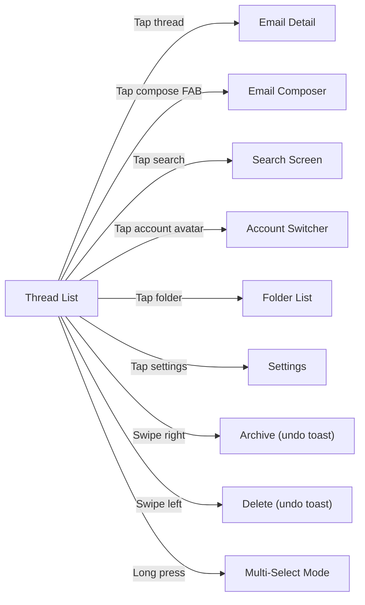
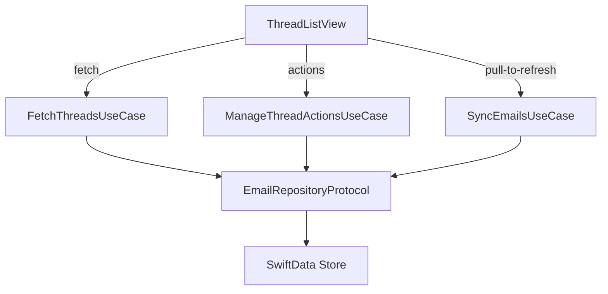

# Specification: Thread List

> The key words **MUST**, **MUST NOT**, **REQUIRED**, **SHALL**, **SHALL NOT**, **SHOULD**, **SHOULD NOT**, **RECOMMENDED**, **MAY**, and **OPTIONAL** in this document are to be interpreted as described in [RFC 2119](https://www.ietf.org/rfc/rfc2119.txt).

## 1. Summary

This specification defines the thread list screen — the primary view of the email client. It covers thread display, pagination, sorting, category filtering, folder navigation, gestures, multi-select, account switching, navigation structure, and the virtual Outbox view. It is the first screen the user sees after onboarding and the hub for all email interactions.

---

## 2. Goals and Non-Goals

### Goals

- **G-01**: Display emails grouped by thread, sorted by most recent date, with pagination for large mailboxes (up to 50K threads per Constitution TC-06)
- **G-02**: Provide category-based filtering (All, Primary, Social, Promotions, Updates) using AI category badges
- **G-03**: Support gestures (pull-to-refresh, swipe archive/delete, multi-select with batch actions)
- **G-04**: Multi-account navigation with per-account and unified inbox views
- **G-05**: Folder-based navigation (Inbox, Sent, Drafts, Trash, Spam, Starred, custom labels)
- **G-06**: Display virtual Outbox for queued/sending/failed emails (per Email Sync FR-SYNC-07)
- **G-07**: Full accessibility: VoiceOver, Dynamic Type, WCAG 2.1 AA compliance (per Constitution TC-05)

### Non-Goals

- **NG-01**: Thread splitting or manual thread management (deferred to V2)
- **NG-02**: Custom sort orders beyond date (deferred to V2)
- **NG-03**: Drag-and-drop thread reordering or manual pinning

---

## 3. Functional Requirements

### FR-TL-01: Thread Display

**Description**

The client **MUST** display emails grouped by thread in a scrollable, paginated list.

**Thread Row Content**

Each thread row **MUST** display the following elements:

| Element | Source Field | Display Rules |
|---------|-------------|---------------|
| Sender avatar(s) | `Thread.participants` | Show avatar for most recent sender; for multi-participant threads, stack up to 2 avatars. Use initials + generated color (deterministic from email address hash) if no profile image available. The `participants` field is a JSON-encoded array of `{name: String?, email: String}` objects — see Data Model section. |
| Sender name(s) | `Thread.participants` | Show most recent sender name. If `messageCount > 1`, append count (e.g., "John, Sarah (3)"). Truncate with ellipsis if exceeding available width. Most recent sender is derived from the first element of the decoded participants array. |
| Subject line | `Thread.subject` | Single line, truncated with ellipsis. |
| Snippet | `Thread.snippet` | First ~100 characters of the latest message body (see Email Sync FR-SYNC-06 Step 5). Single line, truncated. |
| Timestamp | `Thread.latestDate` | Relative format: "2:30 PM" (today), "Yesterday", "Mon" (this week), "Feb 5" (this year), "Feb 5, 2025" (older). |
| Unread indicator | `Thread.unreadCount > 0` | Bold sender name + bold subject + blue dot indicator. |
| Star indicator | `Thread.isStarred` | Filled star icon (★) when starred, hidden when not. |
| Attachment indicator | Derived from emails | Paperclip icon (📎) if any email in the thread has attachments. |
| AI category badge | `Thread.aiCategory` | Colored pill badge showing category name (e.g., "Primary", "Social"). Hidden for `uncategorized`. |

**Sorting**

- The client **MUST** display threads sorted by `latestDate` (newest first).
- The sort order **MUST NOT** be user-configurable in V1 (see NG-02).

**Pagination**

- The client **MUST** implement cursor-based pagination, loading threads in pages of 25.
- Additional pages **MUST** load automatically when the user scrolls near the bottom (infinite scroll with pagination).
- The client **MUST** display a loading indicator at the bottom while fetching the next page.
- The client **MUST** handle mailboxes with up to 50K threads without excessive memory usage (see Constitution TC-06).

**View States**

The thread list **MUST** handle the following states:

| State | Display |
|-------|---------|
| Loading (initial) | Centered `ProgressView` with "Loading emails…" text |
| Loaded (with threads) | Scrollable thread list |
| Empty (no threads in folder) | Centered illustration + "No emails" message + "Pull to refresh" hint |
| Empty (filtered, no matches) | "No emails in [Category]" message |
| Error (sync failed) | Inline banner at top with error message + "Retry" button; stale cached data still shown below |
| Offline | Inline banner "You're offline" + cached data shown; pull-to-refresh disabled with "Offline" hint |

**Error Handling**

- If thread fetching from the local store fails, the client **MUST** display the error state with a retry action.
- If pagination fetch fails, the client **MUST** display an inline retry button at the list bottom — previously loaded threads **MUST** remain visible.

### FR-TL-02: Category Filtering

**Description**

The client **MUST** support filtering threads by AI-assigned category.

**Category Tabs**

The client **MUST** display a horizontal tab bar with the following tabs in order:

| Tab | Filter | Badge |
|-----|--------|-------|
| All | No filter (show all threads) | Total unread count |
| Primary | `aiCategory == .primary` | Unread count for Primary |
| Social | `aiCategory == .social` | Unread count for Social |
| Promotions | `aiCategory == .promotions` | Unread count for Promotions |
| Updates | `aiCategory == .updates` | Unread count for Updates |

- Each tab **MUST** display an unread badge count when the count is > 0.
- Switching tabs **MUST** apply the filter immediately without a network request (local query).
- The selected tab **MUST** persist per folder within a session (e.g., switching to Sent and back should restore the previous tab selection). This persistence is in-memory only and **MUST NOT** be persisted across app launches.

**AI Unavailability Fallback**

- If AI categorization is unavailable (model not downloaded, inference failed, or device unsupported per Foundation Section 11), the client **MUST** hide the category tab bar entirely and show all threads in a single list.
- Threads with `aiCategory == .uncategorized` **MUST** appear in the "All" tab but **MUST NOT** appear under any specific category tab.
- The `forums` category (see Foundation Section 5.2) is **not** displayed as a separate tab in V1. Threads categorized as `forums` **MUST** appear only in the "All" tab.

**Error Handling**

- If the category query fails, the client **MUST** fall back to the "All" tab with all threads visible and log the error.

### FR-TL-03: Gestures and Interactions

**Description**

The client **MUST** support standard iOS/macOS gestures for thread manipulation.

**Pull-to-Refresh**

- Pull-to-refresh **MUST** trigger an incremental sync (Email Sync FR-SYNC-02).
- During sync, the client **MUST** display a refresh indicator.
- After sync completes, the thread list **MUST** update to reflect new/changed/deleted threads.
- If sync fails, the client **MUST** dismiss the refresh indicator and display an inline error banner.

**Swipe Actions**

| Gesture | Action | IMAP Operation | Undo |
|---------|--------|---------------|------|
| Swipe right (full) | Archive | Email Sync FR-SYNC-10 Archive Behavior | 5-second undo toast |
| Swipe right (partial) | Reveal archive button | — | Tap to confirm |
| Swipe left (full) | Delete (move to Trash) | Email Sync FR-SYNC-10 Delete Behavior | 5-second undo toast |
| Swipe left (partial) | Reveal delete + more button | — | Tap to confirm |

- Swipe actions **MUST** apply optimistically (update UI immediately) and sync to server asynchronously per Email Sync FR-SYNC-10.
- If the server sync fails, the client **MUST** revert the local change and display an error toast.
- The "more" button on partial swipe left **SHOULD** reveal: Mark Read/Unread, Star/Unstar, Move to Folder.

**Multi-Select Mode**

- Long-press on any thread row **MUST** activate multi-select mode.
- In multi-select mode:
  - A checkbox **MUST** appear on each thread row.
  - A toolbar **MUST** appear at the bottom with batch actions: Archive, Delete, Mark Read, Mark Unread, Star, Move.
  - A "Select All" / "Deselect All" toggle **MUST** be available.
  - Tapping "Done" or the back button **MUST** exit multi-select mode.
- Batch actions **MUST** apply to all selected threads and follow the same IMAP sync behavior as individual actions.

**Error Handling**

- If a swipe action fails after optimistic update, the client **MUST** revert the UI state and show a toast: "Couldn't [archive/delete]. Tap to retry."
- If a batch action partially fails (some threads succeed, some fail), the client **MUST** report the failure count and keep failed threads selected for retry.

### FR-TL-04: Folder and Account Navigation

**Description**

The client **MUST** provide navigation for both folder switching and account switching.

**Folder Navigation**

The client **MUST** display the following system folders in a sidebar or navigation menu:

| Folder | Source | Badge |
|--------|--------|-------|
| Inbox | `FolderType.inbox` | Unread count |
| Starred | `FolderType.starred` | — |
| Sent | `FolderType.sent` | — |
| Drafts | `FolderType.drafts` | Draft count |
| Spam | `FolderType.spam` | Unread count |
| Trash | `FolderType.trash` | — |
| Outbox | Virtual — computed filter on `sendState ∈ {queued, sending, failed}`, not a `FolderType` enum value (Email Sync FR-SYNC-07) | Queued + failed count |

- Custom Gmail labels **MUST** be displayed below system folders, sorted alphabetically.
- Selecting a folder **MUST** update the thread list to show only threads in that folder.
- The Outbox **MUST** display emails with `sendState ∈ {queued, sending, failed}` (see Email Sync FR-SYNC-07). Each Outbox row **MUST** show the send state and allow retry (for failed) or cancel (for queued).
- When the Outbox folder is selected, category tabs **MUST** be hidden. Outbox emails are filtered by `sendState`, not `aiCategory`.

**Account Switcher**

- The client **MUST** display an account switcher accessible from the thread list (e.g., tapping the account avatar/icon).
- The switcher **MUST** list all configured accounts with: account email, avatar/initials, and unread count.
- Selecting an account **MUST** switch the thread list to that account's Inbox.
- The client **MUST** provide a "Unified Inbox" option that merges threads from all accounts, sorted by `latestDate`.
- In unified view, each thread row **MUST** display an account indicator (colored dot or small avatar) showing which account the thread belongs to.
- In Unified Inbox mode, the folder sidebar **MUST** display only the unified Inbox. System folders (Sent, Drafts, Trash, Spam, Starred) and custom labels are **not** shown in unified mode — they are per-account. To access a specific account's folders, the user **MUST** first select that account from the account switcher.

**Error Handling**

- If a folder's thread count cannot be loaded, the badge **MUST** show "—" instead of a number.

### FR-TL-05: Navigation

**Description**

The client **MUST** support the following navigation flows from the thread list:

- Tapping a thread **MUST** push the Email Detail view onto the navigation stack.
- Tapping compose **MUST** present the Email Composer as a modal sheet.
- The compose button **MUST** be always visible. On iOS, this **MUST** be a toolbar trailing button (standard iOS pattern). On macOS, this **MUST** be a toolbar button.
- Navigation transitions **MUST** follow platform conventions (push on iOS, inline on macOS).

**Error Handling**

- If navigation to Email Detail fails (e.g., thread data corrupted), the client **MUST** display an alert and remain on the thread list.

---

## 4. Non-Functional Requirements

### NFR-TL-01: Scroll Performance

- **Metric**: Scroll frame rate with 500+ threads loaded
- **Target**: 60 fps
- **Hard Limit**: 30 fps on minimum-spec device (per Foundation Section 11 / Constitution TC-04)
- **Measurement**: Instruments Core Animation profiling on iPhone SE 3rd gen

### NFR-TL-02: List Load Time

- **Metric**: Time from screen display to first threads visible (cached data)
- **Target**: < 200ms
- **Hard Limit**: < 500ms
- **Measurement**: Time interval from `onAppear` to first rendered frame with data
- **Note**: This measures local data fetch only. Network sync time is covered by Email Sync NFR-SYNC-01/02.

### NFR-TL-03: Accessibility

- **WCAG 2.1 AA**: All UI elements **MUST** meet WCAG 2.1 AA contrast ratios (4.5:1 for text, 3:1 for large text/icons) per Constitution TC-05.
- **VoiceOver**: Every thread row **MUST** announce: sender name(s), subject, snippet, timestamp, and indicators (unread, starred, attachment, category). The announcement **MUST** be a single, coherent accessibility label (not individual element labels).
- **Dynamic Type**: All text in the thread list **MUST** scale with the user's preferred text size, from accessibility extra small through accessibility 5 (xxxLarge). Layout **MUST NOT** break or clip at any supported size.
- **Color Independence**: Unread status, star status, and category **MUST** be conveyed by both color AND shape/icon — color **MUST NOT** be the sole indicator.
- **Reduce Motion**: If the user has enabled "Reduce Motion", swipe animations **SHOULD** use cross-dissolve instead of slide.

### NFR-TL-04: Memory

- **Metric**: Memory usage with 500+ threads loaded in the list
- **Target**: ≤ 50 MB above baseline for thread list views
- **Hard Limit**: ≤ 100 MB above baseline
- **Measurement**: Xcode Memory Debugger after scrolling through 500 threads
- **Note**: Use `LazyVStack` to ensure only visible rows are in memory.

---

## 5. Data Model

Refer to Foundation spec Section 5 for the Thread entity. This feature reads Thread entities (read-only display). Key fields consumed:

| Field | Usage |
|-------|-------|
| `subject` | Thread row subject line |
| `latestDate` | Sorting + timestamp display |
| `messageCount` | Participant count suffix |
| `unreadCount` | Unread indicator (bold + dot) |
| `isStarred` | Star icon |
| `aiCategory` | Category badge + tab filtering |
| `snippet` | Preview text |
| `participants` | Sender name(s) + avatar(s) — JSON-encoded array of `{name: String?, email: String}` objects, ordered by most recent first |

The thread list also queries `Folder` entities for folder navigation and `Email` entities for attachment indicator derivation (checking if any email in the thread has associated `Attachment` entities).

**Participant JSON Format**

The `Thread.participants` field is a JSON string encoding an array of participant objects. Each object has:
- `name` (String?, optional): Display name of the participant
- `email` (String, required): Email address of the participant

Example: `[{"name":"John Doe","email":"john@example.com"},{"name":null,"email":"sarah@example.com"}]`

The array **MUST** be ordered with the most recent sender first. Implementations **MUST** parse this JSON to extract sender names and email addresses for avatar generation. A `Participant` model type (`Codable`, `Sendable`) **MUST** be used for type-safe parsing.

**Thread↔Folder Resolution**

There is no direct relationship between Thread and Folder. The resolution path is: `Folder` → `EmailFolder` (join table) → `Email` → `Thread`. Implementations **MUST** resolve this join to filter threads by folder. The recommended strategy for SwiftData is a 3-step query:
1. Fetch `EmailFolder` entries for the target folder
2. Collect unique thread IDs via the Email relationship
3. Fetch `Thread` objects by those IDs with any additional filters (category, cursor, limit)

---

## 6. Architecture Overview

Refer to Foundation spec Section 6. This feature uses:

- `FetchThreadsUseCase` — fetches paginated, filtered, sorted threads from the repository; also handles unread counts, folder listing, and outbox queries
- `ManageThreadActionsUseCase` — performs thread actions: archive, delete, toggle read/star, move (single and batch)
- `SyncEmailsUseCase` — triggered by pull-to-refresh (Email Sync dependency)
- `CategorizeEmailUseCase` — provides AI category badges (see AI Features spec); graceful fallback if unavailable

**Note**: Individual action use cases (ArchiveThreadUseCase, DeleteThreadUseCase) from earlier versions have been consolidated into `ManageThreadActionsUseCase` for simplicity, as they all delegate to the same repository methods.

**Note**: Per project architecture (CLAUDE.md), this feature uses the MV (Model-View) pattern with `@Observable` services and SwiftUI native state management. No ViewModels — view logic is in the SwiftUI views using `@State`, `@Environment`, and `.task` modifiers. Per Foundation FR-FOUND-01, views **MUST** call domain use cases only — never repositories directly.

---

## 7. Platform-Specific Considerations

### iOS

- **Navigation**: `NavigationStack` with thread list as root view. Navigation via `navigationDestination(for:)` — no separate NavigationRouter needed, SwiftUI's built-in path-based routing is sufficient.
- **Category tabs**: Horizontal `ScrollView` with pill-shaped buttons. Sticky below navigation bar.
- **Swipe gestures**: Standard `.swipeActions` modifier with leading (archive) and trailing (delete, more) actions.
- **Compose button**: Toolbar trailing button (standard iOS pattern).
- **Folder access**: Toolbar leading button navigates to a `FolderListView` (no persistent sidebar on iPhone). The folder list is a full navigation destination, not a sidebar.
- **Adaptive layout**: **MUST** support iPhone SE (375pt width) through iPhone Pro Max (430pt width). Thread rows **MUST** adapt sender name and snippet truncation to available width. Both portrait and landscape orientations **MUST** be supported (per Foundation Section 7.1).
- **Account switcher**: Presented as a `.sheet` from the account avatar in the navigation bar.
- **Unified inbox account indicator**: Colored dot derived from deterministic hash of the account ID (not small avatar).

### macOS

- **Layout**: Thread list is the middle pane of a `NavigationSplitView` three-pane layout: sidebar (folders + accounts) | thread list | email detail.
- **Category filtering**: Toolbar segmented control above the thread list pane.
- **Keyboard shortcuts** (per Foundation Section 7.2):
  - `⌘N` — New email (compose)
  - `⌘⌫` — Delete selected thread
  - `⌘⇧A` — Archive selected thread
  - `⌘⇧U` — Toggle read/unread
  - `↑` / `↓` — Navigate threads
  - `⏎` — Open selected thread
  - `⌘F` — Search
- **Selection**: Single-click selects a thread and shows detail in the right pane. No separate navigation push.
- **Multi-select**: `⌘`-click for individual selection, `⇧`-click for range selection.
- **Context menu**: Right-click on thread row shows: Reply, Forward, Archive, Delete, Mark Read/Unread, Star/Unstar, Move to Folder.

---

## 8. Alternatives Considered

| Alternative | Pros | Cons | Rejected Because |
|-------------|------|------|-----------------|
| Flat email list (no threading) | Simpler implementation | Loses conversation context; increases list length | Foundation G-03 requires threaded view |
| Infinite scroll without pagination | Simpler data loading | Memory issues with large mailboxes; no scroll position stability | Need pagination for 50K+ emails (Constitution TC-06) |
| UIKit `UITableView` instead of SwiftUI `LazyVStack` | More fine-grained cell reuse control | Breaks SwiftUI-first architecture; harder state management | Project mandates SwiftUI (CLAUDE.md) |
| Category tabs as separate screens | Clearer mental model | Slower switching; redundant navigation | Users expect instant tab switching (Gmail/Outlook pattern) |

---

## 9. Open Questions

| # | Question | Owner | Target Date |
|---|----------|-------|-------------|
| — | None — all resolved | — | — |

---

## 10. Revision History

| Version | Date | Author | Change Summary |
|---------|------|--------|---------------|
| 1.0.0 | 2025-02-07 | Core Team | Extracted from monolithic spec v1.2.0 section 5.3. |
| 1.1.0 | 2026-02-07 | Core Team | Review round 1: Added G-XX/NG-XX IDs (SF-03). Expanded FR-TL-01 with thread row content table, timestamp format, pagination (25/page cursor-based), view states (loading/empty/error/offline), error handling. Expanded FR-TL-02 with category tab table, unread badges per tab, AI unavailability fallback, forums handling. Expanded FR-TL-03 with swipe action table, undo toast (5s), multi-select toolbar, batch action details, optimistic updates with revert, error handling. Renamed FR-TL-04 to include folder navigation: system folders table with Outbox (FR-SYNC-07), custom labels, account indicator in unified view. Expanded FR-TL-05 with compose FAB, folder navigation link. Added NFR-TL-03 (Accessibility: WCAG 2.1 AA, VoiceOver, Dynamic Type, color independence, Reduce Motion). Added NFR-TL-04 (Memory: ≤50MB target for 500+ threads). Expanded Data Model section with field usage table. Added architecture diagram with MV pattern note (no ViewModels). Expanded iOS platform section with adaptive layout, compose button, account switcher. Expanded macOS section with keyboard shortcuts, context menu, multi-select. Added alternatives (UIKit, category-as-screens). Status → locked. |
| 1.2.0 | 2026-02-07 | Core Team | Post-lock compliance fixes: PL-01 — fixed architecture diagram to route swipe actions through ArchiveThreadUseCase/DeleteThreadUseCase instead of directly to EmailRepository (FR-FOUND-01 compliance); MV note now explicitly states "views call use cases only, never repositories directly". PL-02 — clarified that Unified Inbox mode hides folder sidebar (system folders are per-account; user must select an account to see its folders). MC-01 — added clause that Outbox disables category tabs (filtered by sendState, not aiCategory). |
| 1.3.0 | 2026-02-08 | Core Team | Plan review clarifications: Resolved 10 ambiguities from spec review. Clarified participants JSON format with schema and Participant model requirement. Added Thread↔Folder resolution path and 3-step query strategy. Consolidated individual action use cases into ManageThreadActionsUseCase. Specified iOS compose button as toolbar trailing button (not FAB). Specified iOS folder access as toolbar button to FolderListView (not persistent sidebar). Specified unified inbox account indicator as colored dot (not small avatar). Clarified category tab persistence is in-memory only (not across launches). Clarified Outbox is virtual (computed filter, not FolderType enum). Added iOS navigation note that built-in NavigationStack is sufficient (no separate router). |
