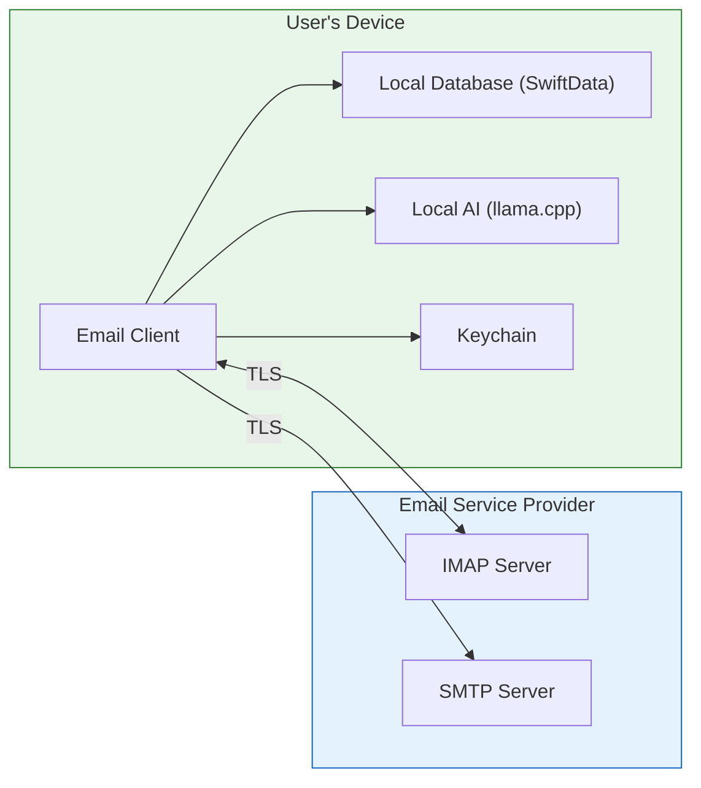
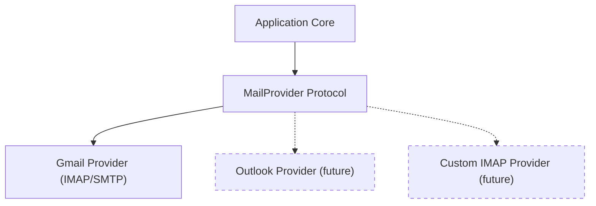
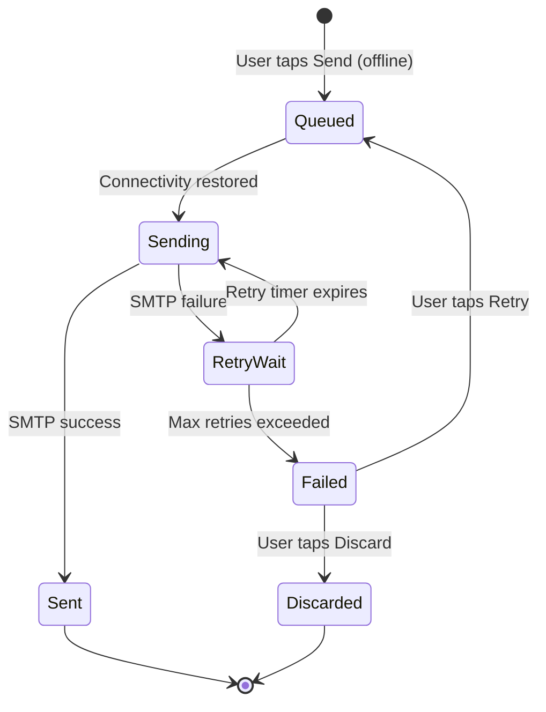

# Proposal: Privacy-First Email Client

> The key words **MUST**, **MUST NOT**, **REQUIRED**, **SHALL**, **SHALL NOT**, **SHOULD**, **SHOULD NOT**, **RECOMMENDED**, **MAY**, and **OPTIONAL** in this document are to be interpreted as described in [RFC 2119](https://www.ietf.org/rfc/rfc2119.txt).

## 1. Context

Email remains the primary communication channel for professional and personal correspondence. Modern email clients have progressively shifted toward cloud-dependent architectures where user data is processed on remote servers — for features like smart categorization, search, and AI-powered replies.

This creates a fundamental tension: users gain convenience but lose control of their data. Every email is read, indexed, and processed by third-party infrastructure. Even clients that market themselves as privacy-focused often route data through intermediary servers for push notifications, AI features, or analytics.

Recent developments make a genuinely local-first approach viable:

- **On-device AI**: Quantized LLMs (Llama, Phi, Mistral) run efficiently on consumer hardware via llama.cpp, enabling smart features without cloud inference.
- **Modern hardware**: Apple Silicon and recent mobile SoCs have the compute and memory to run useful AI models locally.
- **Standard protocols**: IMAP/SMTP provide full email access without proprietary API dependencies.
- **Platform frameworks**: SwiftUI, SwiftData, and Keychain Services provide a mature local-first development stack.

## 2. Decision Drivers

| Driver | Weight | Notes |
|--------|--------|-------|
| User privacy | Critical | Core value proposition; non-negotiable |
| Data sovereignty | Critical | Users own and control their email data completely |
| AI utility | High | Smart features drive adoption; must match cloud-based competitors |
| Offline functionality | High | Local-first means local-functional |
| Multi-provider support | High | Must not be locked to a single email provider |
| Multi-platform reach | Medium | iOS/macOS first, but architecture must support expansion |
| Performance | Medium | On-device AI must feel responsive, not sluggish |
| Development velocity | Medium | Small team; architecture must enable iteration |

## 3. Proposal

Build a privacy-first email client with the following characteristics:

### 3.1 Architecture

A local-first email client that communicates with the user's email service provider via standard IMAP/SMTP protocols. All intelligence features run on-device using local LLM inference. The only outbound connections are to the email provider (IMAP/SMTP/OAuth) and, optionally, a one-time model download (see Section 3.4.1).

No user data flows to any other destination. Aside from the email provider, the only other network traffic is a one-time AI model download from an approved source (see Section 3.4.1), which transmits no user data.

### 3.2 Core Value Proposition

| What Users Get | How It's Delivered |
|---------------|-------------------|
| Smart email categorization | Local LLM classifies emails into Primary, Social, Promotions, Updates |
| Smart reply suggestions | Local LLM generates contextual reply options |
| Thread summarization | Local LLM summarizes long threads into key points |
| Semantic search | Local embeddings enable meaning-based search across all synced email |
| Full offline access | Recent emails fully synced locally with configurable window |
| Zero data leakage | No analytics, no telemetry, no third-party servers |
| Multi-account support | Multiple email accounts in a single client |

### 3.3 Provider Strategy

V1 targets Gmail via IMAP/SMTP. The provider layer is abstracted behind a protocol so additional providers (Outlook, Yahoo, FastMail, custom IMAP) can be added without architectural changes.

#### 3.3.1 Gmail IMAP Quirks and Mitigations

Gmail's IMAP implementation deviates from standard IMAP in several well-documented ways. Since V1 targets Gmail exclusively, these quirks **MUST** be handled explicitly in the Gmail provider layer.

| Gmail Quirk | Standard IMAP Behavior | Gmail Behavior | Mitigation |
|------------|----------------------|----------------|------------|
| **Labels as folders** | Folders are exclusive (an email lives in one folder) | Gmail labels are non-exclusive; an email can have multiple labels. Each label appears as an IMAP folder, so the same email shows up in multiple folders. | Deduplicate by Message-ID during sync. Track label membership via the EmailFolder join entity (many-to-many Email ↔ Folder relationship; see Foundation spec Section 5.1). Display labels as tags, not folder membership. |
| **All Mail folder** | No equivalent | `[Gmail]/All Mail` contains every non-Trash, non-Spam email. Archive = remove from INBOX but remains in All Mail. | Map "Archive" action to IMAP MOVE from INBOX to All Mail (remove \Inbox flag). Do not re-download emails already seen in another folder. |
| **Threading** | No native thread model in IMAP | Gmail threads by subject + References/In-Reply-To headers internally, but IMAP only exposes per-message data. | Build thread model locally from `References` and `In-Reply-To` headers. Fall back to subject-based grouping when headers are absent. |
| **Delete behavior** | STORE +FLAGS \Deleted, then EXPUNGE | Gmail moves to `[Gmail]/Trash` on delete. EXPUNGE in Trash permanently deletes. | Map "Delete" to MOVE to `[Gmail]/Trash`. Map "Permanent Delete" to STORE +FLAGS \Deleted + EXPUNGE only when in Trash. Warn user before permanent deletion. |
| **Rate limits** | No standard rate limit | Gmail IMAP enforces per-user bandwidth and connection limits (~2.5GB/day download, ~500MB/day upload, max 15 concurrent connections). | Implement connection pooling (max 5 concurrent IMAP connections per account). Batch fetches within bandwidth limits. Implement exponential backoff on rate-limit errors (IMAP BYE response). Track bandwidth usage locally. |
| **IDLE limits** | RFC 2177: IDLE until server terminates | Gmail drops IDLE connections after ~29 minutes of inactivity. | Implement IDLE re-establishment with a 25-minute refresh timer. |
| **Search** | IMAP SEARCH command (keyword-based) | Gmail supports server-side SEARCH but it's limited vs. Gmail's web search. `X-GM-RAW` extension provides Gmail-style search, but is proprietary. | Do not rely on server-side search. All search is local (semantic + exact match via local index). IMAP SEARCH is only used for sync, not user-facing search. |
| **Special-use folders** | RFC 6154 LIST extension | Gmail uses `[Gmail]/` prefix for special folders (Sent Mail, Drafts, Trash, Spam, Starred, All Mail, Important). | Detect Gmail special folders by `LIST` attributes (`\Sent`, `\Trash`, `\Drafts`, etc.) and fall back to `[Gmail]/` prefix pattern matching. Map to internal folder types. |

These quirks are encapsulated within the Gmail provider implementation. The `MailProvider` protocol exposes a clean abstraction (folders, threads, labels, actions) that hides provider-specific behavior from the domain and presentation layers.

### 3.4 AI Strategy

All AI features use quantized GGUF models running via llama.cpp. Models are downloaded once and cached locally. No inference requests leave the device.

| Feature | Model Requirements | Priority |
|---------|-------------------|----------|
| Categorization | Small classifier or prompted LLM (~1-3B params) | P0 |
| Smart Reply | Small generative model (~1-3B params) | P0 |
| Summarization | Small generative model (~1-3B params) | P0 |
| Semantic Search | Embedding model for vector similarity | P0 |

#### 3.4.1 Model Download Sources and Policy

The "zero third-party server" principle (Constitution P-02) applies to servers that process or store user data. Model downloads are an exception: they transfer static, non-user data (model weight files) in a one-time operation. This is analogous to downloading app assets and does not violate the privacy guarantee because no user data is transmitted.

**Allowed model sources** (in priority order):

| Source | Description | Privacy Impact |
|--------|-------------|---------------|
| **Hugging Face Hub** | Direct HTTPS download of GGUF files from public model repositories (e.g., `huggingface.co/TheBloke/`). | None — no user data sent. Only an HTTPS GET request for a static file. No authentication required for public models. |
| **Local file import** | User-provided GGUF file from local storage (Files app, AirDrop, USB transfer on Mac). | None — completely offline. |
| **Project-hosted CDN** | If we host models on our own CDN in the future. | None — only model weights transferred. No user data. No tracking. CDN logs **MUST NOT** be used for user identification. |

**Prohibited sources**:
- Any source that requires transmitting user data (email content, account info, device identifiers) to initiate or authorize the download.
- Any source that bundles telemetry or analytics with the model download.

**Model download behavior**:
- The app **MUST** display the model source URL, file size, and license before initiating download.
- Downloads **MUST** use HTTPS.
- Downloads **MUST** be resumable (support HTTP Range requests).
- Downloaded models **MUST** be integrity-verified (SHA-256 checksum).
- The app **MUST** function without AI features if the user declines or delays the download.

### 3.5 Offline Send Queue

Constitution P-04 requires offline capability, including queuing messages for sending when connectivity resumes. The offline send queue is a critical path that requires explicit behavior definition.

#### Queue Lifecycle

#### Retry Policy

| Parameter | Value |
|-----------|-------|
| Max retries | 5 |
| Backoff strategy | Exponential: 30s, 2m, 8m, 30m, 2h |
| Max queue age | 72 hours (then auto-transition to Failed) |
| Retry trigger | Network connectivity change OR retry timer expiry |

#### User Visibility

- Queued messages **MUST** appear in a "Outbox" section visible from the thread list.
- Each queued message **MUST** display its status: `Queued`, `Sending`, `Retry (attempt N/5)`, or `Failed`.
- The user **MUST** be able to edit a queued message before it is sent.
- The user **MUST** be able to cancel/discard a queued message at any point before `Sent`.
- When a message transitions to `Failed`, the client **MUST** display a notification with the failure reason and options to retry or discard.
- When a message is successfully sent from the queue, the client **SHOULD** display a brief confirmation.

#### Error Handling

| Failure Type | Behavior |
|-------------|----------|
| Network timeout | Retry per policy |
| SMTP authentication failure (token expired) | Attempt token refresh; if refresh fails, pause queue and prompt re-auth |
| SMTP rejected (invalid recipient) | Transition immediately to `Failed` (no retry); show error to user |
| SMTP server error (5xx) | Retry per policy |
| SMTP temporary error (4xx) | Retry per policy |
| Device storage full | Pause queue; warn user |

### 3.6 Platform Strategy

| Phase | Platform | Approach |
|-------|----------|----------|
| V1 | iOS + macOS | Native SwiftUI, shared codebase, separate targets |
| V2 | Android | Kotlin/Compose, shared spec, platform-specific code |
| V3 | Windows/Linux | TBD (Kotlin Multiplatform, Electron, or native) |

The spec and domain logic are designed platform-independently. Only the plan and implementation are platform-specific.

## 4. Alternatives Considered

### 4.1 Cloud-Assisted AI with Privacy Proxy

- **Description**: Route AI inference through an encrypted proxy server that processes data ephemerally.
- **Pros**: More powerful models available; smaller app bundle; lower device resource usage.
- **Cons**: Requires server infrastructure; data technically leaves the device even if encrypted; adds operational cost; violates the zero-server principle.
- **Rejected because**: Contradicts the core privacy promise. Any server is a potential point of compromise and requires user trust in the operator.

### 4.2 Gmail REST API Instead of IMAP

- **Description**: Use Gmail's REST API for richer feature support (native labels, thread model, server-side search).
- **Pros**: Better Gmail-specific feature support; more reliable push notifications via Google Cloud.
- **Cons**: Vendor lock-in; requires Google Cloud project; API quotas; harder to add non-Gmail providers; Google can revoke access.
- **Rejected because**: Standard protocols (IMAP/SMTP) align with multi-provider goals and reduce platform dependency. Gmail-specific features can be approximated via IMAP.

### 4.3 React Native / Flutter for Cross-Platform V1

- **Description**: Use a cross-platform framework from day one to cover iOS, Android, and desktop.
- **Pros**: Single codebase for all platforms; faster time to multi-platform.
- **Cons**: Worse native feel; harder to integrate llama.cpp and platform-native security (Keychain); performance overhead for AI workloads; larger bundle size.
- **Rejected because**: V1 quality on iOS/macOS matters more than breadth. Native SwiftUI delivers the best user experience and easiest integration with on-device AI and platform security. Cross-platform can follow with a shared spec.

### 4.4 Core ML Instead of llama.cpp

- **Description**: Use Apple's Core ML framework for on-device AI inference.
- **Pros**: Best Apple Silicon optimization; tight OS integration; smaller model footprint with Apple's compression.
- **Cons**: Apple-only; no path to Android/Windows; limited model ecosystem compared to GGUF; harder to use latest open-source LLMs.
- **Rejected because**: llama.cpp works across all target platforms and has the broadest model support. The spec allows revisiting this if Core ML gains significant advantages for Apple-only features.

## 5. Impact Analysis

### 5.1 Effort

| Component | Scope |
|-----------|-------|
| IMAP/SMTP integration | Email sync, send, folder management, multi-account |
| Local storage layer | SwiftData models, sync state, search index |
| AI engine integration | llama.cpp wrapper, model management, prompt engineering |
| UI (iOS + macOS) | Thread list, detail view, composer, settings, onboarding |
| Testing | Unit, integration, UI, performance validation |

### 5.2 Risks

| Risk | Likelihood | Impact | Mitigation |
|------|-----------|--------|------------|
| On-device LLM too slow on older devices | Medium | High | Profile early; use smallest viable model; make AI features async with graceful degradation |
| IMAP compatibility issues across providers | Medium | Medium | V1 targets Gmail only; build conformance test suite against RFC 3501 |
| Model size too large for app bundle | Medium | Medium | Download models on first launch; allow user to choose model size |
| Gmail OAuth complexity for IMAP | Low | Medium | Well-documented flow; use ASWebAuthenticationSession |
| SwiftData limitations for complex queries | Low | Medium | Fallback to raw SQLite if needed for search index |

## 6. Threat Model

A privacy-focused email client must be explicit about its threat model — what it protects against, what it does not, and what residual risks exist.

### 6.1 Scope

This threat model covers the client application and locally stored data. It does **not** cover the security of the email provider (Gmail), the transport network beyond TLS, or the user's device OS security.

### 6.2 Threat Matrix

| # | Threat | Attack Vector | Severity | Mitigation | Residual Risk |
|---|--------|--------------|----------|------------|---------------|
| T-01 | **Physical device access (unlocked)** | Attacker obtains unlocked device | High | Optional app lock (biometric/passcode). SwiftData inherits iOS Data Protection (iOS) or relies on FileVault (macOS) for encryption at rest. | If device is unlocked and app lock is disabled, email data is accessible. User choice to enable app lock. |
| T-02 | **Physical device access (locked)** | Attacker obtains locked device | Medium | iOS Data Protection encrypts SwiftData at rest when device is locked. Keychain items set to `WhenUnlockedThisDeviceOnly` are inaccessible. | Protected by OS-level encryption. No additional app-level mitigation needed. |
| T-03 | **Device backup extraction** | Attacker accesses iTunes/Finder backup | Medium | Keychain items with `ThisDeviceOnly` are excluded from backups. SwiftData files are included in encrypted backups only. | Unencrypted backups expose email database. Mitigation: document that users should enable encrypted backups. |
| T-04 | **Shared/managed device** | Another user or MDM profile accesses app data | Medium | App lock (biometric/passcode). Per-user iOS accounts isolate app data. | On shared devices without separate iOS accounts, app lock is the only barrier. MDM profiles may have device-level access. |
| T-05 | **Network interception (MITM)** | Attacker intercepts IMAP/SMTP traffic | High | All connections use TLS. Certificate validation is mandatory. | Compromised CAs or TLS implementation bugs. Certificate pinning **MAY** be added as an enhancement. |
| T-06 | **OAuth token theft** | Malware or jailbreak extracts Keychain | High | Keychain with hardware-backed protection (`kSecAttrAccessibleWhenUnlockedThisDeviceOnly`). Tokens scoped to minimum permissions. | Jailbroken devices weaken Keychain guarantees. Not mitigable at the app level. |
| T-07 | **Local database tampering** | Attacker modifies SwiftData store | Low | SwiftData inherits file-system permissions. App sandbox prevents cross-app access. | Jailbroken device or physical access with forensic tools. Not mitigable at the app level. |
| T-08 | **AI model poisoning** | Malicious GGUF file injected as model | Medium | Integrity verification via SHA-256 checksum against known-good hashes. Models downloaded only from pre-approved sources (Hugging Face, local import). | User-imported local files bypass checksum if the user explicitly overrides. |
| T-09 | **Memory forensics during AI inference** | Email content in memory during LLM processing | Low | Swift/OS memory management. No persistent plaintext beyond process lifecycle. Model unloaded after inference. | Sophisticated memory dump attacks on a running device. Not practically mitigable at the app level. |
| T-10 | **Metadata leakage via model downloads** | IP address exposed to Hugging Face during download | Low | Standard HTTPS download. No user data or device identifiers sent. | IP address is visible to the model host. Users concerned about this can use VPN or local file import. |

### 6.3 Out of Scope

The following threats are explicitly **not** addressed by the client:

- **Email provider compromise**: If Gmail itself is compromised, all server-side data is at risk. The client mitigates this only by not adding additional server-side attack surface.
- **OS-level compromise**: If the device OS is compromised (rootkit, jailbreak exploit), all bets are off. The client relies on the OS for sandboxing, encryption, and Keychain security.
- **Social engineering**: Phishing emails displayed in the client are a user-level risk, not a client-level risk. The client does not implement phishing detection in V1.
- **Side-channel attacks**: Timing attacks, power analysis, or electromagnetic emission attacks on AI inference are not addressed.

### 6.4 Security Recommendations for Users

The client **SHOULD** display a one-time security recommendations screen (in onboarding or settings) advising:

- Enable device passcode and biometric authentication
- Enable app lock for additional privacy
- Use encrypted backups
- Keep the device OS updated
- Review connected accounts periodically

---

## 7. Decision

_To be filled after review._

## 8. Consequences

If accepted:

- **Easier**: Adding new email providers (abstracted behind protocol). Adding new AI features (model-agnostic engine). Shipping on both iOS and macOS from day one.
- **Harder**: Implementing push notifications without a relay server (must rely on background fetch). Competing with cloud-powered AI quality (local models are smaller). Supporting very old devices with limited RAM.
- **New constraints**: App bundle or first-launch download will include AI models (200MB-1GB). Device must have sufficient RAM for inference (~2-4GB available). Background sync limited by iOS background execution policies.
