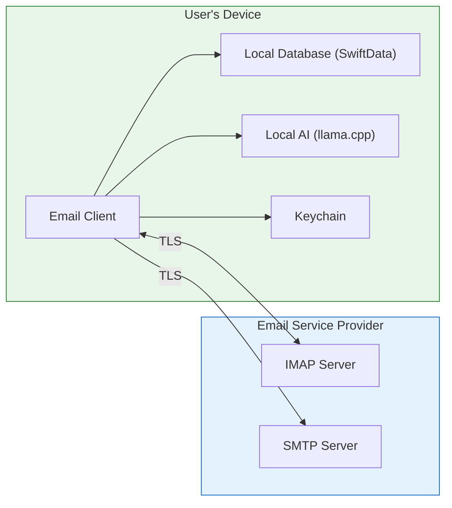
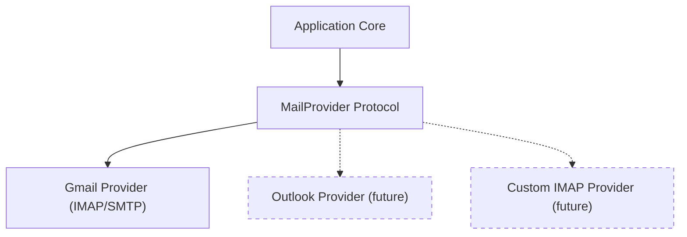

# Proposal: Privacy-First Email Client

> The key words **MUST**, **MUST NOT**, **REQUIRED**, **SHALL**, **SHALL NOT**, **SHOULD**, **SHOULD NOT**, **RECOMMENDED**, **MAY**, and **OPTIONAL** in this document are to be interpreted as described in [RFC 2119](https://www.ietf.org/rfc/rfc2119.txt).

## 1. Context

Email remains the primary communication channel for professional and personal correspondence. Modern email clients have progressively shifted toward cloud-dependent architectures where user data is processed on remote servers — for features like smart categorization, search, and AI-powered replies.

This creates a fundamental tension: users gain convenience but lose control of their data. Every email is read, indexed, and processed by third-party infrastructure. Even clients that market themselves as privacy-focused often route data through intermediary servers for push notifications, AI features, or analytics.

Recent developments make a genuinely local-first approach viable:

- **On-device AI**: Quantized LLMs (Llama, Phi, Mistral) run efficiently on consumer hardware via llama.cpp, enabling smart features without cloud inference.
- **Modern hardware**: Apple Silicon and recent mobile SoCs have the compute and memory to run useful AI models locally.
- **Standard protocols**: IMAP/SMTP provide full email access without proprietary API dependencies.
- **Platform frameworks**: SwiftUI, SwiftData, and Keychain Services provide a mature local-first development stack.

## 2. Decision Drivers

| Driver | Weight | Notes |
|--------|--------|-------|
| User privacy | Critical | Core value proposition; non-negotiable |
| Data sovereignty | Critical | Users own and control their email data completely |
| AI utility | High | Smart features drive adoption; must match cloud-based competitors |
| Offline functionality | High | Local-first means local-functional |
| Multi-provider support | High | Must not be locked to a single email provider |
| Multi-platform reach | Medium | iOS/macOS first, but architecture must support expansion |
| Performance | Medium | On-device AI must feel responsive, not sluggish |
| Development velocity | Medium | Small team; architecture must enable iteration |

## 3. Proposal

Build a privacy-first email client with the following characteristics:

### 3.1 Architecture

A local-first email client that communicates **only** with the user's email service provider via standard IMAP/SMTP protocols. All intelligence features run on-device using local LLM inference.

No data flows to any other destination. The only network traffic is between the client and the user's email provider.

### 3.2 Core Value Proposition

| What Users Get | How It's Delivered |
|---------------|-------------------|
| Smart email categorization | Local LLM classifies emails into Primary, Social, Promotions, Updates |
| Smart reply suggestions | Local LLM generates contextual reply options |
| Thread summarization | Local LLM summarizes long threads into key points |
| Semantic search | Local embeddings enable meaning-based search across all synced email |
| Full offline access | Recent emails fully synced locally with configurable window |
| Zero data leakage | No analytics, no telemetry, no third-party servers |
| Multi-account support | Multiple email accounts in a single client |

### 3.3 Provider Strategy

V1 targets Gmail via IMAP/SMTP. The provider layer is abstracted behind a protocol so additional providers (Outlook, Yahoo, FastMail, custom IMAP) can be added without architectural changes.

### 3.4 AI Strategy

All AI features use quantized GGUF models running via llama.cpp. Models are downloaded once and cached locally. No inference requests leave the device.

| Feature | Model Requirements | Priority |
|---------|-------------------|----------|
| Categorization | Small classifier or prompted LLM (~1-3B params) | P0 |
| Smart Reply | Small generative model (~1-3B params) | P0 |
| Summarization | Small generative model (~1-3B params) | P0 |
| Semantic Search | Embedding model for vector similarity | P0 |

### 3.5 Platform Strategy

| Phase | Platform | Approach |
|-------|----------|----------|
| V1 | iOS + macOS | Native SwiftUI, shared codebase, separate targets |
| V2 | Android | Kotlin/Compose, shared spec, platform-specific code |
| V3 | Windows/Linux | TBD (Kotlin Multiplatform, Electron, or native) |

The spec and domain logic are designed platform-independently. Only the plan and implementation are platform-specific.

## 4. Alternatives Considered

### 4.1 Cloud-Assisted AI with Privacy Proxy

- **Description**: Route AI inference through an encrypted proxy server that processes data ephemerally.
- **Pros**: More powerful models available; smaller app bundle; lower device resource usage.
- **Cons**: Requires server infrastructure; data technically leaves the device even if encrypted; adds operational cost; violates the zero-server principle.
- **Rejected because**: Contradicts the core privacy promise. Any server is a potential point of compromise and requires user trust in the operator.

### 4.2 Gmail REST API Instead of IMAP

- **Description**: Use Gmail's REST API for richer feature support (native labels, thread model, server-side search).
- **Pros**: Better Gmail-specific feature support; more reliable push notifications via Google Cloud.
- **Cons**: Vendor lock-in; requires Google Cloud project; API quotas; harder to add non-Gmail providers; Google can revoke access.
- **Rejected because**: Standard protocols (IMAP/SMTP) align with multi-provider goals and reduce platform dependency. Gmail-specific features can be approximated via IMAP.

### 4.3 React Native / Flutter for Cross-Platform V1

- **Description**: Use a cross-platform framework from day one to cover iOS, Android, and desktop.
- **Pros**: Single codebase for all platforms; faster time to multi-platform.
- **Cons**: Worse native feel; harder to integrate llama.cpp and platform-native security (Keychain); performance overhead for AI workloads; larger bundle size.
- **Rejected because**: V1 quality on iOS/macOS matters more than breadth. Native SwiftUI delivers the best user experience and easiest integration with on-device AI and platform security. Cross-platform can follow with a shared spec.

### 4.4 Core ML Instead of llama.cpp

- **Description**: Use Apple's Core ML framework for on-device AI inference.
- **Pros**: Best Apple Silicon optimization; tight OS integration; smaller model footprint with Apple's compression.
- **Cons**: Apple-only; no path to Android/Windows; limited model ecosystem compared to GGUF; harder to use latest open-source LLMs.
- **Rejected because**: llama.cpp works across all target platforms and has the broadest model support. The spec allows revisiting this if Core ML gains significant advantages for Apple-only features.

## 5. Impact Analysis

### 5.1 Effort

| Component | Scope |
|-----------|-------|
| IMAP/SMTP integration | Email sync, send, folder management, multi-account |
| Local storage layer | SwiftData models, sync state, search index |
| AI engine integration | llama.cpp wrapper, model management, prompt engineering |
| UI (iOS + macOS) | Thread list, detail view, composer, settings, onboarding |
| Testing | Unit, integration, UI, performance validation |

### 5.2 Risks

| Risk | Likelihood | Impact | Mitigation |
|------|-----------|--------|------------|
| On-device LLM too slow on older devices | Medium | High | Profile early; use smallest viable model; make AI features async with graceful degradation |
| IMAP compatibility issues across providers | Medium | Medium | V1 targets Gmail only; build conformance test suite against RFC 3501 |
| Model size too large for app bundle | Medium | Medium | Download models on first launch; allow user to choose model size |
| Gmail OAuth complexity for IMAP | Low | Medium | Well-documented flow; use ASWebAuthenticationSession |
| SwiftData limitations for complex queries | Low | Medium | Fallback to raw SQLite if needed for search index |

## 6. Decision

_To be filled after review._

## 7. Consequences

If accepted:

- **Easier**: Adding new email providers (abstracted behind protocol). Adding new AI features (model-agnostic engine). Shipping on both iOS and macOS from day one.
- **Harder**: Implementing push notifications without a relay server (must rely on background fetch). Competing with cloud-powered AI quality (local models are smaller). Supporting very old devices with limited RAM.
- **New constraints**: App bundle or first-launch download will include AI models (200MB-1GB). Device must have sufficient RAM for inference (~2-4GB available). Background sync limited by iOS background execution policies.
